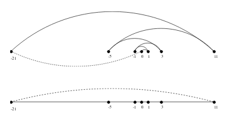

#CHAPTER 1: Algorithms

Algorithms has to solve a general specified problem.

Algorithmic problem is specified by describing the set of **instances** (inputs) it must work on and what desired properties the output must have.

Problems =/= Algorithms

- Algorithm is a solution to algorithmic problem
- Many algorithms for a problem

##Properties of Good Algorithm

- Correct: always return desired output for all legal instances of a problem.
- Efficient

##Expressing Algorithms

Options are in increasing order of precision

- English
- Pseudocode
- Real programming languages

##Induction and Recursion

Induction and recursion are the same basic idea:

1. basis case
2. general assumption
3. general case

(Add Classical Induction Problem)

#TSP (Shortest Tour)

Input: set of points
Output: a tour that starts anywhere, visit all points, returns to starting point. Furthermore, want tour of **least distance**.

##Nearest Neighbor Tour

Algorithm: Start at point, walk to closest point, continue this pattern until back at start.

> Pick initial point p~0~
> p = p~0~
> i = 0 
> While there are still unvisited points

>> i = i + 1

>> Let p~i~ be the closest unvisited point to p~i-1~

>> Visit p~i~

> Return to p~0~ from p~i~

###Nearest neighbor is wrong

\newpage

##Demonstrating incorrectness

Counterexamples best way to disprove correctness of a heuristic.

Tips:

- Think of small examples
- Think of ties on your decision criteria (ex. nearest point)

Failure to find a counterexample =/= algorithm is correct

##Exhaustive Search: a correct algorithm for TSP

Algorithm: Try all possible orderings of points, select the one with a minimize total length.

> (pseudo code here)

All orderings are considered, so guaranteed optimal solution

###Exhaustive Search is Hella Slow

There are n! permutations. 

Still no efficient solution found.

