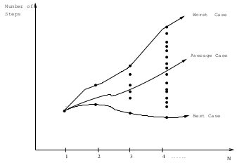
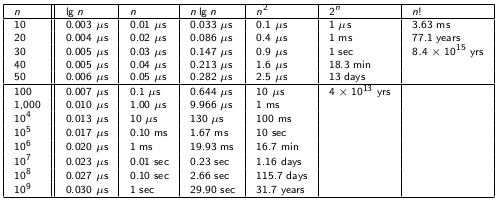
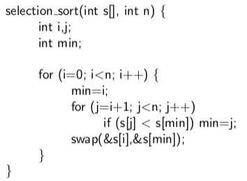

#CHAPTER 2: Algorithms Analysis

1. RAM model of computation
2. Best, Worst and Average-Case Complexity
3. Big-Oh Notation
4. Working with Asymptotics
5. Growth Rates and Dominance
6. Reasoning about Efficiency
7. Logarithms and their Applications

##Ram Model of Computation

- Assume that each simple statement (arithmetic, memory, assignment, etc) requires 1 unit of time per execution.
- Figure out how many times each simple statement is executed.
- Add up for all statements.
- Loop and function calls are **NOT** simple statements.

This model is useful and accurate in the same sense as the flat-earth model (useful but not the truth).

###Ram Model Worksheet

- \# steps depends on n (for loop, single execution in for loop).
- \# steps depends on input permutation, even for the same n.
- \# steps would change slightly with another INSERTION SORT algorithm

Number of steps don't predict algorithms runtime with 100% accuracy 

- Some instructions are more expensive to do 

###Problem-specific metrics

- Common in analysis of sorting or searching to count \# of data comparisons
    - number of comparison in while loop on worksheet
- Matrix multiplication: count \# of scalar multiplication

Hone in on the important lines when doing ram model worksheet problems. 

\newpage
##Worst, Average, Best Case Complexity

- Worst case complexity: maximum \# of steps taken on instance of size n
- Best case complexity: minimum
- Avg case complexity: average (lolnoshit)

Exact analysis is hard, so use upper and lower bounds of functions (Asymptotic notation)

\newpage

###Definitions: O, $\Omega, \Theta$

1. O(g(n)) = {f(n): there exist positive constants c and n~0~ such that **0 $\le$ f(n) $\le$ cg(n)** for all n $\ge$ n~0~}.
2. $\Omega$(g(n)) = {f(n): these exist positive constants c and n~0~ such that **0 $\le$ cg(n) $\le$ f(n)** for all n $\ge$ n~0~}.
3. $\Theta$(g(n)) = {f(n): these exist positive constants c~1~, c~2~, and n~0~ such that **0 $\le$ c~2~g(n) $\le$ f(n) $\le$ c~1~g(n)** for all n $\ge$ n~0~}.

- All of the above define sets. (O(g(n)) is a set of functions)
- If f(n) belongs to this set, we should write it as f(n) $\in$ O(g(n))
- Instead, the convention is to write it as f(n) = O(g(n))
- To show that f(n) belongs to one of these sets, all we need to do is find **one set of constants** that make the inequalities work (c)
- n $\ge$ n~0~ says don't worry about what happens at lower values of n (Care about things as they approach infinity)

Know how to prove an equation is a certain N complexity time (common exam question)

###Using Big-Oh and $\Theta$

Is n = O(n^2^), YES

Is n = O(n^3^), YES

Is n = $\Theta$(n^2), NO

Think of these equations as bounds and averages. Makes more sense that way. 

Also keep in mind to make sensible bounds

\newpage

##Asymptotic Dominance in Action

###Implication of Dominance

- Exponential (2^n^ and n!): goes bad fast
- Quadratic (n^2^): goes bad at or before 1,000,000
- O(nlogn) is possible to 1 billion
- O(logn) never sweats

###Testing Dominance

f(n) dominates g(n) if $\displaystyle \lim_{n \to \infty} g(n)/f(n)$ = 0

Which is the same as saying g(n) = O(f(n))

n^a^ dominates n^b^ if a \> b

> $\displaystyle \lim_{n \to \infty}$ n^b^/n^a^ = n^b-a^ &rarr; 0

###Dominance Ranking

n! >> 2^n^ >> n^3^ >> n^2^ >> nlogn >> n >> logn >> 1

###Advanced Dominance Ranking

n! >> c^n^ >> n^3^ >> nlogn >> n >> $\sqrt{n}$ >> logn >> loglogn >> 1

Epsilon is a small fraction in n^1+$\epsilon$^

##Reasoning About Efficiency

###Selection Sort Example

\

The outer loop takes n times, the inner loop at worst is n times

Nested loops means n x n which is O(n^2^) worst case

##Logarithms

Logarithm is an inverse exponential function

> b^x^ = y is equivalent to x = log~b~y

Logarithms reflects how many times we can double something until we get n, or halve something until we get to 1. 

- How many doubling from 1 to n is log~2~n

###Binary Search

Binary search throws away half the elements after each comparison.

- Binary Search = how many halves on n before getting 1 (LOG)

How tall a binary tree do we need until we have n leaves?

- Number of leaves double per level
- How many times we do need to double until we have n? (LOG)

###Logarithms and Bits

How many bits do you need to represent the numbers from 0 to 2^i^ - 1?

- Each bit doubles the possble number of bit patterns, so LOG(2^i^) = i

###Logarithms and Multiplication

log~a~(xy) = log~a~(x) + log~a~(y)

###Base is not Asymptotically Important

Recall...

> log~b~a = $\frac{log_{c}a}{log_{c}b}$

Changing base is like adding a constant to the expression, so in Big Oh, changing base is negligible. 

###Log of Polynomial Functions of n

log(n^473^ + n^2^ + n) = O(logn)

- This is because log(n^472^) = 472 * log(n). Constant melts away

###Logs of Exponential Functions

log(2^n^) = O( n * log(2) ) = O(n)

log(n!) = O(nlog(n)) 

