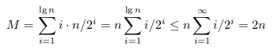
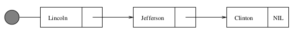
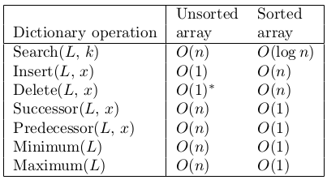
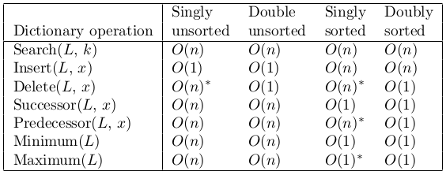
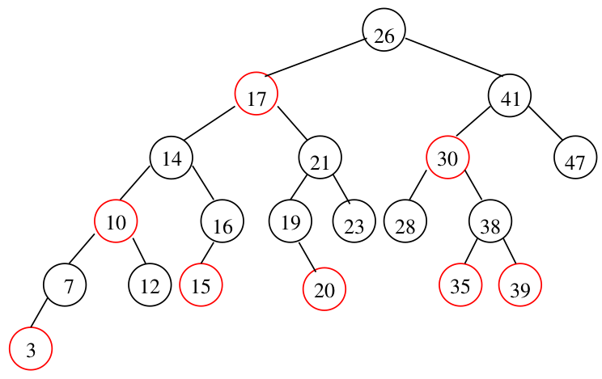
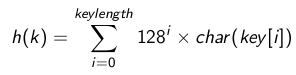
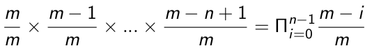
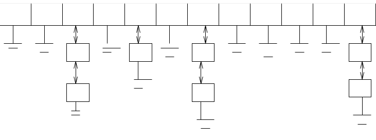

#Data Structures

1. Role of Data Structures
2. Contiguous vs. Linked Data Structures
3. Stacks & Queues
4. Dictionaries
5. Hash Tables
6. Binary Search Trees
7. Balanced Binary Search Trees

##Role of Data Structures

Two aspects to data structure

- Abstract operations which it supports
- The implementation of these operations

Bit of conflict between the two. (algo focus more on implementation)

**Container**: a data structure that permits storage and retrieval of items *independent of content*

**Dictionaries**: abstract data types that retrieve based on key values or content

##Contiguous vs Linked Data Structures

Contiguous: Chunk of memory

Link: Pointer chain (lots of chunks connected)

###Array

Classic Contiguous example

###Advantages of Contiguous

- Constant time: Can access efficiently. If index known, can be accessed in constant time $\Theta$(1)
- Space efficient: Array is pure data, no space wasted with linking (pointers)
- Memory locality: Arrays exhibit good memory locality. Physical continuity between successive data accesses helps exploit the high-speed *cache memory* on modern computer architectures. 

###Dynamic Arrays

- Issue with array is you cant adjust size of arrays mid program execution
- Compensating by allocating large memory for big arrays is wasteful
- Dynamic Array: start with array size 1, double every time space is ran out
- For n, this is log~2~(n) times of doubling. 

Analysis for Dynamic Arrays:

\
{width=70%}

> Half the element copied once, half of that half is copied twice, and so forth

> This results in a time of about 2n, so worst case its the same as a normal array O(n)

###Pointers and Linked Structures

Pointers: represent address of a location in memory

- Cellphone can be seen as a pointer to the owner as they move about the world
- NULL pointer value used to denote structure-terminating, or unassigned pointer

\

###Operations on List

1. Search: walk thru list until you find x. O(n)
2. Insert: insert at front. $\Theta$(1)
3. Delete: first search for x predecessor and point to what x was pointing at. Then delete x. O(n) 

O(n) for search and delete because you can find it right away, or take you until n (less than n). 

Theta for insert because it takes 1 every time to place something in the front. 

###Advantages of Linked Lists

- Overflow on linked structures can never occur, unless memory is actually full.
- Insertions & deletions are *simpler* than for contiguous (array) lists. 
- W/ large records, moving pointers is easier and faster than moving the items themselves. 

###Disadvantages of Linked Lists

- Extra space needed to store pointer fields
- Linked lists do not allow efficient random access to items
- Arrays still have better memory locality

##Stack and Queues

Stack and Queues are relevant when the order in which you retrieve data is based on the **function of when it arrived**. 

- Stack: last-in, first-out (push and pop)
- Queue: first-in, first-out (enqueue and dequeue)
- Deque: double ended queue and supports all four operations (push, pop, enqueue, dequeue)

##Dictionary (Dynamic Set)

Dictionary: set of items indexed by keys

Primary operations on dictionary data structure:

- Search(S, k): given set S and key value k, return a pointer x to an element in S whose key is k, if it exists. 
- Insert(S, x): add x to set S
- Deletion(S, x): Given a pointer x to an element in the set S, remove x from S. (Given a pointer and not a key value) 

Auxiliary operations on dictionary data structures:

- Min(S), Max(S): return the element of the totally ordered set S, which has the smallest/largest key. 
- Successor(S, x), Predecessor(S, x): given an element x whose key is from a totally ordered set S, return the next largest/smallest element in S, or NIL if x is the maximum/minimum element. (next or previous)

###Dictionary Implementations

1. Unsorted Array
2. Sorted Array
3. Singly-Linked Unsorted List
4. Doubly-Linked Unsorted List
5. Singly-Linked Sorted List
6. Doubly-Linked Sorted List
7. Binary Search Tree
8. Balanced Binary Search Tree
9. Hash Tables

###Unsorted Array 

In this context, pointer = index

- Search(S, k) - sequential search. O(n)
- Insert(S, k) - place in first empty spot. $\Theta$(1)
- Delete(S, x)\* - copy n^th^ item to the x^th^ spot. Can do this b/c unsorted. $\Theta$(1)
- Min(S), Max(S) - sequential search. $\Theta$(n)
- Successor(S, x), Predecessor(S, x) - sequential search. $\Theta$(n)

\*Deletion is tricky. Definition states we are given pointer x to the element to delete. Deleting the element leaves a hole that must be filled. There are two approaches to fix this

1. Move each element after x down an index. This requires $\Theta$(n) time
2. Write over A[x] with A[n] and decrement n. This is constant time

###Sorted Array

- Search(S, k) - binary search. O(lg n) 
- Insertion(S, k) - search, then make space. O(n)
- Delete(S, x) - move to fill hole. O(n) 
- Min(S), Max(S) - first or last element. $\Theta$(1)
- Successor(S, x), Predecessor(S, x) - add or subtract 1 from pointer $\Theta$(1)

\newpage

###Singly Unsorted Linked List

Search, insert, and delete were covered earlier.

- Min(S), Max(S) - sequential search. O(n)
- Successor(S, x), Predecessor(S, x) - sequential search. O(n)

###Doubly Unsorted Linked List

- Search(S, k) - sequential search. O(n)
- Insertion(S, k) - put in front. O(1) 
- Delete(S, x) - attach pred and succ, then delete. O(1) 
- Min(S), Max(S) - sequential search O(n)
- Successor(S, x), Predecessor(S, x) - sequential search O(n)

Gives advantages to predecessor queries, however you waste space due to doubling number of pointers. The extra big-Oh costs of doubly-linked lists is zero

###Single Sorted Linked List

- Search(S, k) - sequential search. O(n)
- Insertion(S, k) - sequential search. O(n)
- Delete(S, x) - same solution as single unsorted linked list. O(n) 
- Min(S), Max(S)\* - head or tail of list. O(1)
- Successor(S, x) - look where the pointer points to next. O(1) 
- Predecessor(S, x) - sequential search to find predecessor to x. O(n)

###Double Sorted Linked List

- Search(S, k) - sequential search. O(n)
- Insertion(S, k) - sequential search. O(n)
- Delete(S, x) - attach pred and succ, then delete. O(1) 
- Min(S), Max(S)\* - head or tail of list. O(1)
- Successor(S, x), Predecessor(S, x) - Look at forward/backward pointers. O(1)

\*Usually Max(S) would take $\Theta$(n) in single OR double list, however... 

- Doubly linked lists: having the last element be a NULL allows us to access it constant time, and it points back to the Max node.
- Singly linked lists: Charge the cost to deletion. When doing deletion just keep track of maximum. 

\newpage 

###Complexities

{width=70%}

###DS Operation Expectations

What complexity is considered reasonable for a data structure operations and why?

- $\Theta$(1): Good. Ideal. 
- O(log n): Good
- O(n): Meh, with single access that is not good. 

\newpage

##Binary Search Trees

BST  supports all dictionary operations

- Search: O(h)
- Insert: O(h)
- Delete: O(h)
- Succ/Pred: O(h)
- Min/Max: O(h)

h denotes height of the tree and is $\Theta$(log n) on average and $\Theta(n)$ on worst case.

Representation of BST

- A node uses 2 pointers
- Node contains
    - left & right child pointers
    - key field
    - parent pointer
- The parent link is optional, since you can store pointers on a stack on the way down

Definition of BST

- Rooted binary tree: either empty or root with a left and right subtree
- Let x be any node in BST
- If y is a node in x's left subtree, then y &rarr; key $\le$ x &rarr; key
- If y is a node in x's right subtree, then y &rarr; key $\ge$ x &rarr; key

\*Review 3 order traversal for BST

###BST: Searching

Searching in BST works because both subtrees are BST. (Recursive structure, recursive algorithm). This takes time proportional to the height O(h). 

Just start at root and if the element you're looking for is bigger than your current node, move left, else move right. Repeat until element is found. 

###BST: Min/Max

Min: leftmost subtree

Max: rightmost subtree

\newpage 

###BST: Successor/Predecessor

Successor:

- if x has a right subtree, successor is the smallest element in it. 
- else if the nearest ancestor A(of x) such that x is in A lefts subtree. 

Predecessor is just the opposite (symmetric)

###BST: Insertion

Do a binary search to get to the leaf that will point to the inserted node. Once that leaf is found, replace one of the leaves (depending on if its larger or smaller than the node) with the new inserted node. 

- A trailing pointer must be maintained so that the parent of the new node will know where to point to. 
- Insertion takes time proportional to the height O(h). 

###BST: Deletion

There are three scenarios when deleting:

1. Deleting a leaf (no child): Can just remove it, does not effect structure of the tree
2. Deleting node with 1 child: Replace node you want to delete with its child. 
3. Deleting node with 2 child: Find next biggest value and replace it with that. 
    - This is done by going into the right subtree
    - Then traverse to the leftmost node
    - Take the leftmost node in right subtree and that's the new replacement for the deleted node.  

###BST Runtime

Best Case: All dictionary operations take O(h) time, where h is the height of the tree. The smallest height we can get is on a perfectly balanced tree (h = lg(n) in this scenario)

Worst Case: If insertion occurs in a sorted order, everything would get added to the right subtree. This creates a giant linear height tree of n. 

Average Case: Considering all the permutations of insertion order into the tree, thee average tree will have O(logn) height. This shows the power of randomization. 

##Perfectly Balanced Trees

They are high maintenance: if inserting a new key that doesn't fit in next open leaf, we must move every single node in the tree to rebalance it. This takes $\Theta$(n) time. 

##Red-Black Trees

A BST is a red-black tree if it satisfies the following properties...

- Every node is either red or black
- If a node is red, then both of its children are black
- Every path from a node to a leaf contains the same number of black nodes
- The root is always black

Theorem: a RB tree with n nodes has h $\le$ 2log~2~(n+1)

Can interpret red leaves as nodes with pointers pointing to null black leaves

###Red-Black Tree Operations

Search, Min/Max, Pred/Succ, are unchanged because they don't change the tree

Insert and Delete operations need to be modified as to not violate the red-black tree properties. (This is done using rotations and color changes)

##Hash Tables

Hash tables are a practical way to maintain a dictionary. 

The idea is that looking an item up in an array is $\Theta$(1) once you have it index

A hash function is a mathematical function which maps keys to integers. 

###Hash Functions

Hash Function: map keys to integers. An ideal hash function...

1. Is cheap to evaluate
2. Element is equally likely to hash into any of the *m* slots
3. Independently of other elements

The first step is usually to map the key to a big integer; for example...

\
 

This large number must be reduced to an integer whose value is between 0 and m - 1 (size of hash table). 

One way is by h(k) = k mod m

###The Birthday Paradox

No matter how good our hash function is, we'd better be prepared for *collisions* because of the *birthday paradox*. 

The probability of there being no collisions after n insertions into an m-element table is ...

\

When m = 365, this drops below 1/2 when n = 23 and sinks to almost 0 when n $\ge$ 50

###Collision Resolution by Chaining

Let each element in the hash table be a pointer to a list of keys. 

\

This can be bad if somehow all elements are chained into a single hash point.

- Insertion, deletion and search end up becoming linked list operations
- If the n keys are distributed uniformly in a table of size m, each operation takes O(n/m) time
- Chaining is easy, but devotes a considerable amount of memory to pointers, which could instead be used to make the table larger

###Open Addressing

Can dispense with pointers, by using an implicit reference derived from a simple function

@@@image 61

If the space we want to use is filled, we can examine the remaining locations:

1. Sequentially h, h+1, h+2...
2. Linearly h, h+k, h+2k...
3. Quadratically h, h+1^2^, h+2^2^...

Use more complicated schemes to avoid long runs from similar hash keys

Deletion is fucked with open addressing. How?

###Hash: Performance on Dictionary Operations

With either chaining or open addressing:

- Search - O(1) expected, O(N) worst case
- Insert - O(1) expected, O(N) worst case
- Delete - O(1) expected, O(N) worst case
- Min/Max and Pred/Succ $\Theta$(n+m) expected and worst case

Pragmatically, a hash table is often the best data structure to maintain a dictionary. 

However, we will not use it to analyze algorithms since the worst-case time is unpredictable

###HASHING HASHING HASHING

Some dude at google said hashing three times so you know its important. 

Hashing gives you short, but distinctive representation of a larger document. 
