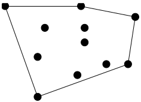
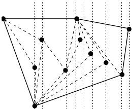
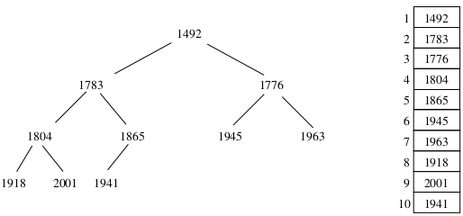
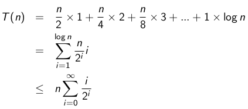
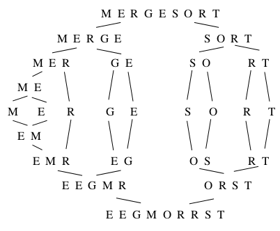
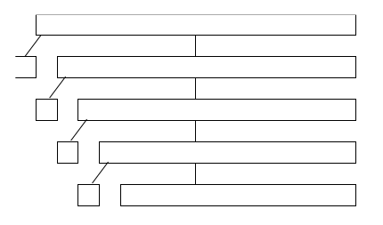
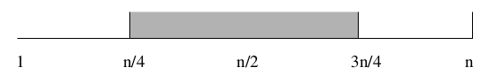
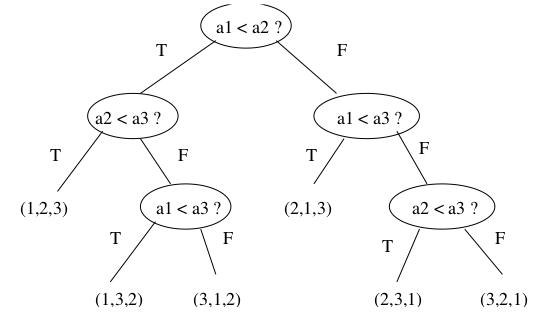

#Sorting

##Problem of the Day

Input: a set of 2n numbers
Want: partition into n pairs, so that the partition minimizes the maximum sum of a pair

Ex: (1, 3, 5, 9)

The possible partitions are...

- ((1,3), (5,9)): sum = (4,14). Max = 14
- ((1,5), (3,9)): sum = (6,12), Max = 12
- ((1,9), (3,5)): sum = (10,8), Max = 10

The third partition has 10 as it maximum sum, which is the minimum over the three partitions. 

##Intro Sorting

Sorting is important because most ideas in algorithm can be taught in the context of sorting. 

Efficiency of Sorting: Using O(nlogn) sorting algorithms leads naturally to sub-quadratic algorithms. 

##Application of Sorting:

Searching

- Binary search lets you test whether an item is in a dictionary in O(lg n) time.
- Search preprocessing is perhaps the single most important application of sorting.

###Application of Sorting: Closest Pair

Given n numbers, find the pair which are closest to each other

- Once the numbers are sorted, the closest pair will be next to each other in sorted order, so an O(n) linear scan completes the job

###Application of Sorting: Element Uniqueness

Given a set of n items, are they all unique or are there any duplicates

- Sort them and do a linear scan to check all adjacent pairs
- This is a special case of closest pair above

###Application of Sorting: Mode

Given a set of n items, which element occurs the largest number of times? (More generally, compute the frequency distribution). 

- Sort them and do a linear scan to measure the length of all adjacent runs. 
- The number of instances of k in a sorted array can be found in O(logn) time by using binary search to look for the positions of both k - $\in$ and k + $\in$

###Application of Sorting: Median and Selection

What is the k^th^ smallest item in the set? k = $\frac{n}{2}$

- Once the keys are placed in sorted order in an array, the k^th^ smallest can be found in constant time by simply looking in the k^th^ position of the array. 
- There is a linear time algorithm for this problem, but this idea comes from partial sorting. (Better off sorting tho) 

\newpage

###Application of Sorting: Convex Hulls

Given n points in two dimensions, find the smallest area convex polygon which contains them all. Convex hull is a key building block for more sophisticated geometric algorithms. 

\

Finding convex hulls: once you have the points sorted by x-coordinate, they can be inserted from left to right into the hull since the rightmost point is always on the boundary. 

\

Sorting eliminates the need to check whether points are inside the current hull. Adding a new point might cause others to be deleted. 

##Pragmatics of Sorting: Comparison Function

- Alphabetizing is the sorting of text strings
- Libraries have very complete and complicated rules concerning the relative collating sequence of characters and punctuation

###Pragmatics of Sorting: Equal Elements

- Elements with equal key values will all bunch together in any total order, but sometimes the relative order among these keys matter. 
- Sorting algorithms that always leave equal items in the same relative order as in the original permutation are called **stable**
- Unfortunately very few fast algorithms are stable, but stability can be achieved by adding the initial position as a secondary key. 

Ex. 

> Array: [1 3(1) 4 5 3(2) 6 3(3) 2] 

>> Sorted: [1 2 3(1) 3(2) 3(3) 4 5] &larr; THIS IS STABLE

>> Sorted: [1 2 3(3) 3(1) 3(2) 4 5] &larr; THIS IS NOT STABLE 

###Pragmatics of Sorting: Library Functions

- Any reasonable programming language has a built-in sort routine as a library function. 
- You are almost always better off using the system sort than writing your own

##Selection Sort

Selection sort scans the entire array, repeatedly finding the smallest remaining element. 

> For i = 1 to n

>> A: Find the smallest of the first n - i + 1 items
>> B: Pull it out of the array and put it first

Selection sort takes O(n(T(A) + T(B)) time

##Data Structure Matters

Using arrays or unsorted linked lists as the data structure, operation A takes O(n) time and operation B takes O(1), for an O(n^2^) selection sort. 

Using balanced search trees or heaps, both of these operations can be done within O(lg n) time, for an O(nlogn) selection sort, balancing the work and achieving a better trade off. 

##Heap Definition

A binary heap is defined to be a binary tree with a key in each node such that:

1. All leaves are on, at most, two adjacent levels (Structural property)
2. All leaves on the lowest level occur to the left, and all levels except the lowest one are completely filled (Structural property)
3. The key in any node is $\le$ keys in its children (Labeling property)

Heaps maintain a partial order on the set of elements which is weaker than the sorted order (so it is more efficient to maintain)

###Heaps: Partial Order

Heaps is a data structure that holds a partial order. The ancestor relation in a heap defines a *partial order*

1. Reflexive: x is an ancestor of itself
2. Anti-symmetric: if x is an ancestor of y, and y is an ancestor of x, then x = y
3. Transitive: if x is an ancestor of y, and y is an ancestor of z, x is an ancestor of z. 

Partial orders can be used to model hierarchies with incomplete information or equal-valued elements. (Hierarchy like CEO boss of CIO and CTO)

###Why Heaps?

The partial order defined by the heap structure is weaker than of the total order, which explains...

- Why its easier to build
- Why it is less useful than sorting (but still important)

###Array-Based Heaps

Normally we use pointers to represent a binary tree. However, we store heaps as an array of keys, using the position of the keys to *implicitly* satisfy the role of the pointers. 
    
- On a heap tree, top to bottom left to right, label each node incrementally for the array (the box from figure 1 represents the heap label into an array). 

- The left child of k sits in position 2k and the right child in 2k + 1
- The parent of k is in position $\lfloor k/2 \rfloor$
- The grandparent of k is in position $\lfloor k/4 \rfloor$ 

###Can we Implicitly Represent any Binary Tree?

- The implicit representation is inefficient if the tree is sparse, meaning that the number of nodes n < 2^h^
- All missing internal nodes still take up space in our structure
- This is why we insist on heaps as being as balanced/full at each level as possible. 

###Heap Height 

A heap height with n elements has height h = $\lfloor lgn \rfloor$

###Heap Insertion

1. Put new element in (n + 1)^st^ location in the array
2. "Bubble" it up to the correct place (swap with parent lol)

Heaps can be constructed incrementally, by inserting new elements into the heap.

- Doing n such insertions takes $\Theta$(nlogn). (log1 + log2 + ... logn)

##Bubble Down or Heapify

Heapify is an OP way to build heaps invented by some dude. Given two heaps and a fresh element, they can be merged into one by making the new one the root and bubbling down. 

###Heapify(A, i) Algorithm

Makes the subtree rooted at i a heap *provided* that the left and right subtrees of i are *already* heaps. 

1. Let min be the smaller of i's two children:

> min(A[2i], A[2i + 1])

2. **if** A[i] < min

> **then** "DONE"

> **else**

>> Swap A[i] with min

>> Heapify(A, 2i or 2i + 1)

- 2i is root of left sub tree, 2i+1 is root of right subtree. 
- Time complexity: O(1) effort at each level x height = O(logn)

###Build Heap

Given an arbitrary array, convert it into a heap

Build-heap(A)

> n = |A|

> For i = $\lfloor$n/2$\rfloor$ to 1 do

>> Heapify(A, i)

- Time complexity(simple analysis): O(n) calls to HEAPIFY, each call is O(logn), so O(nlogn)

\newpage 

###Build Heap: Time Complexity, Exact Analysis

Time complexity(exact analysis): BUILD HEAP performs better than O(nlogn), because most of the heaps we merge are extremely small. 

\

- The bottom level in the tree = n/2 and doesn't even call heapify
    - Each level in the tree has half of the child level and thus decreases incrementally.
- The summation above equates to O(2n) so it takes linear time

###Heap Loose Ends

- Min-Heap vs Max-Heap: are just opposites

- Deletion of max element from max-heap: remove root, take smallest node and place it as the root, then bubble down to fix everything.
    - Deleting max repeatedly leads to algorithm to get the elements sorted

- Heapify is useful for BUILD HEAP and DELETE MAX

\newpage 

##Heapsort

Heapsort(A)

> Build-heap(A)

> For i = n to 1 do

>> swap (A[1], A[i])

>> n = n - 1

>> Heapify(A, 1)

Exchanging the max element with the last element and calling heapify repeatedly gives an O(nlogn) sorting algorithm.

As you delete the largest element, since you're moving the last element, you can place the delete element into that spot. This means you're sorting without taking extra space. 

##Priority Queues

- Priority queues are data structures which provide extra flexibility over sorting.
- This is important because jobs often enter a system at arbitrary times
- It is more cost-effective to insert a new job into a priority queue than to re-sort everything on each new arrival

###Priority Queue Operations

- Insert(Q, x): Given an item x with key k, insert it into priority queue Q
- Find-Maximum(Q): Return a ptr to item with max key value in priority queue Q
- Delete-Maximum(Q): Remove the item from priority queue Q whose key is maximum

Each of these operations can be easily supported using heaps or balanced binary trees in O(logn)

###Application of Priority Queues: Discrete Event Simulations

- In simulations of airports/parking/comp networks priority queues determines who's next
- The stack and queue orders are ideal case, people can cut in real life lol. 

##Mergesort

Mergesort: a recursive approach to sorting involves partitioning the elements into two groups. Sorting each of the smaller groups recursively, and then interleaving the two sorted lists to totally order the elements. 

###Merging Sorted Lists

- The efficiency of mergesort depends on how effectively we combing two sorted halves into a single list
- The smallest element can be removed, leaving two sorted lists behind, one slightly shorter than before. 
- Repeating this operation until both list are empty merges the two sorted lists into one. Using at most n - 1 comparisons or O(n) total work

###Buffering

- Although mergesort is O(nlogn), it is inconvenient to implement with a single array
- Merging (4, 5, 6) and (1, 2, 3) would overwrite the first three elements if they were packed in an array
- Writing the merged list to a buffer and recopying it uses extra space, but not extra time. 

###External Sorting

- When n is large, it doesn't fit in memory
- Mergesort proves to be the basis for the most efficient *external* sorting programs
- Disk are slow than main memory, and benefit from algorithms that read and write data in long streams, not random access

###Divide and Conquer Examples

Matrix multiplication is an example of divide and conquer (can do rows and columns separately).

Best known algorithm for matrix multiplication is O(n^2.376^)

Strategy: divide problem into two smaller subproblems, solve each recursively, meld the two partial solutions into one solution.

- Merging takes less time than solving the two subproblems, we get an efficient algorithm

##Quicksort

Quicksort: is the fastest *internal* sorting algorithm. It uses partitioning about a pivot, the pivot is any element in the array. It could be...

- an element in a specific location
- or chosen randomly

###Partitioning about the Pivot

Partitioning places all the elements less than the pivot in the left part of the array, and all of the elements greater than the pivot in right part of the array. The pivot fits in the slot between them. 

###Why Partition?

Partitioning takes O(n) time. This gives us...

1. The pivot ends up in the correct place in the total order
2. After partitioning, no element flops to the other side of the pivot in the final sorted order
3. Thus, we can sort the elements to the left and right of the pivot independently, giving us a recursive sorting algorithm

###Quicksort Pseudocode

Sort(A)

> Quicksort(A,1,n)

Quicksort(A, low, high)

> if (low < high)

>> pivot-location = Partition(A,low,high)

>> Quicksort(A, low, pivot-location -1)

>> Quicksort(A, pivot-location + 1, high)

###Best Case for Quicksort

The best case for divide and conquer algorithms comes when we split the input as evenly as possible. Thus in the best case, each subproblem is of size n/2

The partition step on each subproblem is linear in its size

At the k^th^ level, the **TOTAL** effort in partitioning the 2^k^ problems of size $\frac{n}{2^k{}}$ is O(n)

{width=50%}

The partitioning on each level is O(n); logn levels

Total time in the best case is O(nlogn)

\newpage

###Worst Case for Quicksort

Suppose instead our pivot elements splits the array as unequally as possible..

\
{width=50%}

We now have n-1 levels, instead of logn, for a worst case time of $\Theta$(n^2^)

###The Average Case for Quicksort

Suppose we pick the pivot at random

\
{width=80%}

Half the time, the pivot element will be from the center half of the centered array

Whenever the pivot element is from positions n/4 to 3n/d, the larger remaining subarray contains at most 3n/4 elements

###How Many Good Partition Levels

If we assume that the pivot element is always in this range, what is the maximum number of partition levels k we need to get from n elements down to 1 element

2 logn

###How Many Bad Partition Levels

1.38 logn

###Picking a Better Pivot

To choose best pivot:

1. Use the middle element of the subarray
2. Take the median of three elements (first, middle, last) as the pivot

Whichever these rules we use, worst case is still O(n^2^)

##Is Quicksort Faster than Heapsort

- Heapsort is $\Theta$(nlogn) and selection sort is $\Theta$(n^2^), there is no debate about which will be better for decent-size files
- When quicksort is implemented well, it is typically 2-3 times faster than mergesort or heapsort
- Outside the realm of asymptotic analysis

###Randomized Quicksort

Picking the pivot at a random point helps avoid worst-case instance. 

Random pivot gives a high probability that the randomized quicksort runs in $\Theta$(nlogn) time 

Randomization is a general tool to improve algorithms with bad worst-case but good average-case complexity

###Can we sort in o(nlogn)

This is the same as can we beat nlogn (strictly less than nlogn)

Any comparison-based sorting program can be thought of as defining a decision tree of possible executions.

\newpage

##Decision Tree for Insertion Sort

Comparison Sorts and Decision Trees

- Claim: the height of a decision tree is the worst-case complexity of sorting
- There are at least n! different leaves in a tree
- Tree of height h has at most 2^h^ leaves
- Tree must have height h such that 2^h^ $\ge$ n!
- h $\ge$ lg(n!) which is equal to $\Theta$(nlgn)
- Therefore h is the worst-case complexity

##Radix Sort

- Assume that the input is provided as a linked list
- Assume that each integer has *d* digits
- There will be *d* passes starting with the least significant digit

###Time Complexity

O(n + r) per pass. 

- r is the number of bins

d passes so O(d(n + r)) overall

numbers in the range [0,999] give d = 3 and r = 10

