#Chapter 5: Graphs

##Graphs

Graphs G = (V, E) is defined by a set of vertices V, and a set of edges E consisting of ordered or unordered pairs of vertices from V. 

Application of Graphs: 

- Road networks
- Circuits

###Directed vs. Undirected Graphs

A graph G = (V, E) is *undirected* if edge (x, y) $\in$ E implies that (y, x) is also in E.

\
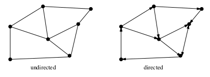

Related back to applications:

- Road networks between cities are undirected
- Street networks within cities may be directed because of one-ways

\newpage

###Weighted vs Unweighted Graphs

In weighted graphs, each edge (or vertex) of G is assigned a numerical value, or weight

\
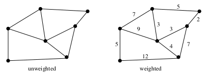

Related back to applications:

- Edge of a road network graph might be weighted with length or drive time.

###Simple vs Non-simple Graphs

Certain types of edges complicate the task of working with graphs. 

1. A self-loop is an edge (x, x) 
2. An edge (x, y) is a multi-edge if it occurs more than once in the graph

\
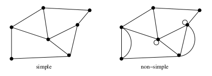

Graph that avoid these structures are called **simple**. 

\newpage

###Sparse vs Dense Graphs

Graphs are *sparse* when a small fraction of vertex pairs actually have edges defined between them. 

\
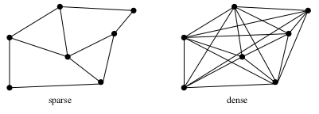

Dense graphs have a quadratic number of edges while sparse graphs are linear in size. 

###Cyclic vs Acyclic Graphs

An *acyclic* graph does not contain any cycles. Trees are connected acyclic undirected graphs. 

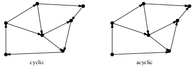

Directed acyclic graphs (DAGs). They arise naturally in scheduling problems, where a directed edge (x, y) indicates that x must occur before y.

\newpage

###Implicit vs Explicit Graphs

Many graphs are not explicitly constructed and then traversed, but built as we use them. 

\
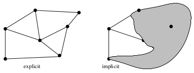

###Embedded vs Topological Graphs

A graph is *embedded* if the vertices and edges have been assigned geometric positions. 

\
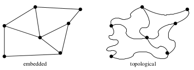

\newpage

###Labeled vs Unlabeled Graphs

In *labeled* graphs, each vertex is assigned a unique identifier to distinguish it from all other vertices. 

\
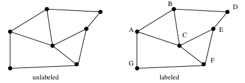

An important graph problem is *isomorphism testing*, determining whether the topological structure of two graphs are in fact identical if we ignore any labels. 

###The Friendship Graph

Consider a graph where the vertices are people, and there is an edge between two people if and only if they are friends. 

\
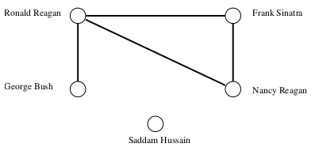

\newpage

Here are some examples of the importance of proper modeling in terms of friendship graph:

- *If I am your friend, does that mean you are my friend?* - This question ask if the graph is **directed** or not. Heard of is an example of directed (you know a famous person, but they don't know you). A "had-sex-with" graph would be undirected because sex involves two people. 
- *How close a friend are you?* - Asking if graph is **weighted**, higher number means closer friends, negative number means enemies. Its all arbitrary. 
- *Am I my own friend?* - Asking if graph is **simple** (is there a loop)
- *Who has the most friends?* - The **degree** of a vertex is the number of edges connected to it. This question is asking for the vertex with highest degree. This is prevalent in **dense** graphs. 
- *Do my friends live near me?* - This would be an **embedded** graph. Where each vertex correspond to a location in the world. 
- *Oh, you also know her?* - This is a **implicit** graph. Everyone knows who their friends are, but not who their friend's friends are, without asking. 

\newpage 

##Data Structures for Graphs

There are two main data structures used to represent graphs are:

1. Adjacency matrices
2. Adjacency lists

We assume the graph G = (V, E) contains n vertices and m edges.

###Adjacency Matrices

We can represent G using an n x n matrix M, where element M[i,j] is 1, if (i,j) is an edge of G, and 0 if it isn't. This takes O(n^2^)

It uses excessive space for graphs with many vertices and relatively few edges. 

- Undirected graph: Wastes less space than a directed graph
- Sparse graph: Wastes hella space

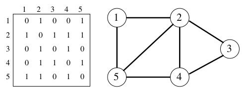{width=65%}

###Adjacency Lists

An adjacency lists consists of an array of n pointers, where the i^th^ element points to a linked list of the edges incident on vertex i. This takes O(n + n)

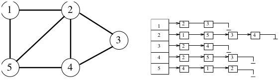{width=75%}

To test if edge (i, j) is in the graph, we search the i^th^ list for j, which takes O(d~i~), where d~i~ is the degree of the i^th^ vertex. 

> d~i~ is much less than n when the graph is sparse

###Comparison

\
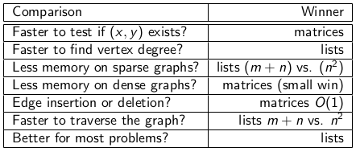

##Traversing a Graph

One of the most fundamental graph problems is to traverse every edge and vertex in a graph.

- For efficiency: we must make sure we visit each edge at most twice. 
- For correctness: we must do the traversal in a systematic way so that we don't miss anything. 

Since a maze is basically a graph, such an algorithm must be powerful enough to enable us to get out of an arbitrary maze.  

###Traversing a Graph: Key Idea

They key idea behind graph traversal is that we must mark each vertex when we first visit it, and keep track of what have not yet been completely explored. There are three states for a vertex

- *Undiscovered*: the vertex is in its initial state
- *Discovered*: the vertex after we have encountered it, but before we have check out all its incident edges
- *Processed*: the vertex after we have visited all its incident edges

A vertex cannot be processed before we discover it, so the state of each vertex progresses from undiscovered to discovered to processed

\newpage

###Traversing a Graph: Structure

Need to maintain a structure containing all the vertices we have discovered, but not yet completely explored

Initially, only a single start vertex is considered to be discovered

To completely explore a vertex, look at each edge going out of it. For each edge to an undiscovered vertex, mark it discovered and add it to the structure. 

Each **undirected** edge is considered exactly twice, when each of its endpoints are explored. **Directed** edges are only considered once. 

###Correctness of Graph Traversal

Every edge and vertex in the connected component is eventually visited

Counter-example proof: Suppose this isn't true (there exists a vertex v which was unvisited whose neighbor u was visited). This neighbor (u) will eventually be explored so we would visit v: 

&nbsp;

&nbsp;

&nbsp;

\
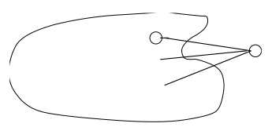

\newpage

##Breadth-First Traversal 

There are two primary traversal algorithms:

- Breadth-first search (BFS)
- Depth-first search (DFS)

For certain problems, it makes no difference which one you use, in other cases the distinction is crucial

BFS is appropriate if we are interested in the shortest paths on unweighted graphs

###By-Products of BFS

1. Breadth First Tree
2. Shortest path from start vertex s to each vertex x in G

###BFS: Info for each node u

color[u]: 

- WHITE = u is undiscovered
- GRAY = u is discovered
- BLACK = u is explored

d[u]: distance from s to u

parent[u]: u's parent in the BF tree

###BFS Algorithm Initialization

Initially, for all nodes:

- color is WHITE (GRAY for s)
- d is $\infty$ (0 for s)
- parent is nil

Use an (initially empty) FIFO queue Q to store discovered vertices

\newpage

###BFS Algorithm

```
Enqueue(Q,s)

while (Q is not empty) do 

    u = first element in Q

    for each v adjacent to u

        if (color[v] == WHITE) then

            color[v] = GRAY
            d[v] = d[u] + 1
            parent[v] = u

            Enqueue(Q,v)

        Dequeue(Q)
        color[u] = BLACK 
```

1. d records length of shortest path from s to u
2. Follow parent ptrs back to s to actually retrieve the shortest path
3. Obtain BF Tree by only considering edges of the form (u, parent[u])

##Applications of BFS

###Connected Components

- The connected components of an undirected graph are the separate "pieces" of the graph such that there is no connection between the pieces
- Many seemingly complicated problems reduce to finding or counting connected components
- For example, testing whether a puzzle such as a Rubik's cube or the 15-puzzle can be solved from any position is really asking whether the graph of legal configurations is connected. 

###Finding Connected Components

- Anything we discover during a BFS must be part of the same connected component. 
- We then repeat the search from any undiscovered vertex (if one exists) to define the next component, until all vertices have been found. 

\newpage

###Two-Color Graphs

The **vertex coloring problem** seeks to assign a label (or color) to each vertex of a graph such that no edge links any two vertices of the same color

A graph is **bipartite** if it can be colored without conflicts while using only two colors. Bipartite graphs are important because they arise naturally in many applications

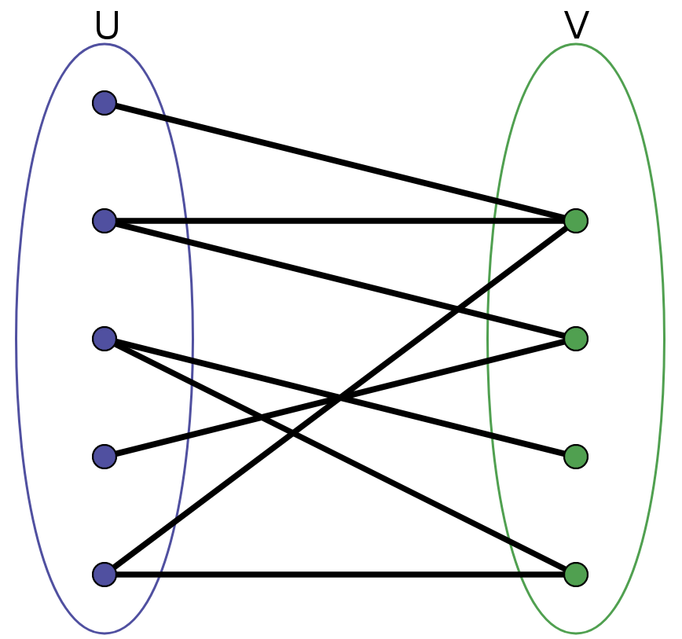{width=40%}

###Finding a Two-Coloring

- We can assign the first vertex in any connected component to be whichever color we wish
- We can augment breadth-first search so that whenever we discover a new vertex, we color it the opposite of its parent. 

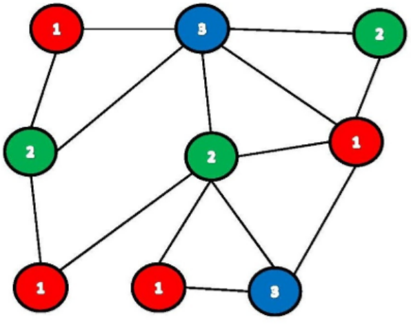{width=40%}

##Depth-First Search

- DFS exhaustively searches all possibilities by advancing if it is possible, and backing up if its not possible
- Best understood as a recursive algorithm
- DFS can be thought of as BFS with a stack instead of a queue. 
- The beauty of implementing DFS recursively is that recursion eliminates the need to keep an explicit stack

###DFS Algorithm

**DFS**(G) 

for each ver u $\in$ V[G] do 

> color[u] = WHITE

> parent[u] = nil

time = 0

for each vertex u $\in$ V[G] do

> if color[u] = WHITE then DFS-VISIT[u]

&nbsp;

**DFS-VISIT**[u] 

color[u] = GREY //u had been white/discovered

d[u] = time = time + 1

for each v $\in$ Adj[u] do 

> if color[v] = WHITE then

>> parent[v] = u

>> DFS-VISIT(v) 

color[u] = BLACK //now finished with u

f[u] = time = time + 1

\newpage

###DFS on Undirected Graph

In a DFS of an undirected graph, we assign a direction to each edge from the vertex which discovers it. 

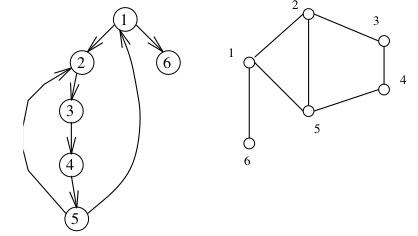{width=55%}

###Parenthesis Theorem 

Define vertex u's range to be [d[u],f[u]] 

For any pair of vertices u and v, exactly one of the following holds:

1. u's range and v's range are disjoint
2. u's range is contained in v's range (u is a descendant of v in DFT) 
3. v's range is contained in u's range (v is a descendant of u in DFT)

If v is a descendant of u:

- Discovery time of v is later than discovery time of u
- However, finishing time of v is earlier than the finishing time of u 

\newpage

###Edge Classification for DFS

Every edge is either: 

\
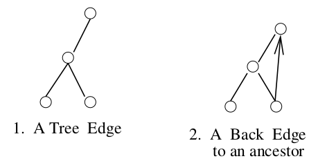{width=70%}

\
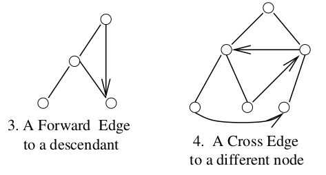{width=70%}

On any DFS or BFS of a directed or undirected graph, each edge gets classified as one of four

\newpage

###Edge Classification Implementation

Modify DFS to classify edges: edge(u,v) can be calssified by the color of v that is reached by exploring the edge. 

- WHITE &rarr; tree (or just check v's parent ptr)
- GRAY &rarr; back
- BLACK &rarr; forward or cross

###DFS: Tree Edges and Back Edges Only

In a DFS of an UNDIRECTED graph, every edge is either a tree edge or a back edge. 

No forward edges in DFS: suppose we have a forward edge. We would have encountered (4,1) when expanding 4, so this would be classified as a back edge

\
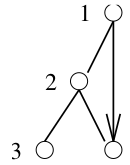{width=30%}

No cross edges in DFS: Suppose we have a cross-edge.

\
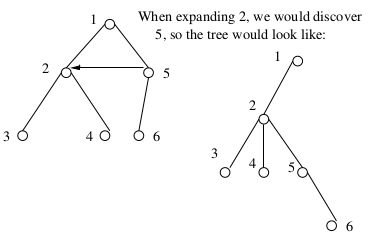{width=80%}

##Applications of DFS

###Finding Cycles

Any back edge going from x to an ancestor y creates a cycle with the path in the tree from y to x. 

###Terrorists

Suppose you are in charge of network security. Which station do you think a terrorist would blow up to disrupt operation. (This problem is directed at undirected graphs). 

\
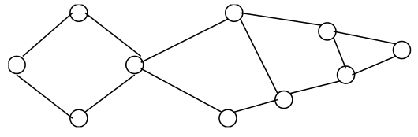

The node with 4 edges meeting. This node is called a **articulation vertex**. 

###Articulation Vertices

Articulation vertex: a vertex of a connected graph whose deletion disconnects the graph

- Connectivity is an important concern in the design of any network
- Articulation vertices can be found in O(n(m+n)): just delete each vertex and do a DFS/BFS on the remaining graph to see if it is connected. 

\newpage

###A Faster O(n+m) DFS Algorithm

Run DFS **once** and work with resulting DFS tree: 

\
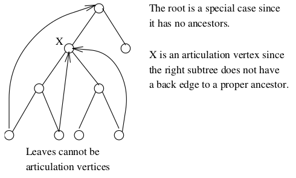

##DFS on Directed Graphs

###Topological Sorting on DAGs

\
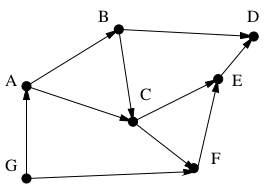

a topological sort of a graph is an ordering on the vertices so that all edges go from left to right (Ex. G,A,B,C,F,E,D)

###Applications of Topological Sorting

Topological sorting is often useful in scheduling jobs in their proper sequence. In general, we can use it to order things given precedence constraints. 

###Topological Algorithm

A directed graph is  DAG if and only if **no backedges are encountered during a depth-first search.** 

Theorem: Arranging vertices in **decreasing order of DFS finish times** gives a topological sort of a DAG

Thus, topological sorting takes O(n+m) time. 

###Proof of Theorem

Consider any directed edge u,v, when we encounter it during the exploration of vertex u: 

- If v is white - we start (and finish) a DFS of v before we continue with u. 
- If v is grey - then u,v is a back edge, which cannot happen in a DAG
- If v is black - we have already finished with v, so f[v] < f[u]

