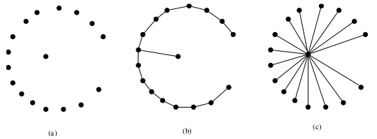
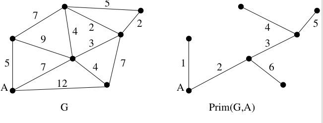
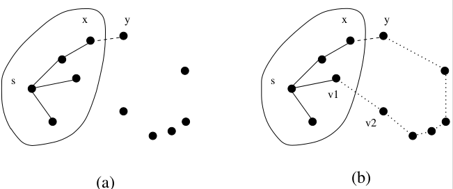
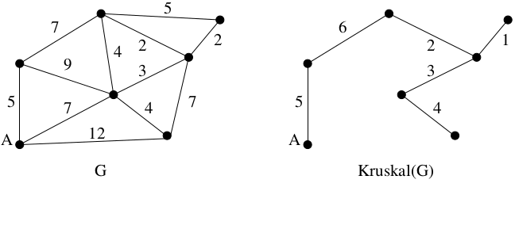
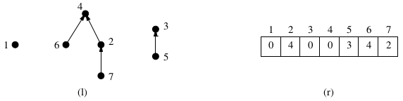
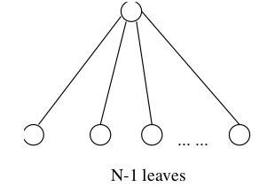
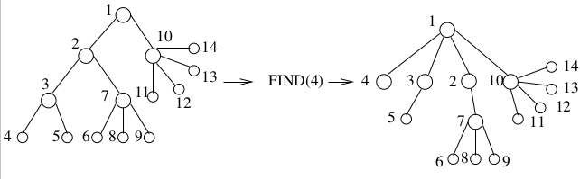
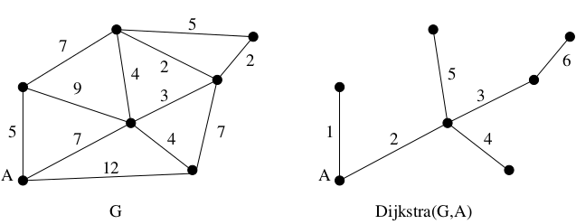

#Chapter 6: Weighted Graph Algorithms

Beyond DFS/BFS exists an alternate universe of algorithms for **edge-weighted graphs**

Our adjacency list representation quietly supported these graphs. (Just add a weight field to each node)

##Minimum Spanning Trees: Definition

*Tree*: is a connected graph with no cycles.

*Spanning tree*: is a subgraph of graph G which has the same set of vertices of G and is a tree (no cycles). 

*Minimum Spanning Tree* (MST): the spanning tree for a graph G whose sum of edges weights is as small as possible. 

There can be more than one minimum spanning tree in a graph &rarr; consider a graph with identical weight edges. 



###Applications of Minimum Spanning Trees

MSTs are useful in constructing networks, by describing the way to connect a set of sites using the smallest total amount of wire. 

MSTs provide a reasonable way for *clustering* points in space into natural groups. 

##Prim's Algorithm

Greedy algorithms (quick review): makes the decision of what next to do by selecting the best local option from all available choices - without regard to the global structure. 

Prim's Algorithm:

- If G is connected, every vertex will appear in the minimum spanning tree. 
- Starts from one vertex and grows the rest of the tree an edge at a time
- As a greedy algorithm, we want to pick the edge that will grow the tree by one vertex without creating a cycle, that is the cheapest also. 

###Prim's Algorithm (Pseudocode)

```
Prim-MST(G)
    Select an arbritrary vertex s to start the tree from
    While (there are still nontree vertices)
        Select the edges of minimum weight between a tree and nontree vertex
        Add the selected edge and vertex to the tree Tprim
```

&nbsp;

&nbsp;

&nbsp;



\newpage 

###Does Prim Produce MST (Proof)

Prim's algorithm is greedy in nature, so how does it obtain the minimum spanning tree (an optimal spanning tree)?

Use proof by contradiction: Suppose that there existed a graph G for which Prim's algorithm did not return a minimum spanning tree. 

\
a

- Let say edge (x,y) in figure (a) above was an edge we were trying to add that didn't return a MST
- For that to occur, a different path must have been available that connected to (x, y), this is shown in figure (b)
    - This path uses edge (v~1~, v~2~). Where v~1~ is in the Prim Algorithm Tree and v~2~ is not. 
    - This (v~1~, v~2~) edge is at least the size of (x,y). This is because Prim is greedy, if it were less it would've chosen this path. 
- Deleting (x,y) and using the edge (v~1~,v~2~) would result in the same path distance
- This means Prim does indeed always return a minimum spanning tree

###Prims' Algorithm

```c++
prim(graph *g, int start) {

    int i;                      /* counter */
    edgenode *p;                /* temporary pointer */
    bool intree[MAXV+1];        /* is the vertex in the tree yet? */
    int distance[MAXV+1];       /* cost of adding to tree */
    int v;                      /* current vertex to process */ 
    int w;                      /* candidate next vertex */
    int weight;                 /* edge weight */
    int dist;                   /* best current distance from start */

    for (i=1; i <= g->nvertices; i++) { // Initialize all nodes in graph
        intree[i] = FALSE; 
        distance[i] = MAXINT;
        parent[i] -1;
    }

    distance[start] = 0
    v = start;

    while (intree[v] == FALSE) {
        intree[v] = TRUE;
        p = g->edges[v]
        while (p != NULL){
            w = p->y;
            weight = p->weight;
            if ((distance[w] > weight) && (intree[w] == FALSE)) {
                distance[w] = weight;
                parent[w] = v;
            }
            p = p->next
        }
        v = 1;
        dist = MAXINT;
        for (i=1; i <= g->nvertices; i++)
            if ((intree[i] == FALSE) && (dist > distance[i])) {
                dist = distance[i];
                v = i;
            }
    }
    
}
``` 

**Algorithm Speed**:  Depends on the data structure used to determine smallest weighted edge from a tree to non-tree vertex. 

- Simple: use BFS/DFS to look at all edges that connect tree vertex to non-tree vertex in O(m). But we do this n times, so total O(nm) 
- Smart: takes O(n) time to figure out smallest weighted edge, O(n^2^) time total
- Smartest: using Fibonacci Heaps (sophisticated priority queue), take O(m+nlogn)
    
\newpage 

##Kruskal's Algorithm

Kruskal's algorithm:

- It repeatedly adds the smallest edge to the spanning tree that does not create a cycle. 
- Is greedy like Prim's.
- Unlike Prim's, it does not start with a particular vertex. 

\


###Kruskal's Algorithm (Pseudocode)

```
Kruskal-MST(G)
    Put the edges in a priority queue ordered by weight.
    count = 0
    while (count < n-1) do
        get next edge (v,w)
        if (component(v) != component(w))
            add to Tkruskal
            merge component(v) and component(w)
```
###Proof of Correctness

Similar to Prim's proof. Omit this information because of similarity. 

###Fast Kruskal implementation

Put the edge in a min-heap
count = 0

while (count < n - 1) do 

> get min-weight edge (v,w) from heap

> if (component(v) != component(w)) 

>> add to T

>> count++

>> Merge(component(v), component(w))

If comp ops take O(logn), Kruskal is O(mlogm)! 

*Q*: is O(mlogn) better than O(mlogm)?

- The value of m is at most n^2^, so mlogm and mlogn are the same shit

###Kruskal's Algorithm Speed

What is the simplest implementation?

- Sort the m edges in O(mlgm) time
- For each edge in order, test whether it creates a cycle in the forest we have thus far built - if 'yes' discard, else add to forest. 
- Testing for a cycle can be done by BFS/DFS in O(n) time (since the tree has at most n edges). 

Kruskal's algorithm builds up connected components 

- If the two end-vertices of an edge that is being considered are in the same connected component, then it creates a cycle. 
- Thus if we can maintain which vertices are in which component fast, we don't have to test for cycles. 
    - This can be accomplished by using Union-Find data structure





###Union-Find Data Structure

Set partition is a partitioning of elements of some universal set, into a collection of disjointed subset.

Connected components in a graph can be represented as a set partition. 

For an efficient Kruskal algorithm, we need a data structure that can handle the following operations efficiently:

- Same component(v,w) - Do vertices v and w lie in the same connected component of the current graph?
- Merge component(C~1~, C~2~) - Merge the given pair of connected components into one component. 
- Represent each component as a tree, with pointers from a node to its parent. 
- Each element is contained in a node, and the *name* of the component is the key at the root. 

Can implement the desired component operations in terms of two simpler operations:

- Find(i): Return the label of the root of tree containing elements i, by walking up the parent pointer until you can't go up any more. 
- Union(i,j): Make the root of one of the trees the parent of the root of the other tree so Find(i) now equals Find(j)

With these operations, the pseudocode to test if two nodes, i and j, are in the same component is now:

```
    t = Find(i)
    u = Find(j)
    return (is t == u)
```
Then use the union operation to merge component if they are not equal

###Union-Find Trees

We are interested in minimizing the time it takes to execute any sequence of unions and finds. 

- In worst case, heights of union-find trees can be O(n).
- When we union, simply make the tree with the smaller height the child of the other one.
- The height of the final tree will increase only if both subtrees are of equal height

Analysis shows that Unions and Finds take O(logn), so a sequence of n union-finds takes O(nlogn)

An ideal Union Find tree has depth 1:

\
{width=50%}

###Path Compression

On a find, if we are going to walk along a path anyway, why not change ptrs to point to the root

\


Better than O(nlogn) for n union-finds

###Inverse Ackermann Function 

Do we O(n) for a sequence of n union-finds?

Not quite, difficult analysis shows that it takes O(n$\alpha$(n)) time,

- $\alpha$(n) is the **inverse Ackermann function** 
- $\alpha$(number of atoms in the universe) = 5 (hella slow growing)

\newpage

##Shortest Paths

Path: a sequence of edges connecting two vertices. 

Finding the shortest path between two nodes in a graph arises in many different applications: 

- Transportation problems: finding the cheapest way to travel between two locations
- Motion planning: what is the most natural way for a cartoon character to move about a simulated environment
- Communications problems: how long will it take for a message to get from one place to another

There can be an exponential number of shortest paths between two nodes - so we cannot report all shortest paths efficiently. 

Shortest Path in Unweighted Graphs:

- In an unweighted graph, the cost of a path is just the number of edges on the shortest path. 
- This is found in O(n+m) time via BFS.

Shortest Path in Weighted Graphs:

- Length of path between two vertices: sum of the weights of the edges on the path. 
- BFS won't work on weighted graphs because sometimes visiting more edges can lead to shorter distances. (Ex. 1 + 1 + 1 + 1 + 1 \< 10 vs 1 + 20 + 1 \> 10)

Negative Edge Weights

- Negative cost cycles will continue to affect path depending how many times you enter the cycle. 
- Assume that all edge weights are positive, other algorithms deal correctly with negative cost edges. 
- MST algorithms are unaffected by negative cost edges. 

###Dijkstra's Algorithm

The principle behind Dijkstra's algorithm is that if **s,...,x,...,t** is the shortest path from s to t

- Then **s,...,x** had better be the shortest path from s to x


This suggests a dynamic programming-like strategy, where we store the distance from s to all nearby nodes, and use them to find the shortest path to more distant nodes.

\newpage

Dijkstra's output: 

- Shortest Path Tree rooted at s (similar to BF tree)
- parent[v]
- distance (from s) d[v]

Dijkstra's initialization:

- set each d[v] to $\infty$ (except d[s] = 0)
- set each parent[v] to nil

###Dijkstra's Algorithm

```
DIJKSTRA(G, S)
    S = {} //S doesn't really do anything, but useful to help prove and show stuff. 
    Q = V[G}                                // Q is a priority queue on d
    while (Q is not empty)
        u = Extract-Min(Q)
        S = S U {u}
        for each vertex v adjacent to u
        // "Relaxation" Step
        if d[v] > d[u] + w(u,v)
            d[v] = d[u] + w(u,v)            // DecreaseKey op
            parent[v] = u
```
The idea is similar to Prim's algorithm.

- In each iteration we add exactly one vertex to the tree of vertices where we *know* the shortest path from s.
- Like Prim, it keeps track of the best path seen to date
- The difference between the algorithms is:
    - MST (Prim): only care about was weight of the next potential tree edge
    - Shortest Path (Dijkstra): include the closest outside vertex to s

{width=75%}

###Dijkstra: Analysis

Initializing Q takes O(n) (this is from build\_heap)

O(n) iterations in while loop

O(n) Extract-Min operations on Q

**Total**: O(m) iterations of inner for loop

At most O(m) relaxations

Need to implement Decrease-Key on Q

###Dijkstra: Effect of Data Structures

1. Min-heap

- EXTRACT-MIN is O(logn)
- DECREASE-KEY is O(logn)
- &rarr; (n+m)logn &rarr; mlogn

2. Fibonacci-heap 

- EXTRACT-MIN is O(logn)
- DECREASE-KEY is O(1) amortized
- &rarr; nlogn + m

Dijkstra will not work if edges have negative weights. (Similar but different to Prim's MST algorithm)

\newpage

##All-Pairs Shortest Paths

All-pairs shortest path: finding the vertex in a graph that minimizes the longest or average distance to all other nodes (The center of a graph). 

Many applications, such as finding the diameter of a graph, require finding the shortest path between all pairs of vertices. 

We can use Dijkstra's algorithm n times (once for each possible start vertex) to solve all-pairs shortest path problem 

- This would be O(n(nlogn + m)) 

###The Floyd-Warshall Algorithm

Floyd-Warshall algorithm is a *slick* way to construct this n x n distance matrix from the original weight matrix of the graph. 

- Algorithm best employed on an adjacency matrix
    - Graph edges denoted with 1
    - Non-edges denoted with MAXINT
- This isn't bad because we need to store all n^2^ pairwise distances anyways. 

Floyd-Warshall algorithm develops recurrence that yields a dynamic programming formulation. 

- Number the vertices from 1 to n. 
- Let d[i,j]^k^ be the shortest path from i to j using only vertices from 1,2,...,k as possible intermediate vertices. (k superscript is the constraint of using vertices 1 to k)
    - Intermediate vertices: vertices between i and j
    - Ex. d[i,j]^0^ = w[i,j], or infinity if no weight
    - Ex. d[i,j]^n^ = Shortest Path

###The Floyd-Warshall Algorithm: Recurrence Relation

Base Case:

> w[i,j] if k = 0

Recurrence Relation:

> min( d[i,j]^k-1^, d[i,k]^k-1^ + d[k,j]^k-1^ ) if k $\ge$ 1

\newpage 

**floyd-warshall**()

> d^0^ = w

> for k = 1 to n

>> for i = 1 to n

>>> for j = 1 to n

>>>> d[i,j]^k^ = min( d[i,j]^k-1^, d[i,k]^k-1^ + d[k,j]^k-1^)  

This runs in $\Theta$(n^3^) time, which is worse than n calls to Dijkstra. However, the loops are tight and the whole thing is just simpler. 

##Network Flows

Flow Network: Directed graph G with two special vertices **sources** s and **sink** t.

- Each edge (u,v) has a capacity c(u,v) > 0 (How much can flow through a pipe)
- If (u,v) is not an edge, c(u,v) = 0 by convention 

Used to model:

- Flow of current in an electrical circuit
- Liquid flowing through pipes
- Traffic flow thru a network of roads
- Packets in a computer network

###Network Flow: Function (Definitions/Rules)

http://www.cs.kent.edu/~dragan/AdvAlg09/NetFlow-1x1.pdf

A flow is a real valued function on pair of vertices, f : V x V &rarr; R

f satisfies three (intuitive) properties 

1. Capacity constraint: f(u,v) $\le$ c(u,v) 
2. Skew Symmetry: f(u,v) = -f(v,u) 
3. Flow conservation: for any vertex u (other than s or t) $\sum_{v}$f(u,v) = 0

f(u,v) is the *net flow* from u to v

|f| = $\sum_{v}$f(u,v) is the *total value* of the flow
 
**Max Flow Problem**: assign legal flow values to each edge so that the value of the flow is maximized 

###Ford-Fulkerson Algorithm

The most basic concept of network-flow algorithms is the notion of **augmenting flows**. The idea is to start with flow size zero and incrementally make the flow larger by finding a path along which we can push more flow. 

Augmenting Path: 

- Augmenting path = sequence of edges from s to t along which flow can be increased.
- Sometimes an augmenting path will traverse edges in *reverse direction*
- BFS/DFS on flow graph will not find an augmenting path 

Ford-Fulkerson pseudocode

```
    Initialize f to 0 for each edge

    While there exists an augmenting path p 
        augment flow along p 
```

###Residual Graph/Network

Define *residual capcity* of edge (u,v) as 

> r(u,v) = c(u,v) - f(u,v) 

Set up *residual graph* as follows: 

- Same vertices as in original graph
- Include edge (u,v) if r(u,v) > 0 

Now use BFS/DFS on residual graph to find augmenting path

###Cuts

Cut(S,T) of a flow network is a partition of V (vertex set) into two disjoint subsets S and T

- s $\in$ S and t $\in$ T
- Flow across the cut is f(S,T)
- Capacity of a cut is c(S,T)

Max flow cannot exceed capacity of the cut

###Max-Flow Min-Cut Theorem

The following statements are equivalent

1. f is a maximum flow in G
2. The residual network (corresponding to f) contains no augmenting paths
3. |f| = c(S,T) for some cut (S,T) of G

Complexity: 

- \# of flow augmentations performed by FF
    - Each augmentation increases flow by at least 1
    - So, at most |f| augmentations
- Run time of one flow augmentation is O(n+m) = O(m)

###Edmonds-Karp Algorithm

Identical to Ford-Fulkerson except it requires augmenting path to be computed with a BF traversal. (So augmenting path is a shortest path from s to t

Theorem: total number of flow augmentations performed by the E-K algorithm is O(nm)

Overall run time is O(nm^2^)

###Maximum Matching in Bipartite Graphs

Bipartite: Connected undirected graph G where

1. Vertices of G can be split into two sets X and Y so that...
2. Every edge of G has one end point in X and the other in Y

Matching M in G is a set of edges that have no end points in common. 

Maximum Bipartite Matching Problem: Find a matching with the greatest number of edges. 

###Application

X is a set of college courses
Y is a set of classrooms
An edge joins x in X and y in Y if course x can be taught in classroom y (based on audio-visual needs, enrollment, etc)

###Reduction to the Maximum Flow Problem

1. Set up flow network H corresponding to bipartite graph G
2. Run max-flow on H
3. Use results of max-flow on H to construct matching in G

###Solve the Maximum Matching Problem

- Run the max-flow algorithm on H
- The flow in each edge is either 0 or 1 (why?)
    - It uses integers
- For each vertex in X, there is at most one outgoing edge with a flow of 1 (why?)
- Similarly, for each vertex in Y, there is at most one incoming edge with a flow of 1
- Matching = set of all (x,y) with a flow of 1 from x to y
- Max flow implies max matching

###Complexity Analysis

- Construct H from G: O(n+m)
- Run FF algorithm: (|f| x m) 
- But |f| = |M| $\le$ n/2
- So O(nm)
