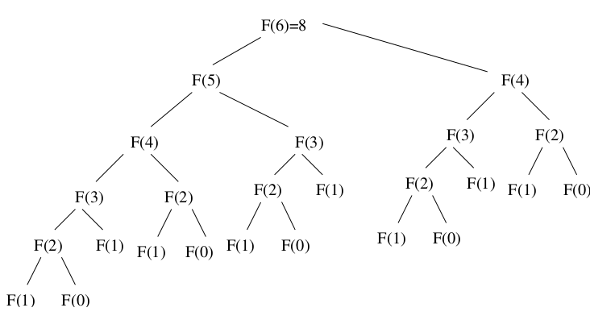
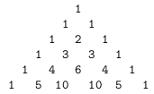
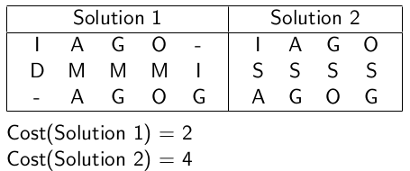
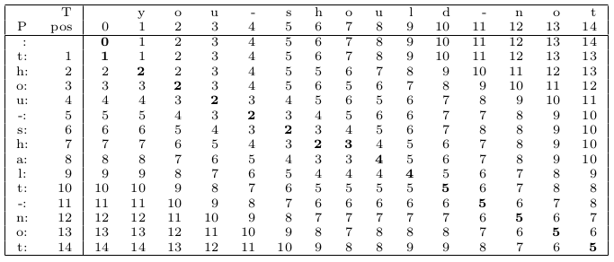
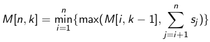
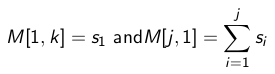

#Chapter 8: Dynamic Programming

Dynamic programming is a powerful, general tool for solving optimization problems on left-right ordered items such as character strings.

Greedy algorithms focus on making the best local choice at each decision point. 

- In the absence of a correctness proof such greedy algorithms are likely to fail. 

Dynamic programming gives us a way to design custom algorithms which...

1. Systematically search all possibilities (thus guaranteeing correctness) while
2. Storing partial results to avoid recomputing (thus providing efficiency)

##Recurrence Relations

A recurrence relation is an equation which is defined in terms of itself. They are useful because many natural functions are easily expressed as recurrences:

- Polynomials: a~n~ = a~n-1~ + 1,&nbsp;&nbsp;  a~1~=1 &rarr; a~n~ = n
- Exponentials: a~n~ = 2a~n-1~, &nbsp;&nbsp;&nbsp;&nbsp; a~1~=2 &rarr; a~n~ = 2^n^
- Factorials: a~n~ = na~n-1~, &nbsp;&nbsp;&nbsp;&nbsp;&nbsp;&nbsp;&nbsp;&nbsp; a~1~ = 1 &rarr; a~n~ = n!

Computer programs can easily evaluate the values of a given recurrence even without the existence of a nice closed form. 

###Fibonacci Numbers (Example)

Definition: 

> F~n~ = F~n-1~ + F~n-2~ &nbsp;&nbsp;&nbsp; F~0~ = 0, F~1~ = 1

Recursive Algorithm:

> int F(int i){

>> if (i == 0) return 0

>> if (i == 0) return 1

>> return F(i-1) + F(i-2) 
  
> }

\newpage

###Perils of Recursive Algorithms

Implementing as a recursive procedure is easy, but slow because we repeat calculations

- F~n~ $\approx$ 1.6^n^
- Since recursion tree has 0 and 1 as leaves, computing F~n~ requires >> 1.6^n^ calls!
- Each call is O(1), so exp time algorithm

###Dynamic Programming?

Can calculate F~n~ in linear time by storing values in array F[0..n]

> F[0] = 0

> F[1] = 1

> For i = 2 to n

>> F[i] = F[i-1] + F[i-2]

The trick to dynamic programming is to see that the naive recursive algorithm computes the same subproblems over and over. (Trade space for time)

- Storing the answers in a table instead of recomputing can lead an efficient algorithm 

- Must first look for a correct recursive algorithm, than speed it up the results in a matrix. 

###Binomial Coefficients

An important class of counting numbers are the *binomial coefficients*, where $\binom{n}{k}$ counts the number of ways to choose k things from n possibilities. 

###Binomial Coefficients: Application Examples

Paths Across a Grid: How many ways are there to travel from the upper-left corner of a n x m grid to the lower-right corner by walking only down and to the right? 

- Every Path must consist of n + m steps, n downward and m to the right
- So, there are $\binom{n+m}{n}$ such sets/paths

###Computing Binomial Coefficients

$\binom{n}{k}$ = $\frac{n!}{(n-k)!k!}$

You can, in principle, compute them straight from factorials. However, intermediate calculations can easily cause arithmetic overflow even when the final coefficient fits comfortably within an int. 

###Pascal's Recurrence

A more stable way to compute binomial coefficients is using

Recurrence relation: 

> $\binom{n}{k}$ = $\binom{n-1}{k-1}$ + $\binom{n-1}{k}$

It works because the n^th^ element either appears or does not appear in one of the $\binom{n}{k}$ subsets of k elements. 

Basis Case: 

- $\binom{n-1}{k-1}$ leads to $\binom{n-k}{0}$. How many ways are there to choose 0 things from a set. Only 1 (this is one of the basis case). 
- $\binom{n-1}{k}$ leads to $\binom{k}{k}$. How many ways are there to choose k things from a k-element set? Only 1 (this is the second basis case). 

This recurrence relation is implicit in the construction of Pascal's triangle. 

>\
{width=30%}

###Binomial Coefficient Algorithm

int **binomial\_coefficient**(int n, int k)

> int bc\[n+1][k+1]; //table of binomial coefficients

&nbsp;

> for (int i=0; i$\le$n; i++) bc\[i][0] = 1;

> for (int j=0; i$\le$k; j++) bc\[j][j] = 1; 

&nbsp;

> for (i=1; i$\le$n; i++) 

>> for (j=1; j\<i and j$\le$k; j++)

>>> bc\[i][j] = bc\[i-1][j-1] + bc\[i-1][j];

> return (bc\[n][k]);

##Three Steps to Dynamic Programming 

1. Formulate the answer as a recurrence relation or recursive algorithm. 

2. Show that the number of different instances of your recurrence is bounded by a polynomial. 

3. Specify an order of evaluation for the recurrence so you always have what you need. 

##Approximate String Matching (Edit Distance)

Misspelling make approximate pattern matching an important problem. 

If we are to deal with inexact string matching, we must first define a cost function telling us how far apart two strings are (Ex. A distance measure between pairs of strings). 

A reasonable distance measure minimizes the cost of the changes which have to be made to convert source strings to target. 

\newpage

###String Edit Operations

There are three natural types of changes:

- Substitution/Match: Change a single character from source s to a different character in text t, such as changing "shot" to "spot" 
- Insertion: Insert a single character into source s to help it match target t, such as changing "ago" to "agog"
- Deletion: Delete a single character from source s to help it match target t, such as changing "hour" to "our" 

###Edit Distance: Recursion

We can compute the edit distance with a recursive algorithm using the observation that the *last character in the string* must either be matched, substituted, inserted, or deleted. 

*If we knew the cost* of editing the three pairs of smaller strings, we could decide which option leads to the best solution and choose that option accordingly. 

We *can learn this cost*, through the magic of recursion. 

\newpage 

###Edit Distance: Recursive Algorithm

const int MATCH = 0 //enumerated type symbol for match/substitute\
const int INSERT = 1 //enumerated type symbol for insert\
const int DELETE = 2 //enumerated type symbol for delete

int string\_compare(char \*s, char\*t, int i, int j)\
&nbsp;&nbsp;&nbsp;&nbsp;&nbsp;&nbsp;&nbsp;int option[3]; //cost of the three options\
&nbsp;&nbsp;&nbsp;&nbsp;&nbsp;&nbsp;&nbsp;int lowest\_cost;

&nbsp;&nbsp;&nbsp;&nbsp;&nbsp;&nbsp;&nbsp;if (i == 0) return j;\
&nbsp;&nbsp;&nbsp;&nbsp;&nbsp;&nbsp;&nbsp;if (j == 0) return i;

&nbsp;&nbsp;&nbsp;&nbsp;&nbsp;&nbsp;&nbsp;option[MATCH] = string\_compare(s,t,i-1,j-1) + match(s[i], t[j]);\
&nbsp;&nbsp;&nbsp;&nbsp;&nbsp;&nbsp;&nbsp;option[INSERT] = string\_compare(s,t,i,j-1) + 1;\
&nbsp;&nbsp;&nbsp;&nbsp;&nbsp;&nbsp;&nbsp;option[DELETE] = string\_com[are(s,t,i-1,j) + 1; 

> lowest\_cost = option[MATCH]; 

> if (option[INSERT] \< lowest\_cost) lowest\_cost = option[INSERT]

> if (option[DELETE] \< lowest\_cost) lowest\_cost = option[DELETE]

> return (lowest\_cost); 

This program is correct, but takes exponential time because it recomputes values repeatedly. 

But there can only be |s| $\cdot$ |t| possible unique recursive calls, since there are only that many distinct (i,j) pairs to serve as the parameters of recursive calls. 

By storing the values for each of these (i,j) pairs in a table, we can avoid recomputing them and just look them up as needed. 

###Edit Distance: Dynamic Algorithm Table

The table is a two-dimensional matrix m where each cell contains the **cost** of the optimal solution of this subproblem, and a **parent** pointer explaining how we got to this location. 

typedef struct cell

> int cost; //cost of reaching this cell

> int parent; //parent cell

cell m\[MAXLEN + 1][MAXLEN + 1];

###Edit Distance: Dynamic Algorithm

int string\_compare(char \*s, char \*t)\
&nbsp;&nbsp;&nbsp;&nbsp;&nbsp;&nbsp;&nbsp;int option[3]; //cost of the three options

&nbsp;&nbsp;&nbsp;&nbsp;&nbsp;&nbsp;&nbsp;initialize zeroth column;\
&nbsp;&nbsp;&nbsp;&nbsp;&nbsp;&nbsp;&nbsp;initialize zeroth row;

> for (i=1; i\<strlen(s); i++)

>> for (int j=1; i\<strlen(t); j++)

>>> option\[MATCH] = m\[i-1][j-1].cost + match(s[i],t[j]);

>>> option\[INSERT] = m\[i][j-1].cost + 1

>>> option\[DELETE] = m\[i-1][j].cost + 1

&nbsp; 

>>> m\[i][j].cost = option[MATCH]; //Rest is about finding min

>>> m\[i][j].parent = MATCH; 

>>> if(option\[INSERT] \< m\[i][j].cost)

>>>> m\[i][j].cost = option[INSERT];

>>>> m\[i][j].parent = INSERT;

>>> ... Repeat for DELETE

> return (m\[i][j].cost); 

###Differences between Recursive & Dynamic Versions

1. Dynamic gets its intermediate values using table lookup instead of recursive calls.
2. Dynamic updates parent field of each cell, which will enable us to reconstruct the edit-sequence later. 

###Evaluation Order

- To determine the value of cell (i,j) we need three values to be sitting and waiting for us, namely, the cells (i-1, j-1), (i, j-1), and (i-1, j).
- Any evaluation order with this property will do, including the row-major order used in this program. 

###Reconstructing the Path

The dynamic programming implementation above returns the **cost** of the optimal solution, but **not the solution** itself. 

Solution is describe by a path through the table, starting from the initial configuration (the pair of empty strings (0,0)) down to the final goal state (the pair of full strings (|s|, |t|)). 

Reconstructing these decisions is done by walking **backward** from the goal state, following parent points. 

The parent field for m[i,j] tells us whether the edit at (i,j) was MATCH, INSERT, or DELETE

if MATCH, look at M[i,j] and m[i-1,j-1] to determine if it's a match or a substitute. 

###Difference between Optimization vs Non-Optimization Problems

The need to make decisions in addition to simple computation.

Decision-making translates into an optimization construct in the recurrence relation.

The need to keep track of decisions and reconstruct solution from them. 

\newpage

##Longest Common Subsequence

The longest common subsequence (not substring) between "democrat" and "republican" is "eca". 

A common subsequence is define by all the identical-character matches in an edit trace. 

To maximize the number of such matches, we must prevent substitution of non-identical characters. 

int match(char c, char d)\
&nbsp;&nbsp;&nbsp;&nbsp;&nbsp;&nbsp;&nbsp;if (c == d) return(0);\
&nbsp;&nbsp;&nbsp;&nbsp;&nbsp;&nbsp;&nbsp;else return(MAXLEN); //used to be 1

###Maximum Monotone Subsequence (MMS) 

A numerical sequence is monotonically increasing if the i^th^ element is larger than the (i - 1)^st^ element. 

The MMS problem seeks to delete the fewest number of elements from an input string S to leave a monotonically increasing subsequence. 

One solution to MMS("243517698") is "23568" 

###Reduction to LCS

In fact, this is just a longer common subsequence problem, where the second string is the element of S sorted in increasing order.

MMS("243517698") = LCS("243517698", "123456789")

##The Linear Partition Problem

Input: A given arrangement S of nonnegative numbers (s~1~, ... ,s~n~) and an integer k. 

Problem: Partition S into k ranges, so as to minimize the maximum sum over all the ranges. 

Does taking the average value of a part $\sum^{n}_{i=1}$s~i~/k form left always work?

###Partition Problem Example: Dividing the Work

The job of scanning in a shelf of books is to be split between k workers. To avoid rearranging the books or separating them into piles, we divide the shelf into k regions and assign each region to a worker. 

What is the fairest way to divide the shelf up (Ex. K = 3)

> If each book is the same length, partition equally:

>> 100 100 100 | 100 100 100 | 100 100 100

> But what if the books are not the same length

>> 100 200 300 | 400 500 600 | 700 800 900

> How can we find the fairest possible partition

###Recursive Idea 

Notice the k^th^ partition starts right after we place the (k-1)^st^ divider.

Place the last divider between the i^th^ and (i + 1)^st^ books for some i

The total cost will be the larger of two quantities 

1. (Easy) the cost of the last partition $\sum^{n}_{j=i+1}$ s~j~
2. (Not so easy) the cost of the largest partition formed to the left of i. How to proceed?

To figure this, we need to partitions the elements (s~1~, ... , s~i~) as equitably as possible among k - 1 ranges. 

###Dynamic Programming Recurrence

Define M[n,] to be the minimum possible cost over all partitions of (s~1~, ... , s~n~) into k ranges. 

\
{width=70%}

With the basis case of 

\
{width=60%}

Runtime

- Number of cells x run time per cell
- A total of k $\cdot$ n cell in the table
- Each cell depends on n other (see recurrence), and can be computed in linear time, for a total of O(kn^2^)

### When can you use DP

- DP computes recurrences efficiently by storing partial results. Thus it can only be efficient when there aren't too many partial results to compute
- DP works best on objects which are linearly ordered and cannot be rearranged (Ex. Chars in a string, rows of books)
- Whenever your objects are ordered in a left-to-right way, you should use DP. 
