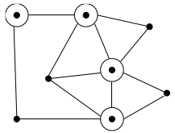
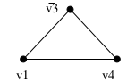
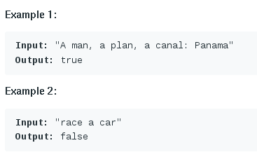
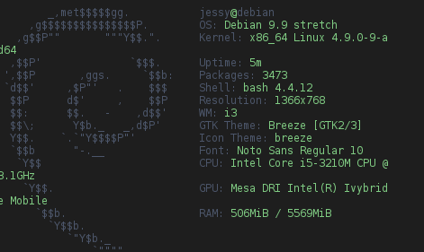

#Chapter 9: NP Completeness

##The Main Idea

Consider the following algorithm to solve Problem A using an algorithm for Problem B.

```
Alg-For-A(X)
    Convert X to an instance of problem B, Y
    Call Alg-For-B on Y to solve this instance
    Return the answer of Alg-For-B(Y) as the answer
```

Such a translation from instances of one type of problem to instances of another type such that answers are preserved is called a **reduction**.

Now suppose my reduction translates X to Y in O(P(n)):

1. If Alg-For-B ran in O(Q(n)) I can solve Problem A in O(P(n) + Q(n)).
2. If I know that $\Omega$(L(n)) is a lower-bound to solve Problem A, then $\Omega$(L(n) - P(n)) must be a lower-bound to solve Problem B. 

The second argument is the idea used to prove problems are hard! 

###What is a Problem?

A *problem* is a general question, with parameters for the input and conditions on what is a satisfactory answer or solution.

> Ex. TSP

>> Problem: Given a weighted graph G, what tour minimizes the path 

###What is an Instance?

An *instance* is a problem with the input specified. 

> Ex. TSP

>> Given a graph and a path, this gives us a value for the distance

###Input Encodings

There are many possible ways to encode the input graph: adjacency matrices, edge lists, etc.

All reasonable encodings will be **within polynomial** size of each other. 

We are concerned with the difference between algorithms which are **polynomial and exponential** in the size of the input. 

This means for the most part, encoding can be ignored as long it doesn't take longer than the actual algorithm. 

###Decision Problems

Decision Problem: A problem with answers restricted to yes and no. 

Most interesting optimization problems can be phrased as decision problems which capture the essence of the computation

##Reductions For Algorithms

Reducing (transforming) one algorithm problem A to another problem B is an argument that if you can figure out how to solve B then you can solve A

We showed that many algorithmic problems are reducible to sorting

<There are some examples of this in the textbook, double check how likely these type of questions will appear on the exam> 

##Satisfiability

Satisfiability is a logic problem

Satisfiability Problem: 

> Instance: A set of boolean variables V and a set of clauses C over V. 

> Question Is there a truth assignment to V such that each clause in C is (simultaneously) satisfied. (A way to set the variables v~1~, ...., v~n~ true or false so that each clause contains at least one true literal)

Example 1:

V = v~1~, v~2~ and C = {{v~1~, $\bar{\text{v}}$~2~}, {$\bar{\text{v}}$~1~, v~2~}}

- A clause is satisfied when at least one literal in it is TRUE
- C is satisfied when v~1~ = v~2~ = TRUE or v~1~ = v~2~ = FALSE

Example 2:

V = v~1~, v~2~ and C = {{v~1~, v~2~}, {v~1~, $\bar{\text{v}}$~2~}, {$\bar{\text{v}}$~1~}}

- Although you try, and you try, you can get no satisfaction
- There is no satisfying assignment since v~1~ must be FALSE (third clause), so v~2~ must be FALSE (second clause), but then the first clause is unsatisfiable!

Satisfiability is known/assumed to be a hard problem

Every top-notch algorithm expert in the world has tried and failed to come up with a fast algorithm to test whether a given set of clauses is satisfiable

Satisfiability shown to be NP-complete by Cook

###3-Satisfiability

3-Satisfiability Problem:

> Instance: Same as SAT except that each clause contains exactly 3 literals (variable in its complement)

> Question: Is there a truth assignment to V so that each clause is satisfied?

3-SAT: 

- More restricted problem than SAT
- If 3-SAT is NP-complete, it implies SAT is NP-complete but not vice-versa, perhaps long clauses are what makes SAT difficult
- 1-SAT is trivial 

To prove that 3-SAT is NP-complete, we give a reduction from SAT $\propto$ 3 - SAT. We will transform each clause independently based on its length. 

Suppose clause C~i~ contains k literals 

- If k = 1, meaning C~i~ = {z~1~}, create two new variables v~1~, v~2~ and four new 3-literal clauses:

>> {v~1~,v~2~,z~1~}, {v~1~,$\bar{\text{v}}$~2~,z~1~},{$\bar{\text{v}}$~1~,v~2~,z~1~},{$\bar{\text{v}}$~1~,$\bar{\text{v}}$~2~,z~1~} 

>> Note that the only way all four of these can be satisfied is if z~1~ is TRUE

- If k = 2, meaning {z~1~, z~2~}, create one new variable v~1~ and two new clauses: {v~1~,z~1~,z~2~}, {$\bar{\text{v}}$~1~,z~1~,z~2~} 

- If k = 3, meaning {z~1~,z~2~,z~3~}, copy into the 3-SAT instance as it is.

- If k > 3

>> Clause is {z~1~,z~2~,...,z~k~}: create k - 3 new variables and k - 2 new clauses in a chain

>> {z~1~,z~2~,$\bar{\text{v}}$~1~}, {v~1~,z~3~,$\bar{\text{v}}$~2~}, {v~2~,z~4~,$\bar{\text{v}}$~3~}, ..., {v~k-4~,z~k-2~,$\overline{\text{v}_{\text{k}-3}}$},{v~k-3~,z~k-1~,$\text{z}_{k}$}

**Why the chain works**: If none of the original variables in a clause are TRUE, there is no way to satisfy all of them using the additional variable:

> (F,F,T), (F,F,T), ..., (F,F,F)

But if any literal is TRUE, we have n - 3 free variables and n - 3 remaining 3-clauses, so we can satisfy each of them.

> (F,F,T), (F,F,T), ..., (**F**, **T**, **F**), ..., (T,F,F), (T,F,F)

3-SAT and SAT are equivalent:

- Any SAT solution will also satisfy the 3-SAT instance. 
- Any 3-SAT solution sets up a SAT solution

###4-Sat 2-Sat

Slight modification to the 3-SAT construction would prove 4-SAT, or 5-SAT, also NP-complete. 

- This modification breaks on 2-SAT though. 

Direction of reduction: SAT $\propto$ 3-SAT $\propto$ X

Now that we've shown 3-SAT is complete, we may use it for further reduction

- 3-SAT instances are smaller and more regular than the SAT instances, it will be easier to use 3-SAT for future reductions

###A Perpetual Point of Confusion

We must transform *every* instance of a known NP-complete problem to an instance of the problem we are interested in. 

If we do the reduction, the other way, all we get is slow way to solve X, by using a subroutine which probably will take exponential time. 

This always is confusing at first - it seems backwards. Make sure you understand the direction of reduction now - and think back to this when you get confused.

\newpage

##Vertex Cover

Vertex Cover Problem:

> Instance: A graph G = (V,E), and integer k $\le$ V 

> Question: Is there a subset of at most k vertices such that every e $\in$ E has at least one vertex in the subset?


\


- Is it trivial to find a vertex cover of a graph - just take all the vertices
- The trick part is to cover with as small a set as possible.

###Vertex Cover is NP-Complete

To prove completeness, we reduce 3-SAT to VC. From a 3-SAT instance with N variables and C clauses, we construct a graph with 2N + 3C vertices. 

###Variable Gadgets

For each variable, we create two vertices connected by an edge: 

\


To cover each of these edges, at least n vertices must be in the cover, one for each pair

###Clause Gadgets

For each clause, we create three new vertices, one for each literal in each clause. Connect these in a triangle.

\


At least two vertices per triangle must be in the cover to take care of edges in the triangle, for a total of at least 2C vertices. 

###Putting it Together

Finally, we will connect each literal in the flat structure to the corresponding vertices in the triangles which share the same literal. 

\


###Claim

G has a vertex cover of size N + 2C iff S is satisfiable

Any cover of G must have at least N + 2C vertices. To show that our reduction is correct, we must show that:

1. Every satisfying truth assignment gives a cover of size N + 2C
    - Select the N vertices corresponding to the TRUE literals to be in the cover. 
    - Since it is a satisfying truth assignment, at least one of the three cross edges associated with each clause must already be covered - pick the other two vertices to complete the cover. 
2. Every vertex cover of size N + 2C gives a satisfying truth assignment 
    - Any vertex of size N + 2C must contain N first stage vertices and 2C second stage vertices
    - Let the first stage vertices define the truth assignment
    - To give the cover, at least one cross-edge must be covered, so the truth assignment satisfies

## P vs NP

The primary question in P vs NP is whether *verification* is really an easier task than initial *discovery*

A problem is in NP (non-deterministically polynomial) if, given the answer, it is possible to verify that the answer is within time polynomial in the size of the input. 

### P vs NP: What We Know

Technically P and NP are sets of problems

- P: problems that can be solved in polynomial time. 
- NP: problems that can be verified in polynomial time. 

If you can solve a problem in polynomial time, you can also verify it in polynomial time (Actual argument is a bit more technical, but this is the essence of the idea).

- So P $\subseteq$ NP

### P vs NP: What We Don't Know

If P $\subseteq$ NP, then either:

1. P = NP
2. P $\subset$ NP

Don't know which is true. 

### NP-Complete Definition

A problem X is NP-Complete if:

1. ALL problems in NP $\propto$ X
2. X is in NP

###The Theorems

"**Get Rich and Famous**" Theorem:

> If any NPC problem is in P, then P = NP

"**Get Famous**" Theorem:

> If any NP problem can be proven to not be in P, then every NPC problem is not in P 

Formal Basis for our NPC Proofs:

> If any NPC problem Y $\propto$ X and X is in NP, then X is NPC



#New Subject

My notes
asdklfj lasdfj 
ajd klj lkajds fa

- asdjfkl sadlfkja 
- ajsldkfj asdf


