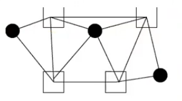
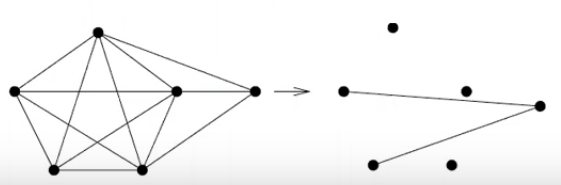
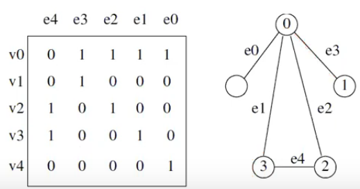
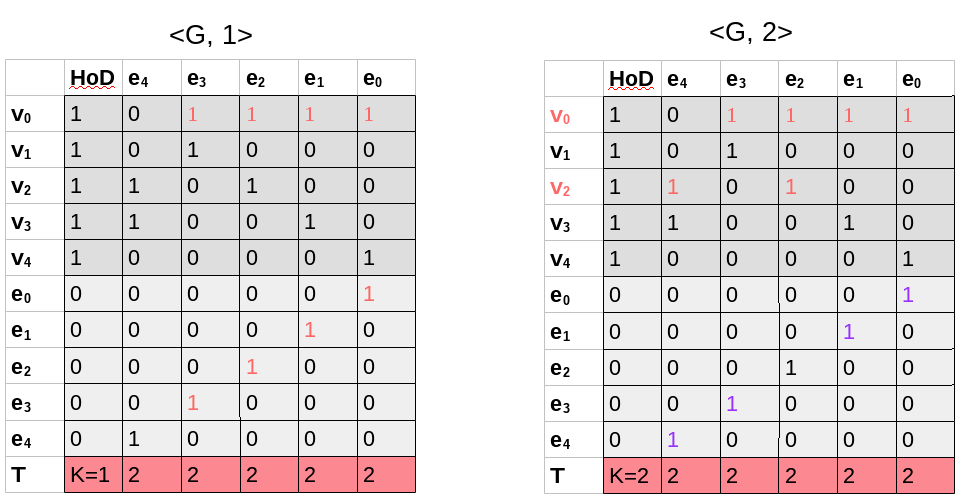
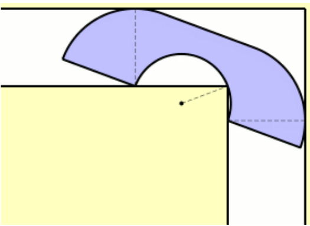
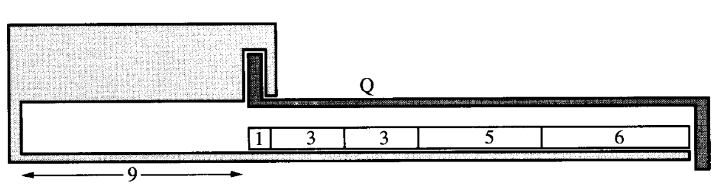

\title{Advanced NPC Videos} 
\maketitle

# Outline

- Vertex Cover, Cliques, and Independent Sets
    - Vertex Cover &rarr; Independent Sets
    - Independent Sets &rarr; Cliques
- Subset Sum
    - Incidence Matrix
    - Proving VC reduces to SS
- Set/Integer Partition
- Motion Planning/Separability
- Hamiltonian Cycle
- Travelling Salesman  

# Vertex Covers (VC), Cliques, and Independent Sets (IS)

Main problem is clique, which we will the idea of reduction to show clique is a NPC problem. 

## Vertex Cover

Vertex Cover: 

- Instance: A graph G = (V, E), and integer k $\le$ V 
- Question: Is there a subset of at most k vertices such that every e $\in$ E has at least one vertex in the subset?
- Easy to find a correct VC, but finding the smallest VC is hard. 

Shown (in chapter 7 notes) that this is a NP-Complete problem by reducing to a 3-sat problem. 

Read chapter 7 notes if you need refresher. 

## Clique 

Clique: set of vertices where every pair of vertices in the subset is joined by an edge

- A clique of size n contains a clique of size n-1, n-2, and so forth, within it
- Want to prove its NP-Complete

Clique (Decision): 

- Instance: A graph G = (V, E) and integer j $\le$ |V| 

- Question: Does the graph contain a clique of j vertices?

To show NP-Completeness we will do: 

> **Vertex Cover (reduction to) Independent Set (reduction to) Clique**

\newpage

## Independent Set

Independent Set: set of vertices in a graph such that there are **no edges** between any two vertices in the independent set

Independent Set (Decision): 

- Instance: A graph G = (V, E) and integer j $\le$ |V| 
- Question: Does the graph contain an independent set?

## Optimization

Vertex Cover: minimization problem

Clique: maximization problem

Independent set: maximization problem

## Vertex Covers VS Independent Sets

If you take a graph and find its vertex cover, the remaining vertices form an independent set. 

The circles are independent set because if they had an edge connecting them, the square wouldn't have covered that edge and therefore it would be wrong. 

Analysis
   
- The smallest vertex cover gives the biggest independent set (equivalent problems)
- Finding VC of size j in graph G can be reduced to:
    
>> IS of size |V| - j in G

- IS is NPC since VC is NPC, and VC can be reduced to an IS problem

\newpage

## Independent Set VS Clique

If we take the complement of a graph: 
    
- A clique becomes an IS
- An IS becomes a clique

Complement of a graph (G'): 

- Copy the same vertices
- If an edge exists in the original graph, do not add it in the complement graph
- If an edge didn't exist in the original graph, add it in the complement graph

From figure 2 we can see that: 

- Original Graph:
    - Max clique = 5
    - Max IS = 2
- Complement Graph: 
    - Max clique = 2
    - Max IS = 5

## Overview

**Clique is NPC**

Could actually skip the IS part and convert from vertex cover to clique: 

- If VC is a vertex cover in G, then V - VC is a clique in G'. If C is a clique in G, V - C is a vertex cover in G'. 

\newpage

# Subset Sum

Instance: A set of integers S and a target integer t

Problem: Is there a subset of S which adds up **exactly** to t?

&nbsp;

Example:

> S = {1, 4, 16, 64, 256, 1040, 1041, 1093, 1284, 1344}

> T = 3754

> Subset Sum = 1 + 16 + 64 + 256 + 1040 + 1093 + 1284 = T

Goal: want to show that subset sum is a NP-complete problem 

- To prove completeness, we show that vertex cover can be reduced to subset sum. 
- Use **incidence matrix** data structure to represent graph G

## Incident Matrix

{width=80%}

- Usually not a square matrix
- Useful to represent graph, not as useful as adjacency matrix
- Place 1 in the matrix if the vertex and edge is connected
- There are 2 1's in each column
- Degree of a vertex is how many 1's in a row (number of outgoing edges)

\newpage

## Vertex Cover & Incidence Matrix

Reduction form VC will create n + m numbers from G

Vertices: 

- The number of vertices will be a base-4 realization of rows from the incidence matrix, plus a high order digit
- x~i~ = 4^|E|^ + $\sum_{j=0}^{|E|-1}$ b[i,j] $\times$ 4^j^
- Example: 

>> V~2~ from figure 1 = 10100 &rarr; 4^5^ + (4^4^ + 4^2^), 4^5^ = 4^|E|^ 

Edges: 

- The number from the edges will be y~j~ = 4^j^

The target integer will be

- t = k $\times$ 4^|E|^ + $\sum_{j=0}^{|E|-1}$ 2 $\times$ 4^j^
- k = vertex cover size

## Proving Vertex Covers &rarr; Subset Sum

Vertex Cover of size 2: \<G,2\>

- K = 2
- Each edge equates to 2 (there are two 1's in each column

Invalid Vertex Cover of size 1: \<G,1\>

- K = 1
- Not all columns equate to 
- Therefore when we don't have a vertex cover, we don't have a subset sum

# Set-Partition / Integer Partition

Instance: A set of integers S

Problem: Can S be partitioned into two sets A and S - A such that their sums are equal?

- Proving that set-partition is NP-C (HOMEWORK)

# Motion Planning/Separability

Instance: A set of polygons in a plane

Problem: Can the polygons be separated?

{width=50%}

## Set-Partition Problem &rarr; Separability

\

In the figure above, the (1, 3, 3, 5, 6) boxes can be converted into a set-partition problem. If we figure out how to partition it so that it is only 9 wide, we can stack both 9 wide partitions on top of each other and polygon Q can be freed. 

# Hamiltonian Cycle

Instance: A undirected graph G

Problem: Is there a cycle in the graph that visits all the vertices once?

Theorem: a bipartite graph will not have a hamiltonian cycle if the vertices of each part of the bipartite graph are not the same. 

## Vertex Cover &rarr; Hamiltonian Cycle
