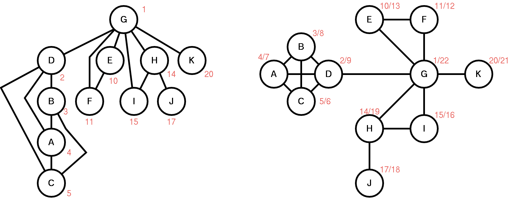
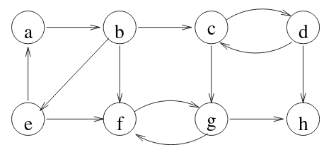
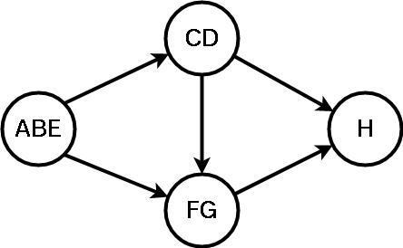

\title{Biconnected \& Strongly Connected Graphs}
\maketitle

# Biconnected (Articulation Vertices)



Articulation vertices (removal of that vertex  will result in a disconnected graph): 

- D
- G 
- H

A biconnected graph is a connected and "nonseparable" graph. 

- Therefore it cannot have any articulation vertices

A n-connected graph is also (n-k) connected from some 0 \< k \< n

## Low Function 

```
low(x) 
    min(discover(x) 
        discover(w) such (u,w) is a back edge for some descendent of u of x) 

```

- discover(x) = timestamp of discovering x
- low searches the smallest discover time including its back edges
- low values can be computed easily with recursion

\newpage

Calculating Low Values:

> Given the example graph in figure 1, calculate the low value for each vertex:

| Vertex | Low |
|:------:|:---:|
| A      | 2   | 
| B      | 2   | 
| C      | 2   | 
| D      | 2   | 
| E      | 1   | 
| F      | 1   | 
| G      | 1   | 
| H      | 1   | 
| I      | 1   | 
| J      | 17  | 
| K      | 20  | 

## Articulation Vertices (Found using low)

V is an articulation vertex if it has a child **s** such that **low[s] $\ge$ discover\[v\]**

- Only applies to internal nodes that are not leaves
- Root is an articulation vertex if it has more than one child

Given the example in figure 1 determine whether V is an articulation vertex using the information from the low table. 

| Vertex | Articulation? |
|:------:|:---:|
| A      | NO  | 
| B      | NO  | 
| C      | NO  | 
| D      | YES | 
| E      | NO  | 
| F      | NO  | 
| G      | YES | 
| H      | YES | 
| I      | NO  | 
| J      | NO  | 
| K      | NO  | 

\newpage

# Strongly Connected Components




Strongly Connected Component: A directed graph is **strongly connected** if for any vertex, you can reach all other vertices.

- If graph is not strongly connected, you can still see if any portions of the graph are strongly connected. 

Strongly Connected Component (formal definition): a **maximal** set of vertices such that there is a path from any vertex to any other vertex

- By **maximal** it means that you cannot add another vertex and have it still be a strongly connect component

## Component Graph

Component Graph: captures relationship between multiple components

- Take each individual components and merge all the vertices belonging to that component and merge them into a *super vertex*
- If the component graph was **cyclical** you could show that the individual components (super vertex) aren't actually strongly connected because they are not maximal

{width=40%}

## Algorithm for Strongly Connected Components

SCC Algorithm:

1. Call DFS(G) to compute *finish* timestamps
2. Let G^T^ be G with the edge reversed
3. call DFS(G^T^) with vertices considered in decreasing order to *finish* timestamp in the main loop (step 1)
4. The vertices correspond to each tree in DF forest form a SCC!


\*Note: in the transpose graph, when reversing the edges, the same SCC will be found in the subgraphs, and the edges in the component graph are reversed


