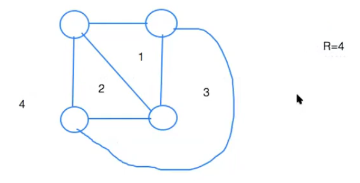

---
geometry: margin=2cm
--- 

\title{Graph Planarity}
\maketitle

# Graph Planarity

Graph planarity: a graph is planar if and only if it can be drawn on a plane without its edges intersecting or crossing each other. 

# Kuratowski's Theorem

A graph is planar if and only if it does not contain a subgraph that can be transformed to K~3,3~ or K~5~ by inserting or erasing vertices of degree 2. 

> K~5~: a complete graph on five vertices (this is not planar)

> K~3,3~: a complete bipartite graph with three vertices in each subset (this is not planar)

# Euler's Formula

If G is a connected, planar graph, then any plane graph for G has r = m - n + 2 regions (Proof by induction). (r = region, m = edges, n = states).  
 
> {width=60%}

\newpage

## Euler's Formula: Corollary

Corollary: If G is a connected planar graph with m > 1, then m $\le$ 3n - 6

> 3r $\ge$ 2m (each region is bordered by at least 3 edges, edges get double counted)

> - Ex. From the graph in figure 1. Region 1 and region 2 share an edge, and that edge gets double counted to ensure that each region is bordered by 3 edges.

> To construct a formula that relates m and n, we need to use the inequality equations to get rid of r. 

>> R $\ge$ 2m/3

>> M - N + 2 $\ge$ 2M/3

>> M/3 + 2 $\ge$ N 

>> M/3 > N - 2

>> M > 3N - 6, corollary is true

# Consequences of Planarity

- The graph can be drawn "nicely" and visualized more easily
- m = $\Theta$(n). So, Bellman-Ford, which takes $\Theta$(nm) in general, takes $\Theta$(n^2^) for a planar graph
- Some graph problems are NPC in general graphs, but in P for planar graphs (Ex. max-clique, graph coloring)

# Geometric (Planar Graphs)

List of geometric (planar graph problem) we will see in this class

- Euclidean minimum spanning trees
- Euclidean TSP
- Rectilinear/Euclidean Steiner trees
- Voronoi Diagrams
- Delaunay Triangulation
- Relative neighborhood graph
- Gabriel graph

# Geometric Dual G\* of a Planar Graph G 

To create a geometric dual:

> Place vertex in each region of G

> If two regions have an edge x in common, join the corresponding vertices by and edge x\* crossing only x 

> Always gives a planar pseudo-graph

## Applications of Duality 

Map coloring $\equiv$ Planar graph Coloring

> Don't want neighboring states sharing the same color (this is planar graph coloring problem)

VLSI floor planning (rectangular dual)

Generally, any dissection of a plan into regions can be represented by a planar graph

# Algorithmic Problems Related to Planarity

Planarity testing: given a graph, is it planar? This can be done in O(n + m) time. Two algorithms:

1. Hopcroft-Tarjan Algorithm
2. Lempel-Even-Cedarbaum and Booth-Leuker

Planar embedding: If graph is planar, draw it in a plane so that the edges don't cross 

Straight-line embedding: each edge is a straight line segment
