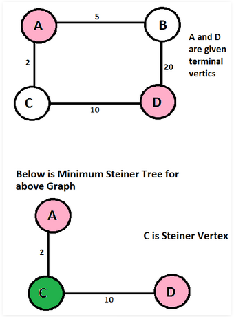
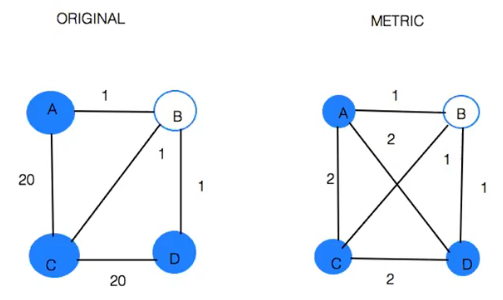

\title{Approximation Algorithms}
\maketitle

# Approximation Algorithm

Approximation Algorithms: one way of coping with NP-completeness

OPT(I) = Cost of optimal solution for instance I

COST~A~(I) = Cost of Algorithm A's solution for instance I 

Approximation Factor = $\displaystyle\frac{COST_{A}(I)}{OPT(I)}$

[comment]: #(herro_)

> Hard to find optimal solution so use Lower bound instead to compare with cost of algorithm

# Steiner Trees

Steiner Tree: 

> G = (V, E) with non-negative edge costs

> R $\subseteq$ V = required vertices

> S = V - R = Steiner vertices

> Problem: Find a min-cos tree in G that contains all vertices in R and any subset of S 

{width=35%}

## Steiner Tree: Special Cases

|R| = 2 

> This is equivalent to the shortest path problem

|R| = |V|, no Steiner vertices

> This is equivalent to the minimum spanning tree problem

# Metric Steiner Trees 

Metric Steiner Tree

> Complete Graph G = (V, E)

> Edge costs satisfy **triangle inequality** 

>> Triangle inequality: Cost(u,v) $\le$ Cost(u,w) + Cost(w,v)

> R, S identical to normal Steiner tree 

> There are nice approximability results for metric Steiner tree 

# Approximation Factor preserving Reduction

Goal: convert metric Steiner tree to original Steiner tree, in order to get an approximation algorithm for the original Steiner tree problem. 

**Steiner Tree &rarr; Metric Steiner Tree**

1. Start with instance of original problem
2. Construct metric Steiner instance as follows
    - V, R, S are the same
    - Define cost of edge (u, v) in metric as cost of the SHORTEST PATH between u & v in original 
    - Complete graph
    - Satisfies triangle inequality

{width=70%}
