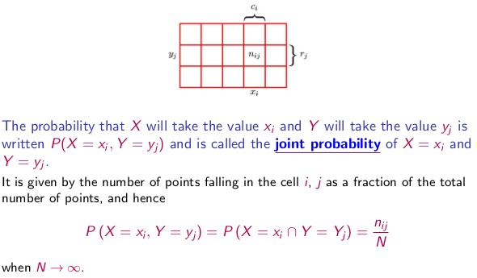
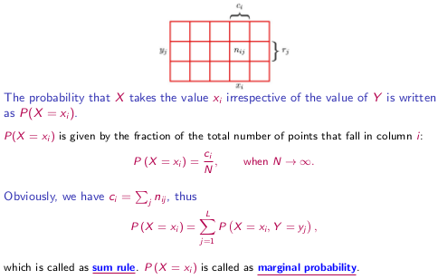
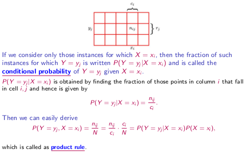
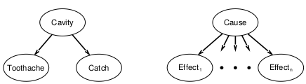

#Chapter 13

##Uncertainty in Diagnosis

To make diagnostic inference possible we need to represent knowledge (axioms) that relate symptoms and diagnosis

**Problem**: disease/symptoms relations are not deterministic: they are uncertain (or stochastic) and vary from patient to patient

Two types of uncertainty

1. Disease -> Symptoms uncertainty

- A patient suffering from pneumonia may not emit symptoms of the disease

2. Symptoms -> Disease 

- A fever is a symptom to many disease (does not point to anything specific
- Someone could have all the symptoms of one disease, but could be a different one. 

##Quantifying Uncertainty - Probability

Probability P is a positive real number describing the likelihood of an event that satisfies:

- P in the range of 0 to 1
- For a mutually *exclusive* and *exhaustive* set of events E, we have the sum of all events equal to 1. 
- P(true) = 1, P(false) = 0

Probability distribution defines probability for all possible value assignments, by which the probabilities are summarized to 1

###Joint Probability

\

- N = Number of instances of variables
- N~ij~ = Number of instances where X = x~i~ and Y = y~i~
- i = number of columns
- j = number of row 

###Full Join Distribution

The joint distribution defines the complete probability model for the problem

ex. pneumonia diagnosis

- Variables: pneumonia, fever, paleness, WBCcount, cough
- Full joint defines the probability for all possible assignments of values to these variables
- Exponential number of probabilities 

###Sum Rule and Marginal Probability

\

###Product Rule and Conditional Probability

\

### Two fundamental rules of probability

Sum rule:

- p(X) = $\sum p(X,Y)$

Product rule:

- p(X,Y) = p(X|Y)p(Y) = p(Y|X)P(X)

###Bayes' Theorem 

From the produce rule, together with the symmetry property, P(X,Y) = P(Y,X), we immediately obtain the following relationship between conditional probabilities:

P(Y|X) = P(X|Y)P(Y) / P(X)

Which is called Bayes' theorem and plays a central role in pattern recognition and machine learning

Using the sum rule, the denominator in Bayes' theorem can be expressed in terms of the quantities appearing in the numerator

P(X) = $\sum P(X|Y)P(Y)$

###Fruit problem

TODO 

###Probability of Drawing a Fruit From a Box

Interpretation of Bayes' theorem:

- If we had been asked which box had been chosen before being told the identity of the selected item of fruit, then the most complete info we have available is provided by the probability P(B)
    - This is the **prior probability** because it is the probability available before we observed the identity of the fruit
- Once we are told that the fruit is an orange we can then use Bayes' theorem to compute the probability P(B|F)
    - We call this the **posterior probability** because it is the probability obtained after we have observed F

Evidence is useful

- The prior probability P(B=r) = 4/10 indicates we are likely to select the blue box
- The posterior probability P(B=r|F=o) = 2/3 indicates we are likely to select the red box

###Syntax for Propositions

Propositional or boolean random variables

- ex. *Cavity*, *Cavity = true* is a proposition, also written *cavity*

Discrete random variables (finite or infinite)

- ex. *Weather* is one of *<sunny,rain,cloudy,snow>*, *Weather = rain* is a proposition
- Values must be exhaustive and mutually exclusive

Continuous random variables (bounded or unbounded)

- ex. *Temp = 21.6* also allow *Temp < 22.0*
- Arbitrary boolean combinations of basic propositions

###Prior Probability 

Prior or unconditional probabilities of propositions correspond to belief prior to arrival of any (new) evidence

- ex. *P(Cavity = true) = 0.1* and *P(Weather = sunny) = 0.72*

Probability distribution gives values for all possible assignments:

- ex. *P(Weather) = <0.72, 0.1, 0.08, 0.1>* (normalized, sums to 1)

Joint probability distribution for a set of r.v.s gives the probability of every atomic event on those r.v.s (every sample point)

- ex. *P(Weather,Cavity)* = a 4 x 2 matrix

###Conditional Probability and Distribution

Conditional or posterior probabilities 

- ex. *P(cavity|toothache) = 0.8*
    - This translates to given that toothache is all I know, NOT, if toothache then 80% chance of cavity

Notation for conditional distributions:  *P(cavity|toothache)* = 2 element vector of 2 element vectors

If we know more, (if *cavity* is given), then we have: *P(cavity|toothache,cavity) = 1*

The less specific belief remains valid after more evidence arrives, but is not always useful

- ex. *P(cavity|toothache,seahawksWin) = P(cavity|toothache) = 0.8*

###Computing Conditional Probability

Definition of conditional probability:

- P(a $/wedge$ b) = P(a|b)P(b) = P(b|a)P(a)

###Inference by Enumeration

Can compute other probabilities through inference if you treat the joint distribution as your knowledge base. 

Can normalize probabilities because they end up being constants. This is used to ensure that the probabilities will add up to 1

###Independence

A and B are **independent** iff

- P(A|B) = P(A) or P(B|A) = P(B) or P(A,B) = P(A)P(B)

Absolute independence is powerful, but rarely is it found in real world applications

##Bayes Rule

P(Y|X) = P(X|Y) P(Y) / P(X)

###Applying Bayes Rule

Bayes rule is a good probabilistic inference tool

P(cause|effect) = P(effect|cause) P(cause) / P(effect)

P(effect|cause) == casual direction (ex.  P(symptom|disease) )

P(cause|effect) == diagnostic direction (ex. P(disease|symptom) )

###Combining Evidence

Naive Bayes model:

- P(cause|effect~1~, ... , effect~n~) = P(cause)$\pi$~i~P(effect~i~|cause)
- This creates a tree where the cause is the root and it points to all the possible effects
 

\

