#CHAPTER 7

##Knowledge-Based Agents and Inference Engine

Knowledge  Base (KB): Knowledge (*a set of sentences*) that describe facts about the world in some formal (*representational*) language. **Domain specific**

Inference Engine: A set of procedures that use the representational language to infer new facts from known ones, or answer a variety of KB queries. *Inferences typically require search*. **Domain independent**

###MYCIN Example

MYCIN: an expert system for diagnosis of bacterial infections

Knowledge base represents...

- Facts about a specific patient case
- Rules describing relations between entities in the bacterial infection domain 
    - **IF**
        1. The strain of the organism is gram-positive, and
        2. The morphology of the organism is coccus, and
        3. The growth conformation of the organism is chains
    - **THEN**
        - The identity of the organism is streptococcus 

Inference engine:

- Manipulates the facts and known relations to answer diagnostic queries (consistent with findings and rules)

###Knowledge Representation

Objective: express the knowledge about the world in a computer-tractable form

Knowledge representational languages (KRL) *key aspects*:

- Syntax: describe how sentences in KRL are formed in the language
- Semantics: describe the meaning of sentences, what is it the sentence refers to in the real world
- Computational aspect: describe how sentences and objects in KRL are manipulated in concordance with semantic conventions

**Many KB systems rely on some variant of logics**

##Logic

Logic: a formal language for expressing knowledge and for making logical inferences, which is defined by...

- A set of sentences: a sentence is constructed from a set of *primitives* according to syntactic rules
- A set of interpretations: an interpretation *I* gives a semantic to primitives. It associates primitives with objects or values. 
    - *I*: primitives -> objects/values
- The valuation (meaning) function *V*: Assigns a values (typically the truth value) to a given sentence under some interpretation
    - *V*: sentence x interpretation -> {True, False}

###Propositional Logic - The Simplest Logic

Proposition: is a statement that is either true or false

###Propositional Logic - Syntax

*P*: syntax + interpretation + semantics

- ex. P represents: "Golden is part of the Jefferson Country"

Connectives: and, or, if, if then, not

Atomic sentences: constructed from constants and propositional symbols
    - True, False are atomic sentences
    - P is an atomic sentences

Composite sentences: constructed from valid sentences via logical connectives
    - (P and Q)

###Propositional Logic - Semantics

Semantic: semantic of a language gives the meaning to a sentence 

The semantics in a propositional logic is defined by

- Interpretation of propositional symbols and constants
    - Semantics of atomic sentences
- Through the meaning of logical connectives
    - Meaning (semantics) of composite sentences 

In a propositional symbol...

- Start with a statement about the world that is true or false
- Interpretation maps symbol to one of the two values (True or False) 
- The meaning (value) of the propositional symbol for a given interpretation is given by its interpretation. False interpretation = false value. 

Truth table for composite sentences 

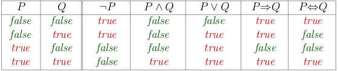
\

###Translation

Translation of English sentences to propositional logics

- Identify atomic sentences that are propositions
- Use logical connectives to translate more complex composite sentences that consist of many atomic sentences
- ex. "It is not sunny this afternoon and it is colder than yesterday
    - p = it is sunny this afternoon
    - q = it is colder than yesterday
    - not p and q

###Contradiction and Tautology

Contradiction: always false

Tautology: always true

###Model, Validity, and Satisfiability

Model: an interpretation is **a model for a set of sentences** if it assigns true to each sentence in the set

Satisfiable: a sentence is satisfiable if it has a model

Validity: a sentence is valid if it is true in ALL interpretations

###Entailment

Entailment: reflects the relation of one fact in the world following from the others

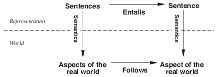
\

Knowledge base *KB* entails sentence P if and only if P is True in all worlds where KB is true

Logicians typically think in terms of **models**, which are formally structured worlds with respect to which truth can be evaluated: 

- We say *m* is a model of sentence P if P is true in *m*
- M(P) is the set of all models of P
- Then KB entails P if and only if M(KB) is in the set of M(P)
- ex. KB = giants and red won, P = giants won

###Sound and Complete Inference

Inference: inference is the process by which new sentences are derived from existing sentences in the KB

- The inference process is implemented on a computer
- Assume an inference procedure *i* that
    - derives a sentences a from the KB: KB provable~i~ a

Soundness: an inference procedure is sound...

- If KB provable~i~ a then it is true that KB entails a

Completeness: an inference procedure is complete 

- If KB entails a then it is true that KB provable~i~ a

##Logical Inference Problem

Logical Inference Problem:

- Given: 
    - A knowledge base KB (a set of sentences) and
    - A sentence *a* (called a theorem)
- Does a KB semantically entail *a*?
    - In other words: In all interpretations in which sentences in the KB are true, is *a* also true?

How to design procedure that answer KB entails *a*? Three approaches...

1. Truth-table approach
2. Inference rules
3. Conversion to the inverse SAT problem (resolution-refutation)

###Truth-Table Approach

Problem: KB entails *a*?

- Need to check all possible interpretations for which the KB is true (models of KB) whether *a* is true for each of them

Truth Table:

- Enumerate truth values of sentences for all possible interpretations (assignments of True/False to propositional symbols)

Two step procedure

1. Generate table for all possible interpretations
2. Check whether the sentence *a* evaluates to true whenever KB evaluates to true

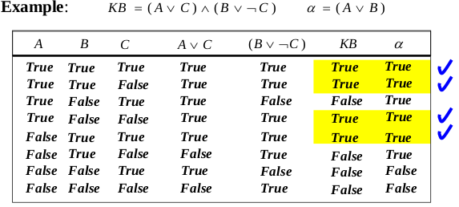
\

Limitations of truth table approach: computational complexity is 2^n^ rows in the table has to be filled

How to make process more efficient? 

- We only have to check entries of KB that are True (this is the idea behind *inference rules approach*)

###Inference Rules for Logic

Inference Rules:

- Represent sound inference patterns repeated in inferences
- Can be used to generate new (sound) sentences from the existing ones

Modus ponens:

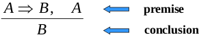
\

- If both sentences in the premis are true, then the conclusion is true

List of inference rules for logic: 

- And-elimination:
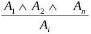
\

- And-introduction:
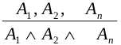
\

- Or-introduction:
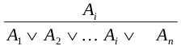
\

- Elimination of double negation:
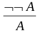
\

- Unit resolution (a special case of resolution):
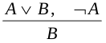
\

- Resolution:
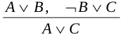
\

###Logical Equivalence

Logical Equivalence: two sentences are **logically equivalent** iff true in same models:

A logically equivalent B iff A entails B and B entails A

###Logical Inferences & Search

For each instance of list of rules so far, many possible rules can be applied next (THIS IS LIKE A SEARCH PROBLEM)

Inference rule method as a search problem

- State: a set of sentences that are known to be true
- Initial State: a set of sentences in the KB
- Operators: applications of inference rules (allow us to add new sound sentences to old ones)
- Goal state: a theorem *a* is derived from KB

Logical inference:

- Proof: a sequence of sentences that are immediate consequences of applied inference rules
- Theorem proving: process of finding a proof of theorem 

Problem: too many inference rules (big branching factor)

Solution: Simplify inferences using on of the normal forms

1. Conjunctive normal form (CNF): conjunction of clauses 

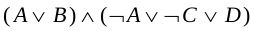
\

2. Disjunctive normal form (DNF): disjunction of terms

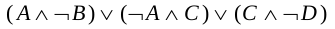
\

###Conversion to CNF

1. Eliminate => and <=>
2. Reduce the scope of signs through De Morgan laws and double negation
3. Convert to CNF using the associative and distributive laws

###Resolution Rule

Resolution rule: sound inference rule that fits the CNF

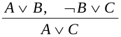
\

When applied directly to KB in CNF to infer *a*:

- Incomplete: repeated application of the resolution rule to a KB in CNF may fail to derive new valid sentences

Trick to make it work:

- Proof by contradiction: 
    - Disprove KB and not *a*
    - Proves entailment KB entails *a*
- **Resolution is refutation complete**

Resolution Algorithm

- Convert KB to CNF form
- Apply iteratively the resolution rule starting from KB, not A
- Stop when: 
    - Contradiction (empty clause) is reached:
        - A, not A -> 0
    - No more new sentences can be derived
        - Disproved

###Properties of Inference Solutions

Truth-table:

- Blind
- Exponential in the numbers of variables

Inference rules:

- More efficient
- Many inference rules to cover logic

Conversion to SAT - Resolution refutation

- More efficient lol
- Sentences must be converted into CNF
- One rule (**RESOLUTION RULE**) is sufficient to perform all inferences

##The Wumpus World

Performance measure

- gold: +1000
- death: -1000
- per step: -1
- using arrow: -10

Environment

- Squares adjacent to Wumpus are smelly
- Squares adjacent to pit are breezy
- Glitter iff gold is in the same square
- Shooting kills Wumpus if you are facing it
- Shooting uses up the only arrow
- Grabbing picks up gold if in same square
- Releasing drops the gold in same square

Actuators

- Left turn, right turn, forward, grab, release, shoot

Sensors

- Breeze, glitter, smell

\newpage

###Wumpus Models

KB = Wumpus world rules + observations

*a~1~* = "[1,2] is safe", KB entails *a~1~* proved by model checking

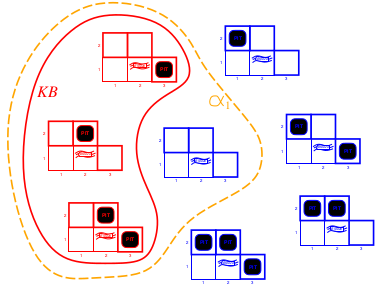
\

*a~2~* = "[2,2] is safe", KB entails *a~2~*

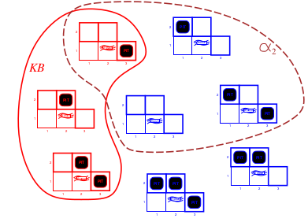
\

#Stuff I didn't know instantly

- Knowledge Representation Language (KRL)
- Model, Validity, and Satisfiability 
- Sound and completeness of inference
- Inference rules (remember them)
- Logic Inferences as a search problem
- Normal Forms
    - CNF
    - DNF
- Resolution Rule

#Stuff that will probably be on the test

- Knowledge Based
- Entailment
- Proposition stuff (maybe, might be too easy)
- Logical inference (3 approaches)
    - Truth table
    - Inference rule
    - Conversion to the inverse SAT problem (Resolution)
- Wumpus
