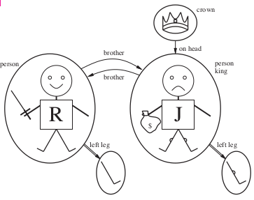

#CHAPTER 8

Proposition has limited expressive power. Need something better (First-order language)

##First Order Logic

First-order logic (natural language) assumes the world contains...

- Objects: people, houses, numbers, theories, colors
- Relations: red, round, bogus, prime, brother of
- Functions: father of, best friend, third inning of

###First Order Logic - Example

\

- Five objects
    1. Richard
    2. John
    3. Left leg of Richard
    4. Left leg of John
    5. Crown
- Two binary relations
    - brother(x, y)
    - onHeadOf(x, z)
- One unary relation
    - crown(x)
- One function
    - leftLegOf(x)

###First Order Logic - Syntax (Basic Elements)

Constants: King John, 2, ...
Predicates: Brother, >, ...
Functions: Sqrt, LeftLegOf, ...
Variables: x, y, a, b
Connectives: and, or, not, if, iff
Equality: =
Quantifiers: for all, there exist

Atomic Sentences: formed from a predicate symbol optionally followed by a parenthesized list of terms.

- Atomic sentence = predicate(term~1~, ... , term~n~) or term~1~ = term~2~
    - Term = function(term~1~, ... ,term~n~) or constant or variable
- ex. Brother(KingJohn, KingRichard)
- Simply put, an atomic sentence is a statement without using any binary connectives

Complex Sentences: formed from atomic sentences using connectives

- ex. Sibling(KingJohn, KingRichard) => Sibling(KingRichard, KingJohn)

###Truth in First Order Logic  

Sentences are true with respect to a *model* and an *interpretation*

Model contains >= 1 objects (**domain elements**) and relations among them

Interpretation specifies referents for

- Constant symbols -> objects
- Predicate symbols -> relations
- Function symbols -> functional relations

An atomic sentence predicate(term~1~, ..., term~n~) is true

- iff the *objects* referred to by term~1~, ..., term~n~
- are in the *relation* referred to by predicate

Model is basically a set of objects w/ interpretation for the constants/predicates/functions. There can be an unlimited combination of the three to form a model. 

###Models for First Order Logic

Entailment in propositional logic can be computed by enumerating models

Can enumerate the FOL models for a given KB vocabulary, but its not easy

##Quantified Statements

Predicate logic lets us make statements about group of objects via quantified expressions

Two types of quantified statements

1. Universal: statement is true for all 
2. Existential: statement is true for some

###Universal Quantifier

The universal quantification of P(x) is the proposition:

- "P(x) is true for all values of *x* in the domain of discourse"
- The notation $\forall$x P(x) denotes the universal quantification of P(x), and is expressed as for every x, P(x)

Dummy translation of above: P is a proposition that is applied to every x person in a domain. For example p can be people at mines are smart, x represents every individual student at mines. The universal quantifier says we are all smart. 

A common mistake to avoid

- Typically, -> is the connective with $\forall$
    - $\forall$x [At(x, Mines) -> Smart(x)]
    - Translation: "All students at Mines are smart"
- Common mistake: using $\wedge$ as the main connective with $\forall$
    - $\forall$x [At(x, Mines) $\wedge$ Smart(x)]
    - Translation: "Everyone at Mines and everyone is smart"

###Existential Quantifier

The existential quantification of P(x) is the proposition:

- "There exists at least an element in the domain (universe) of discourse such that P(x) is true"
- The notation $\exists$x P(x) denotes the existential quantification of P(x), and is expressed as there is an x such P(x) is true

Dummy translation for above: P is a proposition applied to every x person in a domain. For example P is people at boulder are smart, and x represents every individual. The exist quantifier says there has to be at least one smart person at boulder. 

A common mistake to avoid

- Typically, $\wedge$ is the main connective with $\exists$
    - $\exists$x [At(x, Boulder) $\wedge$ Smart(x)]
    - Translation: "Someone at Boulder is smart"
- Common mistake: using -> as the main connective with $\exists$
    - $\exists$x [At(x, Boulder) -> Smart(x)]
    - Translation: "The proposition is true if there is anyone who is not at Boulder

###Quantification

Quantification converts a **propositional function** (a predicate with variables as arguments) into a **proposition** by binding a variable to a set of values from the universe of discourse. 

ex. 

- Let P(x) denote x > x - 1 and assume the universe of discourse of x is all real numbers
- Is P(x) a proposition? **NO** many possible substitutions
- Is $\forall$x P(x) a proposition? **YES** the statement is quantified in a universe of discourse. When x is defined as Real numbers, the proposition is true since all numbers is greater than itself minus 1. 

###Properties of quantifiers (NOT Commutative) 

$\forall$x $\forall$y is the same as $\forall$y $\forall$x

$\exists$x $\exists$y is the same as $\exists$y $\exists$x

$\exists$x $\forall$y is **NOT** the same as $\forall$y $\exists$x

Quantifier duality: each can be expressed using the other

- $\forall$x Likes(x, ice cream) == $\neg\exists$x $\neg$Likes(x, ice cream)

###Equality

term~1~ = term~2~ is true under a given interpretation iff term~1~ and term~2~ refer to the same object. 

ex. $\forall$x multiply(Sqrt(x), Sqrt(x)) = x are satisfiable

