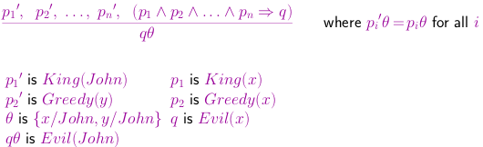
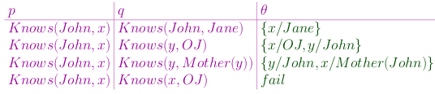
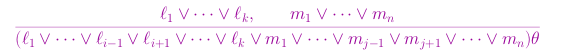
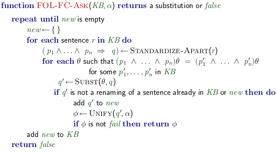
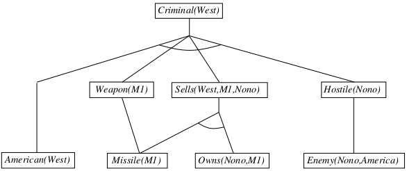
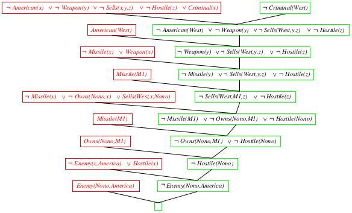

#CHAPTER 9 

##Inference with First Order Logics

Why first order?

- FOL permits quantification over variables
- Higher order logic permits quantification over functions and predicates

Inference with FOL

- Propositionalization
- Prove by resolution

###Universal Instantiation (UI)

Every instantiation of a universally quantified sentence is entailed by it:

$\forall$*v* $\alpha$ / SUBST({*v*,*g*},$\alpha$)

For any variable *v* and ground term *g*

ex. $\forall$x King(x) $\wedge$ Greedy(x) => Evil(x)

- Variable (*v*) = x
- Ground Term (*g*) = John, Richard, Father(John), ... etc (all the possible inferences)
- Alpha is all the possible substitutions
    - $\forall$x King(John) $\wedge$ Greedy(John) => Evil(John) 
        - (*x* substituted with *g*)

###Existential Instantiation (EI)

For any sentence $\alpha$, variable *v*, and constant symbol *k* that does not appear elsewhere in the knowledge base:

$\exists$*v* $\alpha$ / SUBST({*v*/*k*}, $\alpha$)

This is pretty much the same idea as the universal instantiation except with existential

###Instantiation

UI can be applied several times to add new sentences 

- The new KB is logically equivalent to the old

EI can be applied once to replace the existential sentence

- The new KB is not equivalent to the old, but is satisfiable iff the old KB was satisfiable:
    - The new KB is not **logically equivalent** to the original KB, which, yet, is **inferentially equivalent** to the original KB

###Reduction to Propositional Inference

Suppose the KB contains just the following: 

- $\forall$x King(x) $\wedge$ Greedy(x) => Evil(x)
- King(John)
- Greedy(John)
- Brother(Richard, John)

Instantiating the universal sentence in **all possible** ways, we have

- King(John) $\wedge$ Greedy(John) => Evil(John)
- King(Richard) $\wedge$ Greedy(Richard) => Evil(Richard)
- King(John)
- Greedy(John)
- Brother(Richard, John)

The new KB is propositionalized: proposition symbols are:

- King(John), Greedy(John), Evil(John), King(Richard), etc...

###Reduction to Propositional Inference - Semi-decidable

Claim: a ground sentence is entailed by new KB iff entailed by original KB

Claim: every FOL KB can be propositionalized so as to preserve entailment

Idea: propositionalize KB and query, apply resolution, return result

Problem: with function symbols, there are infinitely many ground terms

- ex. Father(Father(Father(John))) 

Theorem: Herbrand (1930). If a sentence $\alpha$ is entailed by an FOL KB, it is entailed by a **finite** subset of a propositional KB

Idea: For *n* = 0 to $\infty$ do

- Create a propositional KB by instantiating with depth-*n* terms, see if $\alpha$ is entailed by this KB

Problem: works if $\alpha$ is entailed, loops if $\alpha$ is not entailed

Theorem: Turing (1936), Church (1936), entailment in FOL is **semidecidable**

Semidecidable: there is an algorithm where its proven to show something entails something. However, there is no algorithm to prove whether something doesnt entail something

###Problems with Propositionalization

Propositionalization seems to generate lots of irrelevant sentences. 

With *p* *k*-ary predicates and *n* constants, there are *p* * *n*^*k*^ instantiations

With function symbols, it gets much worse

###Generalized Modus Ponens (GMP)

GMP is used with KB of **definitive clause** (**exactly** one positive literal).

All variables assumed universally quantified

\

###Unification

We can get the inference immediately if we can find a substitution $\theta$ such that King(x) and Greedy(x) match King(John) and Greedy(y)

$\theta$ = {x/John, y/John} works

UNIFY($\alpha,\beta$) = $\theta$ if $\alpha\theta$ = $\beta\theta$

\

Standardizing apart eliminates overlap of variables, ex. Knows(*z*~17~,OJ)

###Resolution: Brief Summary

Full First-order version:

\

where UNIFY(*l*,$\neg$m~j~) = $\theta$

Apply resolution steps to CNF(KB $\wedge$ $\neg\alpha$); complete for FOL

\newpage
###Conversion to CNF - Example

Everyone who loves all animals is loved by someone:

- $\forall$x [$\forall$y Animal(y) => Loves(x, y)] => [$\exists$y Loves(y, x)]

1) Eliminate biconditionals and implications

- $\forall$x [$\neg\forall$y $\neg$Animal(y) $\vee$ Loves(x, y)] $\vee$ [$\exists$y Loves(y, x)]

2) Move $\neg$ inwards: $\neg\forall$x,p = $\exists$x $\neg$p, $\neg\exists$x,p = $\forall$x $\neg$p:

- $\forall$x [$\exists$y $\neg$($\neg$Animal(y) $\vee$ Loves(x, y))] $\vee$ [$\exists$y Loves(y, x)]
- $\forall$x [$\exists$y $\neg\neg$Animal(y) $\wedge$ $\neg$Loves(x, y))] $\vee$ [$\exists$y Loves(y, x)]
- $\forall$x [$\exists$y Animal(y) $\wedge$ $\neg$Loves(x, y))] $\vee$ [$\exists$y Loves(y, x)]

3) Standardize variables: each quantifier should use a different one

- $\forall$x [$\exists$y Animal(y) $\wedge$ $\neg$Loves(x, y)] $\vee$ [$\exists$z Loves(z, x)]

4) Skolemize: a more general form of existential instantiation

- Each existential variables is replaced by a Skolem function of the enclosing universally quantified variables:
- $\forall$x [Animal(F(x)) $\wedge$ $\neg$Loves(x,F(x))] $\vee$ Loves(G(x),x)

5) Drop universal quantifiers:

- [Animal(F(x)) $\wedge$ $\neg$Loves(x,F(x))] $\vee$ Loves(G(x),x)

6) Distribute $\wedge$ over $\vee$:

- [Animal(F(x)) $\vee$ Loves(G(x),x)] $\wedge$ [$\neg$Loves(x,F(x)) $\vee$ Loves(G(x),x)]

###Knowledge Base in First Order Logic

The law says that it is a crime for an American to sell weapons to hostile nations. The country Nono, an enemy of America, has some missiles, and all of its missiles were sold to it by Colonel West, who is American. 

Prove that Col. West is a criminal

... it is a crime for an American to sell weapons to hostile nations:

- American(x) $\wedge$ Weapon(y) $\wedge$ Sells(x,y,z) $\wedge$ Hostile(z) => Criminal(x)

... Nono has some missles

- Owns(Nono,M~1~) and Missile(M~1~)

... All of its missiles were sold to it by Colonel West

- $\forall$x Missile(x) $\wedge$ Owns(Nono,x) => Sells(West,x,Nono)

... Missiles are weapons 

- Missile(x) => Weapon(x)

... An enemy of America counts as "hostile"

- Enemy(x,America) => Hostile(x)

... West, who is American

- American(West)

... The country Nono, an enemy of America

- Enemy(Nono, America)

\newpage
###Forward Chaining Algorithm

\

###Forward Chaining Proof

\

###Proof by Resolution

\

##Summary of Logic

Propositional Logic: atomic statements are facts

- Inference via resolution is sound and complete (though likely computationally intractable)
- Linear-time inference via forward and backward chaining possible for knowledge bases consisting of definite clauses

First-order Logic: adds variables, relations, and quantification

- Inference is essentially a generalization of propositional inference
    - Propositionalization
    - "lifted" inference rules like generalized Modus Ponens
- Resolution is still sound and complete, but semidecidable: not guaranteed to terminate on non-entailed sentences

