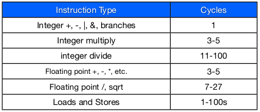

# Metrics:

## Latency

Latency: amount of time needed to finish a task. (Performance usually means latency, but not always). 

- Speed = 1/latency
- Latency = run time
- A measured latency is for a given task (CPU doesnt have latency, an application does (on a CPU))

    
Where latency matters: 

- Application responsiveness: Ex. Games, GUIs, Internet services
- Real-Time applications: Ex. Anti-lock braking systems ("hard" real time), Multi-media applications ("soft" real time). 

Increase clock speed = decrease latency

## Speedup

Speedup: ratio of two latencies 

- Speedup = Latency old / latency new
- Speedup > 1 means performance increased
- Speedup < 1 means performance decreased

Ex. If machine A is 2x faster than machine B then:

> Latency A = Latency B / 2

Speedup allows comparison of two systems without reference to an absolute unit. 

## Throughput

Throughput (Bandwidth): number of tasks complete per unit of time. 

- Independent from the exact total number of tasks

This is important in:

- Data center servers: handling many requests. 
- High performance computing

## Latency VS Bandwidth

Latency lags bandwidth: Bandwidth has outpaced latency across the main computer technologies.

- Bandwidth can be made better with parallelization 
- Latency can be made better with better CPU speeds
- Bandwidth **independent** of latency

## Power

Energy: measured in Joules

Power: rate of energy consumption

Integrate power curve to get average energy consumption. 

## Derived Metrics

Bigger is Better Examples:

- Bandwidth per dollar
- Bandwidth per watt
- Work per Joule 
- In general: Multiply by bigger is better metrics, divide by smaller is better metrics. 

Smaller is better examples:

- Cycles/Instruction (Time per work)
- Latency \* energy (Energy delay product)
- In general: Multiply by smaller is better metrics, divide by bigger is better metrics. 

# Comparing Architectures

There's no best metric to measure something 

## Benchmark

Benchmark: Make comparable measurements 

Benchmark suite: a set of programs that are representative of a set of problems.  Ex:

- Server computing
- Scientific computing

Benchmarks good for long-term performance comparison. 

There's no best benchmark, too many different types of application.

### Classes of Benchmarks

Microbenchmarks: measure one feature of system

Kernel: most compute-intensive part of applications

Full application: SpecInt (For servers)

# CPU Performance: Performance Equation(PE) 

Model how architecture impacts performance (latency) 

Need to quantify performance in terms of architectural parameters: 

- Instruction count: the number of instructions the CPU executes
- Cycles per instructions: the ratio of cycles for execution to the number of instructions executed
- Cycle time: the length of a clock cycle in seconds

First fundamental theorem of computer architecture. 

> Latency = Instruction Count * Cycles/Instruction * Seconds/Cycle 

> L = IC * CPI * CT

\newpage

Good models give insight into the system they model:

- Latency changes linearly with IC
- Latency changes linearly with CPI
- Latency changes linearly with CT (cycle time)

Suggests several way to improve performance

- Reduce cycle time
- Reduce instruction count
- Reduce cycles per instruction

Allows us to evaluate potential trade-offs (reducing CT by 50% and increasing CPI by 2 gives us a net win)

When evaluating time saved from reducing one of the three, you must make sure the other two are fixed. 

## Cycle Time

Cycle time is a function of the processor's design

- If the design does less work during a clock cycle, its cycle time will be shorter. (Will expand more during pipelining)

Cycle time is a function of process technology

- If we scale a fixed design to a more advanced process technology, its clock speed will go up. 
- However, increases in clock rates are slowing down (power problems)

Cycle time is a function of manufacturing variation

- CPU are different in speed, pay more for faster CPU. 

Another way to measure cycle time is: **Clock speed** (measured in Hz)

- x Hz = 1/x seconds per cycle
- Clock speed is used more than second/cycle

Latency = Instruction Count * Cycles/Instruction * (1/Clock Speed(Hz))
 
## Instruction Count

Instruction count in the PE is the **dynamic** instruction count

Dynamic instruction: having to do with the execution of the program or counted at run time. 

Static instruction: fixed at compile time or referring to the program as it was compiled. 

```
    a = 3
    if(a > 10):
```
- Doesn't effect anything, but helps due to spacial locality. 

How to reduce instruction count: 

- Algorithmic improvements
- Compiler optimizations

If one version requires executing fewer dynamic instructions, the PE predicts it will be faster. 

- Assuming that CPI and clock speed remain the same
- A x% reduction in IC should get a speed up of

>> 1/(1-0.01\*x) times

\newpage

Other impacts on instruction count:

- Different programs do different amount of work. (Playing DVD vs writing a document)
- Same program may do different amount of work. (1000-line program vs 100-line program)
- To make meaningful comparison between two computer systems, the same work must be done.

## Cycles Per Instruction

CPI is the most complex term in the PE, since many aspects of processor designs impact it. Ex:

- Compiler
- Program input
- Processor's design (more on this later)
- Memory system (more on this later)

It **is not** the cycles required to execute one instruction

It **is** the ratio of the cycles required to execute a program and the IC for that program (its an average).

1/CPI (Instructions Per Cycle; IPC) is more intuitive because it emphasizes that its an average. 

### Instruction Mix and CPI

Instruction mix: different programs need different types of instructions usage

{width=65%}

- Spec INT 2006 would have higher CPI, branch instructions are performance killers. 

{width=60%}

- Load and Store has a range of possible cycles because the data could be in L1 cache or somewhere else. Have to search all points of memory.  

Different programs need different kinds of instructions

- Compiler has some flexibility in which instructions it uses. 
- As a result the combination and ratio of instruction types that programs execute varies. 

Different inputs can effect instruction mix

- Different input can lead to different function execution
- They could branch off and go in different direction

## Comparing Similar Systems

Latency = Instructions * Cycles/Instruction * Seconds/Cycle

If we have the same CPU's: CT doesn't change 

If workload is fixed: IC doesn't change

If workload and clock rate fixed: latency = cycles/instruction

\*You can only ignore terms in PE if they are identical across the two systems. 

PE allows for projections to be made easily

> L = IC \* CPI~guess~ \* CT (Can easily replace CPI with guestimations)

### Abusing the PE

Be wary of Guaranteed Not To Exceed (GTNE) metrics.

GTNE says you CANNOT exceed this limit, not that you will reach this limit. 

Usually if you're not optimized, you'll only reach 20% peak performance. 

Example:

> "Processor X has a speed of 10 GOPS(giga instructions/seconds)

> Can't say Latency is IC * .1ns 
> No workload is given


