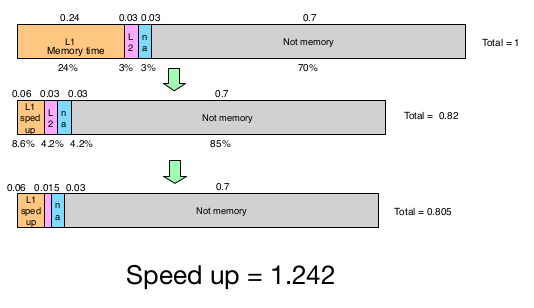

# Amdahl's Law: Fundamental Theorem

Amdahl's Law: fundamental theorem of performance optimization. Optimizations do not (generally) *uniformly* affect the entire program. 

- The more widely applicable a technique is, the more valuable it is. 
- Conversely, limited applicability can (drastically) reduce the impact of an optimization. 

## Amdahl's Law Example 

Imagine a program that handles images. 

- The program spends 33% of its time doing JPEG Decode
- Let says there is an extension called JOR2k that boosts JPEG Decode by 10x. However, it increases processor costs by 45%. 

[comment]: # (get rid of the letters clipped in this image lol)

\
{width=85%}

Does speedup $\times$ cost equate to the extra 45% cost

- Old system: No JOR2k 
    - Latency = 30s
    - Cost = C (don't know exact cost, we assume a constant C)
- New system: With JOR2k
    - Latency = 21s
    - Cost = 1.45 \* C
- Latency \* Cost
    - Old = 30 \* C
    - New = 21 \* 1.45 \* C
    - New/Old = 21 \* 1.45 \* C / 30 \* C = 1.015
    - New is bigger (worse) than old by 1.015
- Latency \* Cost
    - Old = 30^2^ \* C
    - New = 21^2^ \* 1.45 \* C
    - New/Old = 21^2^ \* 1.45 \* C / 30^2^ \* C = .71
    - New is smaller (better) than old by .71

# Amdahl's Law: Fundamental Theorem #2

Amdahl's Law: The second fundamental theorem of computer architecture

- If we can speed up x of the program by S times
- Amdahl's Law gives the total speed up, S~tot~

>> S~tot~ = $\displaystyle \frac{1}{(x/S) + (1-x))}$

[comment]: # (fact check this)

S = speedup of the part of the task that is benefiting from the improved resources

x = the proportion of execution time that is actually benefiting from the improved resources

## Amdahl's Corollary 1 (Maximum Speedup)

Maximum possible speedup S~max~, if we are targeting x of the program (Upper bound):

> S = infinity

> S~max~ = $\displaystyle \frac{1}{(1-x)}$

### Example Corollary 1

Example 1:

- Problem: A protein string matching code runs for 200 hours on the current machine, and spends 20% of the time doing integer instructions. 

1. How much faster must you make the integer unit to make the code run 10 hours faster? 

> 200/190 = 1 / (.2/S) + (.8) &rarr; S = 1.33 (40/30 shortcut )

2. How much faster must you make the integer unit to make the code run 50 hours faster?

> 200/150 = 1 / (.2/S) + (.8) &rarr; S = -4 impossible

[comment]: # (there is a second example in slides, do it if you feel its necessary)

## Amdahl's Corollary 2 (Common Case)

Make the common case fast (x should be large)

- Common = "most time consuming" not necessarily "most frequent" 
    - Ex. You can have 2 functions with instructions. F1 could have 1 instruction and F2 has a hundred. F1 could be a for loop to a billion, F2 could be b++ code. This means F1 is most time consuming, even though F2 has more instructions. 
- The uncommon case doesn't make much difference
- Be sure of what the common case is
- The common case can change based on inputs, compiler options, optimizations applied, etc. 

### Example Corollary 2

\
{width=70%}

Red is common case. (X is large for red), for first iteration

After iterations, there should be no common case, it should be kinda uniformed. 

\newpage

## Amdahl's Corollary 3 (Parallel)

Benefits of parallel processing 

- p processors
- x of the program is p-way parallizable

Maximum speedup, S~par~

> S~par~ = $\displaystyle \frac{1}{(x/p + (1-x))}$

A key challenge in parallel programming is increasing x for a large p. 

- x is pretty small for desktop applications, even for p = 2 (not enough p-way parallelization). 
- This is a big part as to why multi-processors are of limited usefulness

### Example Corollary 3

Customer can use 4 processors for 40% of an application. You have two choices: 

1. Increase the number of processors from 1 to 4. 
2. Use 2 processors but add features that will allow application to use 2 processors for 80% of execution. 

Using corollary 3:

- S between the two options.

>> p = 4 or 2

>> x = 40% or 80%

>> Plugging into the equation, option 2 is actually better.  

## Amdahl's Corollary 4 (Latency)

Amdahl's law for latency.

- By Definition

>> Speedup = $\displaystyle \frac{\text{old Latency}}{\text{new Latency}}$

>> new Latency = $\text{old Latency} \cdot \frac{1}{\text{Speedup}}$

- By Amdahl's Law

>> new Latency = old Latency $\cdot$ ($\frac{\text{x}}{\text{S}}$ + (1-x))

>> new Latency = x $\cdot$ $\frac{\text{old Latency}}{\text{S}}$ + old Latency $\cdot$ (1-x)

Amdahl's Law for Latency: 

> **new Latency** = x $\cdot$ $\frac{\text{old Latency}}{\text{S}}$ + old Latency $\cdot$ (1-x)
 

[comment]: # (format this better)

### Amdahl's Non-Corollary

Amdahl's law does not bound slowdown

- new Latency = x $\cdot$ $\frac{\text{old Latency}}{\text{S}}$ + old Latency $\cdot$ (1-x)

- new Latency is linear in 1/S

\newpage

Example:

- Given x = 0.01 of execution and old Latency = 1

>> S = 0.001, new Latency = ~10 $\cdot$ Old Latency

>> S = 0.0001, new Latency = ~1000 $\cdot$ Old Latency

Amdahl's law can only get so fast, but they can get arbitrarily slow. 

### Example Corollary 4

Problem: What is total speedup given...

- Memory operations currently take 30% execution time
- A new widget called a "L1 cache" speeds up 80% of memory operations by a factor of 4
- A second new widget called a "L2 cache" speeds up 1/2 the remaining 20% by a factor of 2

For L1 cache:

> S~1~ = 4

> x~1~ = .8 \* .3

> S~total:L1~ = 1/(x~1~/S~1~ + (1-x~1~))

> S~total:L1~ = 1/(0.8\*0.3/4 + (1-(0.8\*0.3))) = 1.2195

For L2 cache: 

> S~2~ = 2

> x~2~ = 0.3 \* (1 - 0.8)/2 = 0.03

> S~total:L2~ = 1/(0.3/2 + (1-0.3)) = 1.015

Combine: 

> S~total~ = S~total:L1~ \* S~total:L2~ = 1.02 \* 1.21 = 1.237

This is technically wrong because after L1 cache, the execution time changes, thus the L2 cache fractions are messed up. 

{width=80%}

Correct way to handle multiple optimizations, given we have: 

- Optimization 1 speeds up x~1~ of the program by S~1~
- Optimization 2 speeds up x~2~ of the program by S~2~

S~total~ = 1/(x~1~/S~1~ + x~2~/S~2~ + (1-x~1~-x~2~))

- S~1~ and S~2~ must be disjoint (must not apply to the same portion of execution)
- If not, treat the overlap as a separate portion of execution and measure its speed up independently
    - Example: we have x~1only~, x~2only~, and x~1&2~ and S~1only~, S~2only~, and S~1&2~

>>> S~total~ = 1(x~1only~/S~1only~ + x~2only~/S~2only~ + x~1&2~/S~1&2~ + (1 - x~1only~ - x~2only~ - x~1&2~))

>>> You can estimate S~1&2~ as S~1only~ \* S~2only~, but the real value could be higher or lower. 

# Idea of the CPU

Program is data 

- It is a series of bits
- Lives in memory
- A series of discrete "instructions" 

The program counter (PC) control execution

- Points to the current instruction
- Advances through the program

# Instruction Set Architecture (ISA)

ISA is the set of instructions a computer can execute. 

- All programs are combinations of these instructions. 
- It is an abstraction that programmers (and compilers) use to express computations
    - The ISA defines a set of operations, their semantics and rules for their use
    - The software agrees to follow these rules
- The hardware can implement those rules in ANY WAY IT CHOOSES!

# MIPS ISA

Two ISAs: 

1. MIPS: 
    - Simple elegant, easy to implement
    - Designed for modern programmers

2. x86: 
    - Ugly, messy
    - Dominant ISA in modern computer systems

## MIPS Basics

Instructions:

- 4 bytes (32 bits) 
- Instructions operate on memory and registers

\newpage

Memory Data Types: 

- Bytes (8 bits)
- Half words (16 bits)
- Words (32 bits)
- Memory is denoted by "M"
- Memory is byte addressable! 
- Half words and words are aligned

Registers: 

- 32 4 byte registers in the "register file" 
- Denoted by "R" 
- All registers are the same
- Used for argument passing, temporaries, etc
- $zero is the zero register.
    - It is always zero
    - Writes to it have no effect

[comment]: # (do all MIP instruction types >:c)

### MIPS R-Type Arithmetic Instructions 

\


- R-Type instructions encode operations of the form (a = b **OP** C)
    - **OP** is (+, -, \<\<, &, etc)
- Bit Fields: 
    - Opcode: encodes the operation type
    - Funct: specifies the particular operation
    - Rs, Rt: source registers (5 bits can specify one of 32 registers)
    - Rd: destination register (5 bits can specify one of 32 registers) 
    - Shamt: shift amount for shift operations 

Example:

```mips
1. add $t0, $t1, $t2
    R[8] = R[9] + R[10] 
    opcode = 0, funct = 0x20 
2. nor $a0, $s0, $t4
    R[4] = -(R[16] | R[12])
    opcode = 0, funct = 0x27
3. sll $t0, $t1, 4
    R[4] = R[16] << 4
    opcode = 0, funct = 0x0, shamt = 4

```

\newpage

### MIPS R-Type Control Instructions

\


- R-Type encodes "register-indirect" jumps
- Jump registers:
    - jr rs: PC = R[rs]
- Jump and link registers:
    - jalr rs, rd: R[rd] = PC + 8; PC = R[rs]
    - rd default to $ra (the assembler will fill it in if you leave it out)

Example
```mips
1. jr $t2
    PC = R[10]
    opcode = 0, funct = 0x8
2. jalr $t0
    PC = R[8]
    R[31] = PC + 8
    opcode = 0, funct = 0x9
```
### MIPS I-Type Arithmetic Instructions

\


- I-type arithmetic instructions encode operations of the form (a = b **OP** **\#**)
    - **OP** is (+, -, \<\<, &, etc)
    - **\#** is an integer constant
- Bit Fields
    - Opcode: encodes the operation type
    - Rs: source register
    - Rd: destination register
    - Immediate: a 16 bit constant used as an argument for the operation

Example
```mips
1. addi $t0, $t1, -42
    R[8] = R[9] + -42
    opcode = 0x8
2. ori $t0, $zero, 42
    R[4] = R[0] | 42
    opcode = 0xd
    Loads a constant into $t0
```

\newpage

### MIPS I-Type Branch Instructions

\


- I-type also encodes branches
    - **If (R[rd] OP R[rs])** PC = PC + 4 + 4 \* immediate **else** PC = PC + 4

- Components:
    - Rs, Rt: are the two registers to be compared
    - Rt is sometimes used to specify branch type

- Immediate is a 16 branch offset
    - It is the signed offset to the target of the branch
    - Limits branch distance to 32K instructions
    - Usually specified as a label, and the assembler fills it in for you

Example:
```mips
1. beq $t0, $t1, -42
    if R[8] == R[9] 
        PC = PC + 4 + 4 * -42
    opcode = 0x4
2. bgez $t0, -42
    if R[8] >= 0
        PC = PC + 4 + 4 * -42
    opcode 0x1
    rt = 1 
```

### MIPS I-Type Memory Instructions

\


- I-type also encode memory access
    - Store: M[R[rs] + Immediate] = R[rt]
    - Load: R[rt] = M[R[rs] + Immediate]
- MIPS has load/stores for byte, half word, and word
- Sub-word loads can also be signed or unsigned
    - Signed loads sign-extend the value to fill a 32 bit register
    - Unsigned zero-extend the value
- Immediate is a 16 bit offset
    - Useful for accessing structure components
    - It is signed

Example:
```mips
1. lw $t0, 4($t1)
    R[8] = M[R[9] + 4]
    opcode = 0x23
2. sb $t0, -17($t1)
    M[R[12] + -17] = R[4]
    opcode 0x28
```

\newpage

### MIPS J-Type Instructions

\


- J-Type encodes the jump instructions
- Plain Jump
    - Jump address = {PC + 4[31:28], Address, 2'b0}
    - Address replaces most of the PC
    - PC = Jump address
- Jump and Link
    - R[$ra] = PC + 8; PC = Jump address
- J-Type also encodes misc instructions
    - syscall, interrupt return, and break

\newpage

# From C to MIPS

Compiling: C to bits

\


\newpage

1. Abstract Syntax Tree (AST) 

\
{width=90%}

2. Convert AST to Control flow graph

- Graph consist of basic blocks

\
{width=70%}

\newpage

3. Linear representation of control flow graph

- nop < bubble to stop
- Makes assembly

\


4. Assembler makes assembly to executable binary

\


## Top Reasons to use Assembly Code 

Clout
