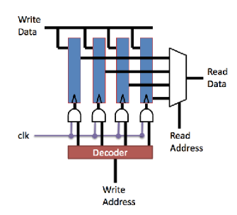
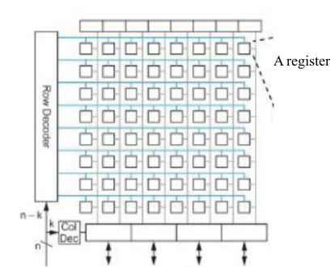

# Memory Hierarchy 

M = % memory operations

M~lat~ (cycles (unit)) = average memory latency

BCPI (Base CPI) = time to access cache (cycles it takes when hit rate is 100%) (assume always 1, as stated by professor)

CPI =  BCPI + M\*M~lat~

## Register File

{width=50%}

{width=48%}

Naive register file: 1D

Organize Register file into 2D mesh, can even make 3D

## Why Cache is Fast

Register and cache are built on static random access memory (SRAM) technology 

- Not dense (less memory per chip) but lots of chips
- Bandwidth:
    - Registers: 324 GB/s
    - L1 Cache: 128 GB/s

Main Memory is built on dynamic random access memory (DRAM) technology

- Need refreshing to keep data
- Very dense (more memory per chip) but less chips
- Bandwidth of DDR3: 16 GB/s

Big memory has further distance to travel to processor

### Memory Hierarchy

Register < SRAM < DRAM

- This apply for capacity and latency
- Bandwidth: better off chip than on chip

## Principle of Locality

Spatial locality: likely to access data close to data it has accessed recently

Temporal locality: like to access the same data repeatedly 

Cache exploit both types of locality 

- Temporal: if you keep accessing from big memory, just store it in your cache 

- Spatial: fetch block of data from big memory, hopefully what you need next will already be in the cache 

# Cache Organization

Block can only be mapped to one single line in a cache (Cache Line)

- Cache line consist of two parts (TAG and DATA)
- Tag consists of where the data is located, data is where the actual block info is

## Cache Geometry

- Cache lines = L
- Cache line size = B
- Address length = A
    - Address break down into tag, index and offset
    - Index bits = log~2~(L)
    - Offset bits = log~2~(B)
    - Tag bits = A - (index bits + offset bits)

## Mapping (Where to place data in cache)

Direct Mapped Cache: Given a block, you will map it to: 

- (BLOCK NUMBER) % (NUMBER OF CACHE LINE)

Set Associate Map: Given a block, you will map it to

- (BLOCK NUMBER) % (NUMBER OF CACHE LINE/(ASSOCIATIVITY)) 
    - Each Cache line is a set of W associativity

Fully Associative Map: Given a block, place it anywhere its available. 

## Cache Geometry (Associativity)

- Cache lines = L
- Cache line size = B
- Address length = A
- Associativity = W
    - Address break down into tag, index and offset
    - Index bits = log~2~(L/W)
    - Offset bits = log~2~(B)
    - Tag bits = A - (index bits + offset bits)

Within a set, when loading into cache, just place it in whichever slot is open in a SET. 

When retrieving, you have to check all tags in a set. 

### Cost of Associativity 

Increased associativity requires multiple tag checks

- N-ways associativity require N parallel comparators
- This is expensive in hardware and potentially slow

This limits associativity L1 caches to 2-8 

Larger, slower caches can be more associative (16-way for L2 and L3)

# INSERT DIAGRAM OF TABLE STORES

\newpage

# Write Through vs Write Back

When writing something, you have to change it in cache and memory. There are different ways to handle this.

Write through, when writing (change in cache and in memory) 

- Advantages: don't have to deal with inconsistency

Write back, have inconsistent memory

- Advantages: less work, don't need to update main memory (initially). Only update when it finally gets kicked out of cache. 
- When cache gets removed, then you need to update main memory
- Need dirty bit (extra bit in cache line signifying the cache has been update) 

## Write Allocate/No-Write Allocate

If the cache allocates cache lines on a write miss, it is write allocate, otherwise, it is no write allocate. 

Write allocate advantage: Exploits temporal locality. Data written will be read soon, and that read will be faster. 

No-write allocate advantage: When you have no temporal locality, update something and never use it again

# Eviction in Associative Caches

Must decide which line in a set to evict if we have associativity

Cache eviction policy:

- Random: randomly choose a line to kick out (hard to implement true randomness)
- Least recently used (LRU): evict the line that was last used the LONGEST time ago
- Prefer clean: try to evict clean lines to avoid the write back
- Farthest future use (theoretical): evict the line whose next access is farthest in the future (This is optimal, but impossible to implement)

# Cache Line Size

Bigger line size:

- Exploits more spatial locality
- Large cache lines effectively prefetch data that we have not explicitly asked for

Smaller line size:

- Focuses on temporal locality
- If little spatial locality, large cache lines waste space and bandwidth

In practice: 32-64 bytes is good for L1 caches, if space is scarce and latency is important

Lower levels use 128-256 bytes. 

\newpage

# Data vs Instruction Cache

Why have different instruction and data caches

- Different areas of memory
- Different access patterns
    - I-cache accesses have lots of spatial locality (mostly sequential accesses)
    - I-cache accesses are also predictable to the extent that branches are predictable
    - D-cache accesses are typically less predictable
- Not just different, but often across purposes
    - Sequential I-cache accesses may interfere with the data the D-cache has collected
