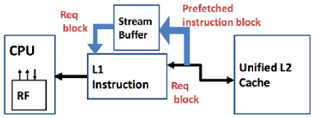
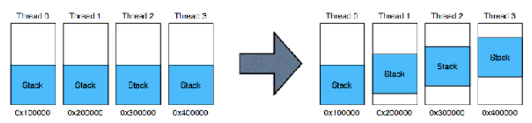

# Cache Misses

The three C's (types of cache misses)

- Compulsory: The program has never requested this data before. A miss is mostly unavoidable
- Conflict: The program has seen this data, but it was evicted by another piece of data that mapped to the same "set"
- Capacity: The program is actively using more data than the cache can hold

Example: Each example uses the following memory access sequence (0x80000000, 0x80000008, 0x80000010, 0x80000018, 0x30000010).

1. Assume a direct mapped cache with 16 blocks and a block size of 16 bytes
    - Index: 4 bits (1 byte)
    - Offset: 4 bits (1 byte)
    - Tag: 24 bits (6 bytes)

\
{width=68%}

2. Assume a direct mapped cache with 8 block and a block size of 32 bytes
    - Index: 3 bits
    - Offset: 5 bits
    - Tag: 24 bits (6 bytes)

\
{width=65%}

\newpage

3. A direct mapped cache with 8 blocks and a block size of 32 bytes
    - Index: 3 bits
    - Offset: 5 bits
    - Tag: 24 bits (6 bytes)

\
{width=65%}


# Compulsory Misses

Reducing compulsory misses:  Increase cache line size so the processor requests bigger chunks of memory. 

- This only works if there is good spatial locality, otherwise you are bringing in data you don't need. 
- If you are reading a few bytes here and a few bytes there (no spatial locality) this will hurt performance

## Prefetching

Idea: Speculate on future instructions and data accesses and fetch them into cache. 

- Instruction accesses easier to predict than data accesses

Varieties of prefetching

- Hardware prefetching
- Software prefetching
- Mixed Schemes

### Hardware Prefetching

Example:

```
    for(i=0; i<100000; i++) {
        sum += data[i];
    }
```

> Pattern: nextAddr = curAddr + 4

Prefetch on miss: Prefetch b+1 upon miss on b

One block lookahead scheme: Initiate prefetch for block b+1 when block b is accessed (can extend to N-block lookahead)

Strided prefetch: If observe sequence of accesses to block b, b+N, b+2N, then prefetch b+3N. 


### Issues in Prefetching

Usefulness: Should produce hits

Timeliness: Not late and not too early

Cache and bandwidth pollution

### Software Prefetching

Example:

```
    for(i=0; i<N; i++) {
        prefetch(&a[i+P]);
        prefetch(&b[i+P]); 
        SUM = SUM + a[i] * b[i]
    }
```

The biggest issue is timing, not predictability 

- If you prefetch close to when the data is requested you may be too late. 
- Prefetching too early causes pollution
- Estimate how long it will take for the data to come into L1 cache, so we can set P appropriately (this is hard, but why)

### Hardware Instruction Prefetching

Fetch two blocks on a miss; the requested block (i) and the next consecutive block (i+1)

Requested block placed in cache, and the next block in instruction stream buffer

If miss in cache but hit in stream buffer, move stream buffer block into cache and prefetch next block (i+2)

{width=50%}

## Restructuring 

Given the following code, how could you restructure it to make it more cache efficient

```c++
    struct Atom {
        double v,
        double f,
        double3 p 
    };

    Atom atoms[N];

    for (...) 
        ... = atoms[i].f + ...
        ... = atoms[i].v + ...
        ... = atoms[i].p + ...
```

This code results in a lot of cache misses. To fix this, instead of using structs, transform the variables into arrays.

\newpage

# Conflict Misses

Conflict misses occur when the data we need was in the cache previously but got evicted

Evictions occur because: 

- Direct mapped: Another request mapped to the same cache line
- Associative: Too many other requests mapped to the same set

Example of code that has a ton of conflict misses

```
    while(1) {
        for(i=0; i<1024*1024; i+=4096) { // this makes it map to the same cache over and over
            sum += data[i];
        } // assume a 4kb cache
    }
```

Can fix this with a dummy cache line 

## Colliding Threads and Data

The stack and the heap tend to be aligned to large chunks of memory

- Threads often run the same code in the same way
- This means that thread stack will end up occupying the same parts of the cache
- Randomize the base of each threads stack to avoid conflict misses

Large data structure are also often aligned. Randomizing malloc() can help here

{width=80%}

# Capacity Misses

Capacity misses occur because the processor is trying to access too much data

- Working set: The data that is currently important to the program
- If the working set  is bigger than the cache, you are going to miss frequently

Capacity misses are a bit hard to measure

- Easiest definition: Non-compulsory miss rate in an equivalently-size fully-associative cache
- Intuition: Take away the compulsory misses and the conflict misses, and what you have left are the capacity misses. 

\newpage

## Reducing Capacity Misses

- Increase capacity
- More associativity or more associative "sets"
    - Costs area makes the cache slower
- Cache hierarchy do this implicitly already
    - If the working set "falls out" of the L1, you start using L2
- In practice, you make the L1 as big as you can within your cycle time and the L2 and L3 as big as you can while upping it on chip

## Reducing Capacity Misses: The Compiler

Tiling (Improves temporal locality, not spatial)

- Need to make several passes over a large array
- Doing each pass in turn will "blow out" our cache
- "Blocking" or "tiling" the loops will prevent the blow out
- Whether this is possible depends on the structure of the loop.

You can tile hierarchically, to fit into each level of the memory hierarchy 


\newpage

# Write Performance

2 Step approach (they depend on each other)

1. Traverse tag field to see if the block is already in the cache
2. Store the data

## Reducing Write Time

Problem: write takes two cycles; one for tag check and the other for writing data

Solution 1: 

- Tag check, buffering old data and write data
- If tag check fails, write old data back 

Solution 2: 

- Pipelining the writes

## Reducing Miss Penalty

{width=80%}

## Multi-level Caches

Problem: a memory cannot be large and fast

Solution: memory hierarchy (increase size of cache at each level) 

\


Local miss rate = miss in caches / access to cache

Global miss rate = misses in cache / CPU memory access

Misses per instruction = misses in cache / number of instructions

## Presence of L2 Influences L1 Design 

User smaller L1 if there is also L2

- Trade increased L1 miss rate for reduced L1 hit time and reduce L1 miss penalty
- Reduce average access energy 

Use simpler write-through L1 with on-chip L2

- Write-backs L2 absorbs write traffic doesn't go off-chip

## Inclusion Policy

Two polices: 

1. Inclusive multilevel cache: L2 cache holds copies of data in L1 cache (more popular)
    - On a miss in L1, it could exist in L2 which is faster. 
2. Exclusion multilevel cache: L2 cache *may* hold data not in L1 cache

## Victim Cache (100% On Exam)

Given a code that access multiple cache lines, but they're all in the same set. This will result in a bunch of conflict misses (keep evicting in the same set) 

Say a set has W ways, but W+2 lines are mapped to each set. 

Solve this with victim cache. If you are about to evict a cache, put it in a buffer (victim cache), this can avoid conflict misses with sets. 


