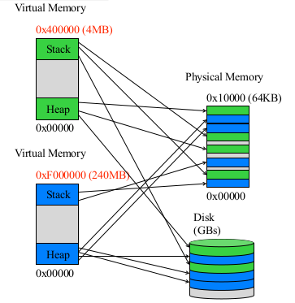
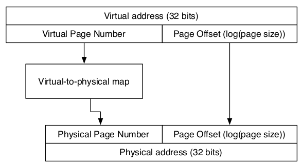
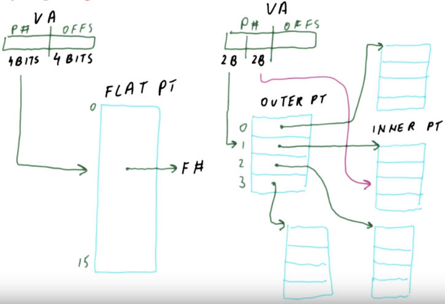
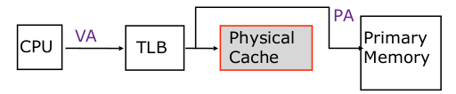
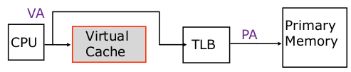
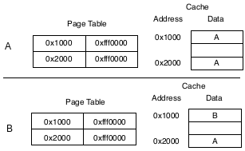
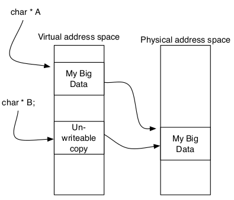

# Virtual Memory

Motivation:

- A process needs more data than available in physical memory 
- Conflict of the space being used

What we want from memory

- Fast
- Infinite memory
- Low Cost
- High bandwidth

All processes have virtual memory and then the virtual memory will moved to actual physical memory (Mapping).

- Physical pages: go into physical memory
- Virtual pages: stored in disk

\newpage

# Mapping

Virtual-to-physical mapping

- Virtual: virtual address space
- Physical: physical address space

Break both address spaces into **pages** (typically 4KB in size) 

Use a **page table** to map between virtual pages and physical pages

The processor generates "virtual" addresses: they are translated via address translation into physical addresses. 

{width=60%}

- Virtual address has only 2 fields
    - Virtual page number: enough bits to represent physical page number
    - Page offset: enough bits to represent page size

# Problems with VIM

How do we store map compactly

How do we translate quickly

# How Big is the Map

For a 32 bit address space:

- 4GB of virtual addresses 
- 1 Mpages
- Each entry is 4 bytes (a 32 bit physical address
- 4MB of mapping data

For a 64 bit address space:

- 16 exabytes of virtual address space
- 4 petapages
- Entry is 8 bytes
- 32PB of mapping data

\newpage

## Hierarchical Page Tables (Reduce Map)

Hierarchical page tables: split the virtual page number bits into several pieces

- Each outer table points to an inner table (based on the split)
- Only need to store the outer tables that are relevant (points to data in inner tables that will be used)
- This allows you to throw away the stuff you don't use

# Make Translation Fast

Address translation has to happen for every memory access

This potentially puts it squarely on the critical for memory operation (which are already slow)

## Solution 1: Use Page Table

Walk through page table on every memory access

- Every load or store requires an additions 3-4 load to walk the page table
- This is butt

## Solution 2: Translation Lookaside Buffer (TLB)

Build a cache for the page mapping, but call it "translation lookaside buffer"

- If you hit in the TLB that is only 1 cycle (very quick)

# Translation Lookaside Buffer 

TLB: small highly, associative caches for page table entries

Miss on TLB (expensive):

- Need to follow tree structure to find the missing information in page tables

TLB is part of the hardware architecture: there are designated "hardware page table walkers" - specialized state machines that can load page table entries into the TLB without OS intervention.

## Solution 3: Defer Translating Accesses

Critical path = TLB access time + Cache access time

> From this equation you can see how defering TLB would make things faster

Solution 3: Skip TLB and use your virtual address to access virtual cache, if it hits than you can figure out the primary memory. If it misses then we would need to go into TLB. 

Virtual cache is an actual physical cache 

[comment]: # (is virtual cache the L1 cache being used to store virtual addresses, or is this a separate cache)

### The Danger of Virtual Caches

Example 1

- Process A issues virtual memory request
- Context switch
- Process B issues virtual memory request
- Will B get right data?

>> NO, need to flush virtual caches on a context switch

\newpage

2 different virtual address maps to the same physical address

- Can be troublesome if you want to change one of the virtual pages
    - Will make your virtual cache have different entries
    - If you want to change one, you need to copy on physical (copy on write)
- Can be good because if you want to copy data in physical address you don't need to rewrite in the physical memory, just have two different virtual address point to the same spot (technically is copying lol). 

{width=60%}

{width=50%}

VIRTUAL VS PHYSICAL CACHE AND WHAT THE DIFFERENCE IS
http://people.ee.duke.edu/~sorin/prior-courses/ece152-spring2008/lectures/6.9-memory.pdf
