[comment]: # (will definitely be on the test)

# Pipelining: Laundry Analogy

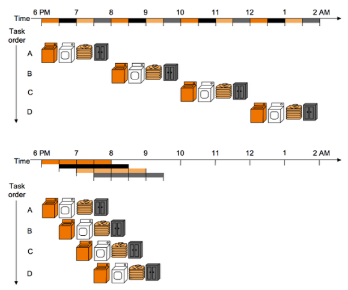{width=80%}

- Improves bandwidth, not latency
- Improve throughput (how much data is successfully transferred)
- Slowest step decides throughput

Example 1: We have a four-stage pipeline. Every stage takes 1 hour. How long does it take to finish 100 loads?

> 103 hours

Question 2: We have a four-stage pipeline. Every stage takes 1 hour. How long does it take to finish N loads?

> N + 3 hours

## Ideal pipeline:

- All objects go through the same stages
- Every stage takes same amount of time
- No stages share resources
- Propagation delay (time to transition from one stage to another) through all pipeline stages is equal
- Scheduling of a transaction entering the pipeline is not affected by transactions in other stages

\newpage

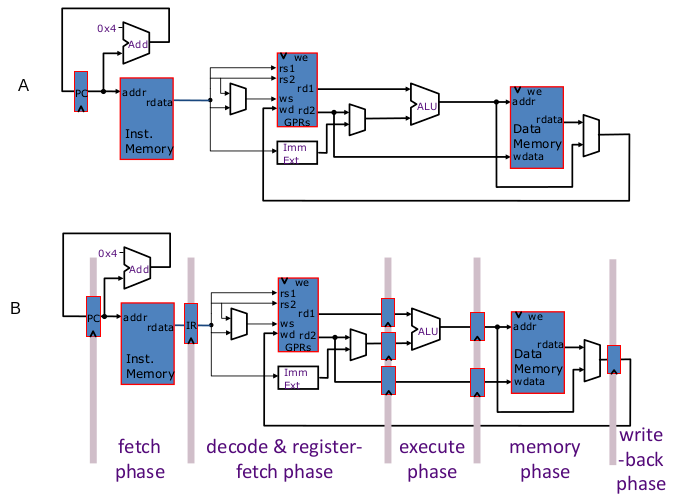

For the datapath above: here is transaction vs time

\
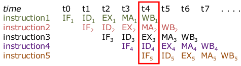{width=80%}

For the datapath above: here is space vs time

\
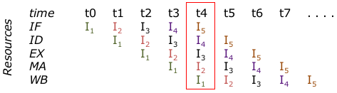{width=80%}

# Hazards

- Structural Hazard: an instruction in the pipeline needs a resource being used by another instruction in the pipeline
- Data Hazard: an instruction depends on a data value produced by an earlier instruction
- Control Hazard: whether or not an instruction should be executed depends on a control decision made by an earlier instruction

[comment]: # (both instructions input for the example is LW)

## Structural Hazard

Example 1: Unified Memory

\
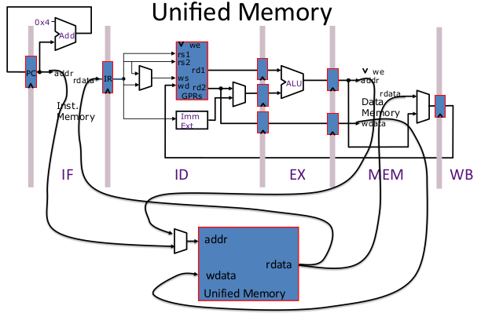

|time|t~1~|t~2~|t~3~|t~4~|t~5~|t~6~|t~7~|
|----|----|----|----|----|----|----|----|
| LW | IF | ID | EX | **ME** | WB |    |    |
| LW |    | IF | ID | EX | ME | WB |    | 
| LW |    |    | IF | ID | EX | ME | WB |
| LW |    |    |    | **IF** | | |  |

ME and IF will conflict because that operation is shared as shown in the diagram

\newpage

Example 2: 2 Cycle Memory

\
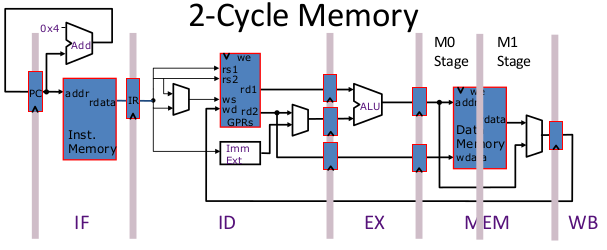{width=80%}

|time|t~1~|t~2~|t~3~|t~4~|t~5~|t~6~|t~7~|
|----|----|----|----|----|----|----|----|
| LW | IF | ID | EX | M0 | **M1** | WB |    |
| LW |    | IF | ID | EX | **M0** |    |    |

M0 and M1 will conflict because that operation is shared

## Data Hazard

\
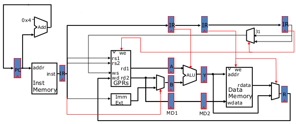{width=80%}

|time |t~1~|t~2~|t~3~|t~4~|t~5~|t~6~|t~7~|
|-----|----|----|----|----|----|----|----|
| ADD | IF | ID | EX | ME | **WB** |    |    |
| ADD |    | IF | **ID** |    |    |    |    |

Breaks because decode cant decode until the previous add writes to memory

|time |t~1~|t~2~|t~3~|t~4~|t~5~|t~6~|t~7~|t~8~|
|-----|----|----|----|----|----|----|----|----|
| ADD | IF | ID | EX | ME | **WB** |    |    |    |
| ADD |    | IF | O  | O  | O  | ID | EX | ME |

O = bubbles to stall dependent instruction  until previous instruction finishes

### Data Dependence

Flow dependence: Read-after-write (RAW)

Anti dependence: Write-after-read (WAR)

Output dependence: Write-after-write (WAW)

### Resolving Data Hazards: Stalls

Examples

### Resolving Data Hazards: Bypass to Datapath

Examples

### Resolving Data Hazards: Bypass to Datapath + memory

EXAMPLE 1
    done earlier

EXAMPLE 2

    Stall:
    I D E M W
      I O O O D

    Bypass:
    I D E M W
      I D O E M W

    on the 4th is when data is forwarded and thus the next step you can execute

EXAMPLE 3

    //understand this example

## Bypass In Action

4 examples (pairs)

Example 1
    
    Normal:
        I D R E E D D W
          I D O O O O O R

    Foward:
        I D R E E D D W
          I D R O E 

Example 2

    Normal:
        I D R E E D D W
          I D O O O O O R

    Foward:
        I D R E E D D W
          I D R O O O E 

Example 3

    Normal:
        I D R E E D D W
          I D O O O O O R

    Foward:
        I D R E E D D W
         

Example 4

    Foward:
        I D R E E D D W
          I D R E E O O D D W

## Control Hazards

Branch code restructuring

## Exceptions

Causes of exceptions:

- Arithmetic overflow (8-bit machine, performing 255 + 1)
- Undefined instruction
- System Call

When to handle: when detected

Who should handle: process

## Interrupts

Causes of interrupts: 

- External events (arrival of network package)

When to handle: When convenient except for high priority ones

Who should handle: system

## Precise Exceptions/Interrupts

The architectural state should be consistent when the exception/interrupt is ready to be handled

- All previous instructions should be completely retired
- No late instruction should be retired

Retire = commit = finish execution and update arch state. 

## Multi-cycle Execute

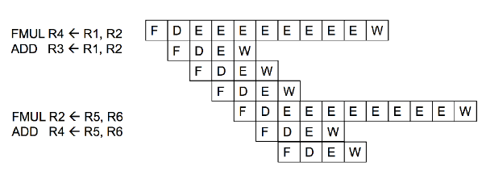

Instructions may take multiple cycles in ALU

Idea 1: make each operation take the same amount of time

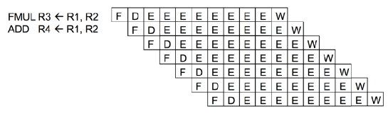

- Downside
    - Worse case latency determines all instructions' latency
    - Chance is high for structural hazards

Idea 2: Reorder buffer (ROB)

- Complete instructions out-of-order, but reorder them before making results visible to architectural state
- When instruction is decoded it reserves an entry in the ROB
- When instruction completes, it writes result into ROB entry
- When instruction oldest in ROB and it has completed without exceptions, its result moved to reg. file. 

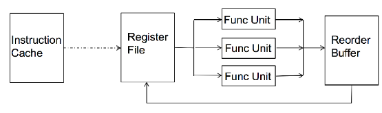

## Reorder Buffer 

In-order pipeline with reorder buffer

- Decode (D): Access regfile/ROB, allocate entry in ROB, and dispatch instruction
- Execute (E): Instructions can complete out-of-order
- Completion (R): Write results to reorder buffer
- Retirement/Commit(W): Check for exceptions; if none, write result to architectural register file or memory; else, flush pipeline and start from exception handler
- In-order dispatch/execution, out of order completion, in-order retirement

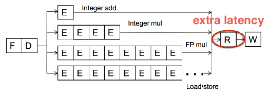

## Ensuring Precise Exception in Pipelining 

Idea 3: History Buffer (HB)

- When instruction is decoded, it reserves an HB entry
- When the instruction completes, it stores the old value of its destination in the HB
- When instruction is oldest and no exceptions interrupts, the HB entry discarded
- When instruction is oldest and an exception needs to be handled, old values in the HB are written back into the architectural state from tail to head. 

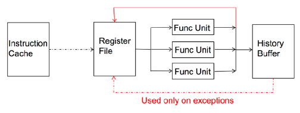

# Superscalar Processor

Superscalar processor enable CPI < 1 (IPC > 1) by executing multiple instructions in parallel. 

Can have both in-order and out-of-order superscalar processors. 

## Baseline 2-way In-order Superscalar Processor

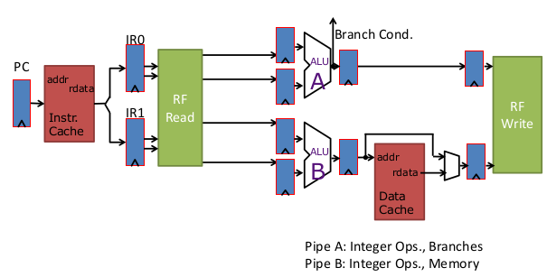

Limitations: 

- Fetching 2 instructions: need to make sure it goes to the right pipeline (branches go to A, memory goes to B)
- Need to duplicate controls because there are multiple pipelines

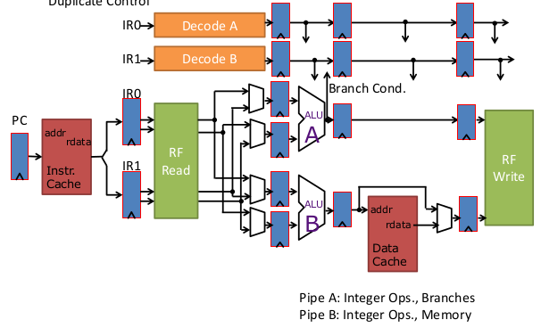

## Issue Logic Pipeline

