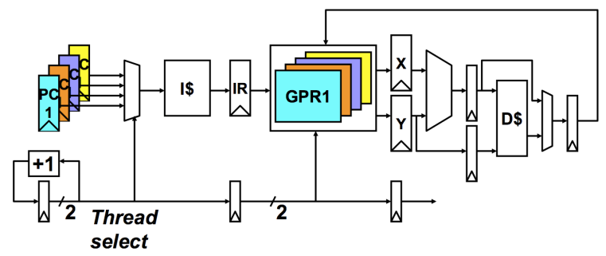
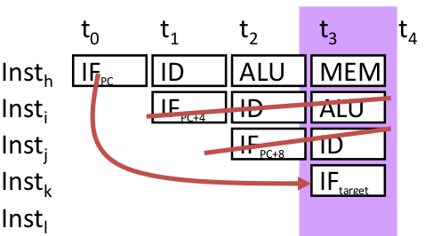
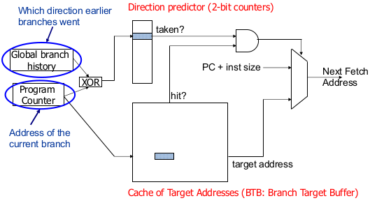
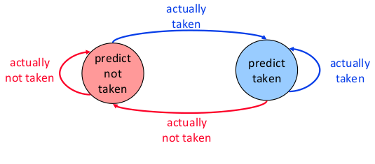
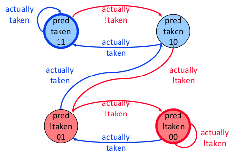
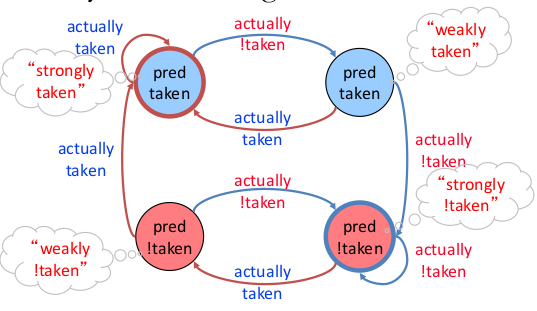
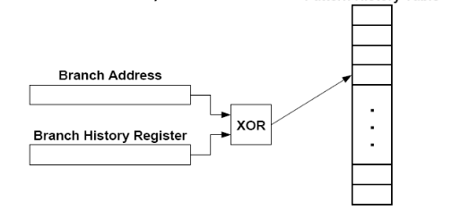
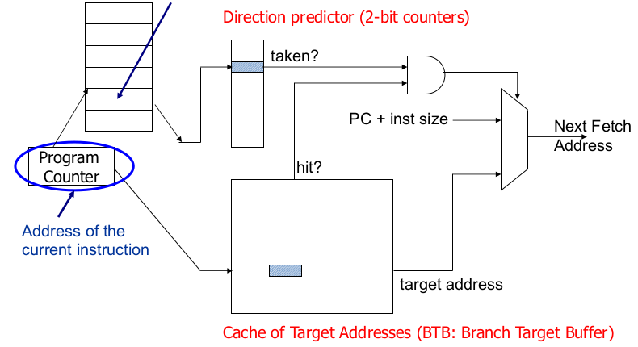

---
geometry: margin=2cm
--- 

[**\[LINK\]:** Entire Lecture is in this video LOL^1^](https://www.youtube.com/watch?v=XkerLktFtJg&t=448s)

# Fine Grain Multithreading 

Idea: Hardware has multiple thread contexts. Each cycle, fetch engine fetches from a different thread. 

- By the time the fetched branch/instruction resolves, no instruction is fetched from the same thread
- Branch/instruction resolution latency overlap on top of other threads' instructions

Advantages:

- No logic needed for handling control and data dependencies within a thread
- No need for branch prediction logic
- Otherwise-bubble cycles used for executing useful instructions from different threads
- Improved system throughput, latency tolerance, utilization

Disadvantages: 

- Single thread performance suffers
- Extra logic for keeping thread context
- Does not overlap latency if not enough threads to cover the whole pipeline
- Extra hardware complexity: multiple hardware context, thread selection logic



- Need to Replicate PC and GPRs (General Purpose Register)
- Thread Select iterates through and chooses a GPR for the respective thread you're on

\newpage

# Branch Prediction

Branch prediction is used to guess the next instruction when a branch is fetched. Requires guessing the direction and target of a branch. 

- Used to keep the pipeline full

{width=55%}

When a branch resolves:

- Branch target (Inst~k~) is fetched
- All instructions fetched since inst~h~ (wrong path instruction) must be flushed
- The ALU and ID instruction running at the same time as the IF~target~ is **killed**
- As you can see, mispredictions are expensive 

## Performance Analysis

Correct guess = No penalty

Incorrect guess = 2 bubbles

Assume:

- No data hazards
- 20% control flow instructions
- 70% of control flow instructions are taken

CPI = [1 + (0.2 $\cdot$ 0.7) $\cdot$ 2] = 1.28

- (0.2 $\cdot$ 0.7) = probability of a wrong guess
- 2 = penalty for a wrong guess

# Branch Prediction (Enhanced) 

Idea: Predict the next fetch address (for the next cycle) 

Requires three things to be predicted at fetch stage: 

1. Is the fetch instruction a branch
2. (Conditional) branch direction 
3. Branch target address (if taken) 

Observation: Target address remains the same for a conditional direct branch across dynamic instances

- Idea: Store the target address from the *previous* instance and access it with the PC
- Called **Branch Target Buffer (BTB)**
- Cache the target address the first time you execute the branch. The hope is that next time you see it you will have it in the cache. 



The program counter sends the address of the current branch to the **BTB** and the **Direction Predictor**

- BTB: Store target address from previous instance and access it with the PC
    - If its been seen before it should be a hit (use the target address) 
    - If it hasn't been seen, store the target address into the buffer, pass along that it is a miss
- Direction Predictor determines whether to take or not take a branch jump
    - This part is optional
    - This part can also be done in the hardware or software
    - If its a taken, then use the target address, if not then jump
- PC + inst size: not taken, jump to next instruction 
- Global Branch History: direction branches went before, aids in making the predictor better

# Branch Prediction Schemes

&nbsp;

## Simple Branch Prediction Schemes 

Compile time (static)

- Always not taken
- Always taken 
- BTFN (backward taken, forward not taken)
- Profile based (likely direction)

Run time (dynamic) 

- Last time prediction (single-bit)

\newpage

## More Sophisticated Direction Prediction

Compile time (static)

- Always not taken
- Always taken 
- BTFN (backward taken, forward not taken)
- Profile based (likely direction)
- Program analysis based (likely direction)

Run time (dynamic) 

- Last time prediction (single-bit)
- Two-bit counter based prediction
- Two-level prediction (global vs. local) 
- Hybrid

# Static Branch Prediction 

All previous techniques can be combined

- Profile based
- Program based 
- Programmer based

What are common disadvantages of all three techniques?

- Cannot adapt to dynamic changes in branch behaviour 
- This can be mitigated by a dynamic compiler, but not at a fine granularity

## Static Branch Prediction (I)

Always not taken

- Simple to implement: no need for BTB, no direction prediction
- Low accuracy: ~30-40%

Always taken

- No direction prediction
- Better accuracy: ~60-70% 
    - Backward branches (loop branches) are usually taken

Backward taken, forward not taken (BTFN) 

- Predict backward (loop) branches as taken, others not taken

## Static Branch Prediction (II)

Profile Based - Idea: compiler determines likely direction for each branch using profile run. Encodes that direction as a hint bit in the branch instruction format. 

Advantage:

- Per branch prediction (more accurate than schemes in previous slide) &rarr; accurate if profile is representative! 

Disadvantage: 

- Requires hint bits in the branch instruction format
- Accuracy depends on dynamic branch behaviour: 
    - TTTTTTTTTTNNNNNNNNNN &rarr; 50% accuracy
    - TNTNTNTNTNTNTNTNTNTN &rarr; 50% accuracy
- Accuracy depends on the representativeness of profile input set

## Static Branch Prediction (III)

**Program based or Program Analysis based** - Idea: use heuristic based on program analysis to determine statically-predicted direction 

- Example opcode heuristic: predict Branch Less than or Equal to Zero (BLEZ) as T (negative integers used as error values in many programs) 
- Example loop heuristic: predict a branch guarding a loop execution as taken (execute the loop). This is saying there is a if statement with a loop inside of it. If this is the case, most of the time you will execute the loop. 
- Pointer and FP comparisons: Predict not equal. Usually two pointer/floating point variables aren't usually equal

- Advantages: 
    - Does not require profiling
- Disadvantages: 
    - Heuristics might be not representative or good 
    - Requires compiler analysis and ISA support (ditto for other static methods) 

**Programmer based** - Idea: programmer provides the statically-predicted direction 

- Via pragmas in the programming language that qualify a branch as likely-taken versus likely-not-taken
- Pragma Idea: keywords that enable a programmer to convey hints to lower levels of the transformation hierarchy
    - if (likely(x)) {...}
    - if (unlikely(error)) {...} 
    - Many other hints and optimizations can be enabled with pragmas
        - \#pragma omp parallel
- Advantages
    - Does not require profiling or program analysis
    - Programmer may know some branches and their program better than other analysis techniques
- Disadvantages
    - Requires programming language, compiler, ISA support
    - Burdens the programmer? LOL

# Dynamic Branch Prediction

Idea: predict branches based on dynamic information (collected at run-time) 

Advantages: 

- Prediction based on history of the execution of branches
- It can adapt to dynamic changes in branch behaviour 
- No need for static profiling: input set representativeness problem goes away

Disadvantages: 

- More complex (require additional hardware) 

\newpage

## Last Time Predictor

Last time predictor: 

- Single bit per branch (stored in BTB) 
- Indicates which direction branch went last time it was executed 
    - TTTTTTTTTTNNNNNNNNNN &rarr; 90% accuracy 

Always mispredicts the last iteration and the first iteration of a loop branch
   
- Accuracy for a loop with N iterations = (N-2)/N
- Loop where N is small: accuracy is shit

Problem: a last-time predictor changes its prediction from T &rarr; NT or NT &rarr; T too quickly



## Two Bit Counter Based Prediction

Two Bit counter based predictor: 

- Each branch associated with a two-bit counter
- One more bit provides hysteresis 
- A strong prediction does not change with one single different outcome 

Accuracy for a loop with N iterations = (N-1)/N

- TNTNTNTNTNTNTNTNTNTN &rarr; 50% accuracy 

Advantages: 

- Better prediction accuracy 

Disadvantages: 

- More hardware cost

\newpage

{width=70%}

&nbsp;

&nbsp;

{width=76%}

\newpage

# Importance of The Branch Problem (Example Problem)

Assume a 5-wide superscalar pipeline with 20-cycle branch resolution latency

How long does it take to fetch 500 instructions?

- Assume 1 out of 5 instructions is a branch
- 100% accuracy
    - 100 cycles (all instructions fetched on the correct path) 
    - No wasted work
- 99% accuracy
    - 100 (correct path) + 20 (wrong path) = 120 cycles
    - 20% extra instructions fetched
- 98% accuracy
    - 100 (correct path) + 20 \* 2 (wrong path) = 140 cycles
    - 40% extra instructions fetched
- 95% accuracy
    - 100 (correct path) + 20 \* 5 (wrong path) = 200 cycles
    - 100% extra instructions fetched

# Global Branch Correlation 

Can we do better?

- Realization 1: a branch's outcome can be correlated with other branches' outcomes. (Global branch correlation)
- Realization 2: a branch's outcome can be correlated with past outcomes of the same branch (other than the outcome of the branch "last time" it was executed) (Local branch correlation) 

## Global Branch Correlation (I)

Idea: Recently executed branch outcomes in the execution path is correlated with the outcome of the next branch. 

> If first branch taken, second also taken

```
        if (cond1) 
            ...
        if (cond1 AND cond2)
```

> If first branch not taken, second definitely taken


```
        branch Y: if (cond1) a = 2; 
            ...
        branch X: if (a==0)
```

## Global Branch Correlation (II) 

If Y or Z is taken, then X also taken. 

If Y and Z not taken, then X also not taken

```
    branch Y: if (cond1)
        ... 
    branch Z: if (cond2)
        ... 
    branch X: if (cond1 AND cond2) 
```

\newpage

## Global Branch Correlation (III) 

If B1 is not taken and B2 is not taken then B3 is certainly taken

```
    if (aa == 2)  //B1
        aa = 0; 
    if (bb == 2)  //B2
        bb = 0; 
    if (aa != bb) //B3
        ...
```

## Capturing Global Branch Correlation

Idea: associate branch outcomes with "global T/NT history" of all branches

- Make a prediction based on the outcome of the branch the last time the same global branch history was encountered 
- GHR is N bit wide: Direction of last N executed branches

Implementation: 

- Keep track of the "global T/NT history" of all branches in a register &rarr; Global History Register (GHR) 
- Use GHR to index into a table that records the outcome that was seen for each GHR value in the recent past &rarr; Pattern History Table
    - GHR provides a "pattern" which you use to index the pattern history table. In the table lies the T/NT for the given pattern. 

Global history/branch predictor

- Uses two levels of history (GHR + history at that GHR) 

## Two Level Global Branch Prediction 

First level: Global branch history register (N bits) 

- The direction of last N branches

Second level: Table of saturating counters for each history entry

- The direction the branch took the last time the same history was seen 

## Improving Global Predictor Accuracy

Idea: add more context information to the global predictor to take into account which branch is being predicted

- Gshare predictor: GHR hashed with the Branch PC
- Adds more context information
- Better utilization of PHT
- Increases access latency

{width=50%}

\newpage

# Local Branch Correlation

Idea: have a per-branch history register

- Associate the predicted outcome of a branch with "T/NT history" of the same branch
- Make a prediction based on the outcome of the branch the last time the same local branch history was encountered
- Similar to global except its all local (There are now N history register for all the branches)

Called the local history/branch predictor

Uses two levels of history (Per-branch history register + history at that history register value)



# Hybrid Branch Predictors

Idea: Use more than one type of predictors (multiple algorithms) and select the "best" prediction

- Ex. hybrid of 2-bit counters and  global predictors

Advantages:

- Better accuracy: different predictors are better for different branches
- Reduced warmup time (faster-warmup predictor used until the slower-warmup predictor warm ups) 
    - Global needs to populate history and pattern (needs to warm up) while last time predictor is ready immediately. 

Disadvantages: 

- Need "meta-predictor" or "selector"
- Longer access latency

\newpage

# Biased Branches

Observation: Many branches are biased in one direction (Ex. 99% taken)

Problem: These branches *pollute* the branch prediction structures &rarr; makes the prediction of other branches difficult by causing "interference" in the branch prediction tables and history registers

Solution: Detect such biased branches, and predict them with a simple predictor

# Predication (Predicated Execution)

Idea: Compiler converts control dependence into data dependence &rarr; branch is eliminated

- Easy instruction has a predicate bit set based on the predicate computation
- Only instructions with TRUE predicates are committed (others turned into NOPs) 
- Predicated execution can be high performance and energy-efficient

Advantages

-  Eliminates mispredictions for hard to predict branches

Disadvantages

- Causes useless work for branches that are easy to predict
- Additional hardware and ISA support

## Wish Branches

Idea: compiler generates code (with wish branches) that can be executed either as predicated code or non-predicated code (normal branch code)

The hardware decides to execute predicated code or normal branch code at run-time based on the confidence of branch prediction

- Easy to predict: normal branch code
- Hard to predict: predicated code

\newpage

# Links

1. https://www.youtube.com/watch?v=XkerLktFtJg&t=448s
