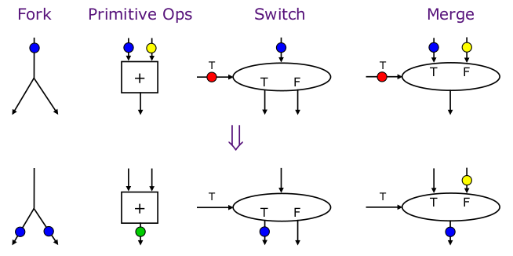

# Introduction

https://youtu.be/P-mXr9adbCc?t=1000

## In-Order Pipeline

{width=60%}

Problem: A true data dependency stalls dispatch of younger instructions into functional (execution) units

Dispatch: Act of sending an instruction to a functional unit

Simplify Problem: when we have dependency in data we need to stall dispatch because we have to wait for the dependency 

## Example: Can We Do Better

What do the following two pieces of code have in common (with respect to execution in the previous design)?

{width=50%}

Answer: 

- ADD stalls the whole pipeline (red line) 
- ADD cannot dispatch because its source registers are unavailable (red line)
- Later independent instructions cannot get executed (blue lines)

How are the above code portions different?

- Answer: load latency is variable (unknown until runtime)
- What does this affect: compiler

## Preventing Dispatch Stalls

Three ways to prevent dispatch stalls: 

1. Fine-grained multithreading: Disadvantage - cannot improve single thread
2. Value prediction: Disadvantage - might not always predict correctly

Improvement ideas:

- Dataflow: fetch and "fire" an instruction when its inputs are ready 
- Problem: We have in-order dispatch (scheduling and execution)
- Solution: Use out-of-order dispatch (scheduling and execution)

# Out-of-Order Execution (OoO) (Dynamic Scheduling) 

Idea: Move the dependent instructions out of the way of independent ones

- Rest areas for dependent instructions: Reservation stations
- Monitor the source "values" of each instruction in the resting area
- When all source "values" of an instruction are available, "fire" (dispatch) the instruction
- This idea is data flow order (order is dependent on when data is available and ready to be ran)

Benefits: **Latency tolerance** - allows independent instructions to execute and complete in the presence of a long latency operation

# In-Order VS Out-of-Order Dispatch

{width=20%}

{width=65%}

## Enabling OoO Execution

1. Need to link the consumer of a value to the producer
    - Register renaming: associate a "tag" with each data value
2. Need to buffer instructions until they are ready to execute
    - Insert instruction into reservation stations after renaming
3. Instructions need to keep track of readiness of source values
    - Broadcast the "tag" when the value is produced
    - Instructions compare their "source tags" to the broadcast tag &rarr; if match, source value becomes ready
4. When all source values of an instruction are ready, need to dispatch the instruction to its functional unit (FU)
    - Instruction wakes up if all sources are ready
    - If multiple instructions are awake, need to select one per FU

- The "SCHEDULE" is the reservation station (scheduling window)
- The "REORDER" does reordering (reorder buffer, aka instruction window or active window)

# The Dataflow Model

Von Neumann model: an instruction is fetched and executed in **control flow order**

- As specified by the **instruction pointer**
- Sequential unless explicit control flow instruction

Dataflow model: An instruction is fetched and executed in **data flow order**

- Ex. When its operands are ready
- Ex. When there is **no instruction pointer**
- Instruction ordering specified by data flow dependence
    - Each instruction specifies "who" should receive the result
    - An instruction can "fire" whenever all operands are received
- Potentially many instruction can execute at the same time
    - Inherently more parallel 

\newpage

## Von Neumann vs Dataflow 

{width=70%}

- Values in data flow graphs are represented as tokens:
    - token \<ip, p, v\> 
        - ip = instruction pointer
        - p = port
        - v = dataa
    - An operator executes when all its input tokens are present; copies of the result token are distributed to the destination operators

In a data flow machine, a program consists of data flow nodes

- A data flow node fires (fetched and executed) when all its inputs are ready (when all inputs have tokens)

### Data Flow Nodes

A small set of data flow operators can be used to define a general programming language

{width=70%}

\newpage

### Data Flow Characteristics

Data-driven execution of instruction-level graphical code
    
- Nodes are operators
- Arcs are data (I/O)
- As opposed to control-driven execution

Only real dependencies constrain processing

No sequential instruction stream (no program counter) 

Execution triggered by the presence/readiness of data

### Data Flow Advantages/Disadvantages

Advantages:

- Very good at exploiting irregular parallelism 
- Only real dependencies constrain processing

Disadvantages: 

- No precise state
    - Debugging very difficult
    - Interrupt/exception handling is difficult
- Bookkeeping overhead (tag matching)
- Too much parallelism? (parallelism control needed) 

