# Introduction

[**\[LINK\]**: Entire lecture on youtube^1^](https://www.youtube.com/watch?v=IUk9o9wvX1Y&t=3094s)

Need more main memory (capacity)

- Modern application are (increasingly) data-intensive
- Many applications share main memory
    - Cloud computing
    - Many-core CPUs

## Major Trends Affecting Main Memory

1. Need for main memory capacity, bandwidth, QoS increasing
    - Multi-core: increasing number of cores
    - Data intensive applications: increasing demand/hunger for data
    - Consolidation: cloud computing, GPUs, mobile

2. Main memory energy/power is a key system design concern
    - DRAM consumes more power when idle and needs periodic refresh

3. DRAM technology scaling is ending
    - DRAM will not scale easily below X nm
    - Scaling has provided many benefits
        - higher capacity, higher density, lower cost, lower energy

## DRAM Scaling Problem

DRAM stores charge in a capacitor (charge-based memory)

- Capacitor must be large enough for reliable sensing
- DRAM hard to scale

Evidence of Scaling Problem  (**Row Hammer**)

- DRAM uses low and high voltage to insert data into a cell
- Repeatedly opening and closing a row enough times within a refresh interval induces disturbance errors in adjacent rows in most real DRAM chips bought today. 
    - Aggressor Row (causing disturbance)
- Experiment shows 80% of DRAMs are effected by this issue

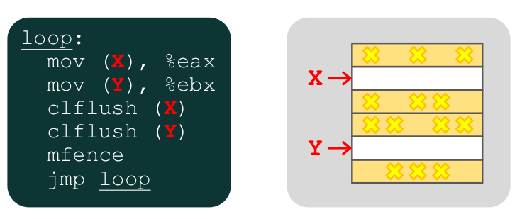{width=80%}

- mov = Load x into eax register
- clflush = Flush register
- mfence = Ensure that memory instructions actually occur
- jmp = Branch jump to beginning of loop

### Security Implications

- Memory isolation:  an access to one address memory should not have unintended side effects on data stored in other addresses. 
- Rowhammer is a problem with recent DRAM devices (as of 2010) 
- Can use rowhammer to induce bit flips to gain kernel privileges on x86-64 when ran as unprivileged userland process.
- Rowhammer can induce bit flips in page table entries
- Able too gain access to its own page table, and hence gain read-write access to all of physical memory

## Main Memory in the System

Physical address space: 

- Maximum size of main memory: total number of uniquely identifiable locations

Physical addressability

- Minimum size of data in memory can be addressed
- Byte-addressable, word-addressable, 64-bit-addressable
- Microarchitectural addressability depends on the abstraction level of the implementation

\newpage

# DRAM Subsystem (Bottom Up)

Abstract Diagram: 

- Channel (Highest in abstraction)
- Due Inline Memory Module (DIMM)
- Rank
- Chip 
- Bank 
- Row/Column

## DRAM Memory Bank Organization

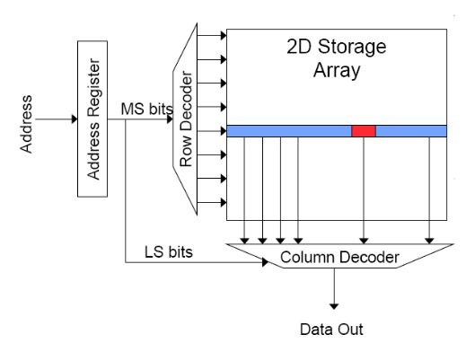{width=60%}

Read access sequence:

1. Decode row address 
2. Read entire row
3. Amplify row data
4. Decode column address and select subset of row (send to output)
5. Precharge bit lines (WTF LOL)

### Interleaving (Banking)

Problem: a single monolithic memory array takes long to access and does not enable multiple access in parallel (high cost). 

Goal: reduce the latency of memory array access and enable multiple access in parallel

Idea: divide the array into multiple banks that can be accessed independently (in the same cycle or in consecutive cycles)

- Each bank is smaller than the entire memory storage
- Accesses to different banks can be overlapped

Key Issue: How to map data to different banks?

[comment]: # (find out how this works, how it index and offset)

### Page Mode DRAM

- A DRAM bank is a 2D array of cells: rows x columns
- A DRAM row is also called a DRAM page
- The activated row is placed in a row buffer
- Each address is a <row, column> pair
- Access to a closed row:
    - Activate command opens row (placed into row buffer)
    - Read/write command reads/write column in the row buffer
    - Precharge command closes the row and prepares the bank for next access
- Access to an open row: 
    - No need for activate command

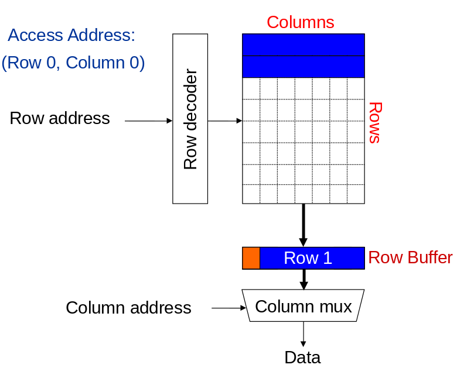{width=70%}

Explanation of DRAM bank operation: 

- Accessing address (Row 0, Col 0) 
    - Row address gets sent to row decoder and retrieve the respective row and puts it in the row buffer
    - The column address is sent to column mux which extracts the data from the column in the row buffer and sends it to the user as the data
- Accessing address (Row 0, Col 69) assuming you just accessed (Row 0, Col 0)
    - You will get a hit in the row decoder and therefore only need to do the column mux part to get the 69^th^ column of data
- Accessing address (Row 1, Col 0) assuming you just accessed (Row 0, Col 69)
    - Miss, gotta do both again

## DRAM Chips

Consists of multiple banks (2-16 in DRAM)

Banks share command/address/data buses 

The chip itself has a narrow interface (4-16 bits per read)

## DRAM Rank and Module

Rank: multiple chips operated together to form a wide interface

- All chips comprising a rank are controlled at the same time
    - Respond to a single command
    - Share address and command buses, but provide different idea

DRAM Module: consists of one or more ranks

- DIMM (dual inline memory module)
- This is what you plug into your motherboard

If we have chips with 8-bit interface, to read 8 bytes in a single access, use 8 chips in a DIMM

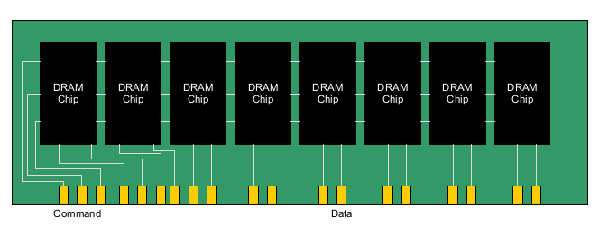{width=60%}

### Multiple DIMMs

Advantages: enables higher capacity

Disadvantages: interconnect complexity and energy consumption can be high

## DRAM Channels

What controls the set of DIMMs. 

2 Independent Channels: 2 memory controllers

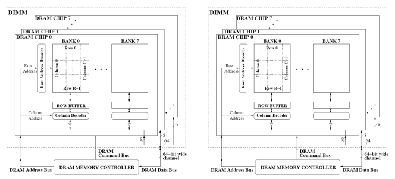{width=90%}

# General Memory Structure

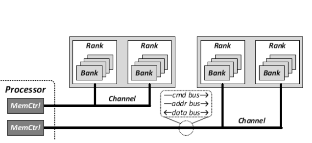

Processor send request to Channel

- Channel holds two DIMMs

DIMM have multiple ranks

- There is a front and a back each is a rank
- Total of 2 ranks

Rank consist of chips 

- Shared data bus, there is a penalty from switching one rank to another

Chip consist of multiple banks

- Can multiplex data to different banks

Banks has the 2D array

\newpage

## How Processors Gets Data from Main Memory 

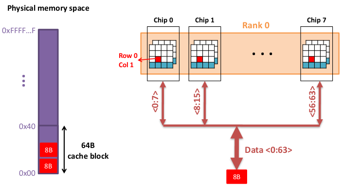

- Given the 64B cache block in main memory, it gets mapped to a single rank
- Chip (tiny square) holds 8 bits of data
    - Accessing an entire row gives you 64 bits
    - With 8 chips this gives us the whole entire 64 byte representation
- A 64B cache block takes 8 I/O cycles to transfer
- During the process, 8 columns are read sequentially (WE CAN PIPE LINE THO)

## Multiple Banks 

Multiple Banks

- Enable concurrent DRAM access
- Multiple independent channels serve the same purpose
    - They are even better because they have separate data buses
    - Increase bus bandwidth
- Enabling more concurrency still requires reducing:
    - Bank conflicts
    - Channel conflicts
- How to select/randomize bank/channel indices in address
    - Lower order bits have more entropy
    - Randomizing hash functions

\newpage

# A Modern DRAM Controller

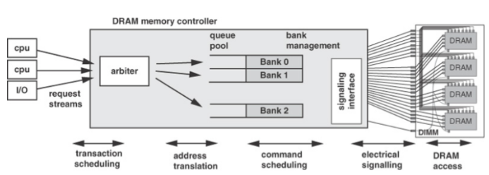{width=85%}

- Input: request from CPU
- Abiter determines where to route request
- When DRAM bank not busy, controller sends one of teh queue pools into the DRAM 

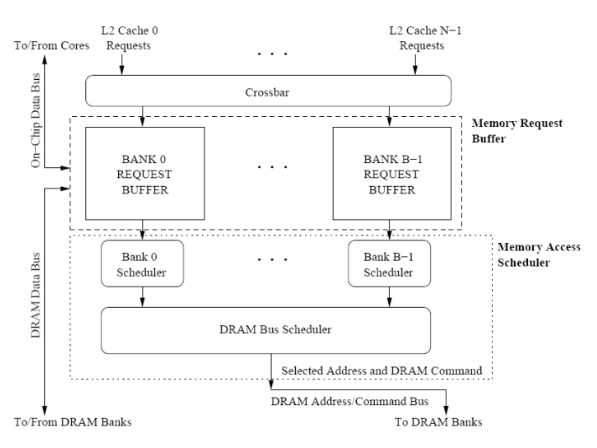{width=80%}

- Request placed in buffers and then scheduled into an actually DRAM when not busy

\newpage

## DRAM Scheduling Policies

First come first served (FCFS)

- Oldest request first

First reader, first come first served (FR-FCFS)

- Row-hit first
- Oldest first
- Goal: Maximize row buffer hit rate &rarr; maximize DRAM throughput

# Multicore on Chip

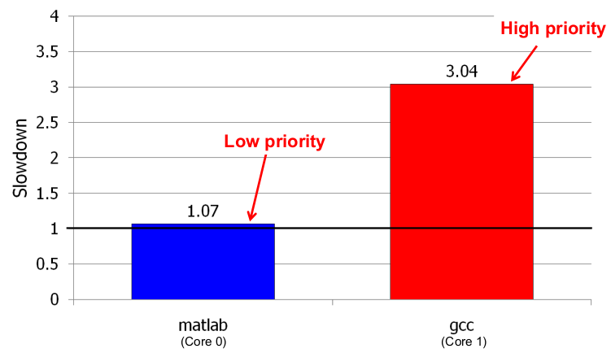

We have two applications running on two different cores

- Expectation: no slowdown, they're running different hardware (different core)
- Graph show otherwise, this is because they share the same DRAM system (main memory causing slowdown)
- Even with high priority, gcc gets the slow down, why???
    - DRAM for sure, this is not because of OS resource allocation
- DRAM controller is unfair

\newpage

## Memory Hog (oink)

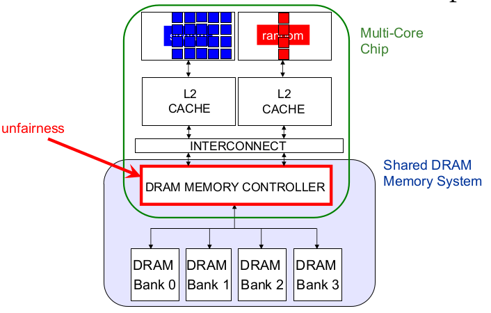

- Blue = streaming application
- Red = random application 
- Blue has better dram controlling because it access the same row 
- Stream application get all 4 banks first because row buffer hits 
- This makes it unfair for the random application (random never gets queued into controller)
[comment]: # (add code implementatio of the above diagram)

## Memory Hog Effects

Worst case scenario given a row size of 8KB and cache block size of 64B.

128 requests to a single row could be serviced before the other is serviced

This same pattern can be seen in systems with more than 2 cores

[comment]: # (add multicore example)

## Memory Hog Solution

Goal: Threads sharing main memory should experience similar slowdowns compared to when they are run alone (fair scheduling)

- Also  improves overall system performance by ensuring cores make "proportional" progress

Idea: Memory controller estimates each thread's slowdown due to interference and schedules requests in a way to balance the slowdowns

Done with **Stall-time fair memory (STFM) scheduling**

### Stall-Time Fairness in Shared DRAM Systems

Fair DRAM System: when it equalizes the slowdown of equal priority threads relative to their speed when ran alone

- DRAM-related stall-time: The time a thread spends waiting for DRAM memory

Memory Slowdown = $\displaystyle\frac{\text{ST-Shared}}{\text{ST-Alone}}$

- ST-Shared: DRAM-related stall-time when the thread runs with other threads
- ST-Alone: DRAM-related stall-time when thread runs alone

STFM scheduler aims to **equalize** memory-slowdown for interfering threads, without sacrificing performance

- Consider inherent DRAM performance of each thread
- Aims  to allow proportional progress of threads

### STFM Scheduling Algorithm

For each thread, the DRAM controller

- Tracks ST-Shared
- Estimates ST-Alone

Each cycle, the DRAM controller

- Computes slowdown = ST-Shared / ST-Alone for threads with legal requests
- Computes unfairness = Max Slowdown / Min Slowdown

If unfairness \< $\alpha$

- Use DRAM throughput oriented scheduling policy

If unfairness $\ge$ $\alpha$ 

- Use fairness-oriented scheduling policy
    1. requests from thread with MAX slowdown first
    2. row hit first, oldest first

\newpage

# Parallelism-Aware Batch Scheduling: Introduction

## Another Problem Due to Interference

Processors try to tolerate the latency of DRAM requests by generating multiple outstanding requests

- Memory-Level Parallelism (MLP)
- Out-of-order execution, non-block caches, runahead execution

Effective only if the DRAM controller actually services the multiple requests in parallel in DRAM banks

Multiple threads share the DRAM controller

DRAM controllers are not aware of a thread's MLP

- Can service each thread's outstanding requests serially, not in parallel 

## Bank Parallelism Example

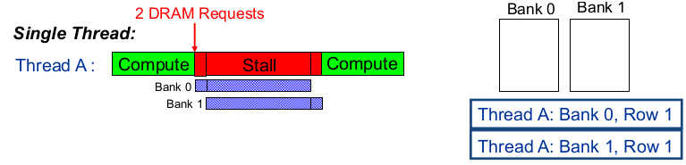

- Bank access latencies of the two requests are overlapped
- Thread stalls for ONE bank access latency
- Parallelism good

## Bank Parallelism Interference Example 

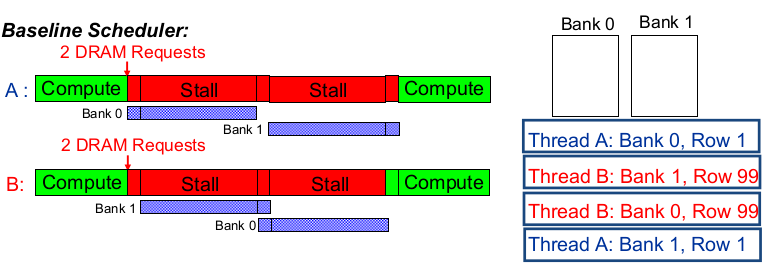

- Bank access latencies of each thread serialized
- Each thread stalls for TWO bank access latencies
- Between the two threads the executions are parallelized, but you still have two stalls
- Handles thread by order in which they appear

## Parallelism-Aware Scheduler Example

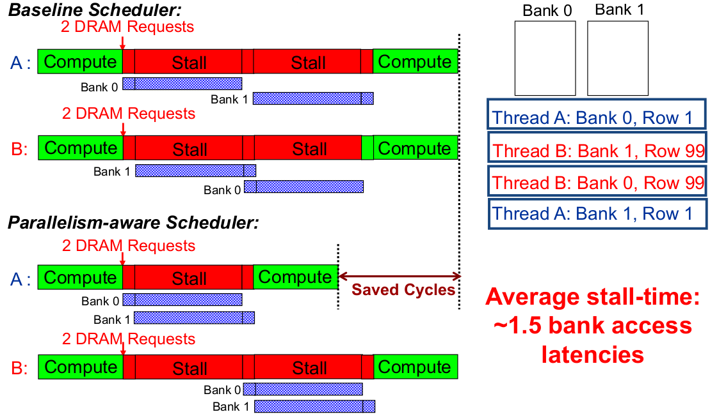

- Instead of doing it by order, it recognizes parallelism and will execute A's request in parallel
- This save *average* stall time because A has save cycles

# Parallelism-Aware Batch Scheduling (PAR-BS)

Principle 1: Parallelism-awareness

- Schedule requests from a thread (to different banks) back to back
    - Preserves each thread's bank parallelism 
    - Can cause starvation

Principle 2: Request Batching

- Group a fixed number of oldest requests from each thread into a "batch"
- Service the batch before all other requests
    - Form a new batch when the current one is done
    - Eliminates starvation, provides fairness
    - Allows parallelism-awareness within a batch

## PAR-BS Components

Two components: 

1. Request batching 
2. Within-batch scheduling

### Request Batching

Each memory request has a bit (marked) associated with it

Batch formation:

- Mark up to Marking-Cap oldest requests per bank for each thread
- Marked requests constitute the batch
- Form a new batch when no marked requests are left 

Marked requests are prioritized over unmarked ones

- No reordering of requests across batches: no starvation, high fairness

How to prioritize requests within branch?

- WITHIN BATCH SCHEDULING

### Within-Batch Scheduling

Can use any DRAM scheduling policy

- FR-FCFS (row hit first, then oldest first) exploits row-buffer locality

But, we also want to preserve intra-thread bank parallelism 

- Service each thread's requests back to back
- How???

How: Scheduler computes a ranking of threads when the batch is formed

- Higher-ranked threads are prioritized over lower-ranked ones
- Improves likelihood that requests from a thread are serviced in parallel by different banks
    - Different threads prioritized in the same order across all banks

## How to Rank Threads within a Batch

Ranking scheme affects system throughput and fairness

Goals I: Maximize system throughput

- Minimize average stall-time of threads within the batch

Goal II: Minimize unfairness (Equalize the slowdown of threads)

- Service threads with inherently low stall-time early in the batch
- Insight: delaying memory non-intensive threads results in high slowdown

Shortest stall-time first (shortest job first) ranking

- Provides optimal system throughput
- Controller estimates each thread's stall-time within the batch
- Ranks threads with shorter stall-time higher

\newpage

## Shortest Stall-Time First Ranking 

Maximum number of marked requests to any bank (max-bank-load)

- Ranked thread with lower max-bank-load higher (~low stall-time) 

Total number of marked requests (total-load)

- Break ties: ranked thread with lower total-load higher

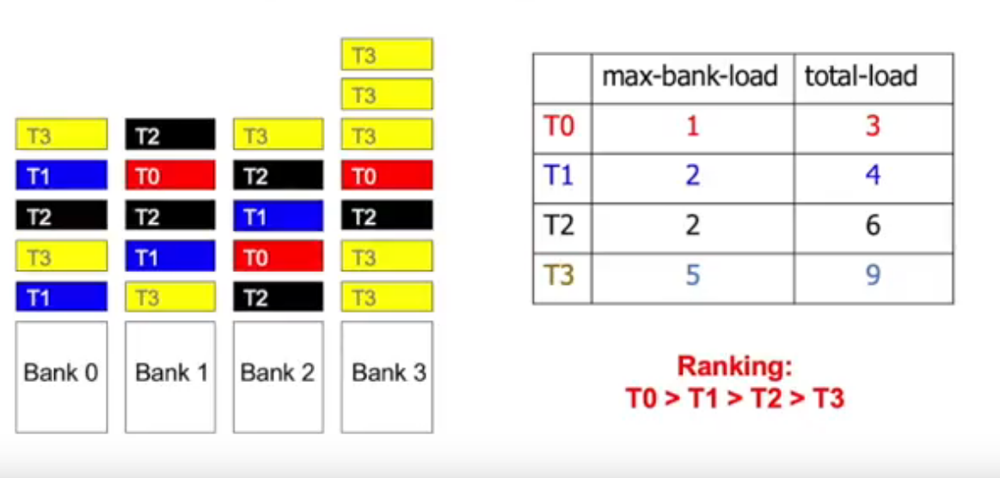{width=70%}

### Example Within-Batch Scheduling Order

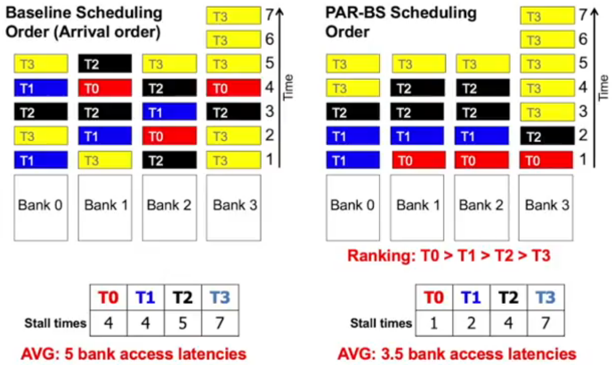{width=95%}

\newpage

### Hardware Costs

\< 1.5KB storage cost for:

- 8-core system with 128-entry memory request buffer

No complex operations (division)

Not on the critical path

- Scheduler makes a decision only every DRAM cycle

## PAR-BS Pros and Cons

Advantages:

- First scheduler to address bank parallelism destruction across multiple threads
- Simple mechanism (VS STFM) 
- Batching provides fairness
- Ranking enables parallelism awareness

Disadvantages:

- Does not always prioritize the latency-sensitive applications
