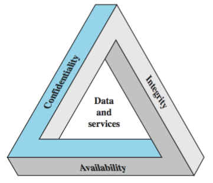

# 1.1 Security Concepts

Cryptographic Algorithms: symmetric ciphers, asymmetric ciphers

Cryptographic Data Integrity Algorithms: hash functions, message authentication codes, digital signatures 

Mutual Trust: Key management and distribution, user authentication protocols

Network/Internet Security, System Security: Measurements used to deter, prevent, detect, and amend security violations. 

Standard Organizations

- National Institute of Standards and Technology (NIST) 
- Internet Society (ISOC)
- International Telecommunication Union Telecommunication Standardization Sector (ITU-T)
- International Organization for Standardization (ISO)

## Computer Security 

Computer Security: the protection afforded to an automated information system in order to attain the applicable objectives of preserving the **integrity**, **availability**, and **confidentiality** of information system resources (includes hardware, software, firmware, information/data, and telecommunications). 

## Three Key Objectives of Computer Security

1. Confidentiality: This term covers two related concepts: 
    - **Data confidentiality**: Assures that private or confidential info is not made available or disclosed to unauthorized individuals. 
    - **Privacy**: Assures individuals control or influence what information related to them, may be collected and stored, and by whom that information may be disclosed. 
    - A loss of confidentiality is the unauthorized disclosure of information.

2. Integrity: This term covers two related concepts: 
    - **Data integrity**: Assures that information and programs are changed only in a specified and authorized manner. 
    - **System integrity**: Assures that a system performs its intended function in an unimpaired manner, free from deliberate or inadvertent unauthorized manipulation of the system. 
    - A loss of integrity is the unauthorized modification or destruction of information. 

3. Availability: Assures that systems work promptly and service is not denied to authorized users. 
    - A loss of availability is the disruption of access to or use of information or an information system. 

{width=38%}

## Additional Concepts

Authenticity: The property of being genuine and being able to be verified and trusted; confidence in the validity of a transmission, a message, or message originator. 

Accountability: The security goal that generates the requirement for actions of an entity to be traced uniquely to that entity. 

## Levels of Impact from Security Breaches

**Low**: Loss has limited adverse effect on organizational operations, organizational assets, or individuals

**Moderate**: Loss has serious adverse effect

**High**: Loss has severe or catastrophic effect

Examples of impact in security objectives: 

- Confidentiality
    - passwords (high), student grades (moderate), directory information (low)
- Integrity
    - patient info (high), web forum for users (moderate), anonymous online poll (low)
- Availability
    - authentication service (high), public website (moderate), online phone directory (low)

## Computer Security Challenges

1. Not simple (requirements seem to be straightforward, mechanisms are complex)
2. Must consider potential attacks
3. Procedures used counter-intuitive
4. Involve algorithms and secret info
5. Must decide where to deploy mechanisms
6. Battle of wits between attacker / admin
7. Not perceived on benefit until fails
8. Requires regular monitoring
9. Too often an after-thought in system design
10. Regarded as impediment to using system

\newpage

# 1.2 Security Terminology and Architecture

OSI Security Architecture: is a definition of security approaches and requirements

- Defines a systematic way of defining and providing security requirements 
- Provide useful abstract overview of concepts we will study

## Aspects of Security

3 Aspects of information security

- Security attack
- Security mechanism (individual features)
- Security service (higher level)

Terms: 

- Threat: a potential for violation of security. 
- Vulnerability: a weakness. 
- Risk: Where a **threat** intersects with a **vulnerability**, risk is present. 
- Attack: an assault on system security, a deliberate attempt to evade security services. (Threat == Attack)

Security Analysis == Risk Analysis 

## Countermeasures 

Means to deal with security attacks:

- Prevent
- Detect
- Recover

May result in new vulnerabilities

Will have residual vulnerability

Goal: minimize risk given constraints. 

## Security Functional Requirements

Technical measures: (Ex. Authentication and identification)

Management controls and procedures: (Ex. Training)

Overlapping technical and management: (Ex. Incident Response)

## Security Attack

Passive Attacks: attempts to learn or make use of information from the system but **does not affect** system resources. 

Active attack: attempts to **alter** system resources or affect their operation

\newpage 

### Passive Attacks

Two types of Passive Attacks

1. Release of Message Contents: Intercepting and reading a private message.
    - Encrypt to protect
2. Traffic Analysis: Intercepting, and analyzing encrypted messages to break the encryption.
    - Inject additional packets to protect 

Passive attacks are **difficult to detect** because they do not involve any alteration of the data. 

Goal: prevent success of attack

### Active Attacks

Four types of Active Attacks

1. Masquerade: One entity pretends to be a different entity.
2. Replay: Captures data unit and retransmit it to cause unauthorized effect.
3. Modification of Message: Capture and alter data unit.
4. Denial of Service: Prevents normal use of communication

Active attacks are **difficult to prevent** because of the wide variety of potential physical, software, and network vulnerabilities. 

Goal: detect them and recover from any disruption or delays caused by them. 

## Security Services

Highest Level in OSI architecture

Two definitions:

1. X.800: "A service provided by a protocol layer of communicating open systems, which ensures *adequate* security of the systems or of data transfer"
2. RFC 2828: "A *processing* or *communication* service provided by a system to give a specific kind of protection to system resources"

X.800 divides these services into 5 categories:

1. Authentication: assurance that communicating entity is the one claimed
    - Peer entity authentication service: used in association to logical connection to ensure identity of entities being connected.
    - Data origin authentication service: used in connectionless transfer, provides assurance of the source. 
2. Access Control: Prevention of the unauthorized use of a resource. 
3. Data Confidentiality: Protection of data from unauthorized disclosure.
4. Data Integrity: Assurance that data received is as sent by an authorized entity, no modification, replay, etc.
5. Non-Repudiation: Protection against denial by one of the parties in a communication.

- Additional Service: Availability: resource accessible and usable.

## Security Mechanisms 

Specific features designed to prevent, detect, or recover form a security attack. 

There is no single mechanism that will support all services required. 

One particular element underlies many security mechanisms: **Cryptographic techniques**

Specific security mechanisms: (interacts more with higher level: security services)

Pervasive security mechanisms: (more general)

\newpage

## Model for Network Security

{width=85%}

Security-related transformation: **ALGORITHM**

Secret information: **KEY**

Using this model requires us to: 

1. Design *suitable algorithm* for the security transformation
2. Generate the *secret information* (keys) used by the algorithm
3. Develop methods to *distribute* and *share* the secret information
4. Specify a *protocol* enabling the principals to use the transformation and secret information for a security service

## Model for Network Access Security

{width=85%}

Protecting from unwanted access

Using this model requires us to: 

1. Select appropriate *gatekeeper functions* to identify users
2. Implement *security controls* to ensure only authorized users access designated information of resources 

