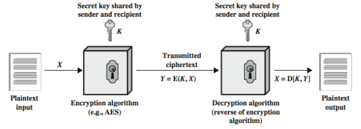
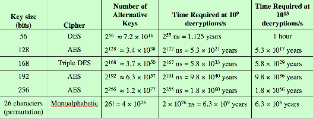
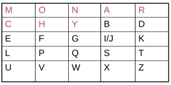
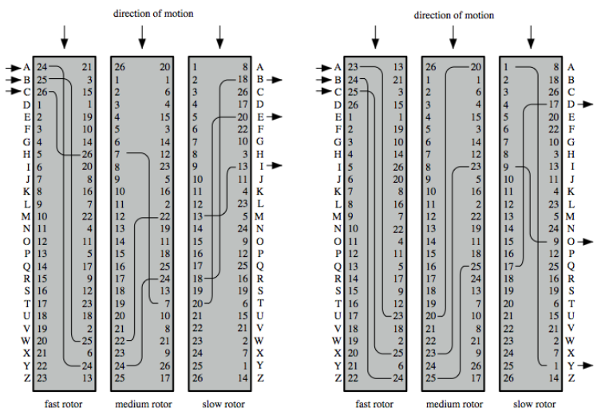

# 2.1 Terminology and Attacks to Cryptographic Systems

## Symmetric Encryption

Symmetric Encryption = Conventional Encryption = Secret-key Encryption = Single-key Encryption

- Sender and recipient share a common key.
- All classical encryption algorithms are secret-key.

## Basic Terminology

- Plaintext: original message
- Ciphertext: coded message
- Cipher: algorithm for transforming plaintext to ciphertext
- Key: info used in cipher known only to sender/receiver
- Encipher (encrypt): converting plaintext to ciphertext
- Decipher (decrypt): recovering ciphertext from plaintext
- Cryptography: study of encryption principles/methods
- Cryptanalysis (codebreaking): study of principle/methods of deciphering ciphertext without knowing key
- Cryptology: field of both cryptography and cryptanalysis

## Symmetric Cipher Model

Two requirements for secure use of symmetric encryption:

1. A strong encryption algorithm
2. A secret key known only to sender / receiver 

Mathematically have: 

> Y = E(K, X) 

> X = D(K, Y) 

Assume en(de)cryption algorithm is known 

Implies a secure channel to distribute key

\newpage

## Cryptography

Can characterize cryptographic systems by: 

- Type of encryption operations used
    - Substitution (change a letter)
    - Transposition (change a sequence)
    - Multiple stages of substitutions and transpositions (hybrid)
- Number of keys used
    - Single-key or secret-key
    - Two-key or public
- Ways in which plaintext is processed
    - Block (chunks of bits at a time)
    - Stream (bit by bit)

## Attacks to Cryptographic Systems

Objective: recover key, not just message

Two general Approaches

1. Cryptanalytic attack: Characteristics of the algorithm
2. Brute-force attack: Key space

If either succeed all keys used are compromised

## Cryptanalytic Attacks

- Ciphertext only: Only know algorithm & ciphertext
- Known plaintext (an encryption algorithm should withstand): know some plaintext/ciphertext pairs
- Chosen plaintext: select plaintext and obtain ciphertext
- Chosen ciphertext: select ciphertext and obtain plaintext
- Chosen text: select plaintext or ciphertext to Gen/decrypt

\*Assume algorithm is known for all these

## Additional Definitions

Unconditional Security: No matter how much computational power or time is available, the cipher cannot be broken since the ciphertext provides insufficient information to uniquely determine the corresponding plaintext. 

- One-time pad (strongest type of cipher algorithm). Cannot break cipher. 

Computational Security: (More real world) given limited computing resources, cipher can't be broken. 

\newpage

## Brute Force Search

Most basic attack, proportional to key size: on average half the key space must be tried. 

Assume either known/recognized plaintext

# 2.2 Substitution Ciphers

Classical substitution: letters of plaintext are *replaced* by other letters, numbers, or symbol. 

- If viewed as a sequence of bits: substitution involves replacing plaintext bit pattern with ciphertext bit patterns.

## Caesar Cipher

Caesar cipher: replaces each letter with the letter 3 places further down the alphabet. 

Algorithm:

- If mathematically, each letter represented at integer starting with A = 0
- c = Encrypt(k, p) = (p + k) mod (26)
- d = Decrypt(k, c) = (c - k) mod (26)
    - p = plaintext character
    - k = shift number (3)
    - c = ciphertext character

Brute Force space (given key is a number):

- key length = 1
- key space = 1

Brute Force space (general case):

- key length = 1
- key space = 26

There are only 26 possible keys (small space). 

\newpage

## Monoalphabetic Cipher

Monoalphabetic cipher: instead of just shifting the alphabet, shuffle the letters arbitrarily as well. 

Brute Force space: 

- key length = 26
- key space = 26!

There are now 26! = 4 x 10^26^ keys
    - number of permutations of alphabet shifts 
    - key space: 10 orders of magnitude greater

This still isn't secure because of **language characteristics** 

- Human language is redundant 
- Letters are not equally commonly used (E is most common. Z,J,K,Q,X are rare)
- Frequency of digrams (two letter combination) and trigrams (three letter combination) are also useful. 

Use in cryptanalysis: 

- Monoalphabetic substitution cipher doesn't change letter frequencies
- Calculate letter frequencies for ciphertext
- Compare with counts/plots of most frequent letter

## Playfair Cipher

Playfair cipher: encrypt multiple letters at once. 

Key: is a matrix based on a keyword

Keyword: word with no duplicate letters that you use to populate part of the matrix randomly. 

{width=50%}

Encrypting and decrypting (plaintext encrypted two letters at a time)

1. If a pair is a repeated letter, insert filler like 'x'
2. If both letters fall in the same row
    - replace each with the letter to the right (wrapping back to start from end) 
3. If both letters fall in the same column 
    - replace each with the letter below it (wrapping to top from bottom)
4. Otherwise each letter is replaced by the letter in the same row and in the column of the other letter of the pair. 

### Security of Playfair Cipher

- Security improved over monoalphabetic.
- Now have 26 x 26 = 676 digrams. Need a 676-entry frequency table to analyze
- Can be broken still with a few hundred letters.

## Hill Cipher

The encryption algorithm takes m successive plaintext letters and substitutes for them m ciphertext letters. Break up your plaintext into chunks of size m. Run it on the matrix calculation, and convert the numbers back into letters.

The substitution is determine by m linear equations in which each character is assigned a numerical value. 

### Hill Cipher (for m = 3)

**Encryption**: 

Hill cipher expressed in terms of column vectors and matrices (C = KP mod 26):

$\begin{aligned}
\left(\begin{array}
{r}
c_{1} \\
c_{2} \\
c_{3} 
\end{array}\right)
\end{aligned}$
= 
$\begin{aligned}
\left(\begin{array}
{rrr}
k_{11} & k_{12} & k_{13} \\
k_{21} & k_{22} & k_{23} \\
k_{31} & k_{32} & k_{33}
\end{array}\right)
\end{aligned}$
$\begin{aligned}
\left(\begin{array}
{r}
p_{1} \\
p_{2} \\
p_{3} 
\end{array}\right)
\end{aligned}$
mod 26

[comment]: <> (comment? _)

- C and P are column vectors of length 3 (m). Representing plaintext and ciphertext
- K is a 3 x 3 (m x m) matrix representing the encryption key

**Decryption**:

Decryption requires using the inverse of the matrix K (if it exists). The inverse K^-1^ of a matrix K is defined by the equation KK^-1^ = K^-1^K = I, where I is the identity matrix. 

K^-1^ = $\begin{aligned}
\left(\begin{array}
{rrr}
k_{11} & k_{12} & k_{13} \\
k_{21} & k_{22} & k_{23} \\
k_{31} & k_{32} & k_{33}
\end{array}\right)
\end{aligned}$

[comment]: <> (comment? _)

If the matrix K^-1^ is applied to the ciphertext, then the plaintext is recovered. 

**General**

In general the hill cipher can be expressed as:

> C = E(K, P) = KP mod 26

> P = D(K, P) = K^-1^C mod 26 = K^-1^KP = P

Key length = m^2^
Key space = 26^m^2^^

### Security of Hill Cipher

- Larger matrix hides more frequency information.
- 3 x 3 Hill cipher hides single-letter and two-letter frequency info.
- Strong against ciphertext-only attack.
- Easily broken with a known plaintext attack.

### Breaking Hill Cipher

Let: X = (P~ij~) and Y = (C~ij~)

The matrix equation is now: Y = KX

- The key can be determined by finding the inverse of X: K = YX^-1^
- If X is not invertible, a new version of X can be formed with additional plaintext-ciphertext pairs until an invertible X is obtained

\newpage

# 2.3 More Substitution Ciphers, Transposition Ciphers, and Product Ciphers

## Polyalphabetic Cipher

Polyalphabetic substitution ciphers: 

- Improve security using *multiple* monoalphabetic ciphers
- Makes cryptanalysis harder with more alphabets to guess and flatter frequency distribution
- Use a key to select which alphabet is used for each letter of the message. 
- Use each alphabet in turn
- Repeat from start after end of key is reached. 

### Vigenere Cipher

Simplest polyalphabetic substitution cipher: effectively uses multiple Caesar ciphers. 

- Key: multiple letters long (K = k~0~, k~1~, ... , K~m-1~)
    - Key is just a keyword repeated
    - Key is as long as the message
- i^th^ letter specifies i^th^ alphabet to shift the plaintext character by. 
- Use each alphabet in turn, repeat after m letters
- Encryption: C~i~ = (P~i~ + k~imodm~) mod 26
- Decryption: P~i~ = (C~i~ + k~imodm~) mod 26

[comment]: # (Add more example of security)
Security: 

- Letter frequency is obscured, but not totally lost 
- If you know keyword size, you know how many bins to categorize the characters in a cipher. 
    - You can use letter frequency to solve each bin.  

### Autokey Cipher

Autokey cipher: Same as Vigenere except instead of repeating keyword, append it to the beginning of the plaintext and use that as the key. 

- Key: Keyword + plaintext message
- Knowing keyword can recover the first few letters. You can use this to figure out the rest of the message. 

Security:

- Frequency characteristics attacks are still viable. 
    - Key and plaintext share the same frequency distribution of letters
    - It is likely for e to point to e in the plaintext and key. 

### Vernam Cipher

Vernam Cipher: key is as long as plaintext, with no statistical relationship to it. 

- Key: long and *eventually* repeating key
- Encrypt (Uses binary data rather than letter) 
    - Convert plaintext to bit stream
    - Perform exclusive-or (XOR) operation

[comment]: # (more example of how encryption/decryption works)

Security:

- Can still be broken: sufficient ciphertext, known plaintext

### One-Time Pad 

One-Time pad cipher: A truly random key as long as the message is used, the cipher will be secure. 

- It is unbreakable since ciphertext bears **no statistical relationship** to the plaintext. 
- Since for any plaintext and any ciphertext, there exists a key mapping one to the other. 
- Can only use the key **once** though. 

Breaking one-time pad?

- Performing exhaustive search will generate multiple legible results
- Hard to guess which is the intended plaintext 

Two fundamental difficulties:

1. There is the practical problem of making large quantities of random keys
2. Even more daunting is the problem of key distribution and protection

- Mostly useful for low-bandwidth channels requiring very high security

## Transposition Ciphers

Transposition or permutation ciphers: hide the message by rearranging the letter order. 

- Does so without altering actual letters used
- Can recognize these since, they have the same frequency distribution as the original text. 

### Rail Fence Cipher

Rail fence cipher: write message letters out diagonally over a number of rows then combine by rows to get ciphertext.

- Key: is the number of rows you can write your message diagonally over
    - Key space: number of columns factorial

### Row Transposition Ciphers

Row transposition: write the message in a rectangle, row by row, and read the message off shuffling the order of the columns in each row. 

- Key: number of columns
    - The key is the order in which the columns should be read (random)
    - Key space: number of columns factorial

### Security of Transposition Ciphers

Pure transposition cipher is easily recognized

- Letter frequencies do not change
- Digram and trigram frequency tables can be useful

Applying multiple stages of transposition ciphers will boost security. 

- Makes brute force harder, but cryptanalytic attack are still viable

## Product Ciphers

Ciphers using single substitution or transposition are not secure because of language characteristics

Consider using several ciphers in succession to make it harder to decrypt:

- two substitutions make a more complex substitution
- two transposition make a more complex transposition
- but a substitution followed by a transposition makes a new much harder cipher

This is the bridge from classical to **modern ciphers**. 

### Rotor Machines

Rotor Machines: Used a series of cylinders, each giving one substitution, which rotated and changed after each letter was encrypted

- With 3 cylinders, that's 26^3^ = 17576 alphabets before the system repeats (3 monoalphabetic substitutions)

### Steganography

Steganography: hides existence of message

- Using only a subset of letters/words in a longer message marked in some way
- Using invisible ink
- Hiding in LSB in graphic image or sound file

Drawbacks: high overhead to hide relatively few info bits 

Advantage: can obscure encryption use

[comment]: # (GO THROUGH AND ADD AN EXAMPLE OR MAKE SURE YOU UNDERSTAND HOW THEY ALL WORK)
