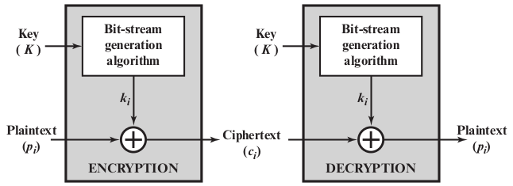
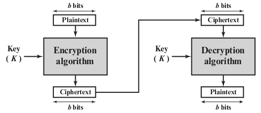
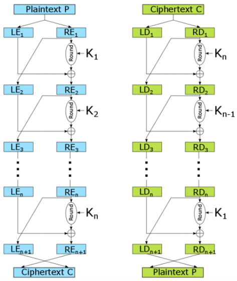
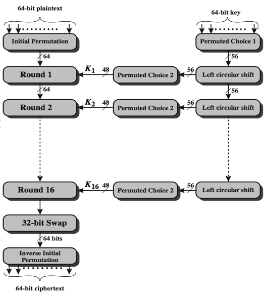
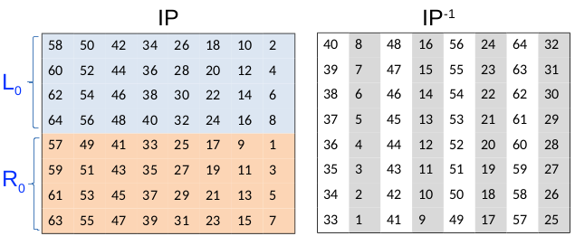
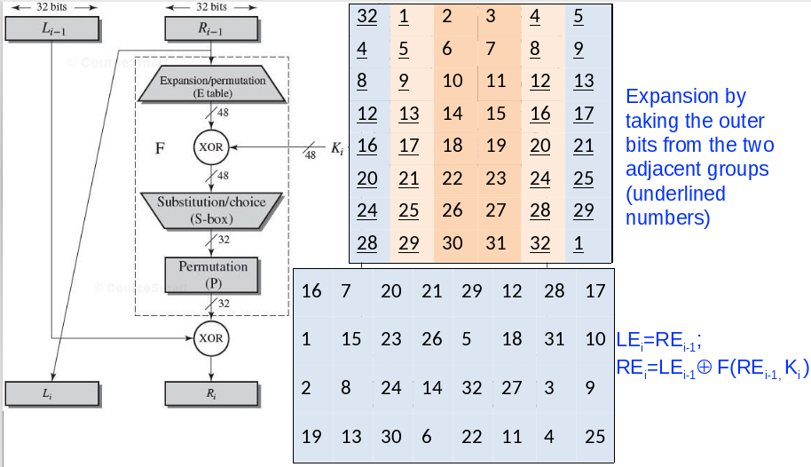
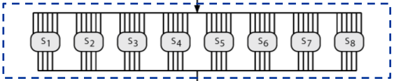
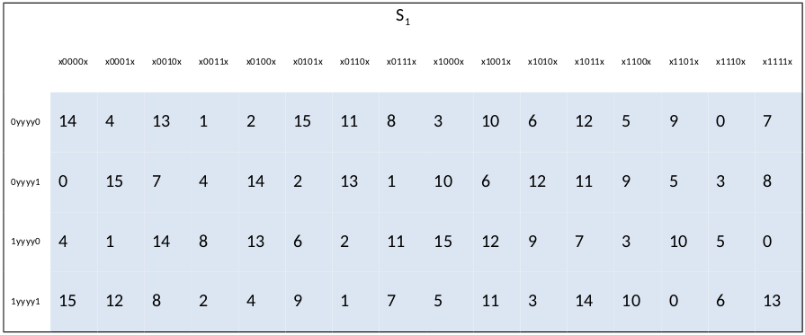
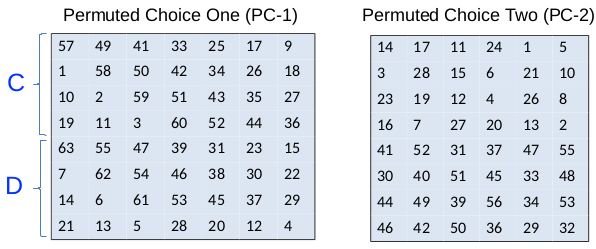

# 3.1 Ideal Block Cipher and Feistel Cipher Structure

Modern Symmetric Block Ciphers

- Provide confidentiality/authentication services
- Focus on data encryption standard (DES)

Block vs Stream Ciphers

- Stream ciphers: process messages a bit or byte at a time when en/decrypting. 

{width=65%}

- Block ciphers: process messages in blocks each of which is then en/decrypted. 

{width=65%} 

- Many current ciphers are block ciphers
    - Better analyzed
    - Broader range of applications

Most symmetric block ciphers are based on a Feistel Cipher Structure

Motivation for the Feistel cipher structure: 

- Block ciphers: 
    - n bits plaintext &rarr; n bits ciphertext
    - 2^n^ possible plaintext/ciphertext blocks
- Reversible (non-singular) transformation
    - Each unique plaintext block &rarr; a unique ciphertext block
    - 2^n^! Reversible transformation
- Feistel refers to an n-bit general substitution as an *ideal block cipher* 
    - It allows for the maximum number of possible encryption mappings from the plaintext to ciphertext block. 

## Problems of Ideal Block Cipher

The block size n must be very large to thwart attacks

- Statistical analysis of plaintext, due to small block size

Straightforward mapping are not practical from an implementation and performance point of view

- In general, key length = n2^n^ bits
- For a 64-bit block, key length = 64\*2^64^ = 2^70^  =10^21^ bits
- That a lot of needed bits

Poorly confined mapping (to a subset of 2^n^! reversible transformation) may be vulnerable to cryptanalysis. 

Example of confined mapping: 

- Mapping in terms of a set of linear equations 

> y~1~ = k~11~x~1~ + k~12~x~2~ + k~13~x~3~ + k~14~x~4~

> y~1~ = k~21~x~1~ + k~22~x~2~ + k~23~x~3~ + k~24~x~4~

> y~1~ = k~31~x~1~ + k~32~x~2~ + k~33~x~3~ + k~34~x~4~

> y~1~ = k~41~x~1~ + k~42~x~2~ + k~43~x~3~ + k~44~x~4~

- Key length = n^2^ (16 in this case) 
- This is vulnerable to cryptanalysis (This is essentially a hill cipher)

## Feistel Cipher

Feistel's observation: an approximation to the ideal block cipher system for large n, built up out of components that are easily realizable is needed.

Feistel Cipher idea:  

- Approximate the ideal block cipher using a product cipher
    - The execution of two or more simpler ciphers in sequence
    - The final result or product is cryptographically stronger than any of the component ciphers. 
- Essence of the approach 
    - Key lengths k bits, block length n bits, 2^k^ instead of 2^n^! transformation, k large for thwarting brute force attacks. 
    - Alternate substitutions and permutations (transpositions) to defend against cryptanalytic attacks
    - Practical application of the **Claude Shannon's proposal**

## Claude Shannon and Substitution-Permutation Ciphers

Claude Shannon idea: substitution-permutation (S-P) networks. S-P nets are based on the two primitive cryptographic operations:

1. Substitution (S-box)
2. Permutation (P-box)

Provide **confusion** and **diffusion** of message and key. Thwart cryptanalysis based on statistical analysis

### Confusion and Diffusion

Cipher needs to completely obscure statistical properties of original message

Combining S & P elements to obtain:

- Diffusion: make the statistical relationship between the plaintext and ciphertext as complex as possible 
    - Achieved by repeated permutation followed by a function (transposition, P-Box) 
    - Having each ciphertext digit be affected by many plaintext digits
- Confusion: make the statistical relationship between ciphertext and key as complex as possible
    - Achieved by complex substitution (S-Box

## Feistel Cipher Structure

Feistel Cipher: partition input block into two halves

- Process through multiple rounds which...
- Perform a substitution on left half data based on round function of right half & subkey
- Then have permutation swapping halves

{width=70%}

[comment]: # (Understand how feistel works)

\newpage

# 3.2 Data Encryption Standard (DES) 

DES Design Controversy

- Although DES standard is public, considerable controversy over design
    - Choice of 56-bit key (vs Lucifer 128-bit) 
    - Design criteria (S-boxes) were classified 

[comment]: # (Read DES article)

## DES Encryption Overview

{width=91.5%}

\newpage

Plaintext side: Three Phases

- Initial Permutation
- 16 Rounds
    - Each round: key dependent round function with S and P 
- Inverse Initial Permutation

Key function side: 

- PC-1: Gets rid of 8 bits ( 56 bits) 
- LCS: Cut key in half, perform bit shift(1 or 2 bit shift) on both half (independently) 
- PC-2: Gets rid of 8 bits ( 48 bits)

Size of input: 64

Effective key length: 56

### Initial Permutation and Inverse (IP)

IP (64 bits): split in half. 32 bits each. 

- The 1^st^ position in the plaintext (bit 1) is now placed in the 40^th^ position as per the IP table. 
- The inverse shows 40 bit = in the bit 1 position. 

\newpage

### Single Round Function

Consists of four steps:

1. Expansion (E table): take outer bits from two adjacent groups (Shown in figure 6)
    - This makes it so that the length of bits is now 48, allowing you to XOR with the key bits (also 48 bits)
2. XOR (KEY): simple XOR operation on all bits in from the E table and from the key
3. Substitution choice (S-Box): takes in 6 bits at a time and outputs given the s-box table 
    - changes back to 32 bits
4. Permutation (P table): Same concept as IP except use the 8x4 table in figure 6
5. XOR (LEFT RIGHT): Take the table from step 4 and XOR with the old left side. Then take the old right side and make that the new left side. 

Substitution/choice (eight S-boxes, each accepts 6 bits, outputs 4 bits) 

- Each S-box: 4 rows, from the 6 bit input, the last and first bit from input decides which row will be used. The middle 4 bits from input will determine the column

\newpage

### S-Boxes Example

\

Input: 011001

- 0xxxx1 = row 2
- x1100x = column 13

Each row of an S-box defines a general 4-bit reversible substitution (ideal block cipher)

- The only nonlinear part of DES

DES 32 total ideal block cipher mapping

### DES Key Schedule

The steps for key scheduling encryption is as follow:

1. Permuted Choice 1: use table to reorder bits and remove 8 of them
2. Left Circular Shift: more ciphering. One copy gets sends to permuted choice 2 for a round and the other goes to another left circular shift for the next key generation for the next round. 
3. Permuted Choice 2: use table to reorder bits and remove 8 more of them (create a 48 bit key for the round to use)

\
{width=80%}

PC-1: Every eighth bit is discarded (8,16,32,64,24,40,48,56)

PC-2: Eight more bits are discarded

### DES Decryption

Same as Feistel: DES decryption uses the **same algorithm** as encryption

Do encryption steps again using subkeys in reverse order. 

## Avalanche Effect

Avalanche effect: where a change of one input or key bit results in changing approximately half output bits. (DES exhibits strong avalanche)

## Strength of DES - Key Size

56 bits have 2^56^ values

## Strength of DES - Cryptanalytic

Utilize some deep characteristics of the cipher

- By gathering information about encryptions
- Can eventually recover some/all of the sub-key bits
- If necessary, exhaustive search the rest

Generally these are statistical attacks: 

- Differential cryptanalysis: observe pairs of text blocks evolving along each round
- Linear cryptanalysis: find linear approximation to the transformations
- Related key attacks: observe the operation of a cipher under several related keys

Theoretical estimation; brute-force is practical concern 

## Strength of DES - Timing Attacks

Attack actual implementation of a cipher 

Information about the key or the plaintext is obtained by observing how long it takes a given implementation to perform decryptions on various ciphertext.

- Specifically use fact that calculations can take varying times

## DES Design Criteria

[comment]: # (From research paper posted on canvas) 

7 criteria for S-boxes provided for

- Non-linearity
- Resistance to differential cryptanalysis
- Good confusion

3 criteria for permutation P provide for

- Increase diffusion

### 7 Criteria for S-Boxes

3 out of 7: 

1. No output bit of any S-box should be too close a linear function of the input bits. 
    - Specifically if we select any output bit and any subset of the six input bits
    - Fraction of inputs for which this output bit equals the XOR of these input bits should not be close to 0 or 1, but rather should be near 1 or 2
2. Each row of an S-box (determined by a fixed value of the leftmost and rightmost input bits) should include all 16 possible output bit combinations
3. If two inputs to an S-box differ in exactly one bit, the outputs must differ in at least two bits. 

### 3 Criteria for Permutation

2 out of 3:

1. The four output bits from each S-box at round i are distributed so that two of them affect (provide input for) "middle bits" of round (i+1) (next round) and the other two affect end bits. 
    - The two middle bits of input to an S-box are not shared with adjacent S-boxes. The end bits are the two left-hand bits and the two right-hand bits, which are shared with adjacent S-boxes
2. The four output bits form each S-box affect six different S-boxes on the next round, and no two affect the same S-box

### Block Cipher Design 

Number of rounds: more is better

- Average Brute force time takes 2^55^
- With DES 16 rounds it takes 2^55.1^ (Just beating brute force average)
- Make known cryptanalytic attack require greater effort than simple brute-force key search attacks (discourage them)

Round function f:

- Provide "confusion", nonlinear, avalanche, bit independence
- Has issues of how S-boxes are selected
- Strict avalanche criterion (SAC)
    - Any *output bit j* of an S-box should change with probability 1/2 when any single *input bit i* is inverted for all i,j. 
    - A similar criterion could be applied to F as a whole
- Bit independence criterion (BIC)
    - *Output bits j and k * should change independently when any single *input bit i* is inverted for all i, j, and k 
- S-Box (n x m) Design
    - Larger S-boxes are more resistant to cryptanalysis, but need larger lookup table and are more difficult to design properly 
    - n limited tp 8~10

Key schedule: 

- Complex subkey creation, key avalanche
- Use the main key to generate subkey for each round: 
    - Maximize the difficulty of deducing individual subkeys
    - Maximize the difficulty of working back to the main key
    - Guarantee key/ciphertext meet SAC and BIC

