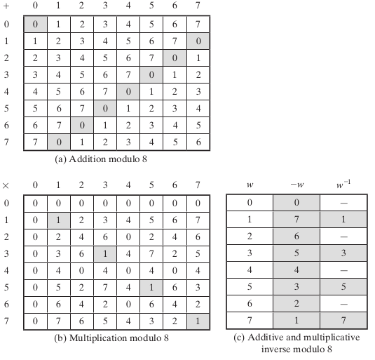
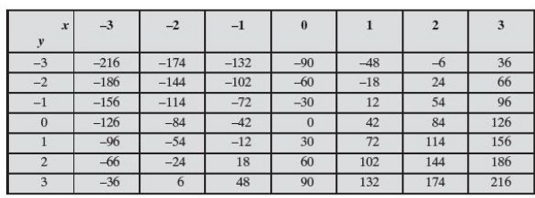
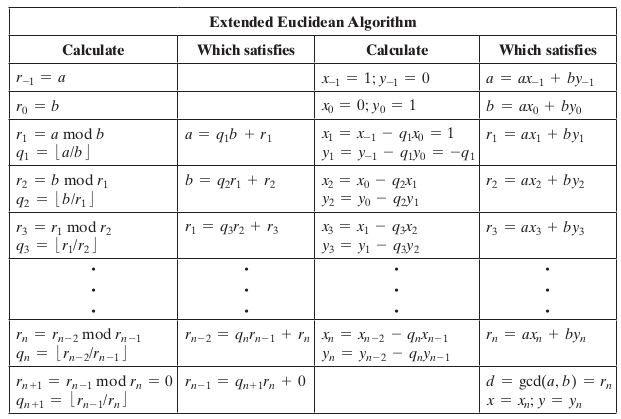
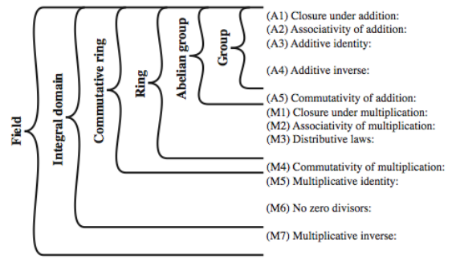
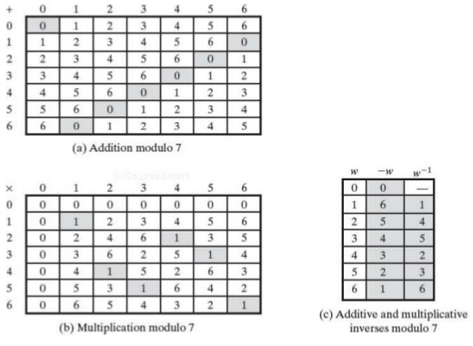

# 4.1 Modular Arithmetic and Extended Euclidean Algorithm

## Divisors

A non-zero number b divides a if for some m,

> *a* = *mb* (*a*, *b*, and *m* are integers)

- *b* divides into *a* with no remainder
- denoted as *a* | *b*
- *b* is a divisor of *a* 

### Properties of Divisibility

- If a|1, then a = $\pm$ 1
- If a|b and b|a, then a = $\pm$ b
- Any b != 0 divides by 0 
- If a|b and b|c, then a|c (transitive property)
    - Example: 11|66 and 66|198 &rarr; 11|198
- If b|g and b|h, then b|(mg + nh)
    - Example: 7|14 and 7|63 &rarr; (3 x 14 + 2 x 63)

### Integer Division Algorithm

Divide non-negative integer a (dividend) by positive integer n (divisor) get integer q (quotient) and integer r (remainder) such that:

> a = qn + r where 0 $\le$ r \< n; q = floor(a/n)

- Residue (r): is "a mod n" 
- q and r are unique

## Greatest Common Divisor (GCD)

GCD(a, b) of a and b is the largest integer that divides both a and b. 

- GCD(0,0) = 0, gcd(a,0) = |a|, for a != 0
- Relatively prime: no common factors (except 1)
    - GCD(a,b) equates to 1

## Euclidean Algorithm

GCD(|a|, |b|) = GCD(a,b) = GCD(b,a)

Pseudo Code: 

```
    Euclid(a,b)
        if (b=0) then return a;
        else return Euclid(b, a mod b)
```

\newpage

### Euclidean Algorithm Proof

Steps for proving algorithm:

1. No harm in assuming *a* $\ge$ *b* \> 0
    - gcd(|*a*|, |*b*|) = GCD(*a*,*b*) = GCD(*b*,*a*)
2. Dividing *a* by *b* and applying the division algorithm, we can state
    - *a* = *q~1~b* + *r~1~*
    - 0 $\le$ *r~1~* \< *b*
3. Case *r~1~* = 0 
    - b divides a and no larger number divides both b and a, because that number would be larger than b
    - Therefore, ***d* = GCD(*a*,*b*) = *b***
4. Case *r~1~* $\not$= 0 
    - Due to basic properties of divisibility: the relations *d*|*a* and *d*|*b* together imply that *d*|(*a*-*q~1~b*).
    - This is the same as ***d*|*r~1~***
5. What is GCD(*b*, *r~1~*)?
    - We know that *d*|*b* and *d*|*r~1~*
    - Take arbitrary *c* that divides both *b* and *r~1~*
    - Therefore, *c*|(*q~1~b* + *r~1~*) = *a*
    - Because *c* divides both *a* and *b*, we must have *c* $\le$ *d*, which is the greatest common divisor of *a* and *b*
    - Therefore ***d* = GCD(*b*,*r~1~*)**

[comment]: # (***)
    
## Modular Arithmetic

Modulo operator (a mod n): to be remainder when a is divided by n 

- positive integer n is called the modulus

a and b are **congruent modulo** n if: a mod n = b mod n 

### Modular Arithmetic Operation

(mod n) operator maps all integers into the set Z~n~ = {0,1,...,(n-1)}

- Z~n~ set of non-negative integers less than n

Modular arithmetic: arithmetic operations that stay within the confines of the set above

Properties:

1. \[(a mod n) + (b mod n)\] mod n = (a + b) mod n
2. \[(a mod n) - (b mod n)\] mod n = (a - b) mod n
3. \[(a mod n) x (b mod n)\] mod n = (a x b) mod n

\newpage

{width=70%}

Addition Table: 

- Matrix is symmetric about the main diagonal (highlighted gray) 
- Additive inverse exists for each integer in modular addition
    - Inverse is when (x+y) mod n = 0

Multiplication Table:

- Matrix is symmetric about the main diagonal (highlighted gray)
- Multiplicative inverse exists for each integer in modular multiplication
    - Inverse is when (x \* y) mod n = 1
    - Only odd numbers multiplied by itself will produce multiplicative inverse (relative primes)

### Residue Classes (mod n) 

(mod n) operator maps all integers into the set:

> Z~n~ = {0,1,...,(n-1)} &rarr; set of residues, or residue classes

Each integer in Z~n~ represents a residue class

Example: the residue classes for (mod 4) are:

- [0] = {...,-16,-12,-8,-4,0,4,8,12,16,...}
- [1] = {...,-15,-11,-7,-3,1,5,9,13,17,...}
- [2] = {...,-14,-10,-6,-2,2,6,10,14,18,...}
- [3] = {...,-13,-9,-5,-1,3,7,11,15,19,...}

Finding the smallest non-negative integer to which k is congruent modulo n is called **reducing k modulo n**

### Properties of Modular Arithmetic for Integers in Z~n~

Commutative Laws

> (w + x) mod n = (x + w) mod n

Associative Laws

> [(w + x) + y] mod n = [w + (x + y)] mod n

Distributive Law

> [w $\cdot$ (x + y)] mod n = [(w $\cdot$ x) + (w $\cdot$ y)] mod n

Identities

> (0 + w) mod n = w mod n 

Additive inverse (-w)

> For each w $\in$ Z~n~, there exists a z such that w + z = 0 mod n

### Modular Arithmetic Special Properties

If (a+b) (mod n) $\equiv$ (a+c) (mod n) then b (mod n) $\equiv$ c (mod n)

- Example: (5 + 23)(mod 8) $\equiv$ (5 + 7)(mod 8) &rarr; 23(mod 8) $\equiv$ 7(mod 8)
- Works due to the existence of additive inverse
    - To prove, add additive inverse (-a) to both side

If (a\*b) (mod n) $\equiv$ (a\*c) (mod n) then b (mod n) $\equiv$ c (mod n) if a is relatively prime to n

- Example: (5 \* 23)(mod 8) $\equiv$ (5 \* 7)(mod 8) &rarr; 23(mod 8) $\equiv$ 7(mod 8) 
- Works if multiplicative inverse exists for a mod n
- Normally, if an integer is relatively prime to n, then this integer has a multiplicative inverse in Z~n~

## Extended Euclidean Algorithm

Extended euclidean algorithm: calculates GCD **and** x & y (with opposite signs)

>> ax + by = d = gcd(a,b)

- Useful for later crypto computations (RSA)
- Follow sequence of divisions for GCD, but assume at each step i, can find x & y:

>> r = ax + by

- AT the end, find GCD value and also x & y

{width=60%}

- gcd(42,30) = 6 = 42\* **-2** + 30 \* **3**
- In general, for given integers a and b, the smallest positive value of ax + by is equal to gcd(a,b)

## Extended Euclidean Algorithm 



### Extended Euclidean Algorithm Proof

1. Can rearrange terms to write *r~i~* = *r~i-2~* - *r~i-1~ q~i~*
2. From rows i-1 and i-2 we get the two following values:
    - *r~i-1~* = *ax~i-1~* + *by~i-1~*
    - *r~i-2~* = *ax~i-2~* + *by~i-2~*
3. Substituting the two values from (2) into the equation in (1) we get the following:
    - *r~i~* = (*ax~i-1~* + *by~i-1~*) - (*ax~i-2~* + *by~i-2~*)
    - *r~i~* = a(*x~i-2~* - *q~i~ x~i-1~*) + b(*y~i-2~* - *q~i~ y~i-1~*) 
4. We already assumed *r~i~* = *ax~i~* + *by~i~* 
    - Therefore: 
        - *x~i~* = (*x~i-2~* - *q~i~ x~i-1~*) 
        - *y~i~* = (*y~i-2~* - *q~i~ y~i-1~*) 

[**\[LINK\]:** Euclidean algorithm/Extended Euclidean algorithm video^1^](https://www.youtube.com/watch?v=6KmhCKxFWOs)

For the video remember this:

- Underline number are the number you use
- For extended, treat underlined numbers as variables (x + 3x = 4x) 
- For extended, start at bottom of 2^nd^ row and work your way up 
- For extended, use the equals in 2^nd^ row as your substitution

\newpage

# 4.2 Finite Fields

## Group

Group G (denoted {G, $\cdot$}): is a set of elements with a *binary operation*, denoted by $\cdot$, that associates to each *ordered pair (a,b)* of elements in G making combined element (a $\cdot$ b). To be a group, the following axioms must be obeyed:

- (A1) closure: a and b belong to G, then a $\cdot$ b is in G
- (A2) associative: (a $\cdot$ b) $\cdot$ c = a $\cdot$ (b $\cdot$ c)
- (A3) has identity element e: e $\cdot$ a = a $\cdot$ e = a
- (A4) each a has an inverse element a^-1^: a $\cdot$ a^-1^ = a^-1^ $\cdot$ a = e
- (A5) commutative: a $\cdot$ b = b $\cdot$ a
    - If true than it forms **abelian group**
    - Example: integers under addition, real numbers under addition, nonzero real numbers under multiplication

A group could be finite or infinite

### Cyclic Group

Exponentiation: defined (within a group) as a repeated application of the group operator

- Example: a^3^ = a $\cdot$ a $\cdot$ a
- Let identity be: e = a^0^

A group is cyclic if *every element* of G is a power of a fixed element

- b = a^k^ for some a and every b in G
- Example: Integers under addition

**a** is said to be a **generator** of the group

A cyclic group is always abelian, may be finite or infinite

## Ring

{R,+,x}: a set of elements with two operations (addition and multiplication) which satisfies: 

- An abelian group with respect to addition (A1 ~ A5)
- (M1) closure under multiplication
- (M2) associative of multiplication
- (M3) distributive laws: 

A **commutative ring** is a ring that satisfies: 

- (M4) Commutativity of multiplication: ab=ba
- Z~n~ together with arithmetic operation modulo n

An **integral domain** is a commutative ring that satisfies: 

- (M5) Multiplicative identity "1" exists: such that 1a = a1 = a (Z~n~ ...) 
- (M6) No zero divisors: ab = 0 &rarr; either a is 0 or b is 0 (All even numbers are zero divisors, can't use)

\newpage

## Field

{F,+,x}: a set of elements with two operations (addition and multiplication) which satisfies: 

- Axioms A1 ~ A5 and M1 ~ M6
- (M7) Multiplicative inverse exists for each a (except 0). There is a^-1^ such that aa^-1^ = a^-1^a = 1

In essence, a field is a set in which we can do addition, subtraction, multiplication, and division without leaving the set. 

- Subtraction: a-b = a + (-b)
- Division: a/b = a(b^-1)
- Rational numbers, real numbers, integers(not)

{width=80%}

## Finite (Galois) Fields

Finite fields play a key role in cryptography. 

- The order (total number of elements) in a finite field must be a power of a prime: p^n^
- The finite field of order p^n^ is denoted as GF(p^n^)
    - GF stands for Galois Fields
    - Often use these field: GF(2^n^), GF(p)

### Galois Fields GF(p)

GF(P) is the set of integers {0,1,...,p-1} with

- The arithmetic operations modulo prime p
    - Z~p~ together with modulo p &rarr; commutative ring
- Multiplicative identity 1 exists (M5)
- p is prime, no zero divisors (M6)
- p is prime, multiplicative inverse exists for each w!= 0 (M7)

Thus, GF(p) a finite field: the arithmetic is *well-behaved* and can do addition, subtraction, multiplication, and division without leaving the field GF(p)

Example: 

> The simplest finite field is GF(2). Its arithmetic operations are summarized as: 

>> Addition: (0 + 0 = 0), (0 + 1 = 1), (1 + 0 = 1), (1 + 1 = 0)

>> Multiplication: (0 x 0 = 0), (0 x 1 = 0), (1 x 0 = 0), (1 x 1 = 1)

>> Inverse: (0(-0) = 0), (0(0^-1^) = -), (1(-1) = 0), (1(1^-1^) = 1)

> Addition is equivalent to XOR operation, multiplication is equivalent to AND operation (THIS IS ONLY APPLICABLE TO THIS GF(@) CASE)

{width=70%}

[**\[LINK\]: **Here is a useful link to understanding Galois Fields^2^](https://crypto.stackexchange.com/questions/2700/galois-fields-in-cryptography)
 
### Calculate Multiplicative Inverse of an Element in GF(P)

Using extended euclidean algorithm::

- a**x** + b**y** = d = gcd(a,b)
- If a is prime and b < a, then ax + by = 1 = gcd(a,b) 

>> [(ax mod a) + (by mod a)] = 1 mod a

>> by mod a = 1

>> Thus b^-1^ = y

Example (calculate multiplicative inverse of 550 in GF(1759):

> 1759x + 550y = 1 = gcd(1759,550)

> this yields y = 355

> thus 550^-1^ = 355

## Polynomial Arithmetic

This knowledge is used to calculate finite fields in the form of GF(p^n^)

A polynomial of degree n (integer n>= 0): f(x) = a~n~x^n^ + a~n-1~x^n-1^ + ... + a~1~x + a~0~ = $\Sigma$ a~i~x^i^

- a~i~ are elements of a set S, called **coefficient set** (integers for us)
- abstract algebra, not interested in the value of x

Three classes of polynomial arithmetic 

1. Ordinary polynomial arithmetic
2. Polynomial arithmetic with coefficients mod p (Ex. GF(p))
3. Polynomial arithmetic with coefficients mod p (Ex. GF(p)), and polynomials modulo a polynomial m(x). 

Objective: defined fields of order p^n^ (GF(p^n^))

### Ordinary Polynomial Arithmetic

- Add or subtract corresponding coefficients
- Multiply all terms by each other

Example:

> let f(x) = x^3^ + x^26 + 2 and g(x) = x^2^ - x + 1

> f(x) + g(x) = x^3^ + 2x^2^ - x + 3

### Polynomial Arithmetic with Coefficients in a Finite Field

- Coefficients are elements of some finite field F
    - Thus, polynomial division is possible
- Can write any polynomial in the form:
    - f(x) = q(x) g(x) + r(x); r(x) = f(x) mod g(x)
    - Can interpret r(x) as being a remainder
- If there is no remainder, say g(x) divides f(x)
- If f(x) has no divisors other than itself & 1, say it is an **irreducible** (or prime) polynomial)

### Polynomial Arithmetic with Coefficients in Z~p~

- All coefficients are 0 or 1
- Addition is equivalent to XOR operation
- Subtraction and addition are equivalent
- Multiplication is equivalent to logical AND
- Example of a reducible g(x) over GF(2)
    - f(x) = x^4^ + 1 = (x+1)(x^3^+x^2^+x+1)

[comment]: # (An irreducible or prime fx over GF2)

#### Polynomial GCD

Can find greatest common divisor for polynomials

- c(x) = GCD(a(x),b(x)) if c(x) is the polynomial of greatest degree which divides both a(x) and b(x) 

Can adapt Euclid's algorithm to find it:

```
    Euclid(a(x), b(x))
        if (b(x) = 0
            return a(x)
        else
            return Euclid(b(x), a(x) mod b(x0));
```

## Finite Fields of the Form GF(2^n^)

The order of a finite field must be of the form p^n^

- GF(p) is a finite field
- n > 1, operations **mod p^n^** do not produce a field
- For convenience and implementation efficiency: expect to work with integers in range 0 to 2^n^-1
- Finite fields of the form GF(2^n^) are good because they map uniformly versus Z~8~

Elements in the form GF(2^n^) are represented as polynomials

- Example GF(2^3^): a~2~x^2^ + a~1~x + a~0~ 
    - There are 8 possible combinations of a~2~, a~1~, and a~0~

## Modular Polynomial Arithmetic 

Polynomial arithmetic is used to construct the field GF(2^n^)

Consider the set S of all polynomials of degree n-1 or less over the field Z~p~ 

> f(x) = a~n-1~x^n-1^ + a~n-2~x^n-2^ + ... + a~1~x + a~0~ = $\Sigma$ a~i~x^i^

Where each a~i~ takes on a value in set the set {0,1,...,p-1}

There are a total of p^n^ different polynomials in S

- Example p = 2, n = 3

>> 0, 1, x, x + 1, x^2^, x^2^ + 1, x^2^ + x, x^2^ + x + 1

**Arithmetic**:

- Addition and subtraction: normal polynomial addition/subtraction with mod 2 on coefficients (Acts like XOR)
    - Given GF(X), the mod should be X
    - Addition and Subtraction are the same 
- Multiplication: do normal polynomial multiplication, but then you need to reduce so that the answer is within the Galois field. 
    - Need to mod by a irreducible polynomial (acts like a prime) (cannot factor them)
    - Keep the remainder
- Inversion: 
    - Use euclidean algorithm to find when d = 1

[**\[LINK\]:** Good video of this whole entire lecture lol^3^](https://www.youtube.com/watch?v=x1v2tX4_dkQ)
 
\newpage

# Links

1. https://www.youtube.com/watch?v=6KmhCKxFWOs
2. https://crypto.stackexchange.com/questions/2700/galois-fields-in-cryptography
3. https://www.youtube.com/watch?v=x1v2tX4_dkQ  
