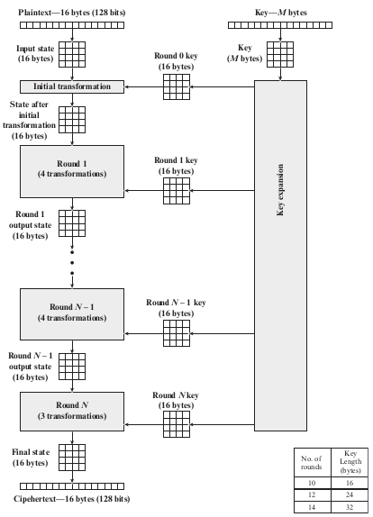
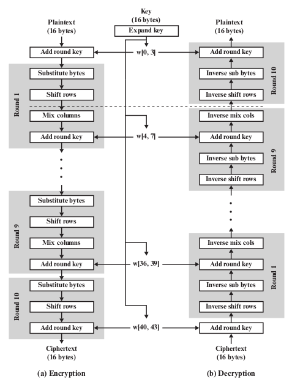
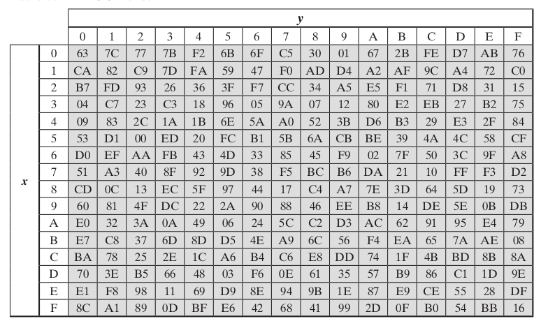
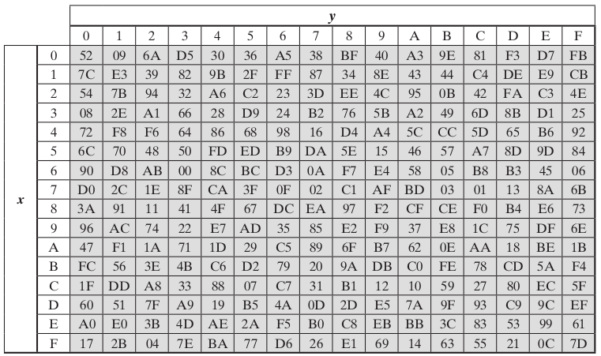
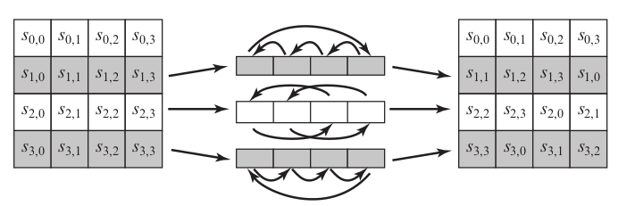
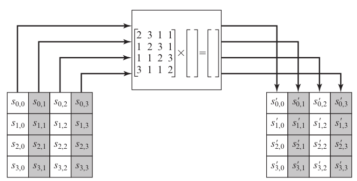
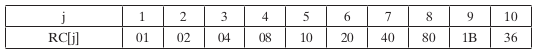

# 5.1 Advanced Encryption Standard (AES)

AES Main points

- Key length: 128^256^
- Average bit key sizes: 128, 192, 256
- Block size: 128 bits (16 bytes)

An iterative cipher (not like Feistel)

- Processes data as a block of 4 columns of 4 bytes
- Operates on **entire data block** (not half and half) in every round

All operations are performed on 8-bit bytes

- The arithmetic operations are performed over the finite field GF(2^8^), with irreducible polynomial m(x) = x^8^ + x^4^ + x^3^ + x + 1 (first of the 30 degree-8 reducible polynomials)

Designed to be:

- Resistant against known attacks
- Speed and code compactness on many CPUs
- Design simplicity

Additional notes of AES features: 

- Four different stages are used, one permutation and three of substitution:
    1. Substitute bytes: Uses an S-box to perform a byte-by-byte substitution of the block
    2. Shift rows: Simple permutation
    3. Mix columns: A substitution that makes use of arithmetic over GF(2^8^)
    4. Add round key: A simple bitwise XOR of the current block with a portion of the expanded key. 
- Both encryption and decryption begin with an *AddRoundKey* followed by nine rounds. Each round includes the four different stages as mentioned above. The tenth round has 3 stages (No mix column). 
- Only the *AddRoundKey* stage makes use of the key (This is why the cipher begins and ends with this stage)
- The *AddRoundKey* is like a Vernam Cipher, pretty shit. However with the other three rounds they provide confusion, diffusion, and nonlinearity. 
- The last round for both encryption and decryption ends with 3 stages. 
- Decryption is done by going through all the rounds with the following order:
    - Inverse shift row
    - Inverse sub bytes
    - Add round key
    - Inverse mix columns
- To achieve decrypting the *AddRoundKey* all you have to do is XOR it again. 
    - (A $\oplus$ B) is the *AddRoundKey* for encryption
    - (A $\oplus$ B $\oplus$ B = A) this is the *AddRoundKey* for decryption (gives you the original value)

\newpage

{width=73%}

- 128 Bit key length: expanded into 44 32-bit words
- Number of rounds relates to key length
- The byte ordering is by column for both the data and key

\newpage

{width=77%}

- One S-box is used on every byte-by-byte substitution 
- Encryption and decryption process are not identical
- Key is expanded into array of 32-bit words; four words form a round key in each round

\newpage

## Substitute Bytes

Substitute bytes: use a S-box table and substitute each byte using the rows and columns of the S-Box table.

- S-box is 16x16
- Each byte of a state is replaced by byte indexed by row (left 4 bits) and column (right 4 bits)

{width=75%}

{width=75%} 

Example:

> Given a byte is 95, the resulting substitution using S-box would result in 2A (row 9 column 5)

\newpage

### Constructing S-Boxes

Consider the byte input $\in$ GF(2^8^) and computes its inverse. 

- A = byte input 11000010 as polynomial 
- B' = inverse of A
- A \* B' = 1 mod (irreducible polynomial for AES)
- With B' multiply it with the affine mapping to produce the S-box

[**\[LINK\]**: Video on constructing sbox](https://youtu.be/NHuibtoL_qk?t=4065)

## Shift Rows

Circular byte shifts for each row:

- 1^st^ row: unchanged
- 2^nd^ row: 1 byte circular shift to left
- 3^rd^ row: 2 byte circular shift to left
- 4^th^ row: 3 byte circular shift to left

Decryption uses right shifts

Since state is processed by columns, this step permutes bytes between columns

{width=75%}

## Mix Columns 

Mix columns:

- Do the 4 byte columns one at a time (columns processed independently)
- Multiply it by the **special constant matrix**
- How to multiply???
    - Each byte is 8 bits
    - The output is a vector of size 4
    - Example of output~0~ = 02 \* Col~11~ + 03 \* Col~12~ + 01 \* Col~13~ + 01 \* Col~14~
    - For each of the (constant matrix) \* (column) these are both 8 bits
    - Need to do polynomial multiplication and addition in the Galois field for all these bytes

\newpage

{width=85%}

- Coefficients based on linear code with maximal distance between code words
- Shift row plus mix columns (all output bits depend on all input bits after a few rounds

## Add Round Key

Operation is just XOR. 

Design criteria

- fast on wide range of CPUs
- Diffusion of key bits into round keys
- Enough nonlinearity to prohibit determination of round key differences from cipher key differences

## AES Key Expansion

1. Start with a cipher key (16 byte). This is given to us.
2. Generate the first round key that will be used by one of the rounds in the AES
    - First Column First Round Key
        a. Take 4^th^ column from cipher key (Rot Word)
        b. Move the 1^st^ byte in that column and move it to the bottom of the column
        c. Now perform the S-box substitution on this column
        d. XOR with Column 1 of cipher key and RCon of your current round 
    - Second Column First Round
        - XOR column 2 in cipher key with First column First Round key
    - Third Column First Round
        - XOR column 3 in cipher key with Second column First Round key
    - Fourth Column First Round
        - XOR column 4 in cipher key with Third column First Round key
3. Generate the rest of the round key
    - Basically the same algorithm except use the previous round key as your new "cipher key"

{width=85%}

### Key Expansion Rationale

Designed to resist known attacks. Design criteria includes:

- Knowing part of key is insufficient to find more key bits
- An invertible transformation with Nk consecutive words of expanded keys
- Fast on wide range of CPUs
- Use round constants to eliminate symmetries
- Diffusion of key bits
- Enough non-linearity to prohibit determination of round key differences from cipher key differences
- Simplicity of description

[**\[LINK\]:** great animation of how key expansion works^1^](https://www.youtube.com/watch?v=gP4PqVGudtg)

## Decryption and Implementation Aspects

- AES decryption is not identical to encryption as their sequence of transformations are different
    - Need separate implementation modules
    - Some cipher modes of operation and MAC only uses encryption
- Can be efficiently implemented on 8-bit CPU
- Can be efficiently implemented on 32-bit CPU
   
\newpage

# Links

1. https://www.youtube.com/watch?v=gP4PqVGudtg
