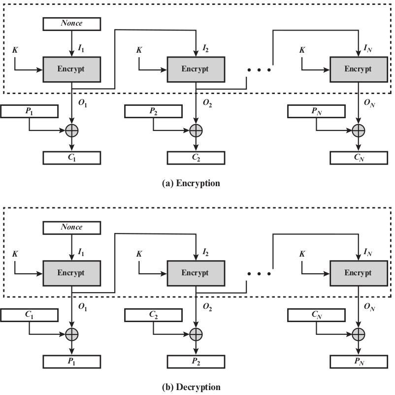

# 6.1 Block Cipher Operation

Multiple Encryption and DES

- AES was a replacement for DES
- Prior to AES, people used multiple encryption with DES implementations (**triple-des**)

## Double-DES

Idea: Use 2 DES encrypts on each block

- C = E(K~2~, E(K~1~,P)) &nbsp; &nbsp; &nbsp; P = D(K~1~, D(K~2~,C))
- Key-length 122 (dramatic increase in cryptographic strength)
- Block size does not change

Intuition of cryptographic strength

- Ideal block cipher: (2^64^)! reversible mappings
- DES each different key: 2^56^ reversible mappings
- Double-DES with different keys will produce one of the many mappings that are not defined by a single application of DES

Proof of cryptographic strength (CAMP92)

- DES is not a group: E(K~2~, E(K~1~,P)) != E(K~3~,P)
- Encrypting once and then another time is not equivalent to encrypting with a single key

This shows better brute force security, but what about cryptanalytic attacks?

### Meet-in-the-Middle Attack

This attack works against any block encryption cipher

- Whenever a cipher is used twice, with known plaintext capability
- If E(K~2~, E(K~1~,P)) then X = E(K~1~,P) = D(K~2~,C)

Example of meet-in-the-middle against double-DES:

- Given: known plaintext-ciphertext pair (P~1~, C~1~)
- Encrypt P~1~ with all 2^56^ values of K~1~ and store X~1~ in a table
- Decrypt C~1~ with all 2^56^ values of K~2~ and match X~1~ in table when each decryption is produced
    - If a match occurs, test the matching (K~1~, K~2~) against a new pair (P~2~,C~2~)
    - If the test passes, accept (K~1~, K~2~)
- False alarms: 
    - Each of the following number is the number of ciphertext possibilities
    - 2^112^/2^64^ = 2^48^ (number of ciphertext possibilities that are able to be generated with the given size of plaintext and key)
    - 2^48^/2^64^ = 2^-16^ (false alarm rate decrease by this number given an extra 64 bit of known plaintext and ciphertext pair)
- An effort on the order of 2^56^, not much more than single DES (2^55^)

Exhaustive Search (Brute Force): O(2^112^)

Meet-In-The-Middle: O(2^56^)

\newpage
 
## Triple-DES with Two keys

Two-DES is butt because of meet-in-the-middle attack, need to use **Three Encryptions**

- Raises the cost of meet-in-the-middle attack to 2^112^
- Would seem to *need* 3 distinct keys (FALSE THO)

Triple-DES only requires two keys (can use three keys) with E-D-E sequence

- C = E(K~1~, D(K~2~, E(K~1~,P))); P = D(K~1~, E(K~2~, D(K~1~,C))); 
- 2^nd^ stage uses decryption: compatible with single DES

This is a standardized cryptographic algorithm

There are currently no known practical attacks (several proposed impractical attacks might become the basis of future attacks however) 

## Triple-DES with Three Keys

Triple-DES using three keys: 

- C = E(K~3~, D(K~2~, E(K~1~,P))); P = D(K~1~, E(K~2~, D(K~3~, C))); 
- If K~1~ = K~2~ or K~2~ = K~3~, this is comparable to a single DES
    - The reason is due to an attack that exist on triple-DES with three keys

As of now triple-DES using two keys is good, but some have concerns that three keys is necessary for better security

&nbsp;

&nbsp;

## Modes of Operation

Block ciphers encrypt fixed size blocks

- Example: DES encrypts 64-bit blocks with 56-bit key

Encrypt arbitrary amounts of data with same key leads to many security issues

NIST SP defines **5 Modes of Operations** 

1. Electronic Codebook
2. Cipher Blocking Chaining
3. Cipher Feedback
4. Output Feedback
5. Counter

- 1 and 2 are block ciphers
- 3, 4, and 5 are converted into stream ciphers

Advantages of 5 modes of operations

- Covers a wide variety of application
- Can be used with any block cipher
    
\newpage

## 1 Electronic Codebook (ECB)

Electronic codebook: plaintext is handled one block at a time and each block of plaintext is encrypted using the same key. 

- C~i~ = E(K,P~i~) &nbsp; &nbsp; &nbsp; P~i~ = D(K,C~i~)
- Called codebook because, for a given key, there is a unique ciphertext for every b-bit block of plaintext
- Good for encrypting a short amount of data

Advantages and Limitations of ECB

- For lengthy messages, repetitions may be shown in ciphertext
    - If aligned with message block
    - Particularly with data such as graphics/images
    - Or with messages that change very little
- Weakness is due to the encrypted message blocks being independent

\newpage

## 2 Cipher Block Chaining (CBC)

Cipher block chaining: Technique in which the same plaintext block, if repeated, produces different ciphertext blocks.

- Each previous ciphertext block is **chained** with the current plaintext block
- C~i~ = E(K,[C~i-1~ $\oplus$ P~i~])
- P~i~ = D(K, C~i~) $\oplus$ C~i-1~)
- Use **Initialization Vector** to start the process
- Good for bulk data encryption/authentication

Advantages and limitations:

- A ciphertext block depends on all blocks before it
- Any change to a block affects all following ciphertext blocks
- Need initialization vector (IV)
    - IV should be known to sender & receiver
    - IV must be unpredictable to attackers
        - Generated by encrypting a **nonce**
        - **nonce**: is time-varying value that has at most a negligible chance of repeating (Ex. a random value that is generated anew for each use, a timestamp, a sequence number, or some combination of these)
    - IV should be sent encrypted (Ex. Using ECB mode, before rest of message) 

{width=85%}

## Message Padding

At the end of the message, the mode should be able to handle a partial block (blocks won't always perfectly end)

- This block is not as large as the block size of the cipher
- Pad either with known non-data value (nulls)
- Or pad last block along with count of pad size
- May require an extra entire block over those in message

## Stream Modes of Operation

Block Modes: encrypts the entire block

- This doesn't handle smaller units well (Example: real time data)

Stream Modes: 

- No need to pad a message
- Only encryption function is needed
- Each unit is encrypted and transmitted immediately

## Block vs Stream Ciphers

{width=69%}

- Stream cipher: process messages a bit or byte at a time when en/decrypting
- Block cipher: process messages in blocks, each of which is then en/decrypting

## 3 Cipher Feedback Mode (CFB)

Cipher feedback mode: plaintext unit is XOR to the output of the encryption function. 

- Can choose size of bit (s bits)
- Ciphertext unit is fed back to the next stage
- b-bit shift register is initialized with IV
- C~i~ = P~i~ $\oplus$ MSB~s~(E(K,IV~i~)
- P~i~ = C~i~ $\oplus$ MSB~s~(E(K,IV~i~)
- MSB~s~X = the most significant s bits of X
- No padding is needed

Advantages and Limitations of CFB

- Appropriate when data arrives in bits/bytes
- Most common stream mode
- Only the block cipher encryption function is used at both ends of communication
- Bit errors in transmission will propagate: one bit error occurs in one transmitted cipher propagate until it won't cause additional corruptions
- Can be view as a stream cipher, but not strictly
    - Keystream of CFB depends on plaintext/ciphertext bits

{width=75%}

## 4 Output Feedback (OFB)

Output feedback: similar to CFB. The output of the encryption function is fed back to become the input for encrypting the next block of plaintext. 

- The output of the XOR unit is fed back to become input for encrypting the next block. 
- Operates on full blocks of plaintext and ciphertext (CFB operates on s-bit subsets)
- Output of the encryption function is the **feedback**
- **Feedback** is independent of plaintext and ciphertext
- C~i~ = P~i~ $\oplus$ E(K, [C~i-1~ $\oplus$ P~i-1~])
- P~i~ = C~i~ $\oplus$ E(K, [C~i-1~ $\oplus$ P~i-1~])
- No padding is needed

Advantages and Limitations of OFB

- IV must be a nonce
    - Because output feedback is independent of plaintext
    - A given key and IV generate some output feedback (keysteam)
    - If ever reused, attackers can recover outputs
- Bit errors in transmission don't propagate
- More vulnerable to message stream modification
    - One bit change in ciphertext can cause the corresponding bit change in the recovered plaintext
- Has the structure of a typical stream cipher, but operates on a full block at a time

{width=75%}

## 5 Counter (CTR)
Counter: use a counter to encrypt with 
- Counter is equal to the plaintext block size
- Counter is different for each plaintext block that is encrypted
- Usually the counter is initialized to some value and then incremented by 1 for each subsequent block
- There is no chaining
- C~i~ = P~i~ $\oplus$ E(K, T~i~)
- P~i~ = C~i~ $\oplus$ E(K, T~i~)
- The initial counter must be a nonce (same as OFB)
- No padding is needed

Advantages and Limitations of CTR

- Efficiency
    - Can do parallel encryptions in h/w or s/w because of no chaining
    - Can preprocess (generate keystream) in advance of need
    - Good for bursty high speed links
- Random access (individually process the i^th^ block)
- Provable security (good as other modes)
- Must ensure to never reuse key/counter values, otherwise could break (same as OFB)

{width=85%}

\newpage

## Feedback Characteristics

{width=85%}

Except for ECB, all other four modes of operations involve feedback

Encryption function: input register &rarr; output register

Output register in OFB and CTR is independent of both plaintext and ciphertext

\newpage

## XTS-AES Mode

New mode, for encryption data stored in sector-based storage devices

Requirements for encrypting stored data are different from those for encrypting transmitted data

- Fix-sized unit, each unit preprocessed separately, same plaintext encrypted to different ciphertexts at different location
- Transparent encryption without data layout modification

Uses AES twice for each 16-byte block; also use GF(2^128^)

Each sector may have multiple blocks; each block treated independently except for the last one (ciphertext-stealing)
