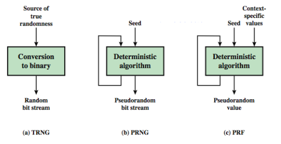
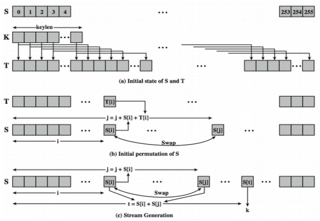

# 7.1 Pseudorandom Number Generation and Stream Ciphers

Random numbers

- Many uses of random numbers in cryptography
    - Nonces
    - Keys in ciphers
- Two requirements for a sequence of random numbers 
    - Randomness:
        - Uniform distribution: occurence of 1/0 bits in the sequence (easily proven)
        - Independence: no one subsequence can be inferred form the others (verified through test)
    - Unpredictability
        - "true" random number sequence can meet this requirement
        - care must be taken for algorithm-generated random numbers

## Pseudorandom Number Generators (PRNGs) 

Often use deterministic algorithmic techniques to create "random numbers" 

- Not truly random
- Can pass many reasonable tests of "randomness"

## True VS Pseudo Random

True random number generator (TRNG): Source is effectively random (entropy source)

Pseudorandom number generator (PRNG): Open-ended bit stream (contains feedback loop)

Pseudorandom function (PRF): Bits of some fixed length (used as nonces) 



## PRNG Requirements

General requirement: an adversary who does not know the **seed** is unable to determine the pseudorandom numbers

Specific requirement:

- Randomness
- Unpredictability
- Seed requirements

### Specific Requirements for Randomness and Unpredictability

Randomness: use a sequence of tests and consider...

- Uniformity: at any point, there should be approximately 1/2 1 bits and 1/2 0 bits
- Scalability: any test applicable to a sequence and any subsequence
- Consistency: the behaviour of a generator consistent across seeds

Unpredictability:

- Forward unpredictability: the next bit in the sequence should be unpredictable given any knowledge of previous bits
- Backward unpredictability: it should also not be feasible to determine the seed from knowledge of any generated values

15 separate tests are defined (NIST) for both requirements

### Specific Requirements for Seed

The seed must be secure, random, and unpredictable

- Typically generated by TRNG

Why not always use TRNG?

- Not practical to share long sequence of random numbers
- TRNG may produce a binary string with bias; not even good for PRF applications
- TRNG might be too slow

## PRNG Algorithms

Purpose-built algorithms

- Linear congruential generator
- Blum Blum Shub (BBS) generator
- RC4 (for stream cipher)

Algorithms based on existing cryptographic algorithms, which essentially need to randomize input

- Based on symmetric block ciphers
- Based on asymmetric ciphers (CH 10)
- Based on hash functions and MACs (chapter 12) 

\newpage

### Linear Congruential Generator

Common iterative technique using: 

> X~n+1~ = (aX~n~ + c) mod m

Given suitable values of parameter (a, c, m) it can produce a long random-like sequence of integers

- Generates a full-period (with all the m numbers
- The generated sequence should appear random

Typically m is a large prime, a is well chosen, c is zero

> Example: X~n+1~ = (7^5^X~n~ + 0) mod (2^31^ - 1)

Random-like, but algorithm is not true random at all, except from X~0~

- Given three parameters and one number, determine the rest
- Given four consecutive values, determine the parameters

Can make it possibly harder (use system clock to restart)

### Blum Blum Shub Generator

Uses least significant bit from iterative equation:

- X~0~ = s^2^ mod n (s is a seed relatively prime to n)
- X~i~ = X~i-1~^2^ mod n

>> B~i~ = X~i~ mod 2

>> B~i~ is output

- Where n = p \* q, and primes p $\equiv$ q $\equiv$ 3 mod 4

BBS:

- The sequence is unpredictable
- Security rests on difficulty of factoring N to two primes
- Slow, since large numbers must be used
- Too slow for stream cipher use, good for key generation

## Using Block Ciphers as PRNGS

A block cipher is a good candidate for building a PRNG

- Randomness of ciphertext, deployment

Two standardized approaches using block ciphers modes of operations 

- CTR

>> X~i~ = E[K, V~i~]

- OFB

>> X~i~ = E[K, X~i-1~]

\newpage

## Stream Cipher

Have a pseudorandom keystream 

XOR with plaintext bit stream: C~i~ = M~i~ XOR StreamKey~i~

Randomness of stream key destroys statistical properties in a message

Similar to one-time pad

- One time pad uses TRNG, stream cipher uses PRNG

CANNOT REUSE STREAM KEY

### Stream Cipher Properties

Some design considerations are: 

- Long period with no repetitions
- Statistically random
- Depends on large enough key or seed

Properly designed, can be as secure as a block cipher with same size key

- But usually simpler and faster
- Good for streams of data

## RC4

RC4: variable key size, byte oriented stream cipher

- Creates a random permutation of all 8-bit values
- Uses the permutation to scramble input byte
- Processed a byte at a time

{width=75%}

- Variable key length (keylen) from 1 to 256 bytes
- A 256-byte state array S of numbers: 0..255
- Anytime, S contains a permutation of all 8-bit numbers 

Initialization of S and T

```
    for i = 0 to 255 do:
        S[i] = i
        T[i] = K[i mod keylen]
```

Initialization permutation of S

```
    j = 0
    for i = 0 to 255 do
        j = (j + S[i] + T[i]) (mod 256)
        swap(S[i]. S[j])
```

### RC4 Encryption (Stream Generation)

Encryption continues shuffling values in array S

- Sum of shuffled pair selects "stream key" value S[t] from permutation
- XOR S[t] with next byte of message to en/decrypt

```
    i = j = 0 
    for each message byte Mi
        i = (i + 1) (mod 256) 
        j = (j + S[i]) (mod 256) 
        swap(S[i], S[j]) 
        t = (S[i] + S[j]) (mod 256) 
        Ci = Mi XOR S[t]
```

### RC4 Security

Security: 

- Claimed to be secured against known attacks
- Have some analyses, none practical
- Results is very nonlinear 
- Is a stream cipher, must never reuse a key
- Have a concern with WEP 
    - The problem is not with RC4 itself
    - But the way keys are generated for use as input to RC4
- Other weaknesses, especially bias in initial key streams bytes

## True Random Number Generators (TRNG) 

Uses nondeterministic source to produce randomness

Unpredictable natural randomness in real world

Find a regular random event and monitor, generally need special h/w to do this: 

- Example: radio noise, thermal noise, leaky capacitors

RFC 4086: Thermal noise from sound/vide or disk drives (fluctuating speed)

### Skew in TRNGs

Output is biased in some way (having more 1s than 0s) 

Eliminate bias (deskewing algorithms)

- Passing bits through a hash function
- Use a few noisiest bits from each sample
- RFC4086 recommends using multiples sources + hash

Linux uses four entropy sources and SHA-1

- Mouse activity
- Keyboard activity
- Disk I/O operations
- Specific Interrupts
