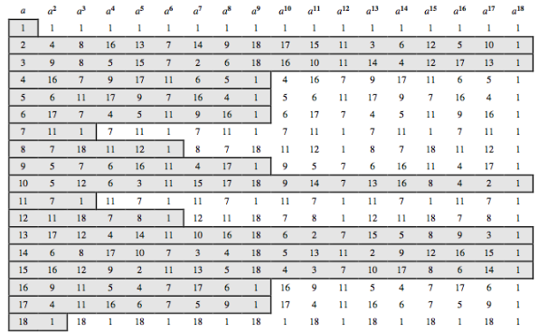
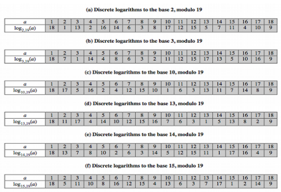

# 8.1 More Number Theory

Number theory: branch of pure mathematics concerned with properties of numbers in general, and integers in particular

Concepts from number theory are essential to public-key cryptographic algorithms

- Fermat's theorem
- Euler's theorem
- Discrete logarithms

## Prime Factorization

To factor a number n is to write it as a product of other numbers

> n = a $\times$ b $\times$ c

- Note: factoring a number is relatively hard compared to multiplying the factor together to generate the number

The **prime factorization** of a number n is when it's written s a product of primes

Any integer a > 1 can be factored uniquely as:

> a = $\displaystyle\prod_{p \in \text{p}}$p^a~p~^ = $\text{p}_{1}^{a_{1}} \times \text{p}_{2}^{a_{2}} \times \text{...} \times \text{p}_{t}^{a_{t}}$

- p~1~ < p~2~ < ... < p~t~ are prime numbers 
- a~i~ is a positive integer

Integer multiplication:

- Given: 
    - a = $\displaystyle\prod_{p \in \text{p}}$p^a~p~^
    - b =  $\displaystyle\prod_{p \in \text{p}}$p^b~p~^ 
- k = ab
- k can be expressed as the product of powers of primes: 
    - k =  $\displaystyle\prod_{p \in \text{p}}$p^k~p~^
    - k~p~ = a~p~ + b~p~ for all p $\in$ P

## Relatively Prime Numbers & GCD

Relatively Prime: two numbers a, b are **relatively prime** if they have no common divisors apart from 1. 

If a divides b then: 

- Given: a = $\displaystyle\prod_{p \in \text{p}}$p^a~p~^,  b =  $\displaystyle\prod_{p \in \text{p}}$p^b~p~^ 
- Then: a~p~ $\le$ b~p~ for all p

Determining the GCD of two numbers

- If k = GCD(a,b), then k~p~ = min(a~p~, b~p~) for all p 
- Not practical for large numbers due to difficulty of factoring
- Example: 
    - 300 = 2^1^ $\times$ 3^1^ $\times$ 5^2^
    - 18 = 2^1^ $\times$ 3^2^ 
    - GCD(18,300) =  2^1^ $\times$ 3^1^ $\times$ 5^0^ = 6

\newpage

## Fermat's Theorem

Fermat's theorem: If p is prime and a is a positive integer not divisible by p, then

- **a^p-1^ $\equiv$ 1 (mod p)**
- Requires that a be relatively prime to p 

Alternative form

- **a^p^ $\equiv$ a (mod p)**
- a doesn't have to be relatively prime to p (a can be divisible by p)

### Fermat's Theorem Proof (Assume Basic True, Formulate Alternative)

1. Assume a^p-1^ $\equiv$ 1 (mod p)
2. From (1) can write: a^p^ $\cdot$ a^-1^ $\equiv$ 1 (mod p)
3. Multiple a^1^ on both sides

> **a^1^** $\cdot$ a^p^ $\cdot$ a^-1^ $\equiv$ 1 (mod p) **a^1^**

> **a^p^ $\equiv$ a^1^ (mod p)** Proof Complete
 
### Fermat's Theorem Proof (Basic Form)

1. Construct set X
    - X = {1,2,...,p-1}

2. Construct set X' by multiplying X with (a mod p)
    - X' = {a mod p, 2a mod p, ..., (p-1)a mod p}

3. Show p does divide a. 
    a. Show no element in X' is equal to zero
        - Assume (a\*i) $\equiv$ (a\*p)(mod p) &rarr; i $\equiv$ p(mod p) $\equiv$ 0(mod p)
        - But 0 < i < p 
    b. Show elements in X' are unique 
        - Assume (a\*i) $\equiv$ (a\*j)(mod p) &rarr; i $\equiv$ j(mod p)
        - But 0 < i, j < p, and i $\not$= j
    c. Show X' is equivalent to X thus...
        - (a \* 2a \* ... \* (p-1)a) $\equiv$ (1 \* 2 \* ... \* p-1)(modp) 
        - (p-1)!a^p-1^ $\equiv$ (p-1)!(mod p), thus
        - **a^p-1^ $\equiv$  1(mod p)**
 
## Euler Totient Function $\phi$(n)

Totient Function - $\phi$(n): The number of positive integers less than *n* and relative prime to *n* 

- Professors definition: computing $\phi$(n) counts the number of residues to be excluded

For prime numbers p and q:

- $\phi$(p) = p-1 
- $\phi$(p $\cdot$ q) = (p - 1) $\cdot$ (q - 1) 

\newpage

Proof for $\phi$(p $\cdot$ q) = (p - 1) $\cdot$ (q - 1) 

1. The integers in the complete set {1, ... , (pq -1)} that aren't relative prime to n can be taken out. They are:
    - {p, 2p, ..., (q - 1)p}
    - {q, 2q, ..., (p - 1)q} 
2. From that you can rewrite the equation to: 

>> $\phi$(n) = (pq - 1) - [(q - 1) + (p - 1)] 

>>> = pq - (p + q) + 1

>>> = (p - 1) $\times$ (q - 1) 

>>> = $\phi$(p) $\times$ $\phi$(q)

## Euler's Theorem

Euler's Theorem: A generalization of Fermat's theorem:

> a^$\phi$(n)^ $\equiv$ 1 (mod n)

- If a and n are relatively prime

Proof:

1. n being prime is true due to Fermat's theorem
2. For any n:
    - Consider the reduced set of residues R = {x~1~, x~2~, ..., x~$\phi$(n)~} 
    - Consider R' = {(ax~1~mod n), (ax~2~mod n), ..., (ax~$\phi$(n)~mod n)}
    - R' is equivalent to R, ..., similar to proof of Fermat's theory

Alternate Euler's Theorem: a^$\phi$(n) + 1^ $\equiv$ a (mod n)

- Like Fermat's, this form doesn't require a and n to be relatively prime

## Primality Testing

Primality testing is needed because finding large prime numbers is useful (There's no simple way to do this though) 

- Traditionally used **trial division** 
    - Divide by all numbers(primes) in turn less than the square root of the number) 
    - Only works for small numbers
- Alternatively can use **statistical primality testing** based on the necessary properties of primes for which all prime numbers satisfy property
    - Some composite numbers called pseudo-primes, can also satisfy the properties
- Can use a slower deterministic primality test

## Two properties of Prime Numbers

First property

- If p is prime and a is a positive integer less than p, then 

>> a^2^ mod p = 1 iff either [a mod p = 1] or [a mod p = p - 1]

Second property

- Let p be a prime number greater than 2. We can write p - 1 = 2^k^q with k > 0, q odd. Let a be any integer in the range 1 < a < p - 1. Then one of the following conditions is true: 
    1. a^q^ mod p = 1
    2. One of the numbers a^q^, a^2q^, a^4q^, ..., $\text{a}^{2^{k-1}q}$mod p = p - 1

## Miller Rabin Algorithm 

A test based on prime properties that result from Fermat's Theorem 

Algorithm:

- TEST(n) is:
    1. Find integers k , q, k > 0, q odd, so that (n - 1) = 2^k^q
    2. Select a random integer a, 1 < a < n - 1
    3. if a^q^ mod n = 1 then return ("inconclusive") 
    4. For j = 0 to k - 1 do &rarr; if ($\text{a}^{2^{j}q}$ mod n = n - 1) then return("inconclusive") 
    5. return("composite")

Probabilistic considerations: 

- If Miller-Rabin returns "composite", the number is definitely not prime
- Otherwise, is a prime or a pseudo-prime
- Probability it returns "inconclusive" is < $\frac{1}{4}$ 
- Hence, if ran repeated test with different random a, then chance n is prime after t test is:
    - Pr(n prime after t tests) = 1 - 4^-t^

## Prime Distribution 

Prime number theorem states that primes near n occur roughly one every (ln n) integers

- Can immediately ignore even numbers
- Therefore, in practice we only need to test 0.5ln(n) numbers of size n to locate a prime
    - This is only the average
    - Sometimes primes are close together
    - Other times are quite far apart

## Primitive Roots

From Euler's theorem (a^$\phi$(n)^mod n = 1), consider the general case: 

> a^m^ mod n = 1

- if GCD(a,n) = 1, there must exist a m = $\phi$(n)
- Smaller m may exist
- Once powers reach m, mod results will repeat

If smallest m = $\phi$(n) then **a** is called a **primitive root of n**

- Successive powers of a "generate" $\phi$(n) distinct integers relatively prime to n (a, a^2^, a^3^, ..., a^$\phi$(n)^)
- For a prime number p, successive powers of a "generate" p-1 distinct integers relatively prime to p: (a, a^2^, a^3^, ..., a^p-1^) 
- The only integers with primitive roots are those of the form 2, 4, p^a^, and 2p^a^
    - p is any odd prime
    - a is a positive integer

\newpage

# Logarithms

## Ordinary Logarithms

y = x^log~x~(y)^

Properties:

- log~x~(1) = 0
- log~x~(x) = 1
- log~x~(yz) = log~x~(y) + log~x~(z)
- log~x~(y^r^) = r $\times$ log~x~(y)

## Discrete Logarithms

The inverse problem to exponentiation modulo p is to find the **discrete logarithm** of a number modulo p. 

- Similar to saying find i such that b = a^i^ (mod p)
    - i is the **discrete logarithm** of the number b for the base a (mod p) 
    - written as **i = dlog~a,p~b**
- If a is a primitive root of p then i **always exist**, otherwise it may not exist or be unique
    - Example: 
        - i = dlog~5,19~ 3 has no answer, i = dlog~5,19~11 has no unique answers
        - i = dlog~10,19~ 3 = 5 by trying sucessive powers
- Whilst exponentiation is relatively easy, finding discrete logarithms is generally a hard problem

\newpage

{width=85%}

Properties of discrete logarithms

- dlog~a,p~(1) = 0, because a^0^ mod p = 1 mod p = 1
- dlog~a,p~(a) = 1, because a^1^ mod p = a mod p = a
- dlog~a,p~(xy) = \[dlog~a,p~(x) + dlog~a,p~(y)\](mod $\phi$(p))
- dlog~a,p~(y^r^) = \[r $\cdot$ dlog~a,p~(y)](mod $\phi$(p))  

