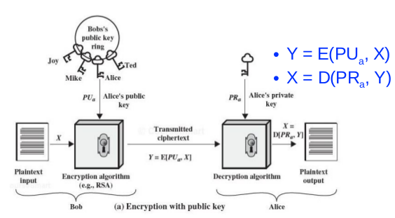
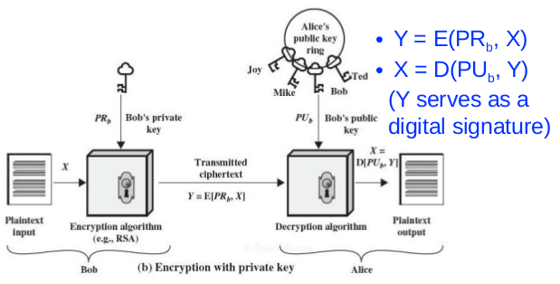
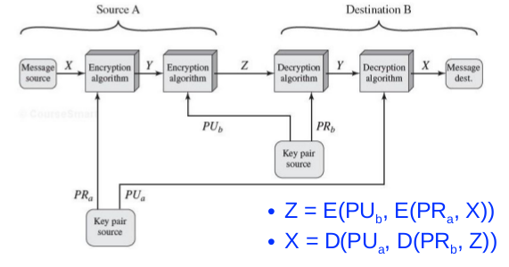
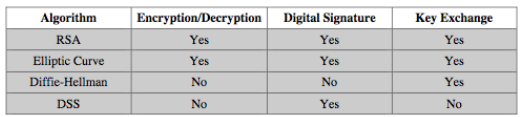
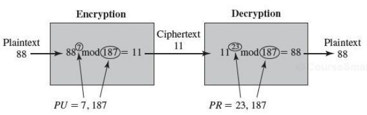
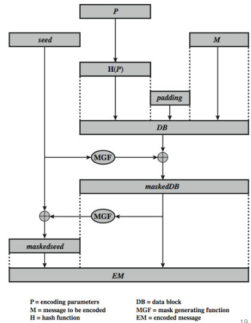

# 9.1 Public Key Cryptography

## Public-Key Cryptography: Overview

Most significant advance in the 3000 year of cryptography

Idea: uses two keys **a public key** and **a private key** 

- Asymmetric since parties are not equal, and different keys are used for en(de)cryption
- Uses clever application of number theoretic concepts to function
- Complements rather than replaces private key cryptography

### Misconceptions about Public-Key Cryptography

Public key encryption is more secure

- There is noting in principle to show one is superior to another from the point of view of resisting cryptanalysis

Public key encryption is a general-purpose technique that has made symmetric encryption obsolete

- Too much computation for it to replace symmetric

Key distribution is trivial in public-key encryption

- Not more complicated nor less complicated than symmetric encryption

### Why Public-Key Cryptography

Developed to address two key issues:

1. Key distribution: how to have secure communication in general without having to trust a KDC with your key 
2. Digital signatures: how to protect two parties against each other

## Public-Key Cryptography

Public-key/two-key/asymmetric cryptography involves the use of two keys: 

- A **public-key**, which may be known by anybody, and can be used to encrypt messages (provide confidentiality), or decrypt message (verify signatures) 
- A related **private-key**, known only to one party, used to decrypt messages (get the plaintext), or encrypt messages (create signatures) 

Computationally infeasible to determine private key from public key

\newpage

{width=80%}

- Encryption with public key provides confidentiality

&nbsp; 

&nbsp; 

&nbsp; 

&nbsp; 

{width=80%}

- Provides authentication (source and the integrity) and digital signature of the message

\newpage

{width=80%}

- Provides confidentiality, authentication, and digital signature (not used in practice due to high computational cost) 

### Applications for Public-Key Algorithms

Can classify uses into 3 categories:

- Encryption/decryption (provide confidentiality) 
- Digital signatures (provide authentication)
- Key exchange (of session keys) 

Some algorithms are suitable for all uses others are specific to one

{width=79%}

### Public-Key Cryptography Requirements

1. It is computationally easy for a party B to generate a pair (public key PU~b~, private key PR~b~) 
2. It is computationally easy for a sender A, knowing the public key and the message to be encrypted, M, to generate the corresponding ciphertext: C = E(PU~b~, M) 
3. It is computationally easy for the receiver B to decrypt the resulting ciphertext using the private key to recover the original message: M = D(PR~b~,C) = D[PR~b~, E(PU~b~,M)] 
4. It is computationally infeasible for an adversary, knowing the public key, PU~b~, to determine the private key, PR~b~
5. It is computationally infeasible for an adversary, knowing the public key, PU~b~, and a ciphertext, C, to recover the original message, M
6. The two keys can be applied in either order:
    - M = D[PU~b~, E(PR~b~,M)] = D[PR~b~,E(PU~b~,M)]
    - A useful requirement, not necessary for all algorithms
    - RSA meets this requirement

These are formidable requirements which only a few algorithms have satisfied

### Public-Key Requirements

Need a **trapdoor one-way function**

One-way function has:

- Y = f(x) easy
- X = f^-1^(Y) infeasible

A trap-door one-way function has

- Y = f~k~(X) easy, if K and X are known
- X = f~k~^-1^(Y) easy, if k and Y are known
- X = f~k?~^-1^(Y) infeasible, if Y known but k not known

Development of a practical public-key scheme depends on discovery of a suitable trap-door one-way function

### Public-Key Cryptanalysis
 
Brute force exhaustive key search attack is always theoretically possible (trade off on key size) 

Cryptanalytic attacks: computing the private key given the public key could be feasible

- No mathematical proof that this type of attack is infeasible for a particular public-key algorithm
- Any given algorithm, include RSA, is suspect

\newpage

# 9.2 RSA Algorithm

RSA Algorithm: a block cipher, the plaintext and ciphertext are integers between 0 and n-1 for some n. 

- A typical size for n is at least 1024 bits

Security is based on the difficulty of finding the prime factors of a large composite number

Three Inventors of RSA

- Ron Rivest
- Adi Shamir
- Len Adleman

## RSA En/decryption

Encryption: to encrypt a message M the sender:

- Obtains public key of recipient PU = {e, n}
- Compute: C = M^e^ mod n, where 0 $\le$ M \< n

Decryption: to decrypt the ciphertext C the owner: 

- Uses the private key PR = {d, n}
- Computes: M = C^d^ mod n
 
>>>> = (M^e^ mod n)^d^ mod n

>>>> = (M^e^)^d^ mod n

>>>> = M^ed^ mod n

>>>> **M = M^ed^ mod n**???

## RSA Key Setup

Each user generates a public/private key pair by

1. Selecting two large primes at random: **p, q**
2. Computing n = p $\cdot$ q ($\phi$(n) = (p-1)(q-1) &larr; Euler Toitent) 
    - n is the number used for modular in encryption/decryption
3. Selecting at random the encryption key e
    - Where 1\<e\<$\phi$(n), GCD(e,$\phi$(n)) = 1
4. Solve following equation to find decryption key d
    - e $\cdot$ d $\equiv$ 1 mod $\phi$(n) and 0 $\le$ d $\le$ n
- Publish the public encryption key: PU{e,n}
- Keep secret private decryption key: PR{d,n}

### RSA Example

Key Setup: 

1. Select primes: p = 17, q = 11
2. Calculate n = p $\cdot$ q = 17 $\cdot$ 11 = 187
3. Calculate $\phi$(n) = (p - 1)(q - 1) = 16 $\cdot$ 10 = 160 
4. Select e: GCD(e, 160) = 1; choose e = 7
5. Determine d: d $\cdot$ e $\equiv$ 1 mod 160 and d < 160.
    - Value is d = 23 since 23 $\cdot$ 7 = 161 = 1 $\cdot$ 160 + 1
6. Public public key PU = {7, 187} 
7. Keep secret private key PR = {23, 187}

\newpage

Encryption/Decryption

- Given:
    - PU = {7, 187} and PR = {23, 187}
    - Message M = 88 (note 88 < 187)
- Encryption: C = 88^7^ mod 187 = 11
- Decryption: M = 11^23^ mod 187 = 88 
- Note, 187 is n **NOT** $\phi$(n)

{width=70%}

## Why RSA Decryption Works

Because Euler's Theorem:

- a^$\phi$(n)^mod n = 1 where GCD(a, n) = 1

In RSA we have

- n = p $\cdot$ q
- $\phi$(n) = (p - 1)(q - 1) 
- Carefully choose e and d to be inverses of mod $\phi$(n) 
- Thus, e $\cdot$ d = 1 + k $\cdot$ $\phi$(n) for some k

Formal Proof (Appendix 9A in book): 

- M^e$\cdot$d^ mod n = M^1+k$\cdot$$\phi$(n)^ mod n = M mod n = M
    - We can prove this by doing it in parts: 
    - M^1+k$\cdot$$\phi$(n)^ mod p = M mod p &rarr; q | (M^1+k$\cdot$$\phi$(n)^ - M) 
    - M^1+k$\cdot$$\phi$(n)^ mod q = M mod q &rarr; q | (M^1+k$\cdot$$\phi$(n)^ - M) 
    - n | (M^1+k$\cdot$$\phi$(n)^ - M) &rarr; M^1+k$\cdot$$\phi$(n)^ mod n = M mod n

### Proof of  M^1+k$\cdot$$\phi$(n)^ mod p = M mod p

First show that M^k(p-1)(q-1)+1^ mod p = M mod p. There are two cases to consider: 

1. M and p are not relatively prime; that is, p divides M. In this case, M mod p = 0 and therefore M^k(p-1)(q-1)+1^ mod p = 0. Thus, M^k(p-1)(q-1)+1^ mod p = M mod p.  

2. If M and p are relatively prime, by Euler's theorem, M^$\phi$(p)^ mod p = 1. We proceed as: 

>> M^k(p-1)(q-1)+1^ mod p = 

>>> = [(M)M^k(p-1)(q-1)1] mod p

>>> = [(M)(M^(p-1)^)^k(q-1)^] mod p

>>> = [(M)(M^$\phi$(p)^)^k(q-1)^] mod p

>>> = (M mod p) $\times$ [(M^$\phi$(p)^) mod p]^k(q-1)^

>>> = (M mod p) $\times$ (1)^k(q-1)^ (By Euler's theorem)

>>> = M mod p 


## Exponentiation in Modular Arithmetic

Can use **square and multiply algorithm** 

- Fast efficient algorithm for computing a^b^ mod n
- [(a mod n) $\times$ (b mod n)] mod n = (a $\times$ b) mod n
- Look at binary representations of exponent b

Example: a^11^ mod n

- = (a^8^ $\cdot$ a^2^ $\cdot$ a^1^) mod n
- = [(a^8^ mod n) $\cdot$ (a^2^ mod n) $\cdot$ (a^1^ mod n)] mod n

### Square and Multiply Algorithm

```
    c = 0;
    f = 1;
    for i = k downto 0
        do c = 2*c
            f = (f * f) mod n
        if bi == 1 then
            c = c + 1
            f = (f * a) mod n
    return f
```

Using previous example:

- b = 1011
- k = 3
- f will be a^11^ mod n
- c will be 11 
 
## Efficient Encryption

Encryption C = M^e^ mod n, faster for smaller e

- Often choose e = 65537 (2^16^ + 1), 98.5% of systems use this key e
- Also see choices of e = 3 or e = 17

If e is too small (e = 3), vulnerable to attack

- Using Chinese Remainder Theorem (CRT) & 3 messages

If e is selected first, to ensure GCD(e, $\phi$(n)) = 1
    
- May need to selected new p and q

## Efficient Decryption 

Decryption M = C^d^ mod n, faster for smaller d

- Small d is vulnerable to brute force and other attacks

Can use large d, but use CRT to speed up

- Compute mod p and mod q separately. Then combine to get desired answer
- Approximately 4 times faster than doing it directly

Only owner of a private key who knows the values of p and q can use this technique
 
\newpage

## RSA Security

Possible approaches to attacking RSA:

- Brute force key search - infeasible given size of numbers
- Mathematical attacks - based on difficulty of factoring n to primes p and q
- Timing attacks - on running decryption
- Chosen ciphertext attacks - given properties of RSA

## Factoring Problem

Mathematical approach takes 3 forms:

- Factor n = p $\cdot$ q, hence compute $\phi$(n) and then d
- Determine $\phi$(n) directly and compute d
- Find d directly

Currently believe all equivalent to factoring n

- Biggest improvement comes form improved algorithm
- 1024 bit RSA is no longer allowed since Oct. 2015
- Current require 2048 bits
- Ensure p, q of smaller size and matching other constraints

## Timing attacks

Exploit time variations in operations 

- Multiplying by small vs large number
- Infer operand size based on time taken

For RSA, exploits time taken in exponentiation (Square and Multiply Algorithm)

Countermeasures:

- Use constraint exponentiation time
- Add random delays
- Blind values used in exponentiation (Example: (xy)^m^ = x^m^y^m^)
 
## Chosen Ciphertext Attacks

RSA is vulnerable to a chosen ciphertext attack (CCA)

- Attackers choose ciphertexts and get decrypted plaintext back

Choose certain ciphertext to exploit a property of RSA to provide info to help cryptanalysis

- E(PU, M~1~) $\times$ E(PU, M~2~) = E(PU, [M~1~ $\times$ M~2~]);
- (C = M^e^ mod n) &larr; above works because of this
- This is a multiplicative homomorphic property
- Example: choose ciphertext X = (C $\cdot$ 2^e^) mod n

Can counter with random pad of plaintext or use Optimal Asymmetric Encryption Padding (OAEP)



- Seed is randomly generated
- A complex padding
- EM is finally encrypted by RSA
- The aforementioned property is no longer valid


    


