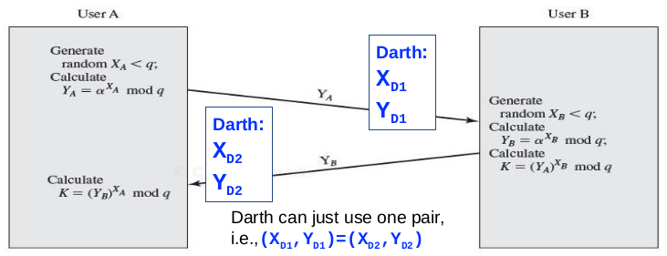
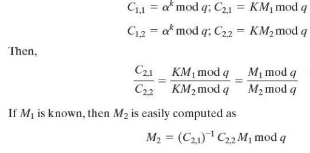
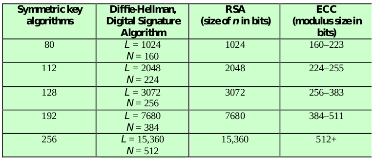
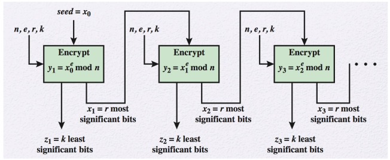

# Diffie-Hellman Key Exchange

First published public-key algorithm 

- Practical method for public exchange of a secret key
- Used in a number of commercial products

Idea: 

- Enables two users to securely exchange a secret or symmetric key for subsequent encryption (Ex. AES) 
- Value of the secret key depends on the participants (and their private and public key information) 
- Security relies on:
    - Exponentiation in a finite (Galois) field (modulo a prime or a polynomial) is easy
    - Computing discrete logarithms (similar to prime factoring) is hard
    
## Diffie-Hellman Setup

All uses agree on global parameters: 

- A large prime integer: q
- A primitive root of q: a

Suppose users A and B wish to exchange a secret key

- User A: selects a random integer X~a~ \< q
    - Computes X~A~ = a^x~A~^ mod q
- User B: selects a random integer X~b~ \< q
    - Computes X~B~ = a^x~B~^ mod q

Each side keeps X as a private key and Y as the private key

K~AB~ is the exchanged secret key for users A and B: 

- K~AB~ = Y~B~^X~A~^ mod q (**User A calculation**)   

>> = (a^X~B~^ mod q)^X~A~^ mod q  
>> = (a^X~B~^) mod q  
>> = a^X~B~^^X~A~^ mod q  
>> = (a^X~A~^)^X~B~^ mod q  
>> = (a^X~A~^ mod q)^X~B~^ mod q  
>> = Y~A~^X~B~^ mod q (**User B calculation**) 

A and B subsequently use K~AB~ for symmetric encryption

Attackers knows q, a, Y~A~, Y~B~; They need to know X~A~ or X~B~ 

- X~A~ = dlog~a,q~ Y~A~, X~B~ = dlog~a,q~ Y~B~, 
- This is hard for large numbers

## Diffie-Hellman Example

Problem: Alice and Bob want to exchange secret keys

- Agree on prime q = 353, a = 3
- Select random private keys:
    - Alice chooses X~A~ = 97
    - Bob chooses X~B~ = 233
- Compute respective public keys:
    - Y~A~ = 3^97^ mod 353 = 40 (Alice)
    - Y~B~ = 3^233^ mod 353 = 248 (Bob)
- Compute shared session key as:
    - K~AB~ = Y~B~^X~A~^ mod 353 = 248^97^ = 160 (Alice)
    - K~AB~ = Y~A~^X~B~^ mod 353 = 40^233^ = 160 (Bob)
 
\newpage

# Man-in-the-Middle Attack

Key exchange protocols:

- Public keys could be between two users A and B
- Could be between a group of users
- Both are vulnerable to a Man-in-the-middle attack

K~AD~ = Y~D2~^X~A~^ mod q = Y~A~^X~D2~^ mod q

K~BD~ = Y~B~^X~D1~^ mod q = Y~D1~^X~B~^ mod q

Darth can eavesdrop or modify messages

Due to the authenticity of two parties not being established

Use public-key certificate and digital signatures to overcome this

## Ephemeral Diffie-Hellman and Perfect Forward Secrecy (PFS)

Fixed Diffie-Hellman: embeds the server's public parameter in the certificate, and the CA then signs the certificate. The certificate contains the Diffie-Hellman public-key parameters that never change. (Prone to man-in-the-middle attack)

Ephemeral Diffie-Hellman: uses temporary, public keys. Each instance or run of the protocol uses a different public key. Each instance or run of the protocol uses a different public key. The authenticity of the server's temporary key can be verrified by checking the signature on the key. Because the public keys are temporary, a compromise of the server's long term signing key does not jeopardize the privacy of past sessions. This is known as perfect forward secrecy. 

Only 44% of connects use ephemeral Diffie-Hellman

# ElGamal Cryptography

Uses concepts from Diffie-Hellman and further add security

- Does this by using finite (Galois) field
- Security depends on difficulty of computing discrete logarithms (Like Diffie-Hellman)
- Used in a number of standards
    - Digital signature standard (DSS) 
    - Email standard (S/MIME)

## ElGamal Setup

All users agree on global parameters: 
    
- A large prime integer: q
- A primitive root of q: a

Users B wants to securely send a message to user A 

User A

- Selects a random integer X~A~ < q - 1
- Computes Y~A~ = a^X~A~^ mod q
- A's private key is X~A~; A's public key is {q, a, Y~A~}

## ElGamal Message Exchange

B encrypts a message to send to A computing

- Represent message M in range: 0 $\le$ M $\le$ q - 1
    - Longer messages must be sent as blocks
- Choose a random integer k with 1 $\le$ k $\le$ q - 1
- Compute a one-time key K = Y~A~^K^ mod q
- Encrypt and send M as a pair of integers (C~1~, C~2~) where 
    - C~1~ = a^k^ mod q; C~2~ = KM mod q

A then recovers message by:

- Recovering key K as K = C~1~^X~A~^ mod q
- Computing M as M = C~2~K^-1^ mod q
- Proof: (K: same as in Diffie-Hellman; K^-1^ multiplicative inverse in GF(q))

## ElGamal Example

Use field GF(19) q = 19 and a = 10 (a primitive root) 

Alice computers her key: 
    
- A chooses X~A~ = 5 and computes Y~A~ = 10^5^ mod 19 = 3

Bob sends message M=17 as (11, 5) by:

- Choosing random k = 6
- Computing k = Y~A~^k^ mod q = 3^6^ mod 19 = 7
- Computing C~1~ = a^k^ mod q = 10^6^ mod 19 = 11
- Computing C~2~ = KM mod q = 7*17 mod 19 = 5

Alice recovers original message by computing:

- Recover k = C~1~^X~A~^ mod q = 11^5^ mod 19 = 7

\newpage

## ElGamal Long Message Exchange

Longer Messages must be sent as blocks, and a unique value of k should be used for each block

- Otherwise, once one plaintext block, ex M~1~, is known by attackers, other can be computed

{width=70%}

# Elliptic Curve Cryptography (ECC)

The key length of RSA has increased over the years

- A heavier processing load, especially on small devicess

ECC offers same security as RSA with a smaller key size

ECC is newer, but not as well analyzed 

Can provide key exchange, encryption, digitical signature

Involves the use of an elliptic curve equation defined over a finite field (variables and coefficients are finite)

# Comparable Key Size in terms of Computation Effort for Cryptanalysis

{width=80%}

# PRNG Algorithms Based on Asymmetric Ciphers

Asymmetric Encryption Algorithms produce apparently random output. 

- Hence can be used to build a pseudorandom number generator (PRNG)
- Much slower than symmetric algorithms
- Hence only used to generate a short pseudorandom bit sequence

## PRNG Based on RSA

Micali-Schnorr PRNG using RSA:

Similar to OFB mode used as PRNG

A portion of output is used as feedback, ensuring unpredictability 

### Six Requirements in Micali-Schnorr PRNG

1. n = pq (This is from RSA)
2. 1 < e < $\phi$(n), GCD(e, $\phi$(n)) = 1 (This is from RSA)
3. re $\ge$ 2 $\cdot$ N, N = floor(log~2~n) + 1
    - Ensures exponentiation requires a full modular reduction
4. r $\ge$ 2 $\cdot$ strength
    - Strength is a value in {112,128,192,256}
    - 2^strength^ is the amount of work to break the security
5. k, r are multiple of 8 (Ease of implementation)
6. k $\ge$ 8; r + k = N (All bits are used)
    - r should be large to meet the requirements of 3 and 4
    - k should be large to get mroe bits in each encryption

