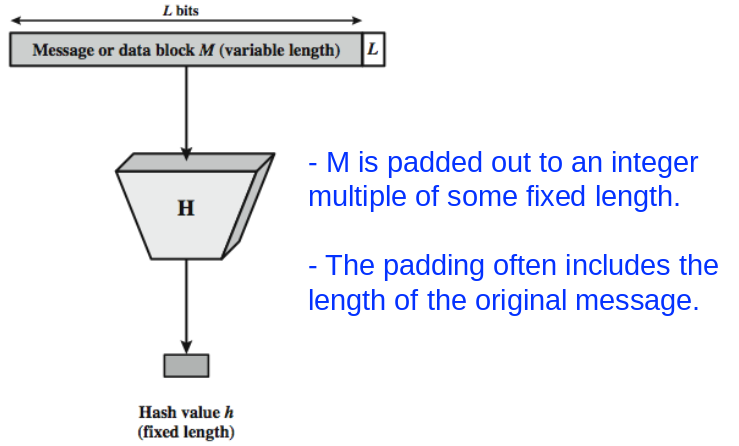
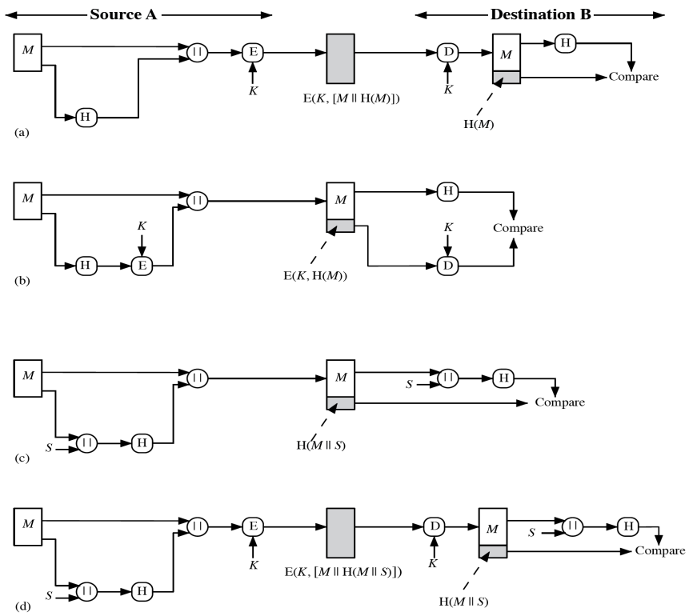
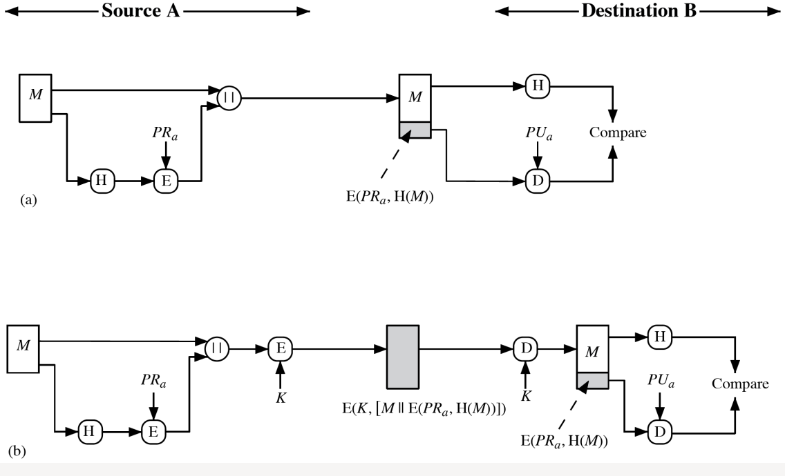
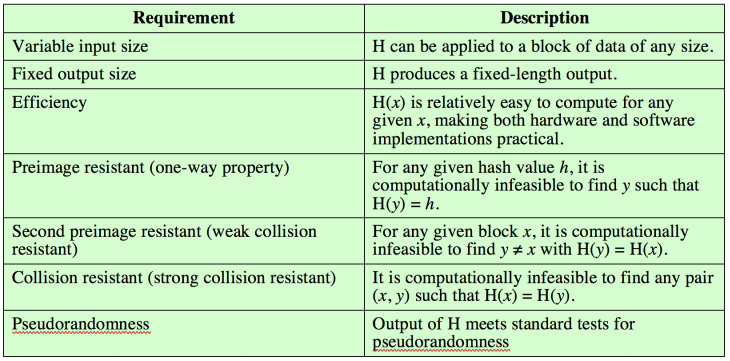
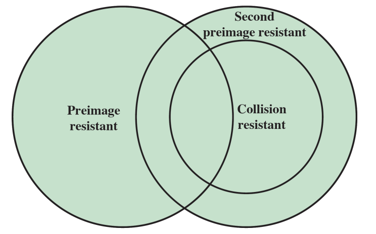
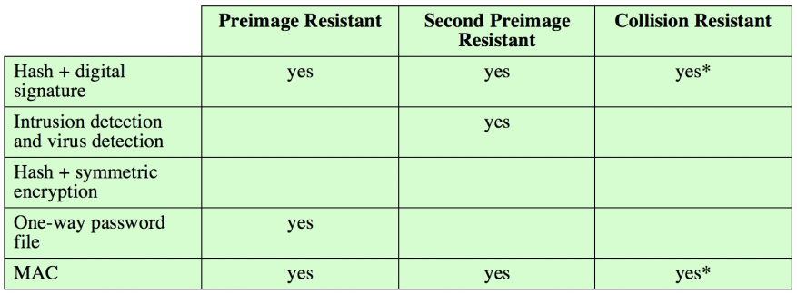
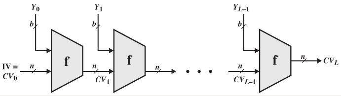

# Hash Functions: Introduction

Hash function: condenses variable-length message to fixed sizes

- h = H (M) 
- Usually assume hash function is public 

A cryptographic hash function is:

- Computationally infeasible to find a data object that maps to a pre-specified hash result (one-way property)
- Computationally infeasible to find two data objects that map to same hash result (collision-free property)
- Used to detect changes to message (data integrity)

{width=80%}

\newpage

## Hash Function: Used to Provide Message Authentication

- Scheme (a) and (d) also provide confidentiality 
- Scheme (a), (b), and (d) need to use encryption
- Specific MAC algorithms are normally used (chapter 12)

[comment]: # (go into textbook and find explanation for all four of these diagrams) 

\newpage

## Hash Function: Used to Provide Digital Signature 

- Scheme (a) is similar to (b) in figure 2, but it also provides a digital signature. 
- Scheme (b) also provides confidentiality
- Specific digital signature algorithms are used (chapter 13)

[comment]: # (go into textbook and find explanation for all four of these diagrams) 

\newpage

## Other Hash Function Uses

- To create a one-way password file
    - Store hash of password not actual password
- For **intrusion detection** and **virus detection**
    - Keep and check hash of files on system
    - Keep H(F) secure, compute and compare later
- Pseudorandom function (PRF) or pseudorandom number generator (PRNG) 

## Two Simple Insecure Hash Functions

Bit-by-bit exclusive-OR (XOR) of every clock

- C~i~ = b~i1~ $\oplus$ b~i2~ $\oplus$ ... $\oplus$ b~im~ (C~i~ = the i^th^ bit of the hash code)
- Produces a simple parity for each bit position
- Reasonably effective as data integrity check
- Regularities in the input will reduce its effectiveness

One-bit circular shift on hash value (an improvement) 

- Rotate current hash value by 1 bit then XOR each new block

Good for data integrity but useless for security 

[comment]: # (see what he says about this and possibly expand)

## Cryptographic Hash Function Requirements

h = H(x)

- x is referred to as the **preimage of h**
- H is a many-to-one mapping
- A **collision** occurs if x $\not$= y, but H(x) = H(y) **This is undesirable (remember from algo hehe)**

Length of x: b bits

Length of H: n bits 

Each h, 2^b-n^ preimages

Length of x can be arbitrary, more preimages

{width=85%}

## Relationship Among Hash Function Properties

## Hash Function Resistance Properties Required for Various Data Integrity Applications

\newpage

## Brute-Force Attacks on Hash Functions

Brute-force attacks depend on the bit length (m) of the hash value
    
- Attack on preimage or second preimage resistance
    - On average, 2^m-1^ attempts, (proof in appendix 11A) 
- Attack on collision resistance
    - 2^m/2^ attempts
    - Birthday paradox (look in algo notes if you need to)
- 128-bits inadequate, 160-bits suspect

## Cryptanalytic Attacks on Hash Functions

Good hash algorithms should make the effort of best cryptanalytic attacks greater than or equal to brute force

Hash functions use iterative structure processing blocks 

If f is collision resistant, then so is the hash function

Attacks focus on collisions in the compression function f

## Block Ciphers as Hash Functions

Can use block ciphers as hash functions

- Divide a message into N blocks M~1~, M~2~, ..., M~N~
- Using H~0~ = 0 and zero-pad of final block
- Compute: H~i~ = E(M~i~, H~i-1~)
- h = H~N~
- Similar to CBC but without a key

Vulnerable to attacks: small hash code if DES (64-bit) is used, birthday attack, "meet-in-the-middle" attack

- Other variants also susceptible to attacks

# Secure Hash Algorithm (SHA)

The most widely used hash function

- Revised in 1995 to use 160-bit hash values
- Research on security of SHA-1 have raised concerns on its use in future applications
    - Estimated collision attack effort: 2^69^ - 2^61^

## Revised Secure Hash Standard

NIST issued another revision in 2002

Added 3 additional versions of SHA (SHA-2)
    
- SHA-256, SHA-384, SHA-512 with different hash value lengths in 2006
- SHA-224 in 2008

## SHA-3

Flaws in previous versions

- SHA-1: insecure and broken
- SHA-2: seems secure but shares mathematical operation as SHA-1 so there are concerns

SHA-3 Requirements

- Able to replace SHA-2 with SHA-3 in any application
- Preserve online nature of SHA-2

Evaluation criteria

- Security strength close to theoretical maximum for different hash value lengths and for preimage resistance and collision resistance
- Efficient in both time & memory
- Algorithm/implementation characteristics: flexibility & simplicity
- Five finalist in third (final) round of the competition

 
 

