# Message Security Requirements

Confidentiality:

- Disclosure 
- Traffic Analysis

Message Authentication:

- Masquerade
- Content modification
- Sequence modification
- Timing modification

Digital Signature:

- Source repudiation
- Destination repudiation

# Message Authentication

Message authentication is concerned with:

- Protecting the integrity of a message
- Validating identity of originator 

Message authentication & digital signature both use some lower-level function to generate an authenticator

Three classes of low-level functions can be sued

- Hash function
- Message encryption
- Message authentication code (MAC)

## Symmetric Message Encryption

Encryption can also provide authentication

If symmetric encryption is used then: 

- Only sender and receiver know the key
- receiver knows sender must have created the message
- Know the message content has not been altered
- To automatically determine the decrypted message is legitimate
    - Structure must be enforced to plaintext 

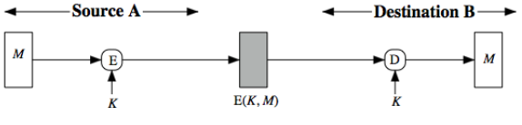

\newpage

## Structure Plaintext

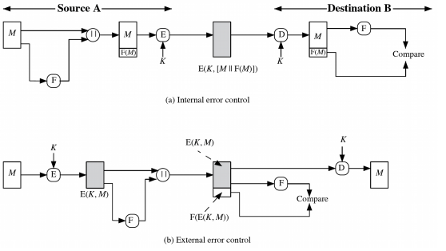

One way is to append an error-detection code or checksum

- Internal error control works
- External error does not work

## Public-Key Message Encryption

If public-key encryption is used:

- Encryption using public key provides confidentiality, but not authentication 
- Encryption using private key provides authentication and digital signature, but not confidentiality
- Encryption using both private and public keys
    - High computation overhead
    - Still, to automatically determine the decrypted message is legitimate, structure must be enforced to plaintext

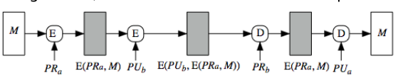

\newpage

# Message Authentication Code

A small fixed-sized block of data (tag, or authenticator)

- Generated from message + a secret key
- MAC = C(K,M) 
    - Variable length input, fix length output
    - Keyed hash function, like encryption though need not to be reversible
- Many to one mapping
    - Collision exists in theory, but computationally infeasible
- Appended to message when sent
- Automatically compared at the destination
- Provides authentication

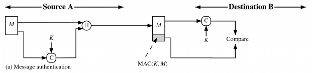

## MAC Plus Encryption

As shown, the MAC provides authentication

Can also add encryption for confidentiality

- Generally use separate keys for each
- Can compute MAC either before or after encryption
- Is generally regarded as better done before

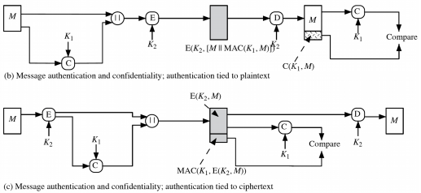

## Why Use MAC?

Symmetric/asymmetric encryption can provide authentication (as we have seen), why use separate MAC?

- Per requirement: sometimes only authentication is needed
- Performance: receiver can selectively check MAC
- Architectural flexibility: authentication and confidentiality can be provided at different layers
- Provide longer protection: sometimes need authentication to persist longer than the encryption

Note: MAC is not a digital signature

## Brute-Force Attacks on MACs

Assume size of key is k, size of MAC is n, k > n

Attack the authentication key (i.e. discover the k)

- Given T~1~ = C(K,M~1~); <M~1~,T~1~>  is known by the attacker
- 1^st^ round, try all the 2^k^ keys, generate 2^k^ tags (2^n^ tags are unique) 
- On average 2^k^/2^n^ = 2^k-n^ keys will produce a match (many-to-one)
- 2^nd^ round <M~2~,T~2~>, on average 2^k-2n^ keys will produce a match
- Multiple rounds are needed until one key will produce a match
- If k $\le$ n, 1^st^ round may work, more may be needed
- No less effort than to find a decryption key of the same length

Attack the MAC value (i.e. find M or generate valid T) 

- Comparable effort to attack one-way/weak collision in hash 2^n^

Overall, min(2^k^, 2^n^) effort

## Cryptanalytic Attacks on MACs

Exploit properties of algorithms

Good MAC algorithms should make the effort of best cryptanalytic attacks greater than or equal to brute force

Much more variety in the structure of MACs than in hash functions, so harder to generalize about cryptanalysis

An insure MAC example:

- M = (X~1~ || X~2~ || ... || X~m~)
- Define $\Delta$(M) = X~1~ $\oplus$ X~2~ $\oplus$ ... $\oplus$ X~m~; 
    - MAC = C(K,M) = E(K, $\Delta$(M))
- Attacker can replace X~1~ through X~m-1~ with desired Y~1~ through Y~m-1
- Attacker can replace X~m~ with Y~m~ = Y~1~ $\oplus$ Y~2~ $\oplus$ ... $\oplus$ Y~m-1~ $\oplus$ $\Delta$(M) 
- MAC value does not change with replaced message

## Requirements for MACs

If an opponent observes M and MAC(K,M), it should be computationally infeasible for the opponent to construct a message M' such that MAC(K,M') = MAC(K,M)

MAC(K,M) should be uniformly distributed in the sense that for randomly chosen messages, M and M', the probability that MAC(K,M') = MAC(K,M) is 2^-n^ where n is the MAC size

- Think about birthday paradox, why this requirement is reasonable (collisions)

Let M' be equal to some known transformation  M. That is, M'=f(M) (Example: inverting one or more bits). Then the probability that MAC(K, M') = MAC(K, M) is 2^-n^
 
# Constructing MACs

1. MACs based on Hash Functions

- HMAC (Hash-Based MAC)

2. MACs based on Block Ciphers

- DAA (Data authentication algorithm)
- CMAC (Cipher-Based Message Authentication Code)

## HMAC

Goal: want a MAC based on a hash function because hash functions are generally faster and widely available

- Allows for easy replaceability of embedded hash function
- Preserve original performance of hash function
- Use and handle keys in a simple way
- Have a well understood cryptographic analysis  of strength based on the embedded hash function

### HMAC Algorithm

HMAC(K, M) = Hash[(K^+^ $\oplus$ opad) || HASH [(K^+^ $\oplus$ ipad) || M)]]

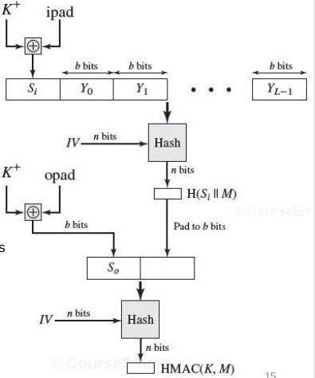{width=65%}

Meaning of symbols in HMAC algorithm visualization:

- Hash = embedded hash function 
- IV = initial value input to hash function
- M = message input to HMAC (including padding specified in Hash)
- Y~i~ = i^th^ block of M, 0 $\le$ i $\le$ (L-1)
- L = number of blocks in M
- b = number of bits in a block 
- n = length of hash code produced by Hash
- K = secret key, recommended length is $\ge$ n
- K^+^ = K padded with zero on the left to reach b bits
- ipad = 00110110 repeated b/8 times
- opad = 01011100 repeated b/8 times 
- (XOR) with ipad and opad flip one-half bits in K

Only adds three executions of hash compression (S~i~, S~0~, outer Hash) 

Security: min(2^k^, 2^n^) effort

## Block Ciphers for MACs: DAA

Data Authentication Algorithm (DAA) was a widely used MAC based on DES-CBC 

- Set IV = 0 and zero-pad of final block
- Send the final block  (leftmost M bits (16 $\le$ m $\le$ 64)) 
- Final MAC is now too small for security
- Also vulnerable if message size is mn 

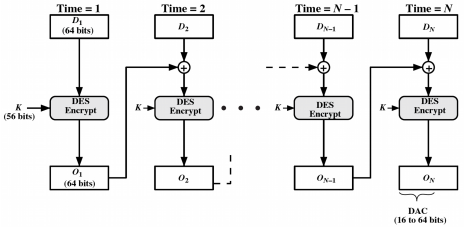

\newpage

## Block Ciphers for MACs: CMAC

Cipher-Based Message Authentication Code (CMAC) 

- Overcome message size limitation in DAA
- Using 2 keys & padding
- L = E(K, 0^b^); K~1~ = L\*x, K~2~ = L\*x^2^ (Multiplication in GF(2^b^)

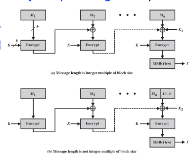

# Authenticated Encryption

Authenticated Encryption (AE) simultaneously protect confidentiality and authenticity off communications

Approaches

- Hash-then-encrypt: E(K, (M || H(M))
- Mac-then-encrypt: E(K~2~, (M || MAC(K~1, M)) 
- Encrypt-then-MAC: (C=E(K~2~,M), T=MAC(K~1~,C)) &larr; GCM
- Encrypt-and-MAC: (C=E(K~2~,M), T=MAC(K~1~,M)) &larr; CCM

Decryption/verification straightforward

With proper design can provide high security: GCM, CCM

\newpage

# Counter with Cipher Block Chaining Message Authentication Code (CCM)

NIST Standard for WiFi

Variation of encrypt-and-MAC approach

Key algorithmic ingredients

- AES encryption algorithm
- CTR mode of operation
- CMAC authentication algorithm

Single key used for both encryption and MAC

## CCM Operations

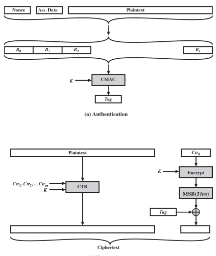{width=75%}

\newpage

Explanation of CCM visualization:

- plaintext P: authenticated & encrypted
- associated data A (protocol header): authenticated
- nonce N: assigned to P and A
- B~0~ contains N & lengths of N, P, A
- tag is also encrypted
- decryption and verification needs C, N, A, K, Ctr~0~ (a nonce)
- HIGH SECURITY

# Galois/Counter Mode (GCM) 

NIST standard parallelizable

Message is encrypted in variant of CTR mode

Ciphertext multiplied with key & length info. Over GF(2^128^) to generate authenticator tag

ALSO HAVE GMAC that supplies MAC-only mode

Uses two function:

1. GHASH:  a keyed hash function
2. GCTR: CTR mode with incremented counter

## GHASH~H~

GHASH~H~(X~1~ || X~2~ || ... || X~m~) = Y~m~

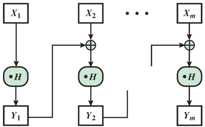{width=50%}

Meaning of symbols in visualization:

- H: the hash key
- X~i~: a 128 bit block
- Y~0~: a block of 128 zeros
- $\cdot$: the multiplication in GF(2^128^), which can be easily computed
- Y~i~ =  (Y~i-1~ $\oplus$ X~i~) $\cdot$ H
- Y~1~ = X~1~ $\cdot$ H
- Y~2~ = (Y~1~ $\oplus$ X~2~) $\cdot$ H = X~1~ $\cdot$ H^2^ $\oplus$ X~2~ $\cdot$ H
- Y~3~ = (Y~2~ $\oplus$ X~3~) $\cdot$ H = X~1~ $\cdot$ H^3^ $\oplus$ X~2~ $\cdot$ H^2^ $\oplus$ X~3~ $\cdot$ H
- Y~m~ = X~1~ $\cdot$ H^m^ $\oplus$ X~2~ $\cdot$ H^m-1^ $\oplus$ ... $\oplus$ X~m-1~ $\cdot$ H^2^ $\oplus$ X~m~ $\cdot$ H
- Return Y~m~
- Can distribute $\oplus$ because you can just precalculate H^i^, parallel process $\oplus$

\newpage

## GCTR~K~

GCTR~K~ (ICB, X~1~ || X~2~ || ... || X~n~\*) = Y~1~ || Y~2~ || ... || Y~n~\*

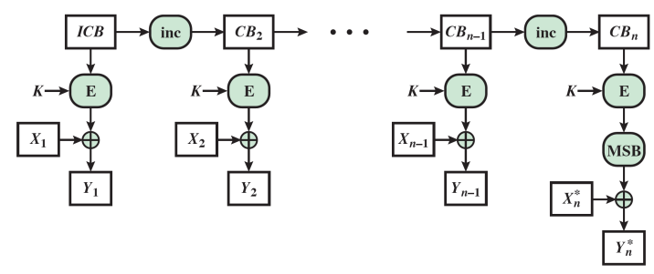{width=80%}

Meaning of symbols in visualization:

- K: the secret key
- ICB: initial counter block (next page)
- X~i~
- Return Y = Y~1~ || Y~2~ || ... || Y~n~\*

\newpage

## GCM Mode Overall Architecture

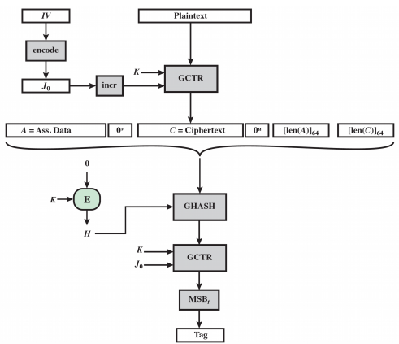{width=70%}

- Input: secret key K, initialization vector IV, plaintext, and A
- Hash key: H = E(K,0^128)
- J~0~: A GHASH~H~ value based on IV if IV length is not 96
- Return (C, Tag)
- Provides both confidentiality and authentication

# Pseudorandom Number Generation (PRNG) Using Hash Functions and MACs

Essential elements of PRNG are:

- Seed value
- Deterministic algorithm

Seed must be known only as needed

Can base PRNG on 

- encryption algorithm
- hash function
- MAC

\newpage

## PRNG Using Hash Function

Hash PRNGs

- Take seed V
- Repeatedly add 1
- Hash V
- Use n-bits of hash as random value

Secure if good hash is used

- There are no known or suspected weakness of SHA-2

## PRNG Using a MAC

MAC PRNGs

- Use a secret key
- Normally choose HMAC
- With extra overhead, but provide much higher security confidence than hash-based PRNG
