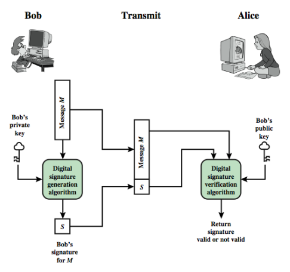

# Digital Signatures

Message authentication

- Does not address issues of trust between two parties
- The receiver can forge a message
- The sender can deny sending a message

Digital signatures provide the ability to:

- Verify the author and the date and time of the signature
- Authenticate the contents at the time of the signature
- Be verifiable by third parties, to resolve disputes
- Essentially authentication function with additional capabilities

## Attacks

Key-only attack: C only knows A's public key

Known message attack: C is given access to a set of messages and their signatures

Generic chosen message attack: C chooses a list of messages before attempting to break A's signature scheme, independent of A's public key; C then obtains from A valid signatures

Directed chosen message attack: Similar to generic attack, except that the list of messages to be signed is chosen after C knows A's public key but before any signatures are seen 

Adaptive chosen message attack: C may request from A signatures of messages that depend on previously obtained message-signature pairs

## Forgeries

Total break: C determines A's private key

Universal forgery: C finds an efficient signing algorithm that provides an equivalent way of constructing signatures on arbitrary messages.

Selective forgery: C forges a signature for a particular message chosen by C

Existential forgery: C forges a signature for at least one message; C has no control over the message

## Requirements for Digital Signatures

- Must depend on the message being signed
- Must use information unique to sender
    - This is to prevent both forgery and denial
- Must be relatively easy to recognize and verify 
- Be computationally infeasible to forge...
    - New message for existing digital signature 
    - Fraudulent digital signature for given message
- Be practical to retain a copy of in storage

# Direct Digital Signatures

- Involve only sender and receiver
    - Assumed receiver has sender's public-key 
- Digital signature made by sender signing entire message or hash with private-key
- Can encrypt using receiver's public-key
- Should sign first then encrypt message & signature
    - The dispute resolver does not need to know the decryption key
- Security depends on sender's private-key

# ElGamal Digital Signature Setup

- Signature variant of ElGamal message exchange
- Depends on difficult of computing discrete logarithms
- Use private key for encryption (signing)
- Uses public key for decryption (verification)
- All users agree on global parameters
    - A large prime integer: q
    - A primitive root of q: a
- User A wants to sign and send a message to user B
    - User A: selects a random integer X~A~ < q - 1

## ElGamal Digital Signature

A signs a message M to B by computing:

- The hash m = H(M), 0 $\le$ m $\le$ (q - 1)
- Choose random integer k with 1 $\le$ k $\le$ (q-1) and GCD(k,q-1) = 1
- Compute temporary keys: S~1~ = a^k^ mod q
- Compute k^-1^ the multiplicative inverse of k mod (q-1)
- Compute the value: S~2~ = k^-1^ (m - X~A~S~1~) mod (q-1)
- Signature is: (S~1~, S~2~)

B can verify the signature by computing 

- V~1~ a^m^ mod q
- V~2~ (Y~A~^S~1~^ S~1~^S~2~^) mod q
- Signature is valid if V~1~ = V~2~

# Digital Signature Standard

- Uses the SHA hash algorithm
- DSS is the standard, DSA is the algorithm 
- DSA only provides the digital signature function
- A public-key technique, difficulty of discrete logarithms
- Based on ElGamal & Schnorr schemes

# DSA Key Generation 

Have shared global public key values (p, q, g):

- Choose 160-bit prime number q
- Choose a large prime p with 2^L-1^ < p < 2^L^
    - Where L = 512 to 1024 bits and is a multiple of 64
    - Such that q is a 160 bit prime divisor of (p-1) 
    - This is Schnorr Scheme
- Choose g = h^(p-1)/q^ mod p (Schnorr Scheme)
    - Where 1 < h < p-1 and h^(p-1)/q^ mod p > 1

User choose private and compute public key: 

- Choose random private key: 0 < x < q
- Compute public key: y = g^x^ mod p

# DSA Signature Creation 

To sign a message M the sender: 

- Generates a per-message secret number k, 0 < k < q
- k must be random and be unique for each signing

Then computes signature pair:  

- r = (g^k^ mod p) mod q
- s = [k^-1^(H(M) + xr)] mod q

Sends signature (r,s) with message M

# DSA Signature Verification

Having received M & signature (r,s) 

To verify a signature, recipient computes:

- w = S^-1^ mod q
- u1 = [H(M)w] mod q
- u2 = (rw) mod q
- v = [(g^u1^ y^u2^) mod p] mod q
- If v=r then signature is verified 
