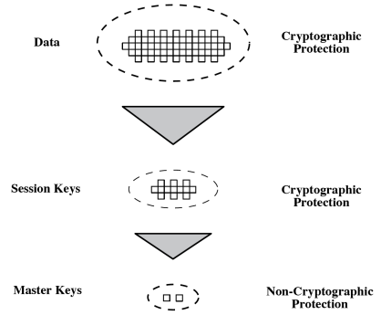

# Key Management and Distribution

Introduction:

- Topics of cryptographic key management / key distribution are complex
- Symmetric schemes requires both parties to share a common secret key: securely distributed, well protected
- Public key schemes require parties to acquire valid public keys: ensure authenticity of the public key

Main Topics:

- Key hierarchy 
- Symmetric key distribution using symmetric encryption
- Symmetric key distribution using asymmetric encryption
- Distribution of public keys
    - Public-key authority 
    - Public-key certificates
    - X.509 certificates
- Public key infrastructure (PKI)

# Symmetric Key Distribution Using Symmetric Encryption

Two parties A and B, key distribution can be achieved in different ways:

1. A can select key and **physically** deliver it to B
2. Third party can select and **physically** deliver key to A & B
3. If A & B have communicated previously, they can use previous keys to encrypt a new key
4. If A & B have secure communications with a trusted key distribution center C, C can deliver key to A & B

Concerns:

- Physical delivery is awkward (but useful) 
- End-to-end encryption, requires [N(N-1)]/2 keys
- Approach 4 id s a good choice if well designed

# Key Hierarchy

Typically have a hierarchy of keys

Session key:

- Temporary key
- Used for encryption of data between users
- Used for one logical session and then discarded

Master key: 

- Used to encrypt session key
- Shared between user & key distribution center

For end-to-end encryption: [N(N-1)]/2 session keys are still required, but only N master keys are required, which can be physically delivered

## Other Issues in Symmetric Key Distribution

- Hierarchies of KDC's required for large networks, but must trust each other
- Session key lifetime: security and overhead tradeoff
- Automatic key distribution that is transparent to users
- Use of decentralized key distribution
- Controlling key usage

## Controlling Key Usage

Limits the ways in which keys are used, ensure high security

Control tag:

- Makes use of the extra 8 bits of DES key to indicates session vs master, and other different uses 
- Not flexible: fixed length, encrypted

Control vector: 

- Consists of many fields to specify uses and restrictions
- Length may vary
- Cryptographically coupled with the key
- Very flexible: many fields, transmitted in clear form

# Symmetric Key Distribution Using Asymmetric Encryption

Public key cryptosystems are inefficient

- Almost never used for direct data encryption
- Rather use to encrypt secret keys for distribution

Merkle proposed this very simple scheme

- Vulnerable to man-in-the-middle attack

# Hybrid Key Distribution

- Retain use of a KDC
- Shares secret master key with each user
- Distributes session key using master key
- Public-key used to distributed master keys
    - Especially useful with widely distributed users
- Rationale 

# Distribution of Public Keys

Can be considered as using one of:

- Public announcement (via email, forum)
    - Can be forged by others
- Publicly available directory
    - Securely register {name, public key} with a public directory
    - Directory must be trusted, and protected
    - More secure, but still vulnerable to tampering or forgery
- Public-key authority
- Public-key certificates

# Public-Key Authority

- Improve security by tightening control over the distribution of keys from the directory
- Require users to know public key of the directory
- Users interact with directory to obtain any desired public key securely
- Require real-time access to directory when public keys are needed

# Public-Key Certificates

- Certificates allow key exchange without requiring real-time access to public-key authority 
- A certificate binds identity to public key
    - Usually with other info such as period of validity, rights of use
- With all contents signed by a trusted third party called Certificate Authority (CA)
- Four requirements: 
    - Any participant can read a certificate to determine the name and public key of the certificate's owner
    - Any participant can verify that the certificate, originated from the certificate authority and is not counterfeit, and the currency of the certificate
    - Only the certificate authority can create and update certificates 

# X.509 Authentication Service

- Part of ITU-T X.500 directory service standards
    - Distributed servers maintaining user info database
- Defines framework for authentication services
    - Directory may store public-key certificates
    - With public key or user signed by certification authority
    - Also defines authentication protocols
- Uses a public-key crypto & digital signatures
    - Algorithms not standardized, but RSA recommended

# Obtaining a Certificate

- Because cannot be forged, certificates can be placed in a public directory by CA
- Any user with access to CA can get any certificate from it
- Only the CA can modify a certificate
- The public key of a CA must be securely provided to users
- For a large number of users, multiple CAs are needed
- Notation: CA\<\<A\>\> denotes certificate for A signed by CA

## CA Hierarchy

- If both users share a common CA, then they are assumed to know its public key
- Otherwise CAs can form a hierarchy
    - User certificates signed between CAs to validate other CAs
    - Enable verification of any certificate from one CA by users of all other CAs in hierarchy
- Example: X~1~ \<\<A\>\>, X~2~ \<\<B\>\> A can user a chain of certificates to obtain/verify B's public key:
    1. A obtains from the directory the certificate of X~2~ signed by X~1~
    2. A obtains and verifies the public key of X~2~ 
    3. A obtains from the directory the certificate of B signed

Hierarchy use:

- Certificates of CAs by CAs are all in the directory, a user need to know how they are linked
- CAs are arranged in a hierarchy for straightforward navigation
- Arbitrarily long path of CAs can be followed to produce a chain
- Forward/reverse certificates
- Cross-certification
- Spanning tree traversal

## Certificate Revocation

- Certificates have a period of validity 
- May need to revoke before expiration, EXAMPLE:
    - User's private key is compromised
    - User is no longer certified by this CA
    - CAs certificate is compromised
- CA maintains list of revoked but not expired certificates
    - The certificate revocation list (CRL), posted on the directory 
- Users should check certificates with each CAs CRL

# X.509 Version 3

- Has been recognized that additional information is needed in a certificate
    - Email/URL, policy details, usage constraints
- Rather than explicitly naming new fields defined a general extension method
- Each extension consists of an extension identifier, a critically indicator, and an extension value
- Three categories extensions related to:
    - Key and policy information
    - Certificate subject and issuer attributes
    - Certificate path constraints

# Public Key Infrastructure (PKI)

PKI: the set of hardware, software, people, polices, and procedure needed to create, manage, store, distribute, and revoke digital certificates based on asymmetric cryptography

Principle objective of PKI: enable secure, convenient, and efficient acquisition of public keys. 

