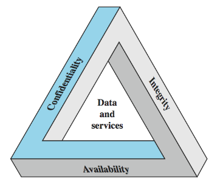

--- 
geometry: margin=2cm
---

# 1.1 Key Security Concepts or Requirements

## Roadmap 

Computer Security Technology Principles 

Software Security and Trusted Systems

Management Issues

## Overview

The protection afforded to an automated information system in order to attain the applicable objectives of preserving the integrity, availability, and confidentiality of information system resources (includes hardware, software, firmware, info/data, and telecommunications)

## Three Key Concepts of Computer Security

1. Confidentiality: covers two related concepts:
    - Data confidentiality: assures that private or confidential information is not made available or disclosed to unauthorized individuals
    - Privacy: assures that individual control or influence what information related to them may be collected and stored and by whom and to whom that information may be disclosed
    - Loss of confidentiality is the unauthorized disclosure of information
2. Integrity: this term covers two related concepts:
    - Data integrity: assures that information and program are changed only in a specified and authorized manner
    - System integrity: assures that a system performs its intended function in an unimpaired manner, free from deliberate or inadvertent unauthorized manipulation of the system
    - Loss of integrity is the unauthorized modification or destruction of information
3. Availability: assures that the systems work promptly and service is not denied to authorized users. 
    - Loss of availability is the disruption of access to information or information system

{width=55%}

## Additional Concepts

Authenticity: the property of being genuine and being able to be verified and trusted; confidence in the validity of a transmission, a message, or message originator

Accountability: the security goal that generates the requirement for actions of an entity to be traced uniquely to that entity. 

## Levels of Impact from Security Breaches

High: severe effect
    
Moderate: serious effect

Low: limited effect

### Examples

Confidentiality

- high: passwords
- moderate: student grades
- low: directory info

Integrity

- high: patient allergy info
- moderate: web forum users
- low: anonymous poll

Availability

- high: authentication service
- moderate: website for university
- low: online telephone directory

## Computer Security Challenges

1. not simple (requirements seem to be straightforward, mechanisms are complex) 
2. must consider potential attacks
3. procedures used counter-intuitive
4. involve algorithms and secret info
5. must decide where to deploy mechanisms
6. battle of wits between attacker / admin
7. not perceived on benefit until fails
8. requires regular monitoring
9. too often an after-thought in system design
10. regarded as impediment to using system

\newpage

# 1.2 Security Terminology and Architecture 

"Where a threat intersects with a vulnerability, risk is present"

## Vulnerabilities and Attacks

System resources vulnerabilities may

- Be corrupted (loss of integrity)
- Become leaky (loss of confidentiality)
- Become unavailable (loss of availability)

Attacks are threats carried out and may be

- Passive
- Active
- Insider
- Outsider

Vulnerabilities are pervasive in computer & network systems

### Countermeasures

Countermeasures: means to deal with security attacks

- Prevent
- Detect
- Recover

May result in new vulnerabilities

Will have residual vulnerabilities

Goal is to minimize risk given constraints

## Security Functional Requirements

Technical measures: 

- Access control; identification and authentication 

Management controls and procedures:

- Awareness and training; audit and accountability.

Overlapping technical and management: 

- Configuration management; incident reports

## X.800 Security Architecture 

Systematic way of defining requirements for security and characterizing approaches to satisfying them. 

Defines: 

- Security attack
- Security mechanisms
- Security services

## Security Attacks

Passive attacks: a passive attack attempts to learn or make use of information from the system but does not affect system resources

Active attacks: an active attack attempts to alter system resources or affect their operation

### Passive Attacks

Passive attacks are difficult to detect because they do not involve any alteration of the data. 

Types of passive attacks:

- Release of message contents
- Traffic analysis

### Active Attacks

Active attacks are difficult to prevent because of the wide variety of potential physical, software, and network vulnerabilities

Types of active attacks:

- Masquerade
- Replay
- Modification of message
- Denial of service

## Security Services (X.800)

- Authentication: assurance that communicating entity is the one claimed
- Access control: prevention of the unauthorized use of a resource 
- Data confidentiality: protection of data form unauthorized disclosure
- Data integrity: assurance that data received is as sent by an authorized entity, no modification, replay, etc. 
- Non-repudiation: protection against denial by one of the parties in a communication
- Availability: resource accessible/usable

## Security Mechanisms (X.800)

Pervasive security mechanisms:

- trusted functionality, security labels, event detection, security audit trail, security recovery
- not specific to any particular OSI security service or protocol layer

Specific security mechanisms:

- encipherment, digital signature, access control, data integrity

