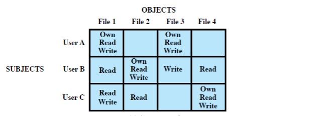

\title{Module 4: Access Control}
\maketitle

# Outline

- Access Control 
- Discretionary Access Control
    - UNIX
- Role-Based Access Control 

# Access Control

Access Control: the prevention of **unauthorized use** of a resource including the prevention of use of a resource in an **unauthorized manner**

Access control is concerned with determining the allowed activities of legitimate users, mediating every attempt by a user to access a resource in the system. It is concerned with how authorizations are structured. 

Consider the situation of having users and groups

- authenticate to system
- assigned access rights to certain resources on system

## Access Control Principles

A user needs to do the following to get access to a resource: 

1. Authentication function (get authenticated as genuine user)
2. Access control function (authorization database need to authorize user)
3. Boom, resources!

## Access Control Elements 

Subject: 

- An entity capable of accessing objects
- Three classes
    1. Owner
    2. Group
    3. World

Object:

- A resource to which access is controlled
- Entity used to contain and/or receive information, number and type depend on environment

Access right:

- Describes the way in which a subject may access an object
- Could include
    - Read
    - Write
    - Execute
    - Delete
    - Create
    - Search

## Access Control Policies

Discretionary access control (DAC): controls access based on the **identity** of the requestor and on access rules (authorizations) stating what requestors are (or are not) allowed to do. 

Role-based access control (RBAC): controls access based on the **roles** that users have within the system and on rules stating what accesses are allowed to **users** in given roles. 

Mandatory access control (MAC): controls access based on comparing **security labels** with **security clearances** (Top secret, secret, confidential, restricted, unclassified) 

Attribute-based access control (ABAC): controls access based on **attributes** (characteristics) of the user, the resource to be accessed, and current environmental conditions

## Access Control Requirements 

Access control needs to have: 

- Reliable input
- Fine and coarse specifications
- **Least Privilege** 
    - In a particular abstraction layer of a computing environment, every module (such as a process, a user, or a program) must be able to access only such information and resources that are necessary for its legitimate purpose. 
- **Separation of duty** 
- Open and closed policies
- Policy combination, conflict resolution
- Administrative policies

\newpage

# Discretionary Access Control (DAC) 

Based on the **identity** of the requestor and on access rules, 

- an entity may be granted access rights that permit the entity, by its own **discretion/volition/will/judgement**, to enable another entity to access some resource
- often provided using an access matrix
    - list subjects in one dimension (rows)
    - list objects in the other dimension (columns)
    - each entry specifies access rights of the specified specified subject to that object
- access matrix is often sparse 
- can decompose by either row or column
    - by column &rarr; access control lists (ACLs) 
    - by row &rarr; capability tickets/lists

{width=80%}

Each [User,File] entry in the matrix specifies the access rights to a file for a given user.  

## Protection Domain

A set of objects together with the access rights to them. 

- in access matrix view, each row defines a protection domain
    - but not necessarily just a user
    - may be a limited subset of user's rights
- the association between a user or process and a protection domain can be static or dynamic
    - should minimize the access rights that any user or process has at any one time
- protection domain examples: Unix user mode/kernel mode

## Unix/Linux: File Concepts

Unix files administered using inodes (index nodes): 

- Control structure with essential info on the file
    - attributes, permission of a single file
- may have several file names for the same inode
- have inode tables/list for all files on a disk 
    - copied to memory when disk mounted

Directories form a hierarchical tree

- may contain files or other directories
- are a file of filenames and point to inodes

Each file has 12 protections bits

- User, group, other 
- In those 4 subcategories we control the bits to give certain permissions

Linux commands:

- ``chmod``: change file access permission
- ``umask``: get/set the file mode creation mask

## Unix/Linux: Warnings

Putting ``umask`` into a startup file will make settings apply to everything you do unless manually changed

Making a file group read/write without checking what group it is can make you give access to everything in the system 

## Unix/Linux: Access Control Lists 

Modern UNIX systems support fine-grained ACLs

- Can specify any number of additional named users/groups and associated rwx permissions

# Role-Based Access Control (RBAC): 

RBAC is based on the roles that users assume in a system rather than the user's identity

- One layer of **indirection**, increased **flexibility**
- Users can have multiple roles, and thus it's a many-to-many mapping

## Role Hierarchies - RBAC

Can create a hierarchy of roles in an organization

- Make use of inheritance to enable one role to implicitly include access rights to associated subordinate roles

## RBAC Constraints 

Provide a means of adapting RBAC to the specifics of administrative and security policies 

A constraint is a defined relationship among roles or a condition related to roles

- Mutually exclusive roles 
    - A user can only be assigned to one role in the set
    - Any permission (access right) can be granted to only one role in the set
- Cardinality roles
    - Setting a max number with respect to roles (max number of users to role)
- Prerequisite roles
    - A user can only be assigned to a role if its assigned to some other specified role

## NIST RBAC Model

Features or functions required for RBAC: 

- Administrative function: provide the capability to create, delete, and maintain RBAC elements and relations
- Supporting system functions: provide functions for session management and for making access control decisions
- Review functions: provide the capability to perform query operations on RBAC elements and relations

