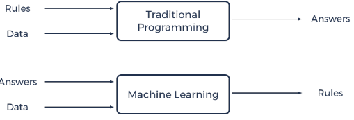
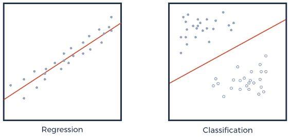
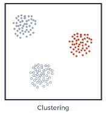
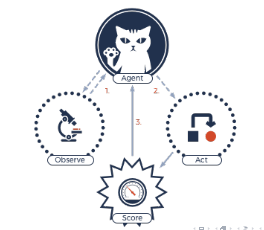
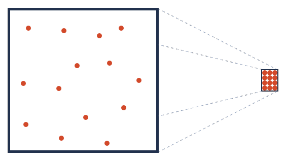

#Machine Learning Overview

##Artificial Intelligence 

Intelligence: anything that can think rationally: making decisions, predictions and detecting patterns. 

- **Search and Optimization**: Determine the complete solution space to a problem, then enumerate over the possibilities that can occur to find the values that perform the best. 

- **Logic**: Propositional logic and first-order logic can model a problem. When presented with a new problem using the same logic statement structures, the developed model can then determine if the problem statements aligns with the original model. 

- **Machine Learning**: ML uses data, and sometimes an answer to a question, to determine the underlying rules that define a system.

##Machine Learning

Machine learning is the learning of a model that can accurately represent the reality it models. Machine learning consists of three primary types: 

- **Supervised Learning**: supervised learning determines a model that can take an input set of features and predict a label for these features. We do so by training the model given a set of inputs with predetermined labels and learning the rules that result in that label. If the label to predict is a continuous value, then the problem is a *regression* problem. If the label to predict is a discrete value then the problem is a *classification* problem. 

- **Unsupervised Learning**: Unsupervised learning does not use predetermined labels and instead detects pattern in data. Pattern include finding similarities between some data points and differences with others. A simple example of unsupervised learning is clustering. 
 

- **Reinforcement Learning**: Reinforcement learning trains a model to make decisions based on a reward or punishment. Reinforcement learning algorithms model as much as possible of the real world scenario and run a large number of simulations to account for variations to learn the appropriate decisions.

###Other popular types/subsets

- **Semi-supervised learning**: When we have a small subset of data with labels and the remaining subset unlabeled, and train a model to predict labels. 

- **Multi-Label Learning**: Supervised learning where we have more than one target label to predict. Ex: labeling all the objects in an image

- **Multi-View or Multi-Model Learning**: Data representing an entity can come in different formats each presenting a potentially different perspective. Ex: brain image of a patient and genetic data of the patient can both represent the patient. 

- **Multi-Instance Learning**: Data contain pieces called instances, that make up the whole data record. Ex: image made up of patches, each containing a desired item to identify

- **Zero Shot Learning**: Supervised learning where the model can classify an item as none of the classes that it trained on. Ex: training on images of cats and dogs and being able to tell a horse is neither of those. 

- **Transfer Learning**: Transfer learning is the study of problems where the distribution of training data and testing data are different. Ex: training a translational model on 2 languages but using it on a third language. 

- **Active Learning**: Active learning is where a learning algorithm is able to interact with a user to obtain desired outputs for new data. In traditional engineering fields, it is also called experimental design.

##Data Representations

In AI, we use different data representation for real world objects. 

We often summarize our data to have a more concise representation. This is done to minimize redundancy represented by two or more features. 

**Dimensionality reduction** is the field that studies this data summarization. When representing data, each attribute of data is a *dimension* or *feature*. Dimensionality reduction reduces the number of dimensions in data to achieve certain learning goals such as minimizing information loss. 

##Deep Learning

Deep Learning: a subset of machine learning that uses *deep neural networks* to solve machine learning problems. 

A neural network (NN) is a graph of network made up of perceptrons or neurons organized in layers. 

Each perception takes *n* inputs of data, combines them with allocated weights to each feature to create a weighted sum that gets passed to an *activation* function to produce an output. 

Deep Neural Network: a network that has a large number of layers between the input and output. Layers between the input and output are *hidden layers*

###Feed Forward Neural Network (FFNN)

A feed forward neural network is one where the flow of data between perceptrons does not create a cycle. Layers organize the structure of a neural network; perceptrons on the same layer are not connected to each other, receive inputs from a previous layer, and output to the next in a FFNN.  

###Convolution Neural Nets (CNN)

CNN works by encoding features into a lower dimension that is the input to a FFNN or neural network of another type. 

###Recurrent Neural Nets (RNN)

RNN can have cycles in the data flow between perceptrons. A popular example of RNN is Long-Short Term Memory Networks

###Generative Adversarial Nets (GAN)

GAN works by creating two competing models; a *generator* or forger and a *discriminator* or detective. The end result is a model that can create fake data that is difficult to identify as fake and a model that can identify fakes.  

##Applications

- Computer Vision: use matrix/tensor to represent images
- Neural Language Processing: term frequency matrix to represent documents
- Bioinformatics
- Medical Image Computing
