#Theory, Practice & Products

Three main approaches for work that happens with machine learning:

1. **Theoretical**: Focus on creating new models and mathematically proving their effectiveness.
2. **Practitioner**: Solving specific problem defined by a dataset.
3. **Product-Based**: Focus on creating a product to solve a consumers problem.

Roles in an organization dealing with Machine Learning:

- Software engineers: build a customer-facing product. 
- Data analysts: use data for decision making and to inform the rest of the organization or its client
- Data engineer: create data pipelines and apply (optimized) algorithms to deliver machine-learning capabilities to the product
- Machine learning engineers - program machine learning algorithms interfacing w/ product
- Data scientist: determine the best machine learning algorithms that apply to the customer domain and fine tune it
- Research engineers: develop new machine learning algorithms and models relevant to the product domain

##Theory

Theory approach focuses on how machine learning models can solve the problems they aim to solve. Machine learning = MODEL PARAMETER ESTIMATION.

###Models

A models purpose is to define a representation for data that mimics the underlying principles that create the data. We define a model by defining an *objective function* that the model should minimize or maximize. 

Ex. Two variables *x* and *y* that have a linear relationship. We can represent *y* in terms of *x* using:
    
> *f(x) = w~1~x + w~0~*

*w~1~* is the sloe of the line, *w~0~* is the bias or intercept. *f(x)* can accurately represent *y* if and only if there in fact exists this linear relationship and *x* is the only variable that influences *y*. In reality, this rarely occurs. If we have a linear relationship between *x* and *y*, our real *f(x)* is usually:

> *f(x) = w~1~x + w~0~ + $\epsilon$*

$\epsilon$ is a function of all the other variables that can influence *y*. 

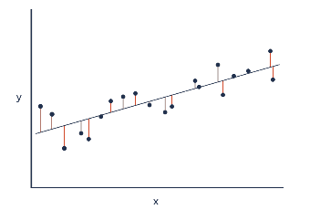

###Linear Regression

Linear regression: best fit line. We do this because accurately representing all possible variables that influence *y* is infeasible. 

Best fit lie (Linear regression): a line that minimizes the squared euclidean distance between the line and the actual data points. 

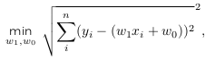

The *w~0~* and *w~1~* under min means that they're the two variables that will change to minimize the equation. Minimizing the equation means minimizing the square distance between actual *y* and estimated *y*.

\newpage

Formulation above can be generalized for a polynomial regression by **Y=w^T^X** as,

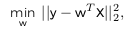

**X** is an (m+1) x *n* matrix, x~ij~ = x^j^~i~

**w** is an (m+1) x 1 vector

and || x ||~p~ is the lp-norm

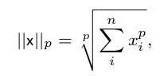

P $\ge$ 1

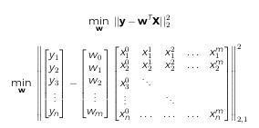

\newpage

##Practitioners

Practitioner: Start with a variety of available model they want to use on a particular dataset. 

Data: any information collected about an object to represent/explain it. 

Metadata: data about data. 

Representing the data means the model can predict how one value changes when compared to others (supervised), detect a pattern or complete the data (unsupervised), or make decisions about the data (reinforcement).

###Model Fitting

Procedure for model fitting is to split data into *training set* and *test set*, train the model on training set, and test the model on testing set. 

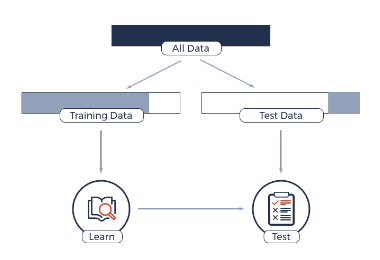

\newpage

Three things can happen to your model when training: 

1. Overfitting: training a model that performs well on training data, but poorly on test data
2. Generalizing: training a model that learns enough from training to generalize a pattern that does well in test data
3. Underfitting: training a model that performs poorly on both training and test data

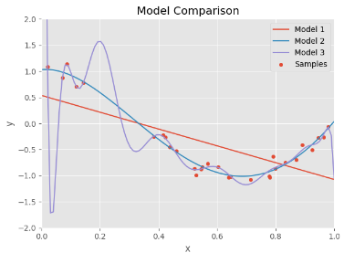

Every model has parameters that it learns through training (ex: coefficients of a polynomial)
Some models also have **hyperparameters** that are inputs to the model training (ex: the order of the polynomial to use). 

\newpage

###Cross Validation

Cross validation: method used to determine ideal hyperparameters of a model. This is done by splitting your training set into model and validation sets. 

- Model set is used to train model with different hyperparameters.
- Validation set used to validate these new models

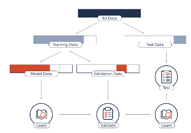

\newpage

Once the best hyperparameters is determined, train a new model using them on the entire training set.  

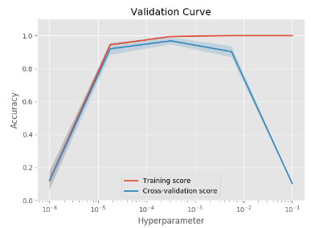

The shaded blue line shows the range in cross validation score. The solid blue line shows the actual averages. As you can see there is a trade off of too much hyperparameter fitting that results in a lower cross validation score. 

\newpage

*k*-fold cross validation: process of breaking training set into *k* equal portions and repeating cross validation experiments *k* times.

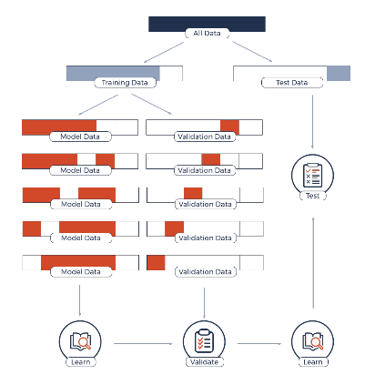

\newpage

##Product

Product: Focus on a measurable value produce for a customer/client. 

Model doesnt have to be the best, the focus is on business and engineering

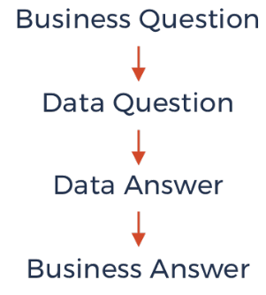

