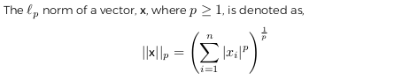
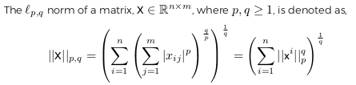
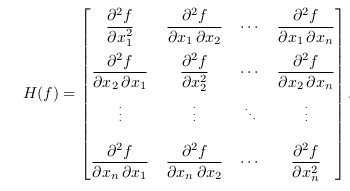
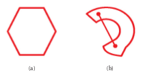

#Optimization & Linear Algebra

Idea: easily represent data mathematically. (With Linear Algebra)

##Linear Algebra

Objective function of a model is to measure the distance between some properties of data, or some function of data. Linear algebra is the notation use to represent these measurements. 

Measurements are with respect to the space they are in:

- **Scalars** are real numbers x $\in$ $\Re$

- **Vectors** generalize scalars in *d* dimensions. **x** $\in$ $\Re$^d^

- **Matrices** generalize vectors in *m x n* dimensions. **x** $\in$ $\Re$^*m x n*^

- **Tensors** generalize matrices in any dimensions **x** $\in$ $\Re$^*a x b x c ...*^ (Representation of everything after matrix)

A **norm** is a function *f(x)* that assigns a strictly positive length or size to each vector in a vector space. The following qualities are important for distances. Norms qualities are...

- Non-negative (*f*(x) $\ge$ 0)
- Definite (*f*(x) = 0 if and only if **x** = 0)
- Homogenous (*f*(*t*x) = |*t*|*f*(x))
- Follows the triangle inequality (*f*(x + y) $\le$ *f*(x) + *f*(y))

\

\

Class will focus mostly on *l*~1~ and *l*~2~ for p. 

*l*~pq~ norm is used for matrices and has a nice relationships with traces. Class focus mostly on **Frobenius Norm** (p = 2, q = 2). 

##Matrix Properties and Operations

###Symmetric Matrix

A symmetric matrix **S** is one where **s**~*ij*~ = **s**~*ji*~. 

Symmetric matrices have a special operation called **trace** which is the sum of the diagonal of that matrix represented as, **tr(S)** = $\sum_{i=1}^{10}$ **s**~ij~

###Rank

Rank of a matrix: maximum number of linearly independent column vectors or linearly independent row vector. 

Max rank of a matrix is therefore less than the minimum of its dimensions.

> **rank(x)** $\le$ min(n,m) where **x** $\in$ R^*nxm*^

Low rank problem: happens in data, where you have lots of data/feature. This problem occur when feature starts depending on each other. So the problem is you not adding more feature because they all start to relate.

###Transpose

Transpose of matrix is represented as **X^T^**. 

If **Y** = **X^T^**, then *y~ij~* = *x~ij~*.

If a matrix is a x b, transposing will make it b x a dimensions. 

Symmetric matrices have a special property where **S^T^** = **S**

###Inverse

Inverse **X**^-1^ of a matrix **X** $\in$ R^*nxn*^ is defined such that **A**^-1^**A** = **AA**^-1^

A matrix is **invertible** if its inverse exists and **singular** otherwise. 

###Eigenvalues / Eigenvectors

Eigenvalues **$\lambda$** and eigenvectors **v** of a matrix **X** satisfy, **Xv**~i~ = **$\lambda$**~i~**v**~i~. 

For a symmetric positive matrix **S**, eig(**S**^T^**S**) = eig(**SS**^T^) = eig(**S**) o eig(**S**).

###Orthogonal

Two vectors, **x** $\in$ R^*n*^, **y** $\in$ R^*in*^ are **orthogonal** if **x**^T^**y** = 0

A matrix **U**, is orthogonal if every pair of its column vectors are orthogonal, **U**^T^**U** = **I** 

###Decomposition

Any matrix can be decomposed into the product of several matrices. If the matrix **X** $\in$ R^*nxm*^ is not symmetric we have,

>> Singular Value Decomposition (SVD): **X** = **U$\Sigma$V^T^**

>> - **U** $\in$ R^*nxn*^ is the eigenvectors of **XX**^T^
>> - **V** $\in$ R^*mxm*^ is the eigenvectors of **X**^T^**X**
>> - **$\Sigma$** $\in$ R^*nxn*^ is a diagonal of the $\sqrt{eig(XX^T)}$

A special case of SVD exists when the matrix is symmetric...

>> Eigenvalue Decomposition: **X** = **V$\Delta$V**^T^

>> - **V** $\in$ R^nxn^ is the eigenvectors of **X**
>> - **$\Delta$** is a diagonal of the eigenvalues of **X**

SVD is like factoring for matrixes

Eigenvalue decomposition is like SVD, but different results due to symmetric matrixes

\newpage

##Matrix Calculus 

In conver optimization problems, you want to set derivative of a function to 0 to find a max or min. 

Hessian Matrix is a square matrix of the second order partial derivatives of a function

\

##Convex Optimization

A set is convex if every point in the set can create a line that lies within the function. 

\newpage

##Gradient Descent

Gradient Descent is a solution algorithm to optimizaion problem. Gradient descent focuses on **first order derivative** of the objective function. The idea behind it is

1. Select a valid point in the solution space
2. Calculate the graident at that point
3. Update the point by some amount by going down the gradient 

Gradient is represented as $\nabla$

Learning rate, or portion of the gradient to determine a step size is reprsented as $\gamma$

Gradient Descent is...

>> **x**~n+1~ = **x**~n~ - $\gamma$~n~$\nabla$*f*(**x**~n~)

Too large of a learning rate: overshoot optimal value
Too small of a learning rate: take a long time to reach optimal

##Newton's Method

Is like gradient descent but with additional information from second order derivative. 

Newtons method is...

>> **x**~n+1~ = **x**~n~ - [H(*f*(**x**~n~))]^-1^$\nabla$*f*(**x**~n~)

>> - H(*f*(**x**~n~)) is the Hessian matrix of *f*
>> - Can also add a learning rate to the step size for more granular control (similar to gradient descent)

##Constrained Problems

So far the solutions presented were for *unconstrained* objective functions. To handle **constrained** problems we just convert it into unconstrained problems.

Lagrange multiplier, denoted as $\lambda$, is how we do this conversion.

Lagrangian function works by adding a variable to change in the optimization problem, the lagrange multiplier, and moving the constraint to the object function itself. 

min f(x) => min f(x) + $\lambda$g(x)

The second function is called the Lagrangian function. 

\newpage

###Karush-Kuhn-Tucker (KKT)

To handle inequality constraints we follow the same approach to ensure KKT conditions. KKT condition states...

>> - g(x) $\le$ 0

>> - $\lambda$ $\le$ 0

>> - $\lambda$g(x) $\le$ 0

