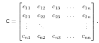
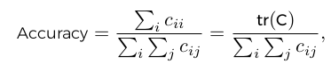
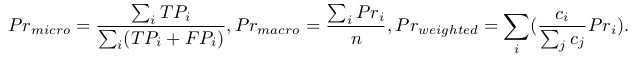
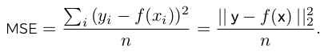
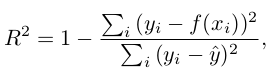
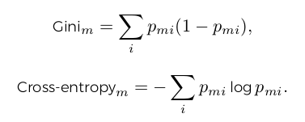

#Supervised Learning

Two main subsets of supervised learning

1. Classification (SL when target class is discrete)
2. Regression (SL when target class is continuous) 

Data is commonly available as *feature and labels* or *targets*

- Features: Observation about data

- Label: Useful values that we would like to predict

If labels of our data are continuous (regression), if labels of our data are discrete (classification)

##Metrics

How to evaluate classification and regression problems (evaluating models). 

For each, there is a set of metrics that can be useful in gauging a model's performance.

##Classification Metrics

Goal of a classifier is to accurate predict the correct label for each data point. 

First lets define notation for classification. Given results from a model that was trained to classify data as one of n classes. 

- c~i~ is the count of data from class *i*
- c~ij~ is the count of data from class *i* that was labeled as class *j*

Confusion Matrix: With above definitions, an *n* x *n* matrix can be created that displays how the model performed. 

###Accuracy

\

Accuracy is the sum of samples where the class and prediction were the same, divided by the sum of all samples. 

Accuracy is useful at high level but it doesn't tell much about the model's performance for each class. 

###More Involved Metrics

- True Positive for class *i* (**TP**~*i*~): count of that class that were labeled correctly
- True Negative for class *i* (**TN**~*i*~): sum of all other classes true positives
- False Positive for class *i* (**FP**~*i*~): sum of all other classes instances that were incorrectly labeled as class *i*
- False Negative for class *i* (**FN**~*i*~): sum of all instances of class *i* that were incorrectly labeled as another class

From those values, precision, recall, and F-1 Score can be calculated

- Precision for class *i* (**Pr**~*i*~): what percentage of data predicted as class *i* is in fact actually class *i*
- Recall for class *i* (**Re**~*i*~): what percentage of that class actually predicted as class *i*
- F-1 score for class *i* (**F1**~*i*~): the harmonic mean of precision and recall

These values are useful if only interested in a particular class. If interested in overall summary score for a model, combine all available classes score. 

\newpage

The three most common ways to combine the scores result in the weighted, micro, and macro scores for precision, recall, and F-1. 

1. Micro aggregation use the values at the data level then calculates the average score
2. Macro aggregation calculates each score and then averages them
3. Weighted aggregation calculates each score and then averages them weighted by the percentage of data in each label

##Regression Metrics

Goal of regression model is to accurately predict the correct continuous value for the target for each data point.

For all metrics for regression

- represent the real values of the target as **y** where *y*~i~ is the target value for the *i*^th^ item and *f*(**x**) and *f*(*x*~i~) are the respective predicted values. 

###Mean Squared Error (MSE)

Mean Squared Error (MSE): frequently used metric to assess model performance in regression. MSE is the difference between the real value and the predicted value, the error, square which is... 

\

Another common metric is **root mean square error (RMSE)** which is just the square root of the MSE. 

\newpage

###R^2^

Another common metric is R^2^ value which is one minus the sum of the squared errors divided by the sum of the squared distance to the mean. Which gives a value that is weighted by the variability within the sample data. 

\

Where $\hat{y}$ is the average of the real target values.

##Methods

Next part is looking at methods that can actually solve the supervised learning problem. The following methods are the one that will be focused on...

- *k*-Nearest Neighbors
- Decision Trees
- Random Forests

###*K*-Nearest Neighbors 

*k*-nearest neighbors (*k*NN) is a simple method for applying supervised learning. When training a *k*NN, the model practically memorizes all the locations of all the points and their values. When it is time to use the model for predictions, the model takes the input data and calculates the *k* nearest points to that input. 

- In a classification problem, the majority class of the nearest points is the prediction
- In a regression problem, the average of the nearest points is the prediction

This approach may seem simplistic, but with a large amount of data, it can be quite effective. When using *k*NN consider the following...

- *k*NN delays the computational effort until the inference/prediction stage
- *k* is a hyper parameter that can affect the model's performance
- The way we calculate 'nearest points' can significantly affect how our model performs. We can use an *l*~p~-norm for our distance metric and *l*~1~, and *l*~2~ are usually effective. 

###Decision Trees

Flow charts and decision trees are used to reach a conclusion or make a decision. In machine learning, the final decision is the prediction we are in search of. 

A decision tree starts at the root node with all the data. Based on the criterion, it splits the data into two nodes. Each node repeats the procedure until we reach a stopping criterion. Stopping criteria include a maximum tree depth or a minimum number of samples in a node. 

Decision trees are easy to follow but complicated to train. A decision tree trains on a dataset by investigating the features and finding the points on those features where, if we split the data, we would get the most consistency in each individual set. 

The metric used as a proxy for consistency is *impurity* and there are many ways to calculate it. Two of which are 

1. Gini
2. Cross entropy

###Decision Trees: Classification

For a classification problem with *k* classes, a decision tree with *n* nodes, has *c*~m~ points in node *m*, and *c*~mi~ points in node *m* belonging to class *i*. We define the proportion of points of node *m* that belong to class *i* as *p*~mi~ = $\frac{c~mi~}{c~m~}$ Following that, the two popular impurity metrics to choose between are...

\

\newpage

###Decision Trees: Regression

For a regression problem, we can use the MSE of each set to represent its impurity. When using decision trees for regression, each node is an exact value that is the average of its points. This means that there are usually more superior methods for regression problems than decision trees. When using decision trees understand that...

- The splitting criterion or measure for impurity is a hyperparameter 
- The stopping criterion for training is a critical hyperparameter to prevent overfitting the data. 

##Random Forests

Random forests are an ensemble method (methods that combine several models to produce better predictions) applied to decision trees that can improve the model's performance. 

Like a forest being a grouping of trees, a random forest model is an aggregation of several decision trees. Each decision tree is training on a random subset of the data to create the random forest model. 

To use the model, the random forest aggregates the prediction from each of the trees

- For classification: the model selects the most common class 
- For regression: the model selects the average of the resulting predictions

When using random forests, the same considerations from decision trees apply. In addition to those, the number of decision trees used to create the random forest model is a hyperparameter to consider. 

