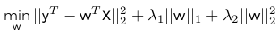

#Regularization

This section covers variation of linear regression that are useful when we have a large number of features. 

## *l*~p~ and *l*~pq~ Norms

First thing is revising the algebra for both the norms.

Note that p,q $\ge$ 1, however we define the *l*~0~-norm as the number of non-zero values in a vector. With that definition of norms, lets look at some patterns that occur at particular values for a norm. For example at the ||w||~p~ = 1..

- ||w||~0~ = 1, we only have one non-zero feature from the vector space
- ||w||~1~ = 1, we have a diamond-like structure which hits each axis at the value of the norm, 1
- ||w||~2~, we have a circular/spherical structure which hits each axis at the value of the norm, 1

@@@@@@@INSERT IMAGES OF THE GRAPHS HERE@@@@@@

l~0~-norm: number of nonzero values in vector

> either value is on w~1~ or w~2~ but not both, or 0,0 neither (|w~0~|=1)

l~1~-norm is |w~1~| + |w~2~| (|w~1~|=1)

l~2~-norm is w~1~^2^ + w~2~^2^ (|w~1~|=2) 

Focus on 0 1 and 2 for p 

##Linear Regression

The objective function for linear regression, with a large number of feature, tends to want to use all the features which will result in overfitting. This is the curse of *dimensionaliy* (will be covered later). 

Linear regression + regularization handles the issue of overfitting. 

- Linear regression: how well it fit
- Regularization: how robust

##Regularization

Regularization term: placed in objective function to prevent model from overfitting. This done by adding a minimization portion to the objective function that applies to the trained coefficients of our model. The equation looks like this...

\

> *f*(**x**) is a goodness of fit function (equation in figure 3)

> *r*(**x**) is a regularization function

When minimizing a function, you can simply add a regularization term in addition, this allows you to mitigate overfitting the data.

###Ridge Regression

Ridge regression model adds an *l*~2~ regularization to reduce the values of coefficients of the model. The objective is...

\

$\alpha$ is a constant hyperparameter of the model

- Adjusting $\alpha$ changes how sensitive the model is to the training data
- Large $\alpha$: reduces how much the model focuses on data
- Small $\alpha$: model focuses more on the trends in the data
- $\alpha$ = 0: a model that is equivalent to the base linear regression

Ridge regression minimizes the effect of colinearity by gaining as much information as possible from the least amount of features. 

- The model wont try to eliminate/zero-out a particular feature's coefficient but it will lower their values

###Lasso

The lasso model adds an *l*~1~ regularization to make some coefficients of the model go to 0. The objective is...

\

$\alpha$ is a constant hyperparameter and behaves like the ridge regression method. 

Lasso regularization tries to reduce coefficients to 0, (getting rid of some of the features). Much more impact than ridge regression. 

###Elastic Net

Elastic net model balances between both approaches of lasso and ridge regression by utilizing both *l*~1~ and *l*~2~-norms. The objective for elastic net is...

\

$\lambda$~1~ and $\lambda$~2~ are the coefficients for the *l*~1~ and *l*~2~-norms respectively. 

Can manually control these hyperparameters separately or create a relationship between the two. If creating the relationship, define two new hyperparameters, $\alpha$ and $\rho$ to make a new objective function that looks like...

\

- $\alpha$ is the normalization coefficient 
- $\rho$ is a balancing ratio between norms *l*~1~ and *l*~2~-norms

With elastic net (with either hyperparameters) the model focuses on lowering the coefficient and focuses on less features that are key to the resulting target. 

If after running this model, you find that $\lambda$~1~ or $\lambda$~2~ is 0, than that means lasso or ridge is more optimal than the other. If they are both 0, than the resulting model is the original linear regression model. 

###Group Lasso

When the features of the data belong to some logical grouping, we can often incorporate the group norm. 

- Group norm is calculated based on a defined grouping of the features
- Idea is to incorporate data's logical grouping when regularizing, so you can identify the most important groups of features

Group lasso is defined similar to lasso, but instead of simple *l*~1~ regularization we use the group *l*~2~ regularization. A group *l*~p~ norm is defined as...

\

The group *l*~2~ norm is therefore, 

\

The group Lasso can be presented as

\

With the group lasso, the *l*~1~ group norm induces sparsity on each group of features, attempting to eliminate any groups that don't provide as much value as others. 

###Sparsity Induction

With these regularization methods, we are inducing sparsity on the learned model. 

- This forces the model to pick less features to use to generalize about the data. 
- This generalization is what we want when adding regularization to avoid overfitting
- Another aspect of sparsity induction is to identify key features that are predictive of the target. 
- By setting model to set some values to zero, we force it to learn about the actual behaviour with less features 
