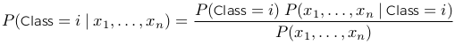
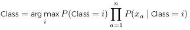
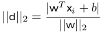
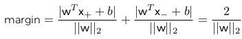
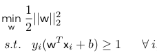
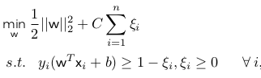
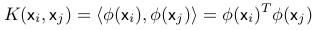

#Supervised Learning - Naive Bayes & Support Vector Machines

##Naive Bayes

Naive Bayes: a modeling method that learns from the conditional probabilities that exist between feature values and the resulting target value. 

Here are some basic shit you need to know to understand Naive Bayes...

- Probability: value between 0 and 1 that denotes the chance of an event happening
- Mutually Exclusive: sum of probabilities equal to 1. (only one outcome can occur) - Conditional Dependence: probability of an event changes based on another event. 
- Conditional Independence: events don't effect each other
- When two events **A** and **B**, are independent, their conditional probabilities are equal to their original probabilities...

>> P(A|B) = P(A) 

###Bayes Rule

To simplify calculations with probabilities, use **Bayes Rule**

> P(A|B) = $\frac{P(A)P(B|A)}{P(B)}$

Bayes Rule allows us to mathematically represent conditional dependence in data. You can use it to understand how certain features affect a target.

Naive Bayes method uses this concept to create a model for our data. It calculates the *probabilities of an input being a particular class* given the *probabilities of all the inputs being each of the classes*. Applying Bayes rule to this problem gives us...

\

###Bayes Rule (Example Problem)

This example is a classification problem with *k* classes where each data item has *n* features. If we assume that all the features are independent, 

Then the probability of a particular feature value resulting in a class is equal to the probability of that feature resulting in the class given all the other features. This assumption is what makes the Naive Bayes method naive.

We can then update the probability of a class given an input as, 

\

From the training data, we can calculate the probability of a class as the proportion of the data that has that class. For the probability of a feature given the class, we can use a variety of methods to calculate them. The value for the probability of a given function vector is a constant. Can determine the appropriate class for a particular input vector as... 

\

The tree common variations of Naive Bayes (NB) are:

1. Gaussian NB
2. Multi-nomial NB
3. Bernouli NB

##Support Vector Machines 

Support Vector Machines (SVMs) are another popular method used in machine learning. 

For a 2-dimensional, 2-class classification problem, SVM's find the line that maximizes the separation between the points of each class. 

- The distance between the two nearest points classified one way or the other is the **margin**. 
- Many line can separate the sets of points, but the goal is to find the line with the largest margin.
- The points closest to the separating line are **support vectors**

@@@@IMAGE OF SVM GRAPH

The output from SVM is the label of a particular point as w^T^x + b. We also get tree lines, one were the label is unknown (0) at the line equidistant from the two classes, and two lines where we know the label are one class or the other (1, -1). The three lines are 

- w^T^x + b = 0
- w^T^x + b = 1
- w^T^x + b = -1

If we select one support vector from each class, x~+~, x~-~ the margin is the difference between the two points. Can state the two support vectors as...

- w^T^x~+~ + b = 1
- w^T^x~-~ + b = -1 

###Calculating Margin Distance

Equation to calculate distance between a point x~i~ and hyperplane w^T^x + b = 0 is...

\

The margin is therefore the distance from x~+~ to the hyperplane plus the distance from x~-~ to the hyperplane. 

\

Goal is to maximize the margin for models. In an objective function we use min, so lets take the reciprocal of this. Turns out that if we square the *l*~2~ norm, we can solve the problem using straight forward quadratic programming methods. The basic SVM objective function is...

\

Where *y*~i~ $\in$ [1, -1] determines the class point *i* belongs to. 

Based on this approach, we ensure that the margin separates all points and does not allow any room for error. 

- Hard margin: does not allow any room for error, leads to overfitting
- Soft margin: allow some errors, use penalty parameter, C, to determine the softness of the margin.

###Soft Margin

Idea is to allow the model a certain amount of error, based on the wrong points it classifies and how wrong these points are. 

Determine the error for a point using the distance to its class line and we use the C value as a weight to multiply the sum of all the distances of the wrong points. 

- Higher C: "harder" margin. 
- Lower C: "softer" margin. 

With soft margin, the objective SVM function is now updated to...

\

Where $\zeta$~i~ is the error for point i, and C is the penalty tuning parameter

##Multi-Class

**One versus All**: train *k* SVMs, where *k* is the number of classes. We train the *i*^th^ SVM to classify whether a point is of class *i* or any of the other classes. We can then use all the hyperplanes of the trained models to classify any given point. Can use this method with any binary classifier other than SVMs as well. In each model, we are likely to have an imbalanced dataset since we are training this class against all others.

**One vs One**: train $\frac{k(k-1)}{2}$ classifiers, where we train each classifier on data from two classes and ignore the rest. This approach can be used with any other binary classifier as well. 

##Regression

To use SVMs for regression we maintain the same objective function but change the constraints to match a continuous value. *y*~i~ is no longer the label, but the exact value of the target and we no longer use 1 as the inequality constraint, but instead use a limit on the acceptable error, e. 

The objective function for support vector machines when used for regression is...

\

Where e is the acceptable error boundary

##The Kernel Method

Everything so far assumes data is linearly separable (classification) or linearly representable (regression). If the data is not, we can apply the kernel method to transform it to a new space that is linearly separable or representable. For all the above objective functions, we replace x with $\phi$(x) where $\phi$(x) defines a transformation that occurs to any given point into the new space. 

A kernel function K(x~i~,x~j~) is one that transform x~i~ and x~j~ into a new space by taking the inner product of their transformations. 

A simple example of this is data that appears as 2 concentric circles where the inner circle near the origin is of one class, and the outer one is of another class. These two classes in the original space are not linearly separable. We can apply a transformation to the data and the results become linearly separable. 

