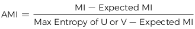

#Unsupervised Learning

Unsupervised learning is the type of machine learning where we do not use labeled data or necessarily have knowledge of a ground truth. 

##Unsupervised Learning: Overview

Unsupervised learning is a subset of machine learning where the model is not provided with ground truth labels for the problem. The model is expected to determine some patterns in the data without any guidance or "supervision"

There are two main problem types where we can use unsupervised learning

1. The first type: is building a model for data that we have ground truth labels for

    - Allows unsupervised learning to be applied on supervised learning problems, which may give a new understanding of the data based on patterns the model recognizes

2. The second type: is building a model for data without ground truth 

    - This is more of a true version of the problems unsupervised learning methods are developed to solve.

One application of unsupervised learning is clustering. Clustering is the grouping of similar data samples together to define representative groups, called clusters. 

##Evaluation Metrics

When withholding ground truth from a model, the evaluation metrics may be more representative since the actual correct answer to the problem is known. 

When the ground truth is unknown, the evaluation metric is fuzzy. 

Evaluation metric determine how closely the result follows some expected pattern or examine the variability of the data. Both these evaluation techniques are useful, but may be very different from ground truth evaluation. 

##Withholding Ground Truth

Withholding ground truth from the model means that the model can not use the correct labels of our data to determine its parameters. The model must recognize a pattern in the data and then we can utilize the available ground truth metric to evaluate its performance. There are several metrics to achieve this...

- Adjusted rand index
- Adjusted mutual information score
- Homogeneity, completeness, and V-measure

Define a problem of

- *n* samples having *s* clusters with *r* predetermined classes. 
- *C* is the grouping of samples based on their classes
- *P* is the grouping based on their predicted clusters
- A contingency table/matrix can be made to display the number of samples from each class in each predicted cluster

###Adjusted rand index

The rand index is a measure of consistency across element groupings. It examines each pair of points from the samples and tracks how many pairs are within the same grouping in both *C* and *P*, and how many are within different groupings in both *C* and *P*. It is calculated as...

*rand* = *$\frac{ss + dd}{ss + dd + sd + ds}$* = *$\frac{ss + dd}{\binom{n}{2}}$*

- ss represents the number of sample pairs that are in the **same** cluster in *C* and in *P*
- dd represents the number sample pairs that are in **different** clusters in *C* and in *P*
- sd represents the number of sample pairs that are in the **same** cluster in *C* but **different** in *P*
- ds represents the number of sample pairs that are **different** clusters in *C* but **same** in *P*

{width=75%}

\newpage 

Can correct for chance when using the rand index by using the adjusted rand index. The adjusted rand index can be calculated as...

\
{width=80%}

###Adjusted Mutual Information Score

Entropy of a set *U* is defined as...

\
{width=50%}

- *P~U~*(*i*) is the probability that a randomly selected object belongs to class *U~i~* of set *U* 
- *P~U,V~*(*i*,*j*) is the probability that a randomly selected object belongs to class *U~i~* of set *U* and class *V~j~* of set *V*

The mutual information between two sets *U* and *V* is then defined as...

\
{width=60%}

We can normalize the mutual information using each set's entropy to get values from 0 to 1 as...

\
{width=45%}

To adjust for the chance of each class, we can use the same approach we used for the rand index. The general idea of how it's calculated is...

\
{width=60%}

\newpage

###Homogeneity, Completeness, and V-measure

**Homogeneity**: Measures how many values in a particular cluster are actually from one class

**Completeness**: Measures how many values in a particular class are predicted in the same cluster

**V-measure**: the hyperbolic mean of the two values. 

To calculate homogeneity and completeness, expand the entropy definition to...

\
{width=50%}

- Note: $\frac{n_{i}}{n}$ is equivalent to the probability of class *i* in the set, similar to our previous definition.

We also expand the definition to conditional entropy

\
{width=70%}

We can now define homogeneity, completeness, and the V-measure as...

- Homogeneity = 1 - $\frac{H(C|P)}{H(C)}$
- Completeness = 1 - $\frac{H(P|C)}{H(P)}$
- V-measure = $\frac{\text{2 x Homogeneity x Completeness}}{\text{Homogeneity + Completeness}}$

##Unknown Ground Truth

When we do not know the ground truth values for our data, it is difficult to assess the performance of our model. There are fewer metrics for evaluating models with unknown ground truth. We will only cover using silhoutte coefficients for scoring to introduce the approach of these metrics

\newpage 

###Silhouette Coefficient

The silhouette coefficient of a sample provides a ratio between the distance to the mean of the selected cluster and the next closest cluster. This helps estimate how close a point is to the next nearest cluster. First we define $\hat{w}$*~i,k~* as the distance between a sample *i* belonging to class *k* and the mean of class *k*

> $\hat{w}$*~i,k~*  = ||*x~i~* - $\hat{x}$*~k~*$\left|\right|_{p}^{r}$

    - $\hat{x}$*~k~* is the mean of all the points in cluster *k*
    - *p* and *r* are determined based on the distance metric we wish to utilize.

We also define $\hat{d}$*~i,k~* as the distance from a point *i* to mean of the next closest cluster *k*

> $\hat{d}$*~i,k~*  = ||*x~i~* - $\hat{x}$*~l~*$\left|\right|i_{p}^{r}$

    - $\hat{x}$*~l~* is the mean of all the points in cluster *l*

The silhouette coefficient for a single sample *i* belonging to cluster *k* is

\
{width=50%}

The silhouette score of clustering output is the mean of all the silhouette coefficients of the samples in the data. 

\newpage

##Clustering

Clustering is about determining a pattern in our data and understanding if many data samples share similar properties. By grouping our data into clusters, we can develop an understanding of how our data exists in nature and begin to model that effectively

###*k*-Means Clustering

*k*-Means clustering method is one of the simplest clustering methods. 

- Has a hyperparameter *k* which is the number of clusters to group the data into
- *k*-Means determines clusters centroids, $\mu$ that solve the objective... 

\
{width=45%}

Where $\mu$*~i~* is the centroid of cluster *i* and *C~i~* is the subset of points that belong to cluster *i*.

*k*-means minimizes the euclidean distance between each point and the centroid of its labeled cluster. It does so using the following algorithm...

\

