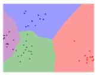

#Unsupervised Learning - Matrix Completion

Matrix completion use in recommendation systems (Spotify discover, Netflix movie suggestion, etc...)

##Recommendation Systems

Recommendation Systems: systems with the goal of making recommendations based on some underlying data. 

There are two main types of recommendation systems

1. Content-based filtering: Focuses on the meaning of the content, and its content-only relationship to other available content
    
    - Requires an understanding of the data itself
    - Require extraction of representative features that can be used to measure content similarity
    - (Discussed more in feature learning & application specific feature extraction)

2. Collaborative filtering: Focuses on shared behaviour rather than content meaning
    
    - It looks at what others have liked and will recommend based on if you also liked those things. 
    - Ex. Social networks, you're like to be friends with your friends mutual friends

##Matrix Completion

Matrix completion: a task designed to **fill in missing values** into a partially observed matrix **X**. 

\newpage

###Matrix Completion: Movie-Rating Matrix Example

Problem: Given a ratings matrix **X** in which each entry *x~ij~* represents the rating of movie *j* by customer *i* if customer *i* has watched movie *k* and is otherwise missing, we would like to predict the remaining entries in order to make good recommendations. 

- This problem starts with a sparsely populated matrix **X**
- Row represents the collection of ratings for a specific customer
- Want to learn to make a denser matrix **M** that contains which movies customer's in **X** would be interest in, but have have no rating in. 

###*k*-Nearest Neighbors for Matrix Completion

*k*-Nearest Neighbor (*k*NN) is a useful algorithm that matches points with their *k* closest neighbors. This algorithm is particularly useful since it can be effective with an arbitrary number of variables and is trivial to implement. 

When trying to determine the missing values in **X** the *k*NN algorithm...

1. Finds the k closest neighbors to a particular observation (row in **X**) with missing data
2. Then assigns the missing values based on the non-missing values in the neighbors. 

The key assumption behind using *k*NN to fill in missing values, is that missing value can be approximated by values contained within records that are closest to it. 

\newpage

Two considerations must be taking into account when using the *k*NN approach. 

1. Determine the value for *k*: how many neighbors are used to predict a given missing value
2. Determine the distance metric: what will be used to quantify how close two records are in **X**. 
    - Could use *Euclidean* or *Manhattan* distance to determine how closely related two records are to each other

###Low Rank Matrix Completion

Different perspective of matrix completion: real world data can often be grouped based on a small number of characteristics. 

- Ex. For the movies, we can group them into genre. Then using a individual genre preference, we can use that to fill in missing values in matrix **X**.
- Assumption: when applying an algorithm that incorporates this *low rank*, assume that a user that has highly rated a certain genre will also like other movies in that same genre. 

Mathematical perspective of low rank matrix completion = constrained rank minimization problem. 

- The rank of a matrix is defined as the number of linearly independent column vectors in a matrix

Below is the objective function to minimize the rank of a matrix **M** with regards to the matrix completion problem...

\

The objective function is constrained by *M~ij~* = *X~ij~*

- This ensures that our learned low-rank matrix **M** is consistent with the partially observed matrix **X**
- Once matrix **M** has been learned, it is possible to inspect its contents to reveal the missing entries in **X**

The figure below is a simple example of low rank matrix completion. For more complicated **X** matrices we need to reformulate it into a matrix factorization problem. 

\newpage

##Matrix Factorization Approach

Matrix factorization approach: instead of using objective function from above, we model the matrix **X** as the multiplication of two smaller matrices: **P** and **Q**, such that **X** $\approx$ **PQ**. We can write this matrix factorization as...

\

- r defines the rank of the factorization
- This model assumes that every entry in **X** can be represented by r different effects
    - This is analogous to fitting a user's movie into a  particular genre 
- Once this optimization problem has been solved, the missing values of **X** can be determined from the **PQ** factorization

\newpage

There are two optimization algorithms that can be used to solve the matrix factorization problem...

###Gradient Descent Algorithm

Gradient descent is a first-order optimization algorithm that is widely used in the field of machine learning. Conceptually, it is a simple iterative optimization process that assumes the existence of a cost function and arbitrary initial values for the optimization variables. 

- It is a simple iterative optimization process.
- It assumes the existence of a cost function and arbitrary initial values fro the optimization values
- Every iteration recomputes the gradient of the cost function w/ respect to the optimization variables
- It then updates them in a step that is proportional to the negative of the gradient of the cost function
- It targets minimizing the cost function, until it converges to a minimum point
- However, optimizing a cost function w/ gradient descent only guarantees convergence to a *local* minimum

Gradient descent has been shown to work well optimizing matrix factorization models. It is not a popular choice for an optimizer for matrix factorization if the dimensionality of the original matrix is high, as there are effective (n x r + r x d) parameters to optimize.

\newpage

###Alternating Least Squares Algorithm

Alternating least squares is a two-step iterative optimization process.

- In every iteration, it first fixes **P** and solves for **Q**. 
- Following that, it fixes **Q** and solves for **P**

The full algorithm is shown below...

\

\newpage

In update steps for **P** and **Q** the cost function in the matrix factorization equation either decreases or stays unchanged

- Alternating between the two steps guarantees reduction of the cost function until convergence
- Similar to gradient descent optimization, it guarantees convergence only to a local minimum, and ultimately depends on the initial values for **P** or **Q**

Below is an example of deriving the updates to **P** and **Q**

\

