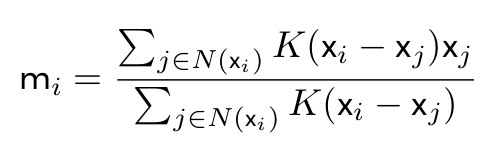

#Density Estimation

This lecture is about density estimation and how its methods can be applied to clustering.

##Density Estimation

Density Estimation: the estimation of a probability distribution function of provided data. 

Goal: create a generalized model about the data that explains the probability of its creation or existence in a particular way. 

Density estimation has a variety of applications including clustering (will be discussed in further detail)

###Histograms

Histograms are useful for examining the distribution of data

- Histograms group data into *bins*, usually equally sized, for the possible range of values for a particular feature. 
- Histograms plot the bins on the x-axis and the y-axis represents the frequency of data. 
- Selecting the number of bins and bin width is difficult
- Plots can be deceiving sometimes

There are several approached to selecting the number of bins in a histogram

- Two simple approaches to selecting bin width are **Scott's rule (1)** and **Fredman and Diaconis' rule (2)**. (These methods are outdated)
    - Both these approaches assume that the data follows a normal distribution 
    - Both focus on minimizing the difference between the histogram and the underlying distribution. 
    - Both methods use descriptive statistics about the data to determine bin width. 

- Scott's rule: states the bin width, *w*, can be formulated with respect to the standard deviation, $\sigma$, and the number of sample *n*, as...

>> w = 3.49$\sigma$n^$\frac{-1}{3}$^

- Fredman and Diaconis: more robust approach that incorporates the interquartile range, *d*, or the difference between the 25^th^ and 75^th^ percentile of the data, instead of the standard deviation and formulate the bin width as...

>> w = 2*dn*^$\frac{-1}{3}$^
 
- Knuth: statistical method of determining bin width by investigating the relationship between the data and assuming a piece-wise constant density model

- Bayesian Block Representations: finds bin width based on the probabilistic relationship between data and provide variable sized bins. 

Despite the sophistication of these various methods, sometimes the result are not great and we need to find other methods than the basic histogram for density estimation. 

##Kernel Density Estimation

A kernel, **K**(*x~i~*), with respect to density estimation is a non-negative function that integrates to one. (Can think of this as an example distribution). 

- Can think of this as example distribution
- Some example kernels are gaussian, uniform, exponential, and linear
- A scaled kernel **K**~*h*~(*x~i~*) scaled by a parameter h, is

>> K~*h*~(*x~i~*) = *$\frac{1}{h}$***K**(*$\frac{x_i}{h}$*)

- With respect to density estimation, the hyperparameter *h*, is called the *bandwidth*
    - bandwidth controls the trade off between bias and variance in the kernel density estimator

\newpage

The kernel density estimator of an unknown density *f* is...

> \

The general idea here is that we determine the parameters for a given distribution when fit to various portions of the data. We do not assume the data is uni-modal. With these ideas in mind, lets transition to some clustering approaches that use density estimation. 

\newpage

##Gaussian Mixture Models

Gaussian mixture models for clustering assumes that each cluster follows a gaussian distribution

- Based on that, the method determines the distributions' parameters that fit each cluster

##MeanShift

The MeanShift algorithm focuses on determining centroids for each cluster. 

- It is an iterative algorithm where the centroid's locations are updated by a "mean shift" vector
- The "mean shift" vectors points in the direction of maximum increase in cluster density

\newpage

The mean shift vector, **m***~i~*, for centroid, **x***~i~*, is...

> \
{width="50%"}

Where the set **N(x*~i~*)** is the set of points within a specified distance of **x***~i~* called its neighborhood, and **K** is a kernel

Based on the mean shift vector, the centroid **x***~i~* is updated at iteration *t* + 1 as...

> \
{width=36%}

##DBSCAN

DBSCAN determines clusters by looking at the variation in densities of the data.

- It assigns every point a status of being a *core point* or a *border point*
    - Core points: points in an area of high density
    - Border points; points in an area of low density
- DBSCAN has two hyperparameters
    1. The minimum number of points to consider a high density area
    2. The distance to count the number of points within
- A core point is one that has the minimum number of points within the specified distance
- Determining core and border points also allows use to determine the metric that we wish to use to utilize for distance
- When core and border points are determined, we can determine the clusters as those with connected core points

Key benefits of DBSCAN are..

- Clusters do not need to form as convex shapes
- Do not need to predetermine the number of clusters we wanted the model to detect

